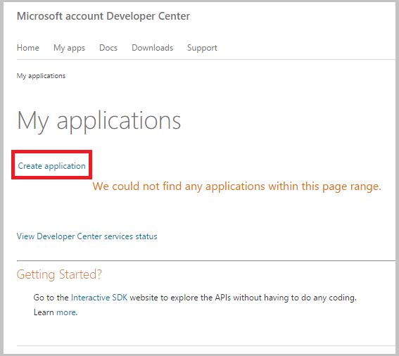
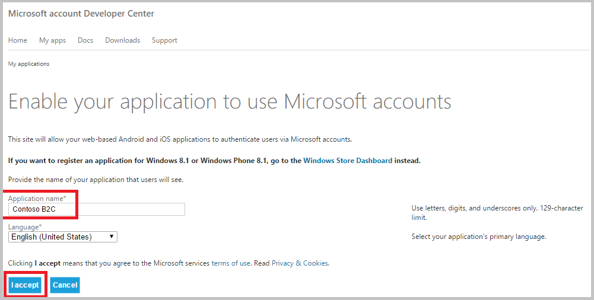
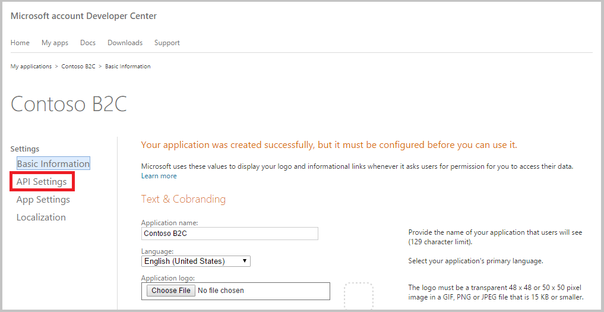
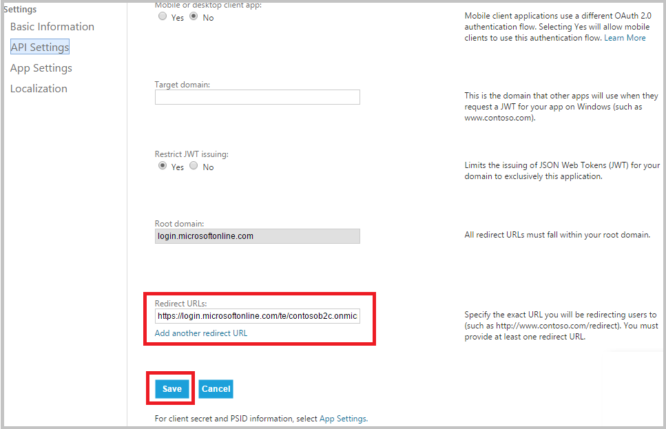
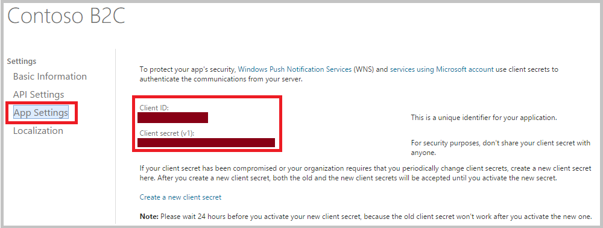

<properties
    pageTitle="Azure Active Directory B2C preview: Microsoft Account configuration | Microsoft Azure"
    description="Provide sign up and sign in to consumers with Microsoft Accounts in your applications secured by Azure Active Directory B2C"
    services="active-directory-b2c"
    documentationCenter=""
    authors="swkrish"
    manager="msmbaldwin"
    editor="bryanla"/>

<tags
    ms.service="active-directory-b2c"
    ms.workload="identity"
    ms.tgt_pltfrm="na"
    ms.devlang="na"
    ms.topic="article"
    ms.date="01/12/2016"
    ms.author="swkrish"/>

# Azure Active Directory B2C preview: Provide Sign up and Sign in to Consumers with Microsoft Accounts
> [AZURE.NOTE]
	This information applies to the Azure AD B2C consumer identity service preview.  For information on Azure AD for employees and organizations, 
	please refer to the [Azure Active Directory Developer Guide](active-directory-developers-guide.md).

## Create a Microsoft Account Application
To use Microsoft Account as an identity provider in Azure Active Directory (AD) B2C, you will first need to create a Microsoft Account application and supply it with the right parameters. You will need a Microsoft Account to do this; if you don’t have one, you can get it at [https://www.live.com/](https://www.live.com/).

1. Go to the [Microsoft Account Developer Center](https://account.live.com/developers/applications) and sign in with your Microsoft Account credentials.
2. Click **Create application**.

    

3. Provide an **Application Name** and click **I accept**. Note: This requires you to accept Microsoft services terms of use.

    

4. Click **API Settings** on the left hand navigation. Enter a valid **Contact Email**.

    

5. Enter `https://login.microsoftonline.com/te/{tenant}/oauth2/authresp` in the **Redirect URLs** field, where **{tenant}** is to be replaced with your tenant's name (for example, contosob2c.onmicrosoft.com). Click **Save** at the bottom of the page.

    

6. Click **App Settings** on the left hand navigation. Copy the values of **Client ID** and **Client secret**. You will need both of them to configure Microsoft Account as an identity provider in your tenant. Note: **Client secret** is an important security credential.

    

## Configure Microsoft Account as an Identity Provider in your Tenant
1. [Follow these steps to navigate to the B2C features blade on the Azure Portal](active-directory-b2c-app-registration.md#navigate-to-the-b2c-features-blade).
2. On the B2C features blade, click **Identity providers**.
3. Click **+Add** at the top of the blade.
4. Provide a friendly **Name** for the identity provider configuration. For example, enter "MSA".
5. Click **Identity provider type**, select **Microsoft Account** and click **OK**.
6. Click **Set up this identity provider** and enter the **Client ID** and **Client secret** of the Microsoft Account application that you created earlier.
7. Click **OK** and then **Create** to save your Microsoft Account configuration.

