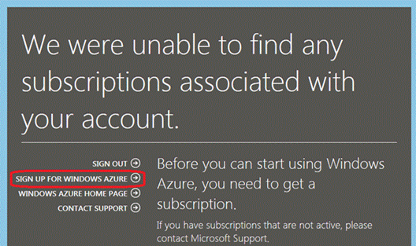

<properties
   pageTitle="Manage the directory for your Office 365 subscription in Azure | Microsoft Azure"
   description="Managing an Office 365 subscription account directory using Azure Active Directory and the Azure classic portal"
   services="active-directory"
   documentationCenter=""
   authors="curtand"
   manager="stevenpo"
   editor=""/>

<tags
   ms.service="active-directory"
   ms.devlang="na"
   ms.topic="article"
   ms.tgt_pltfrm="na"
   ms.workload="identity"
   ms.date="01/05/2016"
   ms.author="curtand"/>

# Manage the directory for your Office 365 subscription in Azure
This article describes how to manage a directory that was created for an Office 365 subscription within the Azure classic portal. The steps to complete this differ depending on whether you already have a subscription for Azure. You must be either the Service Administrator or a co-administrator of an Azure subscription in order to sign in to the Azure classic portal.

If you don’t yet have an Azure subscription, you just need to sign up by using the work or school account that you use to sign in to Office 365.

A corresponding subscription for Azure will not be found, but you can click **Sign up for Azure** and relevant information from the Office 365 account will be prepopulated in the sign-up form. The same account will be assigned to the Service Administrator role by default.

After you complete the Azure subscription, you can sign in to the Azure classic portal and access Azure services. Click the Active Directory extension in order to manage the same directory that authenticates your Office 365 users.

If you do already have an Azure subscription, the process to manage an additional directory is also straightforward. The following diagram may help to illustrate the process.

In this example, Michael Smith has an Office 365 subscription for Contoso.com. He has an Azure subscription that he signed up for by using his Microsoft account, msmith@hotmail.com. In this case, he manages two directories.

| Subscription | Office 365 | Azure |
| --- | --- | --- |
| Display name |Contoso |Default directory |
| Domain name |contoso.com |msmithhotmail.onmicrosoft.com |

He wants to manage the user identities in the Contoso directory while he is signed in to Azure using his Microsoft account so he can enable Azure AD features such as multifactor authentication.

In this case the two directories are independent of each other.

## To manage two independent directories
In order for Michael Smith to manage both directories while he is signed in to Azure as msmith@hotmail.com, he needs to complete the following steps:

> [!NOTE]
> These steps can be completed only when a user is signed in with a Microsoft account. If the user is signed in with a work or school account, the option to **Use existing directory** is not available because a work or school account can be authenticated only by its home directory (that is, the directory where the work or school account is stored, and which is owned by the work or school).
> 
> 
1. Sign in to the Azure classic portal as msmith@hotmail.com.
2. Click **New** > **App services** > **Active Directory** > **Directory** > **Custom Create**.
3. Click Use existing directory and select the **I am ready to be signed out now** checkbox.
4. Sign in to the Azure classic portal as global admin of Contoso.onmicrosoft.com (for example, msmith@contoso.com).
5. When prompted to **Use the Contoso directory with Azure?**, click **Continue**.
6. Click **Sign out now**.
7. Sign in to the Azure classic portal as msmith@hotmail.com. The Contoso directory and the Default directory appear in the Active Directory extension.

After completing these steps, msmith@hotmail.com is a global administrator in the Contoso directory.

## To administer resources as the global admin
Now let’s suppose that John Doe needs to sign in to the Azure classic portal and administer the websites and database resources that are associated with the Azure subscription of msmith@hotmail.com. To do that, Michael Smith needs to complete these additional steps:

1. Sign in to the Azure classic portal by using the Service Administrator account of the Azure subscription (in this example, msmith@hotmail.com).
2. Transfer the subscription to the Contoso directory: click **Settings** > **Subscriptions** > select the subscription > **Edit Directory** > select **Contoso (Contoso.com)**. As part of the transfer, any work or school accounts that are co-administrators of the subscription will be removed.
3. Add John Doe as co-administrator of the subscription: click **Settings** > **Administrators** > select the subscription > **Add** > type **JohnDoe@Contoso.com**.

## Next steps
For more information about the relationship between subscriptions and directories, see [How a subscription is associated with a directory](active-directory-how-subscriptions-associated-directory.md).

