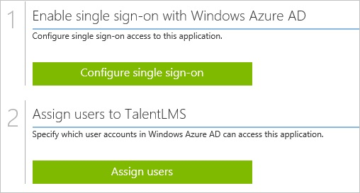
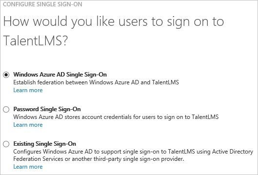
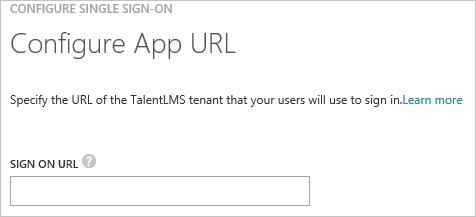
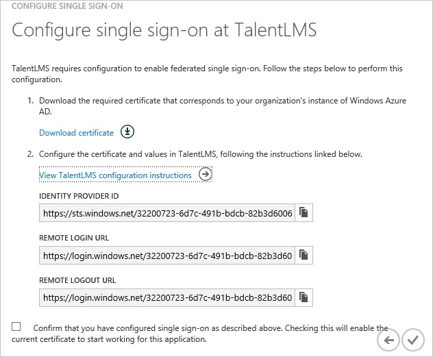
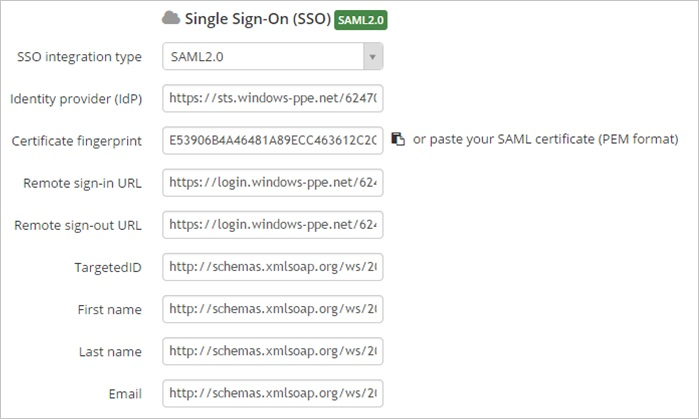
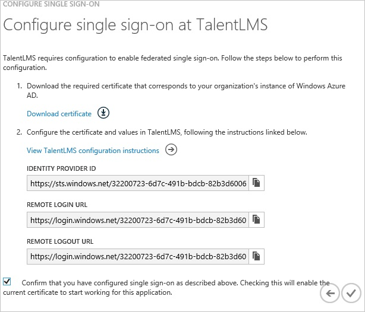
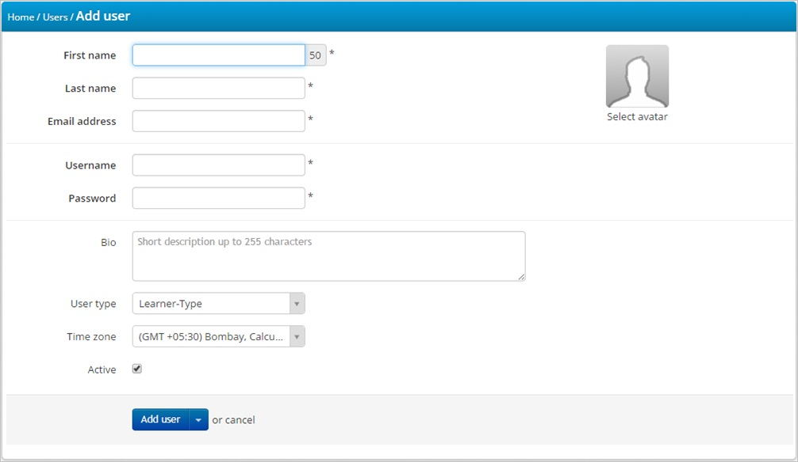

<properties 
    pageTitle="Tutorial: Azure Active Directory Integration with TalentLMS | Microsoft Azure" 
    description="Learn how to use TalentLMS with Azure Active Directory to enable single sign-on, automated provisioning, and more!" 
    services="active-directory" 
    authors="markusvi"  
    documentationCenter="na" 
    manager="stevenpo"/>

<tags 
    ms.service="active-directory" 
    ms.devlang="na" 
    ms.topic="article" 
    ms.tgt_pltfrm="na" 
    ms.workload="identity" 
    ms.date="01/12/2016" 
    ms.author="markvi" />

# Tutorial: Azure Active Directory Integration with TalentLMS
The objective of this tutorial is to show the integration of Azure and TalentLMS.  
The scenario outlined in this tutorial assumes that you already have the following items:

* A valid Azure subscription
* A TalentLMS tenant

After completing this tutorial, the Azure AD users you have assigned to TalentLMS will be able to single sign into the application at your TalentLMS company site (service provider initiated sign on), or using the [Introduction to the Access Panel](active-directory-saas-access-panel-introduction.md).

The scenario outlined in this tutorial consists of the following building blocks:

1. Enabling the application integration for TalentLMS
2. Configuring single sign-on
3. Configuring user provisioning
4. Assigning users

## Enabling the application integration for TalentLMS
The objective of this section is to outline how to enable the application integration for TalentLMS.

### To enable the application integration for TalentLMS, perform the following steps:
1. In the Azure Management Portal, on the left navigation pane, click **Active Directory**.

   

2. From the **Directory** list, select the directory for which you want to enable directory integration.

3. To open the applications view, in the directory view, click **Applications** in the top menu.

   

4. Click **Add** at the bottom of the page.

   

5. On the **What do you want to do** dialog, click **Add an application from the gallery**.

   

6. In the **search box**, type **TalentLMS**.

   

7. In the results pane, select **TalentLMS**, and then click **Complete** to add the application.

   

## Configuring single sign-on
The objective of this section is to outline how to enable users to authenticate to TalentLMS with their account in Azure AD using federation based on the SAML protocol. .  
Configuring single sign-on for TalentLMS requires you to retrieve a thumbprint value from a certificate.  
If you are not familiar with this procedure, see [How to retrieve a certificate's thumbprint value](http://youtu.be/YKQF266SAxI).

### To configure single sign-on, perform the following steps:
1. In the Azure AD portal, on the **TalentLMS** application integration page, click **Configure single sign-on** to open the **Configure Single Sign On ** dialog.

   

2. On the **How would you like users to sign on to TalentLMS** page, select **Microsoft Azure AD Single Sign-On**, and then click **Next**.

   

3. On the **Configure App URL** page, in the **TalentLMS Sign In URL** textbox, type your URL using the following pattern "*https://\<tenant-name\>.TalentLMSapp.com*", and then click **Next**.

   

4. On the **Configure single sign-on at TalentLMS** page, to download your certificate, click **Download certificate**, and then save the certificate file locally as **c:\\TalentLMS.cer**.

   

5. In a different web browser window, log into your TalentLMS company site as an administrator.

6. In the **Account & Settings** section, click the **Users** tab.

   

7. Click **Single Sign-On (SSO)**,

8. In the Single Sign-On section, perform the following steps:

   

   1. From the **SSO integration type** list, select **SAML 2.0**.
2. In the Azure portal, on the **Configure single sign-on at TalentLMS** dialog page, copy the **Identity Provider ID** value, and then paste it into the **Identity provider (IdP)** textbox.
3. Copy the **Thumbprint** value from the exported certificate, and then paste it into the **Certificate Fingerprint** textbox.

   > [!TIP]
> For more details, see [How to retrieve a certificate's thumbprint value](http://youtu.be/YKQF266SAxI)
> 
4. In the Azure portal, on the **Configure single sign-on at TalentLMS** dialog page, copy the **Remote Login URL** value, and then paste it into the **Remote sign-in URL** textbox.

5. In the Azure portal, on the **Configure single sign-on at TalentLMS** dialog page, copy the **Remote Logout URL** value, and then paste it into the **Remote sign-out URL** textbox.
6. In the **TargetedID** textbox, type **http://schemas.xmlsoap.org/ws/2005/05/identity/claims/name**
7. In the **First name** textbox, type **http://schemas.xmlsoap.org/ws/2005/05/identity/claims/givenname**
8. In the **Last name** textbox, type **http://schemas.xmlsoap.org/ws/2005/05/identity/claims/surname**
9. In the **Email** textbox, type **http://schemas.xmlsoap.org/ws/2005/05/identity/claims/emailaddress**
10. Click **Save**.

9. On the Azure AD portal, select the single sign-on configuration confirmation, and then click **Complete** to close the **Configure Single Sign On** dialog.

   

## Configuring user provisioning
In order to enable Azure AD users to log into TalentLMS, they must be provisioned into TalentLMS.  
In the case of TalentLMS, provisioning is a manual task.

### To provision a user accounts, perform the following steps:
1. Log in to your **TalentLMS** tenant.

2. Click **Users**, and then click **Add User**.

3. On the **Add user** dialog page, perform the following steps:

   

   1. Type the related attribute values of the Azure AD user account into the following textboxes: **First name**, **Last name**, **Email address**.
2. Click **Add User**.

> [!NOTE]
> You can use any other TalentLMS user account creation tools or APIs provided by TalentLMS to provision AAD user accounts.
> 
> 
## Assigning users
To test your configuration, you need to grant the Azure AD users you want to allow using your application access to it by assigning them.

### To assign users to TalentLMS, perform the following steps:
1. In the Azure AD portal, create a test account.

2. On the **TalentLMS **application integration page, click **Assign users**.

   

3. Select your test user, click **Assign**, and then click **Yes** to confirm your assignment.

   

If you want to test your single sign-on settings, open the Access Panel. For more details about the Access Panel, see [Introduction to the Access Panel](active-directory-saas-access-panel-introduction.md).

