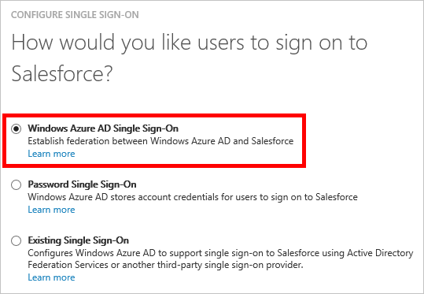
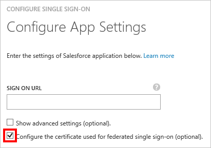
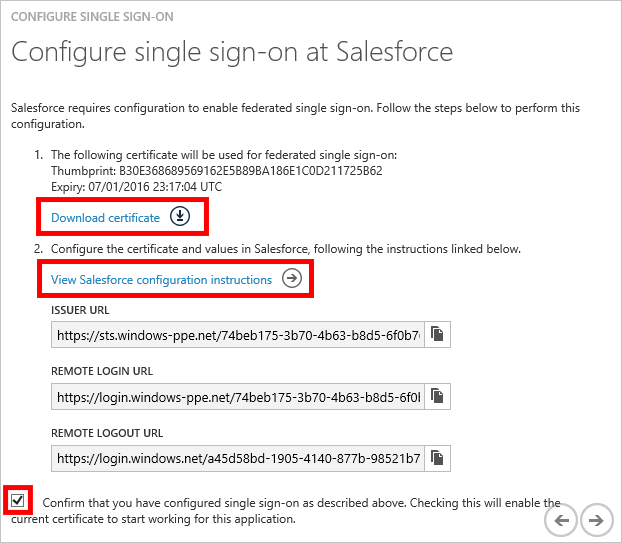

<properties
    pageTitle="How to Manage Federation Certificates in Azure AD | Microsoft Azure"
    description="Learn how to customize the expiration date for your federation certificates, and how to renew certificates that will soon expire."
    services="active-directory"
    documentationCenter=""
    authors="liviodlc"
    manager="terrylan"
    editor=""/>

<tags
    ms.service="active-directory"
    ms.workload="identity"
    ms.tgt_pltfrm="na"
    ms.devlang="na"
    ms.topic="article"
    ms.date="09/29/2015"
    ms.author="liviodlc"/>

# Managing Certificates for Federated Single Sign-On in Azure Active Directory
This article covers common questions related to the certificates that Azure Active Directory creates in order to establish federated single sign-on (SSO) to your SaaS applications.

This article is only relevant to apps that are configured to use **Azure AD Single Sign-On**, as shown in the example below:

## How to Customize the Expiration Date for your Federation Certificate
By default, certificates are set to expire after two years. You can choose a different expiration date for your certificate by following the steps below. The included screenshots use Salesforce for the sake of example, but these steps can apply to any federated SaaS app.

1. In Azure Active Directory, on the Quick Start page for your application, click on **Configure single sign-on**.

    

2. Select **Azure AD Single Sign-On**, and then click **Next**.

3. Type in the **Sign-On URL** of your application, and select the checkbox for **Configure the certificate used for federated single sign-on**. Then click **Next**.

    

4. On the next page, select **Generate a new certificate**, and select how long you'd like the certificate to be valid for. Then click **Next**.

    

5. Next, click on **Download certificate**. To learn how to upload the certificate to your particular SaaS app, click **View configuration instructions**.

    

6. The certificate won't be enabled until you select the confirmation checkbox at the bottom of the dialog and then press submit.

## How to Renew a Certificate that will Soon Expire
The renewal steps shown below should ideally result in no significant downtime for your users. The screenshots used in this section feature Salesforce as an example, but these steps can apply to any federated SaaS app.

1. In Azure Active Directory, on the Quick Start page for your application, click on **Configure Single Sign-On**.

    

2. On the first page of the dialog, **Azure AD Single Sign-On** should already be selected, so click **Next**.

3. On the second page, select the checkbox for **Configure the certificate used for federated single sign-on**. Then click **Next**.

    

4. On the next page, select **Generate a new certificate**, and select how long you'd like the new certificate to be valid for. Then click **Next**.

    

5. Click on **Download certificate**. To successfully rewnew your certificate, you must perform the following two steps:

   * Upload the new certificate to the SaaS app's single sign-on configuration screen. To learn how to do this for your particular SaaS app, click **View configuration instructions**.

* In Azure AD, Select the confirmation checkbox at the bottom of the dialog to enable the new certificate, and then click **Next** to submit.

  > [!IMPORTANT]
> Single sign-on to the app will be disabled the moment either one of these two steps is completed, but it will be enabled again once the second step is completed. Therefore, to minimize downtime, please prepare to accomplish both steps within a short amount of time from each other.
> 
> 
  

##Related Articles

This article is part of a series on how to manage SaaS applications with Azure Active Directory. Below are all of the articles in the series:

- [Introduction to Single Sign-On and Managing App Access with Azure Active Directory](active-directory-appssoaccess-whatis.md)
	- [Managing Certificates for Federated Single Sign-On in Azure Active Directory](active-directory-sso-certs.md)
	- [Introduction to the Access Panel](active-directory-saas-access-panel-introduction.md)
	- [How to Deploy the Access Panel Extension for Internet Explorer using Group Policy](active-directory-saas-ie-group-policy.md)
	- [Troubleshooting the Access Panel Extension for Internet Explorer](active-directory-saas-ie-troubleshooting.md)
- [Automate User Provisioning and Deprovisioning to SaaS Applications](active-directory-saas-app-provisioning.md)
	- [Customizing Attribute Mappings for User Provisioning](active-directory-saas-customizing-attribute-mappings.md)
	- [Writing Expressions for Attribute Mappings](active-directory-saas-writing-expressions-for-attribute-mappings.md)
	- [Scoping Filters for User Provisioning](active-directory-saas-scoping-filters.md)
	- [Account Provisioning Notifications](active-directory-saas-account-provisioning-notifications.md)
- [List of Tutorials on How to Integrate SaaS Apps](active-directory-saas-tutorial-list.md)
	- [How to integrate Salesforce](active-directory-saas-salesforce-tutorial.md)
	- [How to integrate Google Apps](active-directory-saas-google-apps-tutorial.md)
	- [How to integrate Box](active-directory-saas-box-tutorial.md)
	- [How to integrate ServiceNow](active-directory-saas-servicenow-tutorial.md)
	- [How to integrate Dropbox for Business](active-directory-saas-dropboxforbusiness-tutorial.md)
	- [How to integrate Workday](active-directory-saas-workday-tutorial.md) 
	- [More SaaS App Tutorials...](active-directory-saas-tutorial-list.md)

