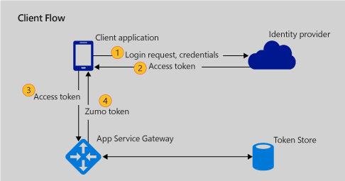
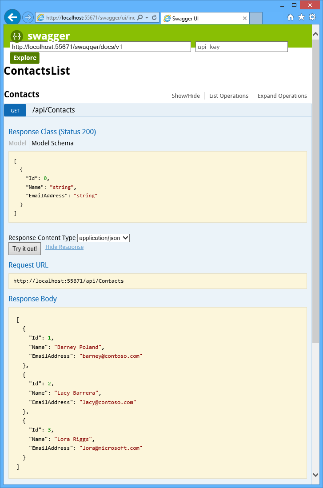
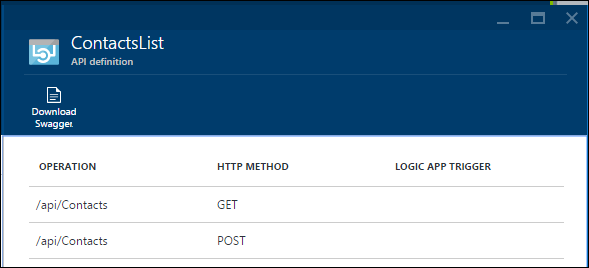
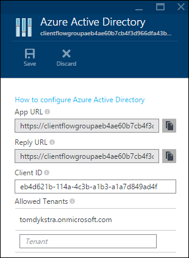
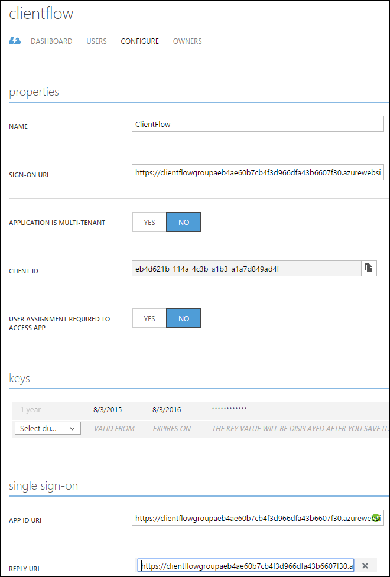
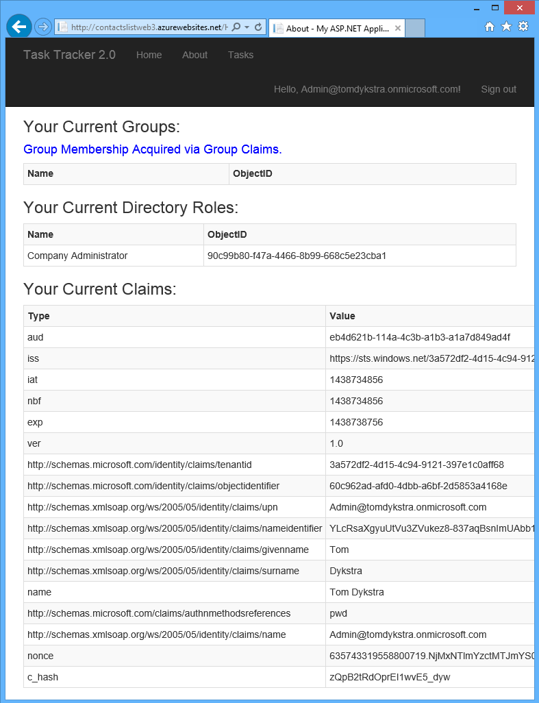
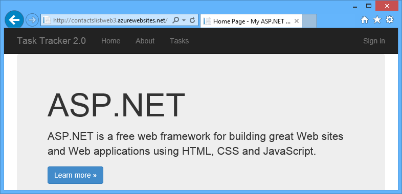
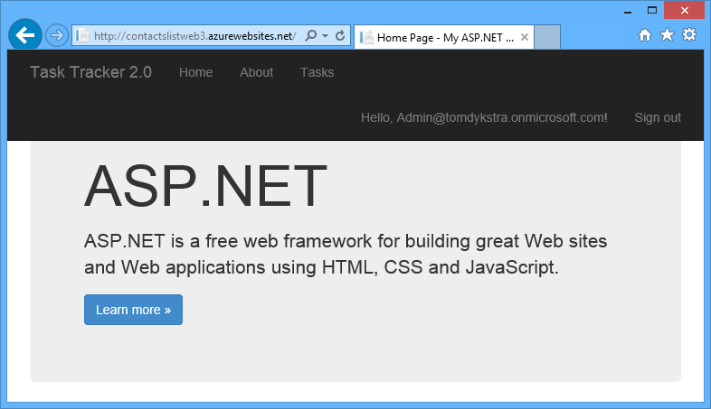

<properties 
    pageTitle="Call an API app from an authenticated client" 
    description="Learn how to call an Azure API app from a web app client that is authenticated by Azure Active Directory." 
    keywords="app service,azure app service,authentication,azure authentication,api,authentication api"
    services="app-service\api" 
    documentationCenter=".net" 
    authors="tdykstra" 
    manager="wpickett" 
    editor="jimbe"/>

<tags 
    ms.service="app-service-api" 
    ms.workload="web" 
    ms.tgt_pltfrm="dotnet" 
    ms.devlang="na" 
    ms.topic="article" 
    ms.date="01/08/2016" 
    ms.author="tdykstra"/>

# Call an Azure API app from a web app client authenticated by Azure Active Directory
## Overview
This tutorial shows how to call an API app that is protected by Azure Active Directory (AAD) from a web app that is also protected by AAD. When you finish the tutorial, you'll have a web app and an API app running in your Azure subscription.  The web app will display data that it gets by calling the API app, as shown in the following screen shot.

You'll learn how to pass on AAD credentials from the web app to the API app so that the user is not prompted again by the API app to log in.

You'll perform the following steps:

* Create an API app and configure it to use AAD authentication.
* Create a web app and configure it to use AAD authentication.
* Add code to the web app to call the protected API app.
* Deploy both the web app and the API app to Azure.
* Test to verify that the web app can call the API app.

### Client flow authentication
The code that you add to the web app will implement a process called [client flow](../app-service/app-service-authentication-overview.md#client-flow) authentication. The following diagram illustrates the process for getting the AAD access token and exchanging it for an API app (Zumo) token.

If you're not familiar with the role of the API app gateway in authentication for API apps, see [Authentication for API apps and mobile apps](../app-service/app-service-authentication-overview.md).

## Prerequisites
Before starting this tutorial, make sure that you have [Visual Studio 2015](https://www.visualstudio.com/) and the [Azure SDK for .NET](http://go.microsoft.com/fwlink/?linkid=518003) installed. The same instructions will also work for Visual Studio 2013.

The tutorial assumes that you know how to work with web projects in Visual Studio.

## Create and secure an API app using AAD
1. Create or download an API app project.

   * To create a project, follow the directions in [Create an API app](app-service-dotnet-create-api-app.md).

* To download a project, get it from the [ContactsList GitHub repository](https://github.com/tdykstra/ContactsList).

  You now have a Web API project that returns contact data.

  

2. Deploy the API app project to a new API app in Azure.

    Follow the directions in [Deploy an API app](app-service-dotnet-deploy-api-app.md).

    In the [Azure preview portal](https://portal.azure.com/), the **API Definition** blade for the API app now shows the Get and Post methods of the Web API project that you deployed.

    

3. Secure the API app by using Azure Active Directory (AAD) as the identity provider.

    Follow the directions for AAD in [Protect an API app](app-service-api-dotnet-add-authentication.md). You don't need to do the **Use Postman to send a Post request** section of the tutorial.

    When you're done, the API app's **Azure Active Directory** blade in the [Azure preview portal](https://portal.azure.com/) has the AAD application's client ID and your AAD tenant.

    

    And the AAD application's **Configure** tab in the [Azure portal](https://manage.windowsazure.com/) has the API app's App ID URL and Reply URL.

    

## Create and secure a web app using AAD
In this section you download and configure a web project that is set up for AAD authentication. The project has an **About** page that shows claims information for the logged-on user.

You'll modify this page later by adding a section for displaying contact information retrieved from the API app.

1. Download the web project from the [WebApp-GroupClaims-DotNet repository](https://github.com/AzureADSamples/WebApp-GroupClaims-DotNet/)

2. Follow the instructions for **How to run the sample** in the [Readme file](https://github.com/AzureADSamples/WebApp-GroupClaims-DotNet/blob/master/README.md), with the following exceptions:

   * You can use Visual Studio 2015 although the Readme file says to use Visual Studio 2013. 

* Use the AAD application you already created instead of creating a new one.

* Keep the same **App ID URI** that you already have for the AAD application. (Don't change it to the format specified in the Readme file.) 

* Change other AAD application settings as directed; in particular, set the sign-on and reply URLs to the base URL for the sample app.

You're keeping the same App ID URI that you created for the API app so that you can use the same AAD access token for both the web app and the API app. If you changed the App ID URI to the format prescribed by the readme, that would work for access to the web app but not for the API app.  You wouldn't be able to pass the AAD token to the API app gateway to get a Zumo token because the gateway expects a token for an App ID URI composed of the gateway URL plus "/login/aad".   

## Add generated client code for the API app
In this section you add automatically generated code for a typed interface for calling the API app. 

1. In Visual studio **Solution Explorer**, right-click the   WebApp-GroupClaims-DotNet project, and then click **Add > Azure API App Client**.

2. In the **Add Microsoft Azure API App Client** dialog box, select the API app that you secured with AAD.

   Once code generation is complete, you see a new folder in **Solution Explorer**, with the name of the API app. This folder contains the code that implements the client classes and data models. 

3. Fix ambiguous references caused by the generated code in *ContactsList/ContactsExtensions.cs*: change the two instances of `Task.Factory.StartNew` to `System.Threading.Tasks.Task.Factory.StartNew`.

## Add code to exchange the AAD token for a Zumo token
1. In HomeController.cs, add `using` statements for the App Service SDK and JSON serializer.

     using Microsoft.Azure.AppService;
  using Newtonsoft.Json.Linq;

2. Add constants for the gateway URL and the App ID URI of the AAD application. Make sure the gateway URL is https, not http.

        private const string GATEWAY_URL = "https://clientflowgroupaeb4ae60b7cb4f3d966dfa43b6607f30.azurewebsites.net/";
     private const string APP_ID_URI = GATEWAY_URL + "login/aad";
3. Add a method that gets a client object for calling the API app.

     public async Task<AppServiceClient> GetAppServiceClient()
  {

         var appServiceClient = new AppServiceClient(GATEWAY_URL);
      string userObjectID = ClaimsPrincipal.Current.FindFirst
          ("http://schemas.microsoft.com/identity/claims/objectidentifier").Value;

      var authContext = new AuthenticationContext
          (ConfigHelper.Authority, new TokenDbCache(userObjectID));

      ClientCredential credential = new ClientCredential
          (ConfigHelper.ClientId, ConfigHelper.AppKey);

      // Get the AAD token.
      AuthenticationResult result = authContext.AcquireToken(APP_ID_URI, credential);
      var aadToken = new JObject();
      aadToken["access_token"] = result.AccessToken;

      // Send the AAD token to the gateway and get a Zumo token
      var appServiceUser = await appServiceClient.LoginAsync
          ("aad", aadToken).ConfigureAwait(false);

      return appServiceClient;
     }

   In this code `ConfigHelper.Authority` resolves to "https://login.microsoftonline.com/{your tenant}", for example:  "https://login.microsoftonline.com/contoso.onmicrosoft.com". 

4. Add code immediately before the `return View()` statement at the end of the `About` method to call the API app. (In the following step you'll add code to the `About` view to display the returned data.)

     var appServiceClient = await GetAppServiceClient();
  var client = appServiceClient.CreateContactsList();
  var contacts = client.Contacts.Get();
  ViewData["contacts"]"contacts"] = contacts;

5. In *Views/Home/About.cshtml*, add code immediately after the `h2` heading to display the contact information.

        <h3>Contacts</h3>
     <table class="table table-striped table-bordered table-condensed table-hover">
         <tr>
             <th>Name</th>
             <th>Email</th>
         </tr>

         @foreach (WebAppGroupClaimsDotNet.Models.Contact contact in (IList<WebAppGroupClaimsDotNet.Models.Contact>)ViewData["contacts"])
         {
             <tr>
                 <td>@contact.Name</td>
                 <td>@contact.EmailAddress</td>
             </tr>
         }

     </table>

1. In the application Web.config file, add the following binding redirect after the opening `<assemblyBinding>` tag.

        <dependentAssembly>
       <assemblyIdentity name="System.Net.Http.Primitives" publicKeyToken="b03f5f7f11d50a3a" culture="neutral"/>
       <bindingRedirect oldVersion="0.0.0.0-4.2.28.0" newVersion="4.2.28.0"/>
     </dependentAssembly>

    Without this binding redirect, the app will fail because the App Service SDK includes a dependency on System.Net.Http.Primitives version 1.5.0.0 but the version used by the project is 4.2.28.0.

2. Follow the instructions in **Deploy this sample to Azure** in the [Readme file](https://github.com/AzureADSamples/WebApp-GroupClaims-DotNet/).

3. Run the app.

    

4. Click **Sign in**, and then enter the credentials of a user in the AAD domain you're using for this application.

    

5. Click **About**.

    The code you added to the About controller and view runs and shows that you successully authenticated to the API app and called its Get method.

    

## Troubleshooting
### HTTP 400 errors
Make sure that the gateway url is https, not http.  When copied directly out of the Azure preview portal, it may specify http.

### SQL Server errors
The application requires access to a SQL Server database identified by the GroupClaimContext connection string. Make sure that the connection string in the deployed site points to a SQL Database instance.  You can put the correct connection string in the deployed Web.config or in the Azure runtime configuration settings.

## Acknowledgments
Thanks to Govind S. Yadav ([@govindsyadav](https://twitter.com/govindsyadav)) for help developing this tutorial. 

## Next steps
You've seen how to do client flow authentication for App Service API apps. For information about other ways to handle authentication in API apps, see [Authentication for API apps and mobile apps](../app-service/app-service-authentication-overview.md). 

[Azure portal]: https://manage.windowsazure.com/
[Azure preview portal]: https://portal.azure.com/
