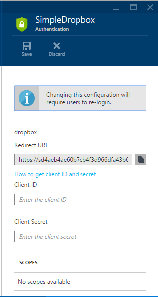
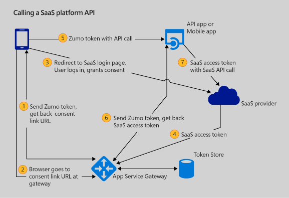
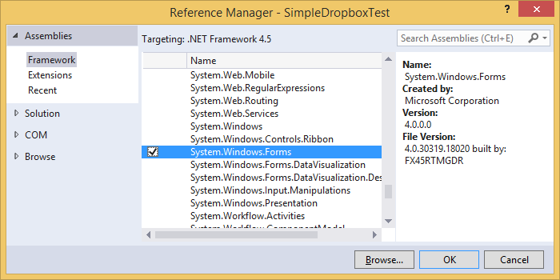
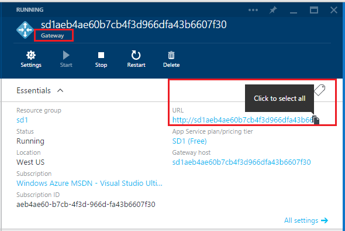
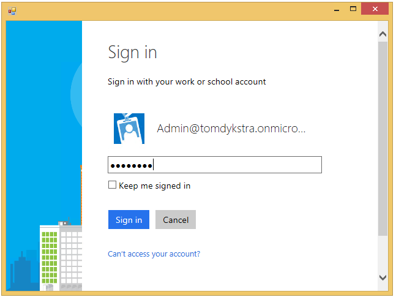
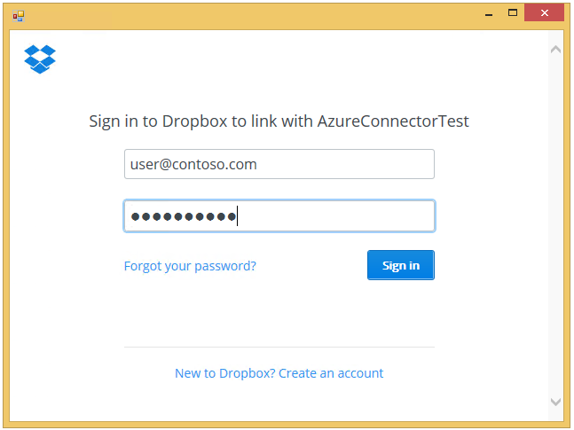
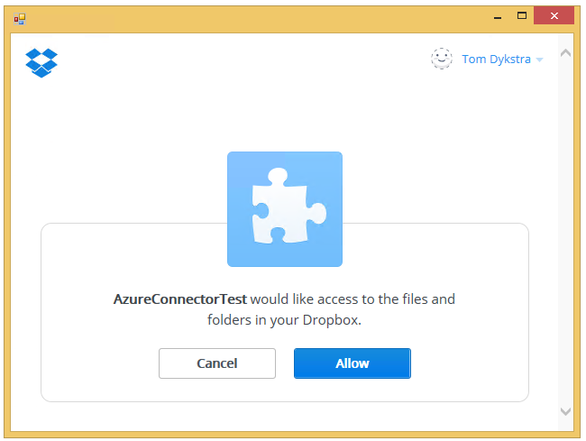
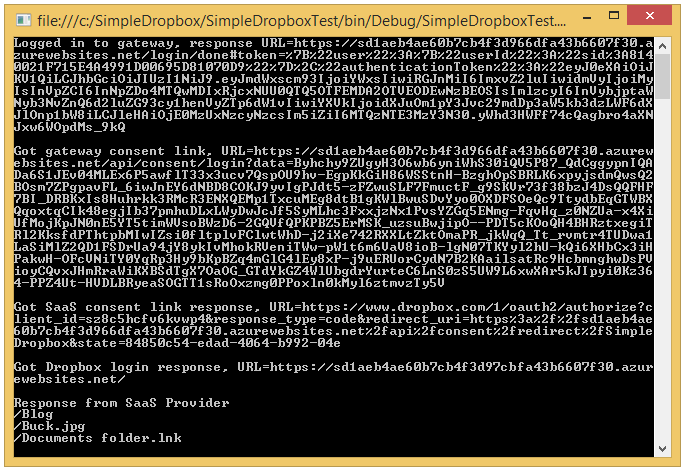
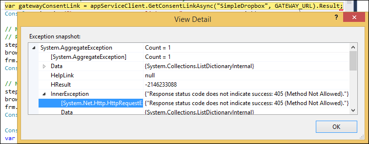

<properties 
    pageTitle="Custom SaaS connector ASP.NET API app in Azure App Service" 
    description="Learn how to write code that connects to a SaaS platform from an API app and how to call the API app from a .NET client." 
    services="app-service\api" 
    documentationCenter=".net" 
    authors="tdykstra" 
    manager="wpickett" 
    editor="jimbe"/>

<tags 
    ms.service="app-service-api" 
    ms.workload="web" 
    ms.tgt_pltfrm="dotnet" 
    ms.devlang="na" 
    ms.topic="article" 
    ms.date="01/08/2016" 
    ms.author="tdykstra"/>

# Connect to a SaaS platform from an ASP.NET API app in Azure App Service
> [AZURE.WARNING] This article refers to the original preview release of App Service API Apps.  For information about the current preview release of API Apps, see [App Service API Apps - What's changed](../articles/app-service-api/app-service-api-whats-changed.md). For tutorials that show how to work with the current preview release of API Apps, see [Get started with API Apps](../articles/app-service-api/app-service-api-dotnet-get-started.md). 

## Overview
This tutorial shows how to code and configure an [API app](app-service-api-apps-why-best-platform.md) that connects to a [Software-as-a-Service (SaaS) platform](../app-service/app-service-authentication-overview.md#obotosaas) using the [App Service API app SDK for .NET](http://www.nuget.org/packages/Microsoft.Azure.AppService.ApiApps.Service/). The tutorial also shows how to call the API app from a .NET client by using the [App Service SDK for .NET](http://www.nuget.org/packages/Microsoft.Azure.AppService). At the end of the tutorial you'll have a .NET console app client that calls a .NET API app running in Azure App Service. The API app calls the Dropbox API and returns a list of files and folders in the user's Dropbox account.

As an alternative to writing code that calls a SaaS API directly from a custom API app, you can call a prepackaged [connector API app](../app-service-logic/app-service-logic-what-are-biztalk-api-apps.md). For information about how to do that, see [Deploy and configure a SaaS connector API app](app-service-api-connnect-your-app-to-saas-connector.md).

The tutorial walks you through the following steps:

* Create an API app project in Visual Studio. 
* Configure the *apiapp.json* file to enable the API app to connect to the Dropbox service.
* Add code that calls Dropbox and returns the results.
* Create a new API app in Azure.
* Deploy the project to the API app.
* Configure the API app.
* Configure the gateway.
* Create a test client.
* Run the test client.

## Prerequisites
The tutorial makes these assumptions:

* You have completed the [Create an API app](app-service-dotnet-create-api-app.md) and [Deploy an API app](app-service-dotnet-deploy-api-app.md) tutorials.

* You have a basic understanding of the Azure App Service gateway architecture for authentication, as presented in [Authentication for API apps and mobile apps](app-service-authentication-overview.md).

* You know how to work with API apps in the Azure preview portal, as explained in [How to navigate to API app and gateway blades](app-service-api-manage-in-portal.md#navigate).

## Create the API app project
When the instructions direct you to enter a name for the project, enter *SimpleDropbox*. 

1. Open Visual Studio 2015 or Visual Studio 2013.

2. Select **File > New > Project**.

3. Select the **ASP.NET Web Application** template.

4. Make sure that the **Add Application Insights to Project** check box is cleared.

4. Enter a name for the project.

	

5. Click **OK**.

6. In the **New ASP.NET Project** dialog, select the **Azure API App** project template.

	

7. Click **OK** to generate the project.

Visual Studio creates a Web API project configured for deployment as an API app.

## Configure the *apiapp.json* file
For an API app to make outgoing calls to a SaaS platform, the SaaS platform has to be specified in the *apiapp.json* file. 

1. Open the *apiapp.json* file and add an `authentication` property as shown here (you'll also have to add a comma after the preceding property):

        "authentication": [
       {
         "type": "dropbox"
       }
     ]

    The complete apiapp.json file will resemble this example: 

        {
         "$schema": "http://json-schema.org/schemas/2014-11-01/apiapp.json#",
         "id": "SimpleDropBox",
         "namespace": "microsoft.com",
         "gateway": "2015-01-14",
         "version": "1.0.0",
         "title": "SimpleDropBox",
         "summary": "",
         "author": "",
         "endpoints": {
             "apiDefinition": "/swagger/docs/v1",
             "status": null
         },
         "authentication": [
           {
             "type": "dropbox"
           }
         ]
     }
2. Save the file.

Setting the `authentication` property has a couple effects:

* It causes the portal to display UI in the API app blade that enables you to enter the SaaS platform's client ID and client secret values.

    

* It enables the API app to retrieve the SaaS provider's access token from the gateway for use when calling the SaaS provider's API.

The `authentication` property is an array, but this preview release doesn't support specifying multiple providers.

For a list of the supported platforms, see [Getting user consent to access other SaaS platforms](../app-service/app-service-authentication-overview.md#obotosaas).

You can also specify scopes, as in this example:

        "authentication": [
          {
            "type": "google",
            "scopes": ["https://www.googleapis.com/auth/userinfo.email", "https://www.googleapis.com/auth/userinfo.profile"]
          }
        ]

Available scopes are defined by each SaaS provider and can be found in the provider's developer portal.

## Add Code that calls Dropbox
1. Install the [DropboxRestAPI](https://www.nuget.org/packages/DropboxRestAPI) NuGet package in the SimpleDropbox project.

   * From the **Tools** menu, click **NuGet Package Manager > Package Manager Console**.

* In the **Package Manager Console** window, enter this command:

        install-package DropboxRestAPI  

2. Open *Controllers\ValuesController.cs* and replace all of the code in the file with the following code.

        using DropboxRestAPI;
     using Microsoft.Azure.AppService.ApiApps.Service;
     using System;
     using System.Collections.Generic;
     using System.Linq;
     using System.Net;
     using System.Net.Http;
     using System.Threading.Tasks;
     using System.Web.Http;

     namespace SimpleDropBox2.Controllers
     {
         public class ValuesController : ApiController
         {
             public async Task<IEnumerable<string>> Get()
             {
                 // Retrieve the token from the gateway
                 var runtime = Runtime.FromAppSettings(Request);
                 var dropboxTokenResult = await runtime.CurrentUser.GetRawTokenAsync("dropbox");

                 // Create a Dropbox client object that will send the token
                 // with REST API calls to Dropbox.
                 var dropboxClient = new Client(
                     new Options
                     {
                         AccessToken = dropboxTokenResult.Properties["AccessToken"]
                     }
                 );

                 // Call the Dropbox API
                 var metadata = await dropboxClient.Core.Metadata.MetadataAsync("/");

                 // Return a list of files and folders.
                 return metadata.contents.Select(md => md.path);
             }
         }
     }

    Before the client calls this method, the user has logged in to Dropbox and granted consent for the API app to access the user's Dropbox account. Dropbox acknowledges that consent by providing an access token to the App Service gateway. This code retrieves the token from the gateway and includes it in a call to the Dropbox API, as shown in steps 6 and 7 in the diagram below.

    

3. Build the project.

## Create an API app in Azure
In this section you use the Visual Studio **Publish Web** wizard to create an API app in Azure. Where the instructions direct you to enter a name for the API app, enter *SimpleDropbox*.

1. In **Solution Explorer**, right-click the project (not the solution) and click **Publish**. 

	

2. Click the **Profile** tab and click **Microsoft Azure API Apps (Preview)**. 

	

3. Click **New** to provision a new API App in your Azure subscription.

	

4. In the **Create an API App** dialog, enter the following:

	- For **API App Name**, enter the name you're using for this tutorial. 
	- If you have multiple Azure subscriptions, select the one you want to use.
	- For **App Service Plan**, select from your existing App Service plans, or select **Create new App Service plan** and enter the name of a new plan. 
	- For **Resource Group**, select from your existing resource groups, or select **Create new resource group** and enter a name. 
	- For **Access Level**, select **Available to Anyone**. You can restrict access later through the Azure preview portal.
	- For **Region**, select a region close to you.  

	

5. Click **OK** to create the API App in your subscription. 

	As this process can take a few minutes, Visual Studio displays a confirmation dialog.  

6. Click **OK** on the confirmation dialog. 
 
	The provisioning process creates the resource group and API App in your Azure subscription. Visual Studio shows the progress in the **Azure App Service Activity** window. 

	

## Deploy your code
You use the same **Publish Web** wizard to deploy your code to the new API app.

7. Right-click the API app project in **Solution Explorer** and select **Publish** to open the publish dialog. The publish profile that you created earlier should be pre-selected. 

9. Click **Publish** to begin the deployment process. 

	

	The **Azure App Service Activity** window shows the deployment progress. 

	

	During this deployment process, Visual Studio automatically tries to restart the *gateway*. The gateway is a web app that handles administrative functions for all API apps in a resource group, and it has to be restarted to recognize changes in an API app's API definition or *apiapp.json* file. 
 
	If you use another method to deploy an API app, or if Visual Studio fails to restart the gateway, you might have to restart the gateway manually. The following steps explain how to do that.

1. In your browser, go to the [Azure preview portal](https://portal.azure.com). 

2. Navigate to the **API app** blade for the API app that you deployed.

	For information about the **API app** blade, and how to find it, see [Manage API apps](../articles/app-service-api/app-service-api-manage-in-portal.md).

4. Click the **Gateway** link.

3. In the **Gateway** blade, click **Restart**.

	

## Configure authentication for incoming calls
For Azure App Service to allow authenticated outgoing calls from the API app, the API app must also require that incoming calls come from authenticated users. This is not a general OAuth 2.0 requirement but is a requirement of the App Service gateway architecture as it is currently implemented.

The screenshots in this section show a ContactsList API app, but the process is the same for the SimpleDropbox API app that you're creating in this tutorial.

### Configure the API app to require that incoming calls be authenticated
1. Navigate to the **API App** blade for the API app that you want to protect.

2. In the **API App** blade, click **Settings**, and then click **Application settings**.

	

	

3. In the **Application Settings** blade, change **Access Level** to **Public (authenticated)**, and then click **Save**.

	

### Configure an identity provider in the gateway
4. Navigate to your API app's gateway blade.

	

7. In the **Gateway** blade, click **Settings**, and then click **Identity**.

	

	

	From the **Identity** blade you can navigate to different blades for configuring authentication using Azure Active Directory and several other providers.

	
  
3. Choose the identity provider you want to use, and follow the steps in the corresponding article to configure your API app with that provider. These articles were written for mobile apps, but the procedures are the same for API apps. Some of the procedures require you to use the [Azure portal]. 

 - [Microsoft Account](../articles/app-service-mobile/app-service-mobile-how-to-configure-microsoft-authentication.md)
 - [Facebook login](../articles/app-service-mobile/app-service-mobile-how-to-configure-facebook-authentication.md)
 - [Twitter login](../articles/app-service-mobile/app-service-mobile-how-to-configure-twitter-authentication.md)
 - [Google login](../articles/app-service-mobile/app-service-mobile-how-to-configure-google-authentication.md)
 - [Azure Active Directory](../articles/app-service-mobile/app-service-mobile-how-to-configure-active-directory-authentication.md)

As an example, the following screen shots show what you should see in the [Azure portal] pages and [Azure preview portal] blades after you have set up Azure Active Directory authentication.

In the Azure preview portal, The **Azure Active Directory** blade has a **Client ID** from the application you created in the Azure Active Directory tab of the Azure portal, and **Allowed Tenants** has your Azure Active Directory tenant (for example, "contoso.onmicrosoft.com").

In the Azure portal, the **Configure** tab for the application you created in the **Azure Active Directory** tab has the **Sign-on URL**, **App ID URI**, and **Reply URL** from the **Azure Active Directory** blade in the Azure preview portal.

(The Reply URL in the image shows the same URL twice, once with `http:` and once with `https:`.)

## Configure authentication for outgoing calls
To enable your API app to call the Dropbox API, you have to exchange settings between your API app and a Dropbox app that you create on the Dropbox developer site.

### Create a Dropbox app on the Dropbox.com site
The following steps show the process for creating a Dropbox app using the Dropbox.com site. As the Dropbox.com site may change without notice, you might see differences in UI from what is shown.

1. Go to the [Dropbox developer portal](https://www.dropbox.com/developers/apps), click **App Console**, and then click **Create App**.

	 

2. Choose **Dropbox API app** and configure the other settings. 
 
	The file access options shown in the screenshot below will enable you to test access to your Dropbox account with a simple HTTP Get request if you have any files in your account. 

	The name of the Dropbox API app can be anything the Dropbox site will accept.

3. Click **Create app**.

	

	The next page shows the App key and App secret settings (named Client ID and Client secret in Azure) that you'll use for configuring your Azure Dropbox connector. 

	This page also has a field where you can enter a Redirect URI, the value of which you'll get in the next section.

	

### Exchange settings between Dropbox and your API app
The following steps refer to a Dropbox connector API app, but the procedures and UI are the same for the SimpleDropbox API app that you're creating in this tutorial.

> **Note:** If you don't see fields for the Dropbox client ID and client secret on the SimpleDropbox API app's **Authentication** blade as shown in the screenshot, make sure that you restarted the gateway as directed after deploying the API app project to the API app. The "dropbox" value in the `authentication` property of the *apiapp.json* file that you deployed earlier is what triggers the portal to display these fields.
> 
> 
4. In another browser window or tab, go to the [Azure preview portal](https://portal.azure.com).

3. Go to the **API App** blade for your Dropbox connector. (If you're still on the **Resource Group** blade, just click the Dropbox connector in the diagram.)

4. Click **Settings**, and in the **Settings** blade click **Authentication**.

	

	

5. In the Authentication blade, enter the client ID and client secret from the Dropbox site, and then click **Save**.

	

3. Copy the **Redirect URI** (the grey box above the client ID and client secret) and add the value to the page you left open in the previous step. 

	The redirect URI follows this pattern:

		[gatewayurl]/api/consent/redirect/[connectorname]

	For example:

		https://dropboxrgaeb4ae60b7.azurewebsites.net/api/consent/redirect/DropboxConnector

	

	

## Create a test client
In this section you create a console app project that uses client code generated by Visual Studio to call the SimpleDropbox API app. The console app instantiates a Windows Forms browser control to handle user interaction with the gateway and Dropbox login web pages.

### Create the project
1. In Visual Studio, create a console application project and name it *SimpleDropboxTest*.

2. Set a reference to System.Windows.Forms.

   * In **Solution Explorer**, right-click **References**, then click **Add Reference**.

* Select the check box at the left of **System.Windows.Forms**, and then click **OK**.

  

  The console application will use the Windows Forms assembly to instantiate a browser control when it needs to enable the user to log in to the gateway and to Dropbox.

### Add generated client code
The screenshots in this section show a ContactsList project and API app, but for this tutorial select the SimpleDropboxTest project and SimpleDropbox API app.

3. In **Solution Explorer**, right-click the project (not the solution) and select **Add > Azure API App Client**. 

	
	
3. In the **Add Azure API App Client** dialog, click **Download from Azure API App**. 

5. From the drop-down list, select the API app that you want to call. 

7. Click **OK**. 

	

	The wizard downloads the API metadata file and generates a typed interface for calling the API app.

	

	Once code generation is complete, you see a new folder in **Solution Explorer**, with the name of the API app. This folder contains the code that implements the client classes and data models. 

	

### Add code to call the API app
1. Open *Program.cs* and replace the code in it with the following code.

        using Microsoft.Azure.AppService;
     using Newtonsoft.Json;
     using System;
     using System.Collections.Generic;
     using System.Diagnostics;
     using System.Linq;
     using System.Text;
     using System.Threading.Tasks;
     using System.Windows.Forms;

     namespace SimpleDropboxTest
     {
         enum Step
         {
             GatewayLogin,
             GetSaaSConsentLink,
             GetUserConsent
         }

         class Program
         {
             private const string GATEWAY_URL = @"{gateway url}";
             private const string URL_TOKEN = "#token=";
             private const string SAAS_URL = "dropbox.com";
             private static Form frm = new Form();
             private static string responseURL = "";
             private static Step step;
             [STAThread]
             static void Main(string[] args)
             {
                 // Create the web browser control
                 WebBrowser browser = new WebBrowser();
                 browser.Dock = DockStyle.Fill;
                 browser.Navigated += CheckResponseURL;
                 frm.Controls.Add(browser);
                 frm.Width = 640;
                 frm.Height = 480;

                 // Create the gateway and API app clients.
                 AppServiceClient appServiceClient = new AppServiceClient(GATEWAY_URL);
                 SimpleDropbox simpleDropboxClient = appServiceClient.CreateSimpleDropbox();

                 // Navigate browser to gateway login URL for configured identity provider.
                 // Identity provider for this example is Azure Active Directory.
                 step = Step.GatewayLogin;
                 browser.Navigate(string.Format(@"{0}/login/aad", GATEWAY_URL));
                 frm.ShowDialog();
                 Console.WriteLine("Logged in to gateway, response URL=" + responseURL);

                 // Get user ID and Zumo token from return URL, then call 
                 // the gateway URL to log in the gateway client.
                 var encodedJson = responseURL.Substring(responseURL.IndexOf(URL_TOKEN) + URL_TOKEN.Length);
                 var decodedJson = Uri.UnescapeDataString(encodedJson);
                 var result = JsonConvert.DeserializeObject<dynamic>(decodedJson);
                 string userId = result.user.userId;
                 string userToken = result.authenticationToken;
                 appServiceClient.SetCurrentUser(userId, userToken);

                 // Call gateway API to get consent link URL for target SaaS platform.
                 // SaaS platform for this example is Dropbox.
                 // See the tutorial for an explanation of
                 // the redirectURL parameter for GetConsentLinkAsync
                 var gatewayConsentLink = appServiceClient.GetConsentLinkAsync("SimpleDropbox", GATEWAY_URL).Result;
                 Console.WriteLine("\nGot gateway consent link, URL=" + gatewayConsentLink);

                 // Navigate browser to consent link URL returned from gateway.
                 // Response URL will be the SaaS logon link
                 step = Step.GetSaaSConsentLink;
                 browser.Navigate(gatewayConsentLink);
                 frm.ShowDialog();
                 Console.WriteLine("\nGot SaaS consent link response, URL=" + responseURL);

                 // Navigate browser to login/consent link for SaaS platform.
                 step = Step.GetUserConsent;
                 browser.Navigate(responseURL);
                 frm.ShowDialog();
                 Console.WriteLine("\nGot Dropbox login response, URL=" + responseURL);

                 Console.WriteLine("\nResponse from SaaS Provider");
                 var response = simpleDropboxClient.Values.Get();
                 foreach (string s in response)
                 {
                     Console.WriteLine(s);
                 }
                 Console.Read();
             }

             static void CheckResponseURL(object sender, WebBrowserNavigatedEventArgs e)
             {
                 if ((step == Step.GatewayLogin && e.Url.AbsoluteUri.IndexOf(URL_TOKEN) > -1)
                     || (step == Step.GetSaaSConsentLink && e.Url.AbsoluteUri.IndexOf(SAAS_URL) > -1)
                     || (step == Step.GetUserConsent && e.Url.AbsoluteUri.IndexOf(GATEWAY_URL) > -1))
                 {
                     responseURL = e.Url.AbsoluteUri;
                     frm.Close();
                 }
             }

         }
     }
2. Replace {gateway url} with the actual URL of your gateway.

    You can get the gateway URL from the **gateway** blade in the portal:

    

        private const string GATEWAY_URL = @"https://sd1aeb4ae60b7cb4f3d966dfa43b660.azurewebsites.net";

   > **Important**: Make sure the gateway URL begins with `https://`, not `http://`. **If you copy http:// from the portal, you have to change it to https:// when you paste it in the code.**
> 
> 

### Explanation of the code
This console application is designed to use a minimum amount of code to illustrate the steps that a client app has to go through. A production application would not typically be a console application and would implement error handling and logging.

Here's an overview of what the code is doing:

* Opens a browser to the gateway login URL for the configured identity provider, in this case Azure Active Directory. 

* Handles expected response URL after user logs in:  extract user ID and Zumo token, provide them to App Service client object. 

* Uses App Service client object to retrieve a gateway URL that will redirect to the Dropbox  link for login and consent. Step 1 in the diagram.

* Opens a browser to the gateway consent URL. Browser gets redirected to Dropbox login and consent link. Step 2 in the diagram. 

* Closes browser after user logs and gives consent at Dropbox.com. Step 3 in the diagram. 

* Calls the API app. Step 5 in the diagram. (Step 4 happens behind the scenes between Dropbox.com and the gateway, steps 6 and 7 are done from the API app, not the client.)

Additional notes:

* The `STAThread` attribute on the `Main` method is required by the web browser control and is not related to setting up for or calling the API app.

* The gateway login URL shown ends in `/aad` for Azure Active Directory.

        browser.Navigate(string.Format(@"{0}/login/aad", GATEWAY_URL));

    Here are the values to use for the other providers:

  * "microsoftaccount"
* "facebook"
* "twitter"
* "google"
  

* The second parameter for the `GetConsentLinkAsync()` method is the callback URL that the consent server redirects to after the user logs in to Dropbox and gives consent to access the user's account. 

        var gatewayConsentLink = appServiceClient.GetConsentLinkAsync("SimpleDropbox", GATEWAY_URL).Result;

    For this parameter you would normally specify the next web page that the user should go to in the client application. Since this demo code is in a console app, there is no application page to go to, and the code specifies the gateway URL just as a convenient landing page. 

    The client application should verify that it gets redirected to this URL and that there is no error message. If the login/consent process fails, the redirect URL may contain an error message in the querystring. For more information, see the [Troubleshooting](#troubleshooting.md) section. 

## Test
1. Run the SimpleDropboxTest console application.

2. In the first logon page, sign in using your Azure Active Directory credentials (or credentials for another identity provider such as Google or Twitter if that's what you configured in the gateway).

    

3. In the Dropbox.com login page, sign in using your Dropbox credentials.

    

4. In the Dropbox consent page, give the application permission to access your data.

    

    The console app then calls the API app and it returns a list of the files in your Dropbox account.

    

## Troubleshooting
This section contains the following topics:

* [HTTP Error 405 after gateway login](#405.md)
* [HTTP Error 400 instead of Dropbox login page](#400.md)
* [HTTP Error 403 when calling the API app](#403.md)

###  HTTP Error 405 after gateway login
If you get HTTP Error 405 when the code calls GetConsentLinkAsync, verify that you used https://, not http:// for the gateway URL.

The 405 method not allowed error is received because the client attempts to make a non-SSL HTTP POST request, the gateway redirects to *https://*, and the redirect causes a GET request. The URL for retrieving a consent link only accepts POST requests.

### HTTP Error 400 instead of Dropbox login page
Make sure that you have the correct **client ID** in the API app's **Authentication** blade, and make sure there are no leading or trailing spaces. 

###  HTTP Error 403 when calling the API app
* Make sure that the **Access Level** of the API app is set to **Public (authenticated)**, not **Internal**.

* Make sure that you have the correct **client secret** in the API app's **Authentication** blade, and make sure there are no leading or trailing spaces.

The redirect URL after Dropbox login may look like this example:

    https://sd1aeb4ae60b7cb4f3d966dfa43b6607f30.azurewebsites.net/?error=RmFpbGVkIHRvIGV4Y2hhbmdlIGNvZGUgZm9yIHRva2VuLiBEZXRhaWxzOiB7ImVycm9yX2Rlc2NyaXB0aW9uIjogIkludmFsaWQgY2xpZW50X2lkIG9yIGNsaWVudF9zZWNyZXQiLCAiZXJyb3IiOiAiaW52YWxpZF9jbGllbnQifQ%3d%3d

If you remove the %3d%3d from the end of the `error` querystring value, this is a valid base64 encoded string. Decode the string to get the error message:

    Failed to exchange code for token. Details: {"error_description": "Invalid client_id or client_secret", "error": "invalid_client"}

## Next steps
You've seen how to code and configure an API app that connects to a SaaS platform.  For links to other tutorials about how to handle authentication in API apps, see [Authentication for API apps and mobile apps - Next steps](../app-service/app-service-authentication-overview.md#next-steps). 

[Azure preview portal]: https://portal.azure.com/
[Azure portal]: https://manage.windowsazure.com/
