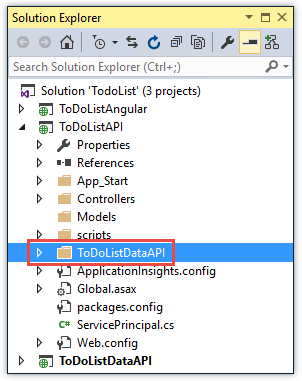

<properties
    pageTitle="Get started with API Apps and ASP.NET in Azure App Service | Microsoft Azure"
    description="Learn how to create, deploy, and consume an ASP.NET API app in Azure App Service, by using Visual Studio 2015."
    services="app-service\api"
    documentationCenter=".net"
    authors="tdykstra"
    manager="wpickett"
    editor=""/>

<tags
    ms.service="app-service-api"
    ms.workload="na"
    ms.tgt_pltfrm="dotnet"
    ms.devlang="na"
    ms.topic="hero-article"
    ms.date="01/26/2016"
    ms.author="tdykstra"/>

# Get started with API Apps and ASP.NET in Azure App Service
> [AZURE.SELECTOR]
- [1. Get started (.NET)](app-service-api-dotnet-get-started.md)
- [1. Get started (Node.js)](app-service-api-nodejs-api-app.md)
- [1. Get started (Java)](app-service-api-java-api-app.md)
- [2. CORS](app-service-api-cors-consume-javascript.md)
- [3. Auth intro](app-service-api-authentication.md)
- [4. User auth](app-service-api-dotnet-user-principal-auth.md)
- [5. Service auth](app-service-api-dotnet-service-principal-auth.md)

## Overview
This is the first in a series of tutorials that show how to use features of Azure App Service that are helpful for developing and hosting APIs:

* Integrated support for API metadata
* CORS support
* Authentication and authorization support

You'll deploy a sample application to two [API apps](app-service-api-apps-why-best-platform.md) and a web app in Azure App Service. The sample application is a to-do list that has an AngularJS single-page application (SPA) front end, an ASP.NET Web API middle tier, and an ASP.NET Web API data tier, as shown in the diagram.

Here's a screen shot of the SPA front end.

On completing this tutorial, you'll have the two Web APIs up and running in App Service API apps. After completing the following tutorial you'll have the entire application running in the cloud, with the SPA in an App Service web app. In subsequent tutorials you add authentication and authorization.

## What you'll learn
In this tutorial, you'll learn:

* How to prepare your machine for Azure development by installing the Azure SDK for .NET.
* How to work with API apps and web apps in Azure App Service by using tools built into Visual Studio 2015.
* How to automate API discovery by using the Swashbuckle NuGet package to dynamically generate Swagger API definition JSON.
* How to use automatically generated client code to consume an API app from a .NET client.
* How to use the Azure portal to configure the endpoint for API app metadata.

## Prerequisites
### ASP.NET Web API

The tutorial assumes that you have a basic knowledge of how to work with ASP.NET [Web API 2](http://www.asp.net/web-api/overview/getting-started-with-aspnet-web-api/tutorial-your-first-web-api) and [MVC 5](http://www.asp.net/mvc/overview/getting-started/introduction/getting-started) in Visual Studio.

### Visual Studio 2015

The instructions and screen shots assume you're using Visual Studio 2015, but the same guidance works for Visual Studio 2013.

### Azure account

You do not need any prior knowledge of how to work with Microsoft Azure, but you do need an Azure account to complete the tutorial. You can:

* [Open an Azure account for free](/pricing/free-trial/?WT.mc_id=A261C142F). You get credits that can be used to try out paid Azure services. Even after the credits are used up, you can keep the account and use free Azure services and features, such as the Web Apps feature in Azure App Service.
* [Activate Visual Studio subscriber benefits](/pricing/member-offers/msdn-benefits-details/?WT.mc_id=A261C142F). Your MSDN subscription gives you credits every month that you can use for paid Azure services.

If you want to get started with Azure App Service before you sign up for an Azure account, go to [Try App Service](http://go.microsoft.com/fwlink/?LinkId=523751). There, you can immediately create a short-lived starter  app in App Service — no credit card required, and no commitments.

## Set up the development environment

To start, set up your development environment by installing the [Azure SDK for Visual Studio 2015](http://go.microsoft.com/fwlink/?linkid=518003) or the [Azure SDK for Visual Studio 2013](http://go.microsoft.com/fwlink/?LinkID=324322).

If you don't have Visual Studio installed, use the link for Visual Studio 2015, and Visual Studio will be installed along with the SDK.

>[AZURE.NOTE] Depending on how many of the SDK dependencies you already have on your machine, installing the SDK could take a long time, from several minutes to a half hour or more.

This tutorial requires version 2.8.2 or later of the Azure SDK for .NET.

## Download the sample application
1. Download the [Azure-Samples/app-service-api-dotnet-to-do-list](https://github.com/Azure-Samples/app-service-api-dotnet-todo-list) repository.

    You can click the **Download ZIP** button or clone the repository on your local machine. 

2. Open the ToDoList solution in Visual Studio 2015 or 2013.

    The Visual Studio solution is a sample application that works with    simple to-do items that consist of a description and an owner.

        public class ToDoItem 
     { 
         public int ID { get; set; } 
         public string Description { get; set; } 
         public string Owner { get; set; } 
     } 

    The solution includes three projects:

    

   * **ToDoListAngular** - The front end: an AngularJS SPA that calls the middle tier. 

* **ToDoListAPI** - The middle tier: an ASP.NET Web API project that calls the data tier to perform CRUD operations on to-do items.

* **ToDoListDataAPI** - The data tier:  an ASP.NET Web API project that performs CRUD operations on to-do items. To-do items are stored in memory, which means that whenever the application is restarted all changes are lost. 

  The middle tier provides the user ID in the `Owner` field when it calls the data tier. In the code that you download, the user ID is always "*". When you add authentication in later tutorials, the middle tier will provide the actual user ID to the data tier.

3. Build the solution to restore the NuGet packages.

### Optional: run the application locally
In this section you verify that you can run the client locally and can call the API while it too is running locally.

**Note:** These instructions work for Internet Explorer and Edge browsers because these browsers allow cross-origin JavaScript calls from and to `http://localhost` URLs. If you're using Chrome, start the browser with the `--disable-web-security` switch. If you're using Firefox, skip this section.

1. Set all three projects as startup projects, with ToDoListDataAPI starting first, then ToDoListAPI, and then ToDoListAngular. (Right-click the solution, click **Properties**, select **Multiple startup projects**, put the projects in the correct order, and set **Action** to **Start** for each one.)  

2. Press F5 to start the projects.

    Two browser windows open to HTTP 403 error pages, which is normal for Web API projects, and the third browser window shows the AngularJS UI. 

3. In the browser window that shows the AngularJS UI, click the **To Do List** tab.

    The UI shows two default to-do items.

    

4. Add, edit, and delete to-do items to see how the application works. 

    Any changes you make are stored in memory and are lost the when you restart the application.

5. Close the browser windows.

## Use Swagger metadata and UI
Support for [Swagger](http://swagger.io/) 2.0 API metadata is built into Azure App Service. Each API app specifies a URL endpoint that returns metadata for the API in Swagger JSON format. The metadata returned from that endpoint can be used to generate client code. 

The [Swashbuckle](https://www.nuget.org/packages/Swashbuckle) NuGet package provides Swagger 2.0 metadata for an ASP.NET Web API project. Swashbuckle uses Reflection to dynamically generate metadata. 

The Swashbuckle NuGet package is already installed in the ToDoListDataAPI and ToDoListAPI projects that you downloaded, and it is already installed when you create a new project by using the **Azure API App** project template. (In Visual Studio: **File > New > Project > ASP.NET Web Application > Azure API App**.)

In this section of the tutorial you take a look at the generated Swagger 2.0 metadata, and then you try out a test UI that is based on the Swagger metadata.

1. Set the ToDoListDataAPI project as the startup project. 

2. Press F5 to run the project in debug mode.

    The browser opens and shows the HTTP 403 error page.

3. In your browser address bar, add `swagger/docs/v1` to the end of the line, and then press Return. (The URL will be `http://localhost:45914/swagger/docs/v1`.)

   This is the default URL used by Swashbuckle to return Swagger 2.0 JSON metadata for the API. If you're using Internet Explorer, the browser prompts you to download a *v1.json* file.

   

   If you're using Chrome, Firefox, or Edge, the browser displays the JSON in the browser window.

   

   The following sample shows the first section of the Swagger metadata for the API, with the definition for the Get method. This metadata is what drives the Swagger UI that you'll use in the following steps, and you'll use it in a later section of the tutorial to automatically generate client code.

       {
      "swagger": "2.0",
      "info": {
        "version": "v1",
        "title": "ToDoListDataAPI"
      },
      "host": "localhost:45914",
      "schemes": [ "http" ],
      "paths": {
        "/api/ToDoList": {
          "get": {
            "tags": [ "ToDoList" ],
            "operationId": "ToDoList_GetByOwner",
            "consumes": [ ],
            "produces": [ "application/json", "text/json", "application/xml", "text/xml" ],
            "parameters": [
              {
                "name": "owner",
                "in": "query",
                "required": true,
                "type": "string"
              }
            ],
            "responses": {
              "200": {
                "description": "OK",
                "schema": {
                  "type": "array",
                  "items": { "$ref": "#/definitions/ToDoItem" }
                }
              }
            },
            "deprecated": false
          },
4. Close the browser.

5. In the ToDoListDataAPI project in **Solution Explorer**, open the *App_Start\SwaggerConfig.cs* file, then scroll down to the following code and uncomment it.

        /*
         })
     .EnableSwaggerUi(c =>
         {
     */

    The *SwaggerConfig.cs* file is created when you install the Swashbuckle package in a project. The file provides a number of ways to configure Swashbuckle.

    The code you've uncommented enables the Swagger UI that you'll use in the following steps. When you create a Web API project by using the API app project template, this code is commented out by default as a security measure.

6. Run the project again.

7. In your browser address bar, add `swagger` to the end of the line, and then press Return. (The URL will be `http://localhost:45914/swagger`.)

8. When the Swagger UI page appears, click **ToDoList** to see the methods available.

    

9. Click **Get**.

10. Enter an asterisk as the value of the `owner` parameter, and then click **Try it out**.

     

     The Swagger UI calls the ToDoList Get method and displays the JSON results.

     

11. Click **Post**, and then click the box under **Model Schema**.

     Clicking the model schema prefills the input box where you can specify the parameter value for the Post method. (If this doesn't work in Internet Explorer, use a different browser or enter the parameter value manually in the next step.  

     

12. Change the JSON in the `contact` parameter input box so that it looks like the following example, or substitute your own description text:

         {
       "ID": 2,
       "Description": "buy the dog a toy",
       "Owner": "*"
     }
13. Click **Try it out**.

    The ToDoList API returns an HTTP 204 response code that indicates success.

14. Click **Get > Try it out**.

    The Get method response now includes the new to do item. 

15. Try also the Put, Delete, and Get by ID methods, and then close the browser.

Swashbuckle works with any ASP.NET Web API project. If you want to add Swagger metadata generation to an existing project, just install the Swashbuckle package. To create a new project, use the ASP.NET **Azure API App** project template, shown in the following illustration. This template creates a Web API project with Swashbuckle installed.

**Note:** By default, Swashbuckle may generate duplicate Swagger operation IDs for your controller methods. This happens if your controller has overloaded HTTP methods, for example: `Get()` and `Get(id)`. For information about how to handle overloads, see [Customize Swashbuckle-generated API definitions](app-service-api-dotnet-swashbuckle-customize.md). If you create a Web API project in Visual Studio by using the Azure API App template, code that generates unique operation IDs is automatically added to the *SwaggerConfig.cs* file.  

## Create an API app in Azure and deploy the ToDoListAPI project to it
In this section you use Azure tools that are integrated into the Visual Studio **Publish Web** wizard to create a new API app in Azure. Then you deploy the ToDoListDataAPI project to the new API app and call the API by running the Swagger UI again, this time while it runs in the cloud.

1. In **Solution Explorer**, right-click the ToDoListDataAPI project, and then click **Publish**.

2. In the **Profile** step of the **Publish Web** wizard, click **Microsoft Azure App Service**.

   

3. Sign in to your Azure account if you have not already done so, or refresh your credentials if they're expired.

4. In the App Service dialog box, choose the Azure **Subscription** you want to use, and then click **New**.

    

5. In the **Hosting** tab of the **Create App Service** dialog box, click **Change Type**, and then click **API App**.

    

    Setting the type to **API App** doesn't determine the features that will be available to the new app. The API definition URL (which you'll see later in this tutorial), CORS support (which you'll see in the next tutorial), and authentication (which you'll see in the last 3 tutorials in this series) are available to web apps and mobile apps as well as API apps.  Creating an app as an API app has only the following effects:

    a. In the Azure portal, the app type icon or text appears in blade headings and lists of apps; and on the **Settings** blade, the API section appears earlier in the list for an API app compared to other app types.

    b. In Visual Studio with the Azure SDK for .NET 2.8.1, Visual Studio sets the API definition URL during creation of a new ASP.NET API app, but not for other app types.

6. Enter an **API App Name** that is unique in the *azurewebsites.net* domain, such as ToDoListDataAPI plus a number to make it unique. 

    Visual Studio proposes a unique name by appending a date-time string to the project name.  You can accept that name if you prefer. 

    If you enter a name that someone else has already used, you'll see a red exclamation mark to the right instead of a green check mark, and you'll need to enter a different name.

    Azure will use this name as the prefix for your application's URL. The complete URL will consist of this name plus *.azurewebsites.net*. For example, if the name is `ToDoListDataAPI`, the URL will be `todolistdataapi.azurewebsites.net`.

7. In the **Resource Group** drop-down, Enter "ToDoListGroup" or another name if you prefer.

    This box lets you select an existing [resource group](../azure-preview-portal-using-resource-groups.md) or create a new one by typing in a name that is different from any existing resource group in your subscription.

    For this tutorial it's best to create a new one because that will make it easy to delete in one step all the Azure resources that you create for the tutorial.

8. Click the **New** button next to the **App Service Plan** drop-down. 

    

    For information about App Service plans, see [App Service plans overview](../app-service/azure-web-sites-web-hosting-plans-in-depth-overview.md).

9. In the **Configure App Service Plan** dialog, enter "ToDoListPlan" or another name if you prefer.

10. In the **Location** drop-down list, choose the location that is closest to you.

     This setting specifies which Azure datacenter your app will run in. For this tutorial, you can select any region and it won't make a noticeable difference. But for a production app, you want your server to be as close as possible to the clients that are accessing it in order to minimize [latency](http://www.bing.com/search?q=web%20latency%20introductionqs=nform=QBREpq=web%20latency%20introductionsc=1-24sp=-1sk=cvid=eefff99dfc864d25a75a83740f1e0090).

11. In the **Size** drop-down, click **Free**.

     For this tutorial, The free pricing tier will provide sufficient performance.

12. In the **Configure App Service Plan** dialog, click **OK**.

     

13. In the **Create App Service** dialog box, click **Create**.

     Visual Studio creates the API app and creates a publish profile that has all of the required settings for the new API app. In the following steps you use the new publish profile to deploy the project. 

     **Note:** There are other ways to create API apps in Azure App Service. In Visual Studio the same dialogs are available while you're creating a new project. You can also create API apps by using the Azure portal, [Azure cmdlets for Windows PowerShell](../powershell-install-configure.md), or the [cross-platform command-line interface](../xplat-cli.md).

14. In the **Connection** tab of the **Publish Web** wizard, click **Publish**.

     

     Visual Studio deploys the ToDoListDataAPI project to the new API app and opens a browser to the URL of the API app. A "successfully created" page appears in the browser.

     

15. Add "swagger" to the URL in the browser's address bar, and then press Enter. (The URL will be `http://{apiappname}.azurewebsites.net/swagger`.)

    The browser displays the same Swagger UI that you saw earlier, but it is now running in the cloud. Try out the Get method, and you see that you're back to the default 2 to-do items, because the changes you made earlier were saved in memory in the local machine.

16. Open the [Azure portal](https://portal.azure.com/).

17. Click **Browse > API Apps > {your new API app}**.

    

18. Click **Settings**, and then in the **Settings** blade find the API section and click **API Definition**. 

    

    The API Definition blade lets you specify the URL that returns Swagger 2.0 metadata in JSON format. When Visual Studio creates the API app, it sets the API definition URL to the default value that you saw earlier, which is the API app's base URL plus `/swagger/docs/v1`. 

    

    When you select an API app to generate client code for it, Visual Studio retrieves the metadata from this URL. 

### API definition URL in Azure Resource Manager tooling
You can also configure the API definition URL for an API app by using Azure Resource Manager tooling such as Azure PowerShell, CLI or [Resource Explorer](https://resources.azure.com/). 

To do that, you set the `apiDefinition` property on the `Microsoft.Web/sites/config` resource type for your `<site name>/web` resource. For example, in **Resource Explorer**, go to **subscriptions > {your subscription} > resourceGroups > {your resource group} > providers > Microsoft.Web > sites > {your site} > config > web**, and you'll see the `apiDefinition` property:

        "apiDefinition": {
          "url": "https://todolistdataapi.azurewebsites.net/swagger/docs/v1"
        }

##  Consume from a .NET client by using generated client code
One of the advantages of integrating Swagger into Azure API apps is automatic code generation. Generated client classes make it easier to write code that calls an API app.

In this section you see how to consume an API app from ASP.NET Web API code. 

### Generate client code
You can generate client code for an API app by using Visual Studio or from the command line. For this tutorial you'll use Visual Studio. For information about how to do it from the command line, see the readme file of the [Azure/autorest](https://github.com/azure/autorest) repository on GitHub.com.

The ToDoListAPI project already has the generated client code, but you'll delete it and regenerate it, which will reset the default target URL to your own API app.

1. In Visual Studio **Solution Explorer**, in the ToDoListAPI project, delete the *ToDoListDataAPI* folder.

    This folder was created by using the code generation process that you're about to go through.

    

2. Right-click the ToDoListAPI project, and then click **Add > REST API Client**.

    

3. In the **Add REST API Client** dialog box, click **Swagger URL**, and then click **Select Azure Asset**.

    

4. In the **App Service** dialog box, expand the resource group you're using for this tutorial and select your API app, and then click **OK**.

    This dialog box gives more than one way to organize API apps in the list, in case you have too many to scroll through. It also lets you enter a search string to filter API apps by name.

    

    If you don't see the API app in the list, chances are that when you were creating the API app you accidentally omitted the step that changed the type from web app to API app. In that case, you can create a new API app by repeating the steps you did earlier. You'll need to choose a different name for the API app. 

    Notice that when you return to the **Add REST API Client** dialog, the text box has been filled in with the API definition URL value that you saw earlier in the portal. 

    

    An alternative way to get metadata for code generation is to enter the URL directly instead of going through the browse dialog. For example, if you deployed your API to a web app and it doesn't show up in the browse dialog, you can manually enter the URL that returns Swagger metadata here.

    Another alternative way to get metadata is to use the **Select an existing Swagger metadata file** option. For example, if you want to generate client code before deploying to Azure, you could run locally, download the Swagger JSON file, and select it here.

5. In the **Add REST API Client** dialog box, click **OK**.

    Visual Studio creates a folder named after the API app and generates client classes.

    

6. In the ToDoListAPI project, open *Controllers\ToDoListController.cs* to see the code that calls the API by using the generated client. 

    The following snippet shows how the code instantiates the client object and calls the Get method.

        private ToDoListDataAPI db = new ToDoListDataAPI(new Uri("http://localhost:45914"));

     public ActionResult Index()
     {
         return View(db.Contacts.Get());
     }

    This code passes in the local IIS Express URL of thet API project to the client class constructor so that you can run the the application locally. If you omit the constructor parameter, the default endpoint is the URL that you generated the code from.

7. Your client class will be generated with a different name based on your API app name; change this code so that the type name matches what was generated in your project, and remove the URL. For example, if you named your API App ToDoListDataAPI0121, the code would look like the following example:

        private ToDoListDataAPI0121 db = new ToDoListDataAPI0121();

     public ActionResult Index()
     {
         return View(db.Contacts.Get());
     }

    The default target URL is your ToDoListDataAPI API app because you generated the code from there; if you used a different method to generate the code you might have to specify the Azure API app URL the same way you specified the local URL. 

#### Create an API app to host the middle tier
1. In **Solution Explorer**, right-click the ToDoListAPI project, and then click **Publish**.

2. In the **Profile** tab of the **Publish Web** wizard, click **Microsoft Azure App Service**.

3. In the **App Service** dialog box, click **New**.

4. In the **Hosting** tab of the **Create App Service** dialog box, click **Change Type**, and change the type to **API App**.

5. Enter an **API App Name** that is unique in the *azurewebsites.net* domain. 

6. Choose the Azure **Subscription** you want to work with.

7. In the **Resource Group** drop-down, choose the same resource group you created earlier.

8. In the **App Service Plan** drop-down, choose the same plan you created earlier. 

9. Click **Create**.

    Visual Studio creates the API app, creates a publish profile for it, and displays the **Connection** step of the **Publish Web** wizard.

### Deploy the ToDoListAPI project to the new API app
1. In the **Connection** step of the **Publish Web** wizard, click **Publish**.

   Visual Studio deploys the ToDoListAPI project to the new API app and opens a browser to the URL of the API app. The "successfully created" page appears.

### Test to verify that ToDoListAPI calls ToDoListDataAPI
1. Add "swagger" to the URL in the browser's address bar, and then press Enter. (The URL will be `http://{apiappname}.azurewebsites.net/swagger`.)

   The browser displays the same Swagger UI that you saw earlier for ToDoListDataAPI, but now `owner` is not a required field, because the middle tier API app is sending that value to the data tier API app for you.  

2. Try out the Get method and the other methods to validate that the middle tier API app is successfully calling the data tier API app.

   

## Next steps
In this tutorial, you've seen how to create API apps, deploy code to them, generate client code for them, and consume them from .NET clients. The next tutorial in the API Apps getting started series shows how to [consume API apps from JavaScript clients, using CORS](app-service-api-cors-consume-javascript.md).

