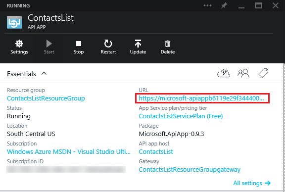
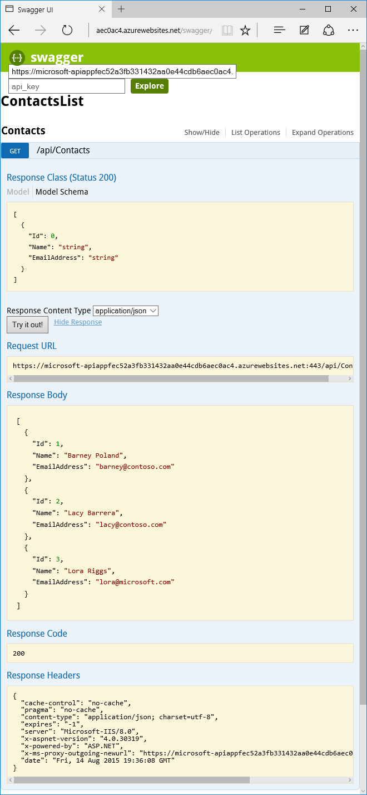
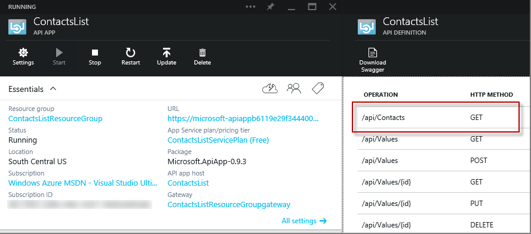
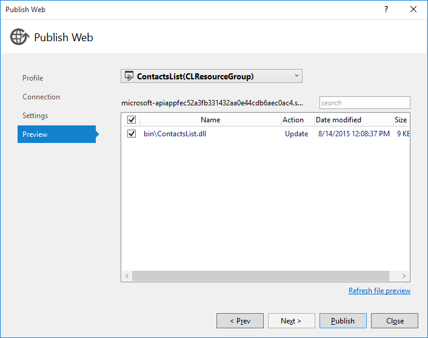
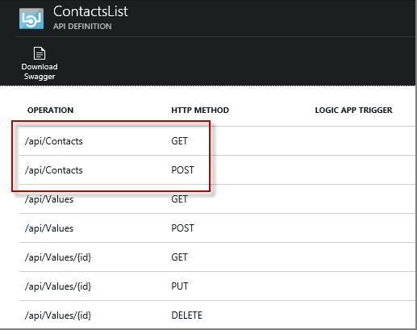

<properties 
    pageTitle="Deploy an API app in Azure App Service " 
    description="Learn how to deploy an API app project to your Azure subscription." 
    services="app-service\api" 
    documentationCenter=".net" 
    authors="bradygaster" 
    manager="wpickett" 
    editor="jimbe"/>

<tags 
    ms.service="app-service-api" 
    ms.workload="web" 
    ms.tgt_pltfrm="dotnet" 
    ms.devlang="na" 
    ms.topic="article" 
    ms.date="01/08/2016" 
    ms.author="tdykstra"/>

# Deploy an API app in Azure App Service
> [AZURE.WARNING] This article refers to the original preview release of App Service API Apps.  For information about the current preview release of API Apps, see [App Service API Apps - What's changed](../articles/app-service-api/app-service-api-whats-changed.md). For tutorials that show how to work with the current preview release of API Apps, see [Get started with API Apps](../articles/app-service-api/app-service-api-dotnet-get-started.md). 

## Overview
In this tutorial, you deploy the Web API project that you created in the [previous tutorial](app-service-dotnet-create-api-app.md) to a new [API app](app-service-api-apps-why-best-platform.md). You use Visual Studio to create the API app resource in [Azure App Service](../app-service/app-service-value-prop-what-is.md) and to deploy your Web API code to the Azure API app. 

### Other deployment options
There are many other ways to deploy API apps. An API app is a [web app](../app-service-web/app-service-web-overview.md) with extra features for hosting web services, and all of [the deployment methods that are available for web apps](../app-service-web/web-sites-deploy.md) can also be used with API apps. The web app that hosts an API app is called the API app host in the Azure preview portal, and you can configure deployment by using the API app host portal blade. For information about the API app host blade, see [Manage an API app](app-service-api-manage-in-portal.md).

The fact that API apps are based on web apps also means that you can deploy code written for platforms other than ASP.NET to API apps. For an example that uses Git to deploy Node.js code to an API app, see [Create a Node.js API app in Azure App Service](app-service-api-nodejs-api-app.md).

## Create the API app in Azure
In this section, you use the Visual Studio **Publish Web** wizard to create an API app in Azure. Where the instructions direct you to enter a name for the API app, enter *ContactsList*.

1. In **Solution Explorer**, right-click the project (not the solution) and click **Publish**. 

	

2. Click the **Profile** tab and click **Microsoft Azure API Apps (Preview)**. 

	

3. Click **New** to provision a new API App in your Azure subscription.

	

4. In the **Create an API App** dialog, enter the following:

	- For **API App Name**, enter the name you're using for this tutorial. 
	- If you have multiple Azure subscriptions, select the one you want to use.
	- For **App Service Plan**, select from your existing App Service plans, or select **Create new App Service plan** and enter the name of a new plan. 
	- For **Resource Group**, select from your existing resource groups, or select **Create new resource group** and enter a name. 
	- For **Access Level**, select **Available to Anyone**. You can restrict access later through the Azure preview portal.
	- For **Region**, select a region close to you.  

	

5. Click **OK** to create the API App in your subscription. 

	As this process can take a few minutes, Visual Studio displays a confirmation dialog.  

6. Click **OK** on the confirmation dialog. 
 
	The provisioning process creates the resource group and API App in your Azure subscription. Visual Studio shows the progress in the **Azure App Service Activity** window. 

	

## Deploy your code to the new Azure API app
You use the same **Publish Web** wizard to deploy your code to the new API app.

7. Right-click the API app project in **Solution Explorer** and select **Publish** to open the publish dialog. The publish profile that you created earlier should be pre-selected. 

9. Click **Publish** to begin the deployment process. 

	

	The **Azure App Service Activity** window shows the deployment progress. 

	

	During this deployment process, Visual Studio automatically tries to restart the *gateway*. The gateway is a web app that handles administrative functions for all API apps in a resource group, and it has to be restarted to recognize changes in an API app's API definition or *apiapp.json* file. 
 
	If you use another method to deploy an API app, or if Visual Studio fails to restart the gateway, you might have to restart the gateway manually. The following steps explain how to do that.

1. In your browser, go to the [Azure preview portal](https://portal.azure.com). 

2. Navigate to the **API app** blade for the API app that you deployed.

	For information about the **API app** blade, and how to find it, see [Manage API apps](../articles/app-service-api/app-service-api-manage-in-portal.md).

4. Click the **Gateway** link.

3. In the **Gateway** blade, click **Restart**.

	

## Call the Azure API app
Since you enabled the Swagger UI in the previous tutorial, you can use that to verify that the API app is running in Azure.

1. In the [Azure preview portal](https://portal.azure.com/), go to the **API app** blade for the API app that you deployed.

2. Click the API app's URL.

    

    An "API app successfully created" page appears.

3. Add "/swagger" to the end of the URL in the browser address bar.

4. In the Swagger page that appears, click **Contacts > Get > Try it Out**.

    

## View the API definition in the portal
1. In the [Azure preview portal](https://portal.azure.com/), go back to the **API app** blade for the API app that you deployed.

2. Click **API Definition**. 

    The app's **API Definition** blade shows the list of API operations that you defined when you created the app. 

    

Next, you'll make a change to the API definition and see the change reflected in the portal.

1. Go back to the project in Visual Studio and add the following code to the **ContactsController.cs** file.   

        [HttpPost]
     public HttpResponseMessage Post([FromBody] Contact contact)
     {
         // todo: save the contact somewhere
         return Request.CreateResponse(HttpStatusCode.Created);
     }

    This code adds a **Post** method that can be used to post new `Contact` instances to the API.

    The code for the Contacts class now looks like the following example.

        public class ContactsController : ApiController
     {
         [HttpGet]
         public IEnumerable<Contact> Get()
         {
             return new Contact[]{
                         new Contact { Id = 1, EmailAddress = "barney@contoso.com", Name = "Barney Poland"},
                         new Contact { Id = 2, EmailAddress = "lacy@contoso.com", Name = "Lacy Barrera"},
                         new Contact { Id = 3, EmailAddress = "lora@microsoft.com", Name = "Lora Riggs"}
                     };
         }

         [HttpPost]
         public HttpResponseMessage Post([FromBody] Contact contact)
         {
             // todo: save the contact somewhere
             return Request.CreateResponse(HttpStatusCode.Created);
         }
     }
2. In **Solution Explorer**, right-click the project and select **Publish**. 

3. Click the **Preview** tab

4. Click **Start Preview** to see which file(s) will be copied to Azure.  

   

5. Click **Publish**.

6. Restart the gateway as you did the first time you published.

7. Once the publish process has completed, go back to the portal, and close and reopen the **API Definition** blade. You will see the new API endpoint you just created and deployed directly into your Azure subscription.

   

## Next steps
You've seen how the direct deployment capabilities in Visual Studio make it easy to test that your API works correctly. In the [next tutorial](../app-service-dotnet-remotely-debug-api-app.md), you'll see how to debug your API app while it runs in Azure.

API apps are web apps with extra features for hosting APIs, which means you can use any deployment method that works with web apps. For more information about deployment options for web apps, see [Deploy a web app in Azure App Service](../app-service-web/web-sites-deploy.md).

For information about API Apps features, see [What are API apps?](app-service-api-apps-why-best-platform.md).

