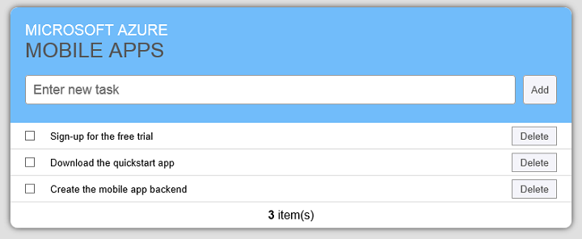
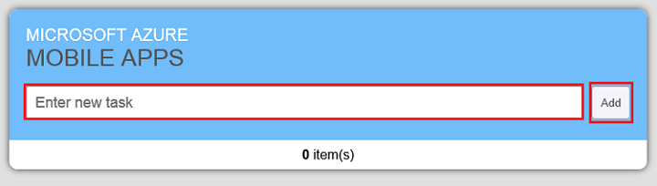

<properties
    pageTitle="Get Started with mobile app backends for HTML/JavaScript apps | Azure App Service Mobile Apps"
    description="Follow this tutorial to get started using Azure mobile app backends for web app development in HTML5 and JavaScript."
    services="app-service\mobile"
    documentationCenter=""
    authors="ggailey777"
    manager="dwrede"
    editor=""/>

<tags
    ms.service="app-service-mobile"
    ms.workload="mobile"
    ms.tgt_pltfrm="mobile-html5"
    ms.devlang="javascript"
    ms.topic="get-started-article"
    ms.date="11/18/2015"
    ms.author="glenga"/>

# Create an HTML app
> [AZURE.SELECTOR]
- [Android](../articles/app-service-mobile/app-service-mobile-android-get-started.md)
- [iOS](../articles/app-service-mobile/app-service-mobile-ios-get-started.md)
- [Windows](../articles/app-service-mobile/app-service-mobile-windows-store-dotnet-get-started.md)
- [Xamarin.Android](../articles/app-service-mobile/app-service-mobile-xamarin-android-get-started.md)
- [Xamarin.iOS](../articles/app-service-mobile/app-service-mobile-xamarin-ios-get-started.md)
- [Xamarin.Forms](../articles/app-service-mobile/app-service-mobile-xamarin-forms-get-started.md)

&nbsp;  
<!--- [AZURE.INCLUDE [app-service-mobile-note-mobile-services](../../includes/app-service-mobile-note-mobile-services.md)]-->

> [!IMPORTANT]
> This topic is not currently supported by Mobile Apps because the quickstart for HTML/JavaScript apps has been temporarily removed from the Azure portal. We plan to bring it back in the very near future. Thanks you for your patience.
> 
> 
## Overview
This tutorial shows you how to add a cloud-based backend service to an HTML5/JavaScript web app. For more information, see [What are Mobile Apps](app-service-mobile-value-prop.md). 

A screenshot from the completed app is below:

Completing this tutorial is a prerequisite for all other Mobile Apps tutorials for HTML apps. 

## Prerequisites
To complete this tutorial, you need the following:

* An active Azure account. If you don't have an account, you can sign up for an Azure trial and get up to 10 free Mobile Apps that you can keep using even after your trial ends. For details, see [Azure Free Trial](https://azure.microsoft.com/pricing/free-trial/).

* [Visual Studio Community 2013](https://www.visualstudio.com/downloads) or a later version.

> [!NOTE]
> If you want to get started with Azure App Service before signing up for an Azure account, go to [Try App Service](https://tryappservice.azure.com/?appServiceName=mobile), where you can immediately create a short-lived starter Mobile App in App Service. No credit cards required; no commitments.
> 
> 
## Create a new Mobile App backend
Follow these steps to create a new Mobile App backend.

1. Log into the [Azure Portal].

2. In the top left of the window, click the **+NEW** button > **Web + Mobile** > **Mobile App**, then provide a name for your Mobile App backend.

3. In the **Resource Group** box, select an existing resource group. If you have no resource groups, enter the same name as your app. 
 
	At this point, the default App Service plan is selected, which is in the Free tier. The App Service plan settings determine the location, features, cost and compute resources associated with your app. You can either select another App Service plan or create a new one. For more about App Services plans and how to create a new plan, see [Azure App Service plans in-depth overview](../app-service/azure-web-sites-web-hosting-plans-in-depth-overview.md)

4. Use the default App Service plan, select a different plan or [create a new plan](../app-service/azure-web-sites-web-hosting-plans-in-depth-overview.md#create-an-app-service-plan), then click **Create**. 
	
	This creates the Mobile App backend. Later you will deploy your server project to this backend. Provisioning a Mobile App backend can take several minutes; the **Settings** blade for the Mobile App backend is displayed when complete. Before you can use the Mobile App backend, you must also define a connection a data store.

    > [AZURE.NOTE] As part of this tutorial, you create a new SQL Database instance and server. You can reuse this new database and administer it as you would any other SQL Database instance. If you already have a database in the same location as the new mobile app backend, you can instead choose **Use an existing database** and then select that database. The use of a database in a different location is not recommended because of additional bandwidth costs and higher latencies. Other data storage options are available. 

6. In the **Settings** blade for the new Mobile App backend, click **Quick start** > your client app platform > **Connect a database**. 

	

7. In the **Add data connection** blade, click **SQL Database** > **Create a new database**, type the database **Name**, choose a pricing tier, then click **Server**.  
 
    

8. In the **New server** blade, type a unique server name in the **Server name** field, provide a secure **Server admin login** and **Password**, make sure that **Allow azure services to access server** is checked, then click **OK** twice. This creates the new database and server.

10. Back in the **Add data connection** blade, click **Connection string**, type the login and password values for your database, then click **OK** twice.

	Creation of the database can take a few minutes.  Use the **Notifications** area to monitor the progress of the deployment.  You cannot continue until the database has been deployed sucessfully.

<!-- URLs. -->
[Azure Portal]: https://portal.azure.com/

You have now provisioned an Azure Mobile App backend that can be used by your mobile client applications. Next, you will download a server project for a simple "todo list" backend and publish it to Azure.

## Download the server project
1. In the [Azure Portal](https://portal.azure.com/), click **Browse All** > **Web Apps**, then click the Mobile App backend that you just created. 

2. In the Mobile App backend, click **All settings** and under **Mobile App** click **Quickstart** > **HTML/JavaScript**.

3. Under **Download and run your server project** in **Create a new app**, click **Download**, extract the compressed project files to your local computer, and open the solution in Visual Studio.

4. Build the project to restore the NuGet packages.

## Enable CORS in the server project
Cross-origin resource sharing (CORS) is a way for your web-based app to indicate from which domains requests are safe and should be permitted by the browser. You must add a CORS entry for every web site that will access your Mobile App backend. You control your CORS settings by using the standard ASP.NET Web API behaviors. For more information, see [Enabling Cross-Origin Requests in ASP.NET Web API](http://www.asp.net/web-api/overview/security/enabling-cross-origin-requests-in-web-api#enable-cors).

By default, the client quickstart project that you will download from the portal runs on localhost on port 8000. Because of this, you will next enable CORS for `http://localhost:8000` in the server project.  

1. In Visual Studio in the Tools menu, click **NuGet Package Manager** > **Package Manager Console**, select Nuget.org as the **Package source** and execute the following command in the console window:

        Install-Package Microsoft.AspNet.WebApi.Cors  
2. Open the App_Start/Startup.MobileApp.cs project file and add the following using statement:

        using System.Web.Http.Cors;
3. Next, add the following code to the **Startup.ConfigureMobileApp** method after the **HttpConfiguration** (*config*) is created:

        // Enable CORS support for localhost port 8000, all headers and methods.
     var cors = new EnableCorsAttribute("http://localhost:8000", "*", "*");
     config.EnableCors(cors);
4. Save your updates.

Next, you will deploy your CORS-enabled project to Azure.

## Publish the server project to Azure
	
+ **.NET backend (C#)**:  

	1. In Visual Studio, right-click the project, click **Publish** > **Publish Web** > **Microsoft Azure Web Apps**, and (if needed) sign-in with your Azure credentials. When you sign in, Visual Studio downloads and stores your publish settings directly from Azure.
	
	2. Select your service from **Existing Web Apps** and click **OK**, then verify the publish information and click **Publish**.  When your Mobile App backend has published successfully, you will see a landing page indicating success.

+ **Node.js backend (via Node.js code)** :  

 	Follow the [instructions for deploying Node.js to a Web App](../articles/app-service-web/web-sites-nodejs-develop-deploy-mac.md)
 

## Download and run the client project
1. Back in the blade for your Mobile App backend, click **All settings** and under **Mobile App** click **Quickstart** > **HTML/JavaScript**. 

2. Under **Download and run your HTML/Javascript project** in **Create a new app**, click **Download** and save the compressed project files to your local computer.

3. Browse to the location where you saved the compressed project files, expand the files on your computer, and launch one of the following command files from the **server** subfolder.

   * **launch-windows** (Windows computers)
* **launch-mac.command** (Mac OS X computers)
* **launch-linux.sh** (Linux computers)

  > [!NOTE]
> On a Windows computer, type `R` when PowerShell asks you to confirm that you want to run the script. Your web browser might warn you to not run the script because it was downloaded from the internet. When this happens, you must request that the browser proceed to load the script.
> 
> 
  This starts a web server on your local computer to host the new app.

4. Open the URL <a href="http://localhost:8000/" target="_blank">http://localhost:8000/</a> in a web browser to start the app. The client app is configured to connect to your Mobile App backend in Azure.

5. In the app, type meaningful text, such as *Complete the tutorial*, in **Enter new task**, and then click **Add**.

       

    This sends a POST request to the new Mobile App backend hosted in Azure. Data from the request is inserted into the TodoItem table in the Mobile App schema. Items stored in the table are returned by the service, and the data is displayed in the second column in the app.

   > [!TIP]
> You can review the code that accesses your mobile service to query and insert data, which is found in the app.js file. 
> 
> 

<!-- Anchors. -->
<!-- Images. -->
<!-- URLs. -->

[Get started with authentication]: app-service-mobile-windows-store-dotnet-get-started-users.md
[Mobile App SDK]: http://go.microsoft.com/fwlink/?LinkId=257545
[Azure Portal]: https://portal.azure.com/

[Visual Studio Community 2013]: https://www.visualstudio.com/downloads

