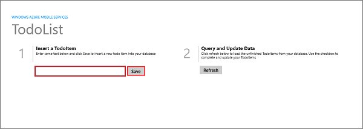
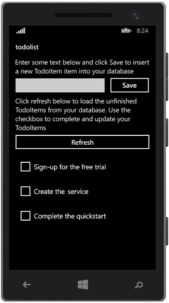

<properties
    pageTitle="Create a Windows Runtime 8.1 universal app on Azure App Service Mobile Apps | Microsoft Azure"
    description="Follow this tutorial to get started with using Azure mobile app backends for Windows Store development in C#, Visual Basic, or JavaScript."
    services="app-service\mobile"
    documentationCenter="windows"
    authors="ggailey777"
    manager="dwrede"
    editor=""/> 

<tags
    ms.service="app-service-mobile"
    ms.workload="mobile"
    ms.tgt_pltfrm="mobile-windows"
    ms.devlang="dotnet"
    ms.topic="hero-article"
    ms.date="12/19/2015"
    ms.author="glenga"/>

# Create a Windows app
> [AZURE.SELECTOR]
- [Android](../articles/app-service-mobile/app-service-mobile-android-get-started.md)
- [iOS](../articles/app-service-mobile/app-service-mobile-ios-get-started.md)
- [Windows](../articles/app-service-mobile/app-service-mobile-windows-store-dotnet-get-started.md)
- [Xamarin.Android](../articles/app-service-mobile/app-service-mobile-xamarin-android-get-started.md)
- [Xamarin.iOS](../articles/app-service-mobile/app-service-mobile-xamarin-ios-get-started.md)
- [Xamarin.Forms](../articles/app-service-mobile/app-service-mobile-xamarin-forms-get-started.md)

&nbsp;
>[AZURE.NOTE] This is an **Azure Mobile Apps** topic. For Mobile Services topics, see the [Mobile Services documentation center](/documentation/services/mobile-services/).
>
>App Service Mobile Apps is our newest mobile backend platform and [gives you additional advantages](app-service-mobile-value-prop-migration-from-mobile-services.md) over Mobile Services. [Migrating to App Service](app-service-mobile-migrating-from-mobile-services.md) is  recommended for customers using the .NET backend SDK. However, [Mobile Apps Node SDK](https://github.com/azure/azure-mobile-apps-node) is currently in Preview and is not yet recommended for production use. SDK and API contracts are subject to change within minor version releases.

## Overview
This tutorial shows you how to add a cloud-based backend service to a universal Windows app. For more information, see [What are Mobile Apps](app-service-mobile-value-prop.md).  

The following are screen captures from the completed app:

 Windows Store app

 Windows Phone Store app

Completing this tutorial is a prerequisite for all other Mobile App tutorials for Windows Store and Windows Phone Store apps. 

## Prerequisites
To complete this tutorial, you need the following:

* An active Azure account. If you don't have an account, you can sign up for an Azure trial and get up to 10 free mobile apps that you can keep using even after your trial ends. For details, see [Azure Free Trial](https://azure.microsoft.com/pricing/free-trial/).

* [Visual Studio Community 2013](https://go.microsoft.com/fwLink/p/?LinkID=534203) or a later version.

> [!NOTE]
> If you want to get started with Azure App Service before you sign up for an Azure account, go to [Try App Service](https://tryappservice.azure.com/?appServiceName=mobile). There, you can immediately create a short-lived starter mobile app in App Service—no credit card required, and no commitments.
> 
> 
## Create a new Azure Mobile App backend
Follow these steps to create a new Mobile App backend.

1. Log into the [Azure Portal].

2. In the top left of the window, click the **+NEW** button > **Web + Mobile** > **Mobile App**, then provide a name for your Mobile App backend.

3. In the **Resource Group** box, select an existing resource group. If you have no resource groups, enter the same name as your app. 
 
	At this point, the default App Service plan is selected, which is in the Free tier. The App Service plan settings determine the location, features, cost and compute resources associated with your app. You can either select another App Service plan or create a new one. For more about App Services plans and how to create a new plan, see [Azure App Service plans in-depth overview](../app-service/azure-web-sites-web-hosting-plans-in-depth-overview.md)

4. Use the default App Service plan, select a different plan or [create a new plan](../app-service/azure-web-sites-web-hosting-plans-in-depth-overview.md#create-an-app-service-plan), then click **Create**. 
	
	This creates the Mobile App backend. Later you will deploy your server project to this backend. Provisioning a Mobile App backend can take several minutes; the **Settings** blade for the Mobile App backend is displayed when complete. Before you can use the Mobile App backend, you must also define a connection a data store.

    > [AZURE.NOTE] As part of this tutorial, you create a new SQL Database instance and server. You can reuse this new database and administer it as you would any other SQL Database instance. If you already have a database in the same location as the new mobile app backend, you can instead choose **Use an existing database** and then select that database. The use of a database in a different location is not recommended because of additional bandwidth costs and higher latencies. Other data storage options are available. 

6. In the **Settings** blade for the new Mobile App backend, click **Quick start** > your client app platform > **Connect a database**. 

	

7. In the **Add data connection** blade, click **SQL Database** > **Create a new database**, type the database **Name**, choose a pricing tier, then click **Server**.  
 
    

8. In the **New server** blade, type a unique server name in the **Server name** field, provide a secure **Server admin login** and **Password**, make sure that **Allow azure services to access server** is checked, then click **OK** twice. This creates the new database and server.

10. Back in the **Add data connection** blade, click **Connection string**, type the login and password values for your database, then click **OK** twice.

	Creation of the database can take a few minutes.  Use the **Notifications** area to monitor the progress of the deployment.  You cannot continue until the database has been deployed sucessfully.

<!-- URLs. -->
[Azure Portal]: https://portal.azure.com/

You have now provisioned an Azure Mobile App backend that can be used by your mobile client applications. Next, you will download a server project for a simple "todo list" backend and publish it to Azure.

## Configure the server project

1. Back in the Mobile App backend settings, click **Get started** > your client platform. 

2. Under **Create a table API**, select your **Backend language**, either **C#** or **Node.js**:

	+ **Node.js backend** (via portal):  
	Accept the acknowledgment and click **Create TodoItem table**. This creates a new *TodoItem* table in your database.
	 
		>[AZURE.IMPORTANT] Switching an existing app backend to Node.js will overwrite all site contents.

	+ **.NET backend (C#)**:  
	Click **Download**, extract the compressed project files to your local computer, open the solution in Visual Studio, build the project to restore the NuGet packages, then deploy the project to Azure. To learn how to deploy a .NET backend server project to Azure, see [How to: Publish the server project](app-service-mobile-dotnet-backend-how-to-use-server-sdk.md#publish-server-project) in the .NET backend SDK topic. 
	 
You Mobile App backend is now ready to use with your client app.

## Download and run the client project
Once you have configured your Mobile App backend, you can either create a new client app or modify an existing app to connect to Azure. In this section, you download a universal Windows app template project that is customized to connect to your Mobile App backend.

1. Back in the **Get started** blade for your Mobile App backend, click **Create a new app** > **Download**, then extract the compressed project files to your local computer.

2. (Optional) Add the universal Windows app project to the solution with the server project. This makes it easier to debug and test both the app and the backend in the same Visual Studio solution, if you choose to do so.

3. With the Windows Store app as the startup project, press the F5 key to rebuild the project and start the Windows Store app.

4. In the app, type meaningful text, such as *Complete the tutorial*, in the **Insert a TodoItem** text box, and then click **Save**.

    

    This sends a POST request to the new mobile app backend that's hosted in Azure.

5. Stop debugging, right-click the `<your app name>.WindowsPhone` project, click **Set as StartUp Project**, and then press F5 again.

    

    Notice that data saved from the previous step is loaded from the mobile app after the Windows app starts.

## Next steps
* [Add authentication to your app ](app-service-mobile-windows-store-dotnet-get-started-users.md)
 Learn how to authenticate users of your app with an identity provider.

* [Add push notifications to your app](app-service-mobile-windows-store-dotnet-get-started-push.md)
 Learn how to send a very basic push notification to your app.

<!-- Anchors. -->
<!-- Images. -->
<!-- URLs. -->

[Mobile App SDK]: http://go.microsoft.com/fwlink/?LinkId=257545
[Azure portal]: https://portal.azure.com/
[Visual Studio Community 2013]: https://go.microsoft.com/fwLink/p/?LinkID=534203
