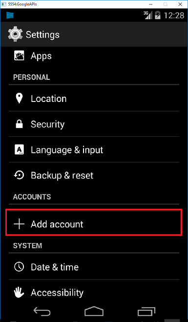

<properties
    pageTitle="Add push notifications to your Xamarin.Android app with Azure App Service"
    description="Learn how to use Azure App Service and Azure Notification Hubs to send push notifications to your Xamarin.Android app"
    services="app-service\mobile" 
    documentationCenter="xamarin" 
    authors="ggailey777"
    manager="dwrede"
    editor=""/>

<tags
    ms.service="app-service-mobile"
    ms.workload="mobile"
    ms.tgt_pltfrm="mobile-xamarin-android"
    ms.devlang="dotnet"
    ms.topic="article"
    ms.date="12/18/2015" 
    ms.author="glenga"/>

# Add push notifications to your Xamarin.Android app
> [AZURE.SELECTOR]
- [Android](../articles/app-service-mobile-android-get-started-push.md)
- [iOS](../articles/app-service-mobile-ios-get-started-push.md)
- [Windows](../articles/app-service-mobile-windows-store-dotnet-get-started-push.md)
- [Xamarin.Android](../articles/app-service-mobile-xamarin-android-get-started-push.md)
- [Xamarin.iOS](../articles/app-service-mobile-xamarin-ios-get-started-push.md)
- [Xamarin.Forms](../articles/app-service-mobile-xamarin-forms-get-started-push.md)

&nbsp;  
>[AZURE.NOTE] This is an **Azure Mobile Apps** topic. For Mobile Services topics, see the [Mobile Services documentation center](/documentation/services/mobile-services/).
>
>App Service Mobile Apps is our newest mobile backend platform and [gives you additional advantages](app-service-mobile-value-prop-migration-from-mobile-services.md) over Mobile Services. [Migrating to App Service](app-service-mobile-migrating-from-mobile-services.md) is  recommended for customers using the .NET backend SDK. However, [Mobile Apps Node SDK](https://github.com/azure/azure-mobile-apps-node) is currently in Preview and is not yet recommended for production use. SDK and API contracts are subject to change within minor version releases.

## Overview
In this tutorial, you add push notifications to the [Xamarin.Android quickstart](app-service-mobile-xamarin-android-get-started.md) project so that every time a record is inserted, a push notification is sent. This tutorial is based on the [Xamarin.Android quickstart](app-service-mobile-xamarin-android-get-started.md) tutorial, which you must complete first. If you do not use the downloaded quick start server project, you must add the push notification extension package to your project. For more information about server extension packages, see [Work with the .NET backend server SDK for Azure Mobile Apps](app-service-mobile-dotnet-backend-how-to-use-server-sdk.md).

## Prerequisites
This tutorial requires the following:

* An active Google account. You can sign up for a Google account at [accounts.google.com](http://go.microsoft.com/fwlink/p/?LinkId=268302).

* [Google Cloud Messaging Client Component](http://components.xamarin.com/view/GCMClient/). You will add this component during the tutorial.

* Completed [Xamarin.Android quickstart](app-service-mobile-xamarin-android-get-started.md) tutorial.

## Create a Notification Hub
Follow these steps to create a new notification hub to use for push notifications. If you already have a notification hub, you can also connect it to your Mobile App backend. 

1. In the [Azure Portal], click **Browse** > **App Services**, then click your Mobile App backend > **All settings**, then under **Mobile** click **Push** > **Notification Hub**.

2. Click **+Notification Hub**, type a new **Notification Hub** name, which can be the same as your Mobile App backend, type a new namespace name or use an existing one, then click **OK** and finally **Create**.

	

	This creates a new notification hub and connects it to your mobile app. If you have an existing notification hub, you can choose to connect it to your Mobile App backend instead of creating a new one.

Now you have connected a notification hub to your Mobile App backend. Later you will configure this notification hub to connect to a platform notification service (PNS) that sends push notifications to the native device.

[Azure Portal]: https://portal.azure.com/

## Enable Google Cloud Messaging

1. Navigate to the [Google Cloud Console](https://console.developers.google.com/project), sign in with your Google account credentials. 
 
2. Click **Create Project**, type a project name, then click **Create**. If requested, carry out the SMS Verification, and click **Create** again.

   	   

	 Type in your new **Project name** and click **Create project**.

3. Make a note of the project number in the **Projects** section. You will need to set this value as the *PROJECT_ID* variable in the client.

4. In the project dashboard, click **Use Google APIs** > **Cloud Messaging for Android**, then on the next page click **Enable API**. 

5. In the API Manager, Click **Credentials** > **Add Credential** > **API Key**. 

   	

6. In **Create a new key**, click **Server key**, type a name for your key, then click **Create**.

7. Make a note of the **API KEY** value.

	You will use this API key value to enable Azure to authenticate with GCM and send push notifications on behalf of your app.

## Configure the Mobile App backend to send push requests

1. In the [Azure Portal]( https://azure.portal.com/), click **Browse** > **App Services**, locate and click your Mobile App backend > **All settings**, then under **Mobile** click **Push**.

2. In Push notification services, click **Google (GCM)**, enter the **API Key** value that you obtained from GCM in the previous procedure, then click **Save**.

    

The Mobile App backend is now configured to use GCM to send push notifications to your app running on an Android device using the notification hub.

<!-- URLs. -->

<!-- images -->

## Update the server project to send push notifications
Use the procedure that matches your backend project type&mdash;either [.NET backend](#dotnet) or [Node.js backend](#nodejs).

### .NET backend project
1. In Visual Studio, right-click the server project and click **Manage NuGet Packages**, search for `Microsoft.Azure.NotificationHubs`, then click **Install**. This installs the Notification Hubs library for sending notifications from your backend.

3. In the server project, open **Controllers** > **TodoItemController.cs**, and add the following using statements:

		using System.Collections.Generic;
		using Microsoft.Azure.NotificationHubs;
		using Microsoft.Azure.Mobile.Server.Config;
	

2. In the **PostTodoItem** method, add the following code after the call to **InsertAsync**:  

        // Get the settings for the server project.
        HttpConfiguration config = this.Configuration;
        MobileAppSettingsDictionary settings = 
			this.Configuration.GetMobileAppSettingsProvider().GetMobileAppSettings();
        
        // Get the Notification Hubs credentials for the Mobile App.
        string notificationHubName = settings.NotificationHubName;
        string notificationHubConnection = settings
            .Connections[MobileAppSettingsKeys.NotificationHubConnectionString].ConnectionString;

        // Create a new Notification Hub client.
        NotificationHubClient hub = NotificationHubClient
        .CreateClientFromConnectionString(notificationHubConnection, notificationHubName);

        // Sending the message so that all template registrations that contain "messageParam"
        // will receive the notifications. This includes APNS, GCM, WNS, and MPNS template registrations.
        Dictionary<string,string> templateParams = new Dictionary<string,string>();
        templateParams["messageParam"] = item.Text + " was added to the list.";

        try
        {
            // Send the push notification and log the results.
            var result = await hub.SendTemplateNotificationAsync(templateParams);

            // Write the success result to the logs.
            config.Services.GetTraceWriter().Info(result.State.ToString());
        }
        catch (System.Exception ex)
        {
            // Write the failure result to the logs.
            config.Services.GetTraceWriter()
                .Error(ex.Message, null, "Push.SendAsync Error");
        }

    This code tells the notification hub to send a a template notification to all template registrations that contain "messageParam". The string will be inserted in the place of messageParam across each PNS that has a registration using "messageParam". This allows you to send the notification to APNS, GCM, WNS, or any other PNS.

	For more information on templates with Notification Hubs, see [Templates](notification-hubs-templates.md).

4. Republish the server project. 

### Node.js backend project

1. If you haven't already done so, [download the quickstart project](app-service-mobile-node-backend-how-to-use-server-sdk.md#download-quickstart) or else use the [online editor in the Azure portal](app-service-mobile-node-backend-how-to-use-server-sdk.md#online-editor).

2. Replace the existing code in the todoitem.js file with the following:

		var azureMobileApps = require('azure-mobile-apps'),
	    promises = require('azure-mobile-apps/src/utilities/promises'),
	    logger = require('azure-mobile-apps/src/logger');
	
		var table = azureMobileApps.table();
		
		table.insert(function (context) {
	    // For more information about the Notification Hubs JavaScript SDK, 
	    // see http://aka.ms/nodejshubs
	    logger.info('Running TodoItem.insert');
	    
	    // Define the template payload.
	    var payload = '{"messageParam": context.item.text}'; 
	    
	    // Execute the insert.  The insert returns the results as a Promise,
	    // Do the push as a post-execute action within the promise flow.
	    return context.execute()
	        .then(function (results) {
	            // Only do the push if configured
	            if (context.push) {
					// Send a template notification.
	                context.push.send(null, payload, function (error) {
	                    if (error) {
	                        logger.error('Error while sending push notification: ', error);
	                    } else {
	                        logger.info('Push notification sent successfully!');
	                    }
	                });
	            }
	            // Don't forget to return the results from the context.execute()
	            return results;
	        })
	        .catch(function (error) {
	            logger.error('Error while running context.execute: ', error);
	        });
		});

		module.exports = table;  

	This sends a template notification that contains the item.text when a new todo item is inserted.

2. When editing the file on your local computer, republish the server project.

## Configure the client project for push notifications

1. In the Solution view (or **Solution Explorer** in Visual Studio), right-click the **Components** folder, click  **Get More Components...**, search for the **Google Cloud Messaging Client** component and add it to the project.

2. Open the ToDoActivity.cs project file and add the following using statement to the class:

		using Gcm.Client;

3. In the **ToDoActivity** class, add the following new code: 

        // Create a new instance field for this activity.
        static ToDoActivity instance = new ToDoActivity();

        // Return the current activity instance.
        public static ToDoActivity CurrentActivity
        {
            get
            {
                return instance;
            }
        }
        // Return the Mobile Services client.
        public MobileServiceClient CurrentClient
        {
            get
            {
                return client;
            }
        }

	This enables you to access the mobile client instance from the push handler service process.

4.	Add the following code to the **OnCreate** method, after the **MobileServiceClient** is created:

        // Set the current instance of TodoActivity.
        instance = this;

        // Make sure the GCM client is set up correctly.
        GcmClient.CheckDevice(this);
        GcmClient.CheckManifest(this);

        // Register the app for push notifications.
        GcmClient.Register(this, ToDoBroadcastReceiver.senderIDs);

Your **ToDoActivity** is now prepared for adding push notifications.

## Add push notifications code to your app

4. Create a new class in the project called `ToDoBroadcastReceiver`.

5. Add the following using statements to **ToDoBroadcastReceiver** class:

		using Gcm.Client;
		using Microsoft.WindowsAzure.MobileServices;
		using Newtonsoft.Json.Linq;

6. Add the following permission requests between the **using** statements and the **namespace** declaration:

		[assembly: Permission(Name = "@PACKAGE_NAME@.permission.C2D_MESSAGE")]
		[assembly: UsesPermission(Name = "@PACKAGE_NAME@.permission.C2D_MESSAGE")]
		[assembly: UsesPermission(Name = "com.google.android.c2dm.permission.RECEIVE")]

		//GET_ACCOUNTS is only needed for android versions 4.0.3 and below
		[assembly: UsesPermission(Name = "android.permission.GET_ACCOUNTS")]
		[assembly: UsesPermission(Name = "android.permission.INTERNET")]
		[assembly: UsesPermission(Name = "android.permission.WAKE_LOCK")]

7. Replace the existing **ToDoBroadcastReceiver** class definition with the following:
 
	    [BroadcastReceiver(Permission = Gcm.Client.Constants.PERMISSION_GCM_INTENTS)]
	    [IntentFilter(new string[] { Gcm.Client.Constants.INTENT_FROM_GCM_MESSAGE }, 
	        Categories = new string[] { "@PACKAGE_NAME@" })]
	    [IntentFilter(new string[] { Gcm.Client.Constants.INTENT_FROM_GCM_REGISTRATION_CALLBACK }, 
	        Categories = new string[] { "@PACKAGE_NAME@" })]
	    [IntentFilter(new string[] { Gcm.Client.Constants.INTENT_FROM_GCM_LIBRARY_RETRY }, 
        Categories = new string[] { "@PACKAGE_NAME@" })]
        public class ToDoBroadcastReceiver : GcmBroadcastReceiverBase<PushHandlerService>
        {
	        // Set the Google app ID.
	        public static string[] senderIDs = new string[] { "<PROJECT_NUMBER>" };
        }

	In the above code, you must replace _`<PROJECT_NUMBER>`_ with the project number assigned by Google when you provisioned your app in the Google developer portal. 

8. In the ToDoBroadcastReceiver.cs project file, add the following code that defines the **PushHandlerService** class:
 
		// The ServiceAttribute must be applied to the class.
    	[Service] 
    	public class PushHandlerService : GcmServiceBase
    	{
        	public static string RegistrationID { get; private set; }
 
        	public PushHandlerService() : base(ToDoBroadcastReceiver.senderIDs) { }
    	}

	Note that this class derives from **GcmServiceBase** and that the **Service** attribute must be applied to this class.

	>[AZURE.NOTE]The **GcmServiceBase** class implements the **OnRegistered()**, **OnUnRegistered()**, **OnMessage()** and **OnError()** methods. You must override these methods in the **PushHandlerService** class.

5. Add the following code to the **PushHandlerService** class that overrides the **OnRegistered** event handler. 

        protected override void OnRegistered(Context context, string registrationId)
        {
            System.Diagnostics.Debug.WriteLine("The device has been registered with GCM.", "Success!");

            // Get the MobileServiceClient from the current activity instance.
            MobileServiceClient client = ToDoActivity.CurrentActivity.CurrentClient;
            var push = client.GetPush();

            // Define a message body for GCM.
            const string templateBodyGCM = "{\"data\":{\"message\":\"$(messageParam)\"}}";

            // Define the template registration as JSON.
            JObject templates = new JObject();
            templates["genericMessage"] = new JObject
            {
              {"body", templateBodyGCM }
            };

            try
            {
                // Make sure we run the registration on the same thread as the activity, 
                // to avoid threading errors.
                ToDoActivity.CurrentActivity.RunOnUiThread(

                    // Register the template with Notification Hubs.
                    async () => await push.RegisterAsync(registrationId, templates));
                
                System.Diagnostics.Debug.WriteLine(
                    string.Format("Push Installation Id", push.InstallationId.ToString()));
            }
            catch (Exception ex)
            {
                System.Diagnostics.Debug.WriteLine(
                    string.Format("Error with Azure push registration: {0}", ex.Message));
            }
        }

	This method uses the returned GCM registration ID to register with Azure for push notifications. Tags can only be added to the registration after it is created. For more information, see [How to: Add tags to a device installation to enable push-to-tags](../articles/app-service-mobile/app-service-mobile-dotnet-backend-how-to-use-server-sdk.md#tags).

10. Override the **OnMessage** method in **PushHandlerService** with the following code:

        protected override void OnMessage(Context context, Intent intent)
        {          
            string message = string.Empty;

            // Extract the push notification message from the intent.
            if (intent.Extras.ContainsKey("message"))
            {
                message = intent.Extras.Get("message").ToString();
                var title = "New item added:";

                // Create a notification manager to send the notification.
                var notificationManager = 
                    GetSystemService(Context.NotificationService) as NotificationManager;

                // Create a new intent to show the notification in the UI. 
                PendingIntent contentIntent = 
					PendingIntent.GetActivity(context, 0, 
					new Intent(this, typeof(ToDoActivity)), 0);	          

                // Create the notification using the builder.
                var builder = new Notification.Builder(context);
                builder.SetAutoCancel(true);
                builder.SetContentTitle(title);
                builder.SetContentText(message);
                builder.SetSmallIcon(Resource.Drawable.ic_launcher);
                builder.SetContentIntent(contentIntent);
                var notification = builder.Build();

                // Display the notification in the Notifications Area.
                notificationManager.Notify(1, notification);

            }
        }

12. Override the **OnUnRegistered()** and **OnError()** methods with the following code.

        protected override void OnUnRegistered(Context context, string registrationId)
        {
            throw new NotImplementedException();
        }

        protected override void OnError(Context context, string errorId)
        {
            System.Diagnostics.Debug.WriteLine(
                string.Format("Error occurred in the notification: {0}.", errorId));
        }

## Test push notifications in your app
You can test the app by using a virtual device in the emulator. There are additional configuration steps required when running on an emulator.

1. Make sure that you are deploying to or debugging on a virtual device that has Google APIs set as the target, as shown below in the Android Virtual Device (AVD) manager. 

    

2. Add a Google account to the Android device by clicking **Apps** > **Settings** > **Add account**, then follow the prompts to use add an existing Google account to the device to create a new one.

    

3. Run the todolist app as before and insert a new todo item. This time, a notification icon is displayed in the notification area. You can open the notification drawer to view the full text of the notification.

    

<!-- URLs. -->

[Xamarin.Android quickstart]: app-service-mobile-xamarin-android-get-started.md

[Google Cloud Messaging Client Component]: http://components.xamarin.com/view/GCMClient/
[Xamarin.Android]: http://xamarin.com/download/
[Azure Mobile Services Component]: http://components.xamarin.com/view/azure-mobile-services/
