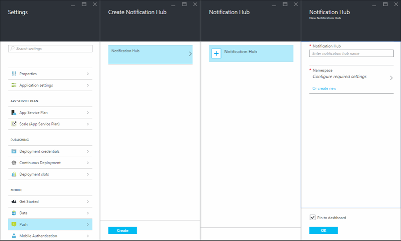

<properties 
    pageTitle="Add push notifications to your Xamarin.Forms app with Azure App Service" 
    description="Learn how to use Azure App Service to send push notifications to your Xamarin.Forms app" 
    services="app-service\mobile" 
    documentationCenter="xamarin" 
    authors="wesmc7777"
    manager="dwrede" 
    editor=""/>

<tags 
    ms.service="app-service-mobile" 
    ms.workload="mobile" 
    ms.tgt_pltfrm="mobile-xamarin" 
    ms.devlang="dotnet" 
    ms.topic="article"
    ms.date="12/19/2015" 
    ms.author="wesmc"/>

# Add push notifications to your Xamarin.Forms app
> [AZURE.SELECTOR]
- [Android](../articles/app-service-mobile-android-get-started-push.md)
- [iOS](../articles/app-service-mobile-ios-get-started-push.md)
- [Windows](../articles/app-service-mobile-windows-store-dotnet-get-started-push.md)
- [Xamarin.Android](../articles/app-service-mobile-xamarin-android-get-started-push.md)
- [Xamarin.iOS](../articles/app-service-mobile-xamarin-ios-get-started-push.md)
- [Xamarin.Forms](../articles/app-service-mobile-xamarin-forms-get-started-push.md)

&nbsp;  
>[AZURE.NOTE] This is an **Azure Mobile Apps** topic. For Mobile Services topics, see the [Mobile Services documentation center](/documentation/services/mobile-services/).
>
>App Service Mobile Apps is our newest mobile backend platform and [gives you additional advantages](app-service-mobile-value-prop-migration-from-mobile-services.md) over Mobile Services. [Migrating to App Service](app-service-mobile-migrating-from-mobile-services.md) is  recommended for customers using the .NET backend SDK. However, [Mobile Apps Node SDK](https://github.com/azure/azure-mobile-apps-node) is currently in Preview and is not yet recommended for production use. SDK and API contracts are subject to change within minor version releases.

## Overview
This tutorial is based on the [Xamarin.Forms quickstart tutorial](app-service-mobile-xamarin-forms-get-started.md), which you must complete first. You will add push notifications support for each project that your want to support in the the Xamarin.Forms quick start project. Every time a record is inserted, a push notification will be sent. 

If you do not use the downloaded quick start server project, you must add the push notification extension package to your project. For more information about server extension packages, see [Work with the .NET backend server SDK for Azure Mobile Apps](app-service-mobile-dotnet-backend-how-to-use-server-sdk.md). 

The [iOS simulator does not support push notifications](https://developer.apple.com/library/ios/documentation/IDEs/Conceptual/iOS_Simulator_Guide/TestingontheiOSSimulator.html), so you must use a physical iOS device. You'll also need to sign up for an [Apple Developer Program membership](https://developer.apple.com/programs/ios/).

## Prerequisites
To complete this tutorial, you need the following:

* An active Azure account.  
If you don't have an account yet, sign up for an Azure trial and get up to 10 free mobile apps. You can keep using them even after your trial ends. See [Azure Free Trial](https://azure.microsoft.com/pricing/free-trial/).

* A Mac with [Xamarin Studio](http://xamarin.com/platform) and [Xcode](https://go.microsoft.com/fwLink/?LinkID=266532) v4.4 or later installed it. You can run the Xamarin.Forms app using Visual Studio on a Windows computer if you want, but it's a bit more complicated because you have to connect to a networked Mac running the Xamarin.iOS Build Host. If you're interested in doing that, see [Installing Xamarin.iOS on Windows](http://developer.xamarin.com/guides/ios/getting_started/installation/windows/).

* A physical iOS device. Push notifications are not supported by the iOS simulator.

* Complete the [Xamarin.Forms quickstart tutorial](app-service-mobile-xamarin-forms-get-started.md).

## Create a Notification Hub for your Mobile App
To configure your app to send notifications, create a new notification hub and configure it for the platform notification services that you will use. 

These steps walk you through creating a new notification hub. If you already have one created, you can just select it.

1. Log into the [Azure portal](https://portal.azure.com/). Click **Browse** > **Mobile Apps** > your backend > **Settings** > **Mobile** > **Push** > **Notification Hub** > **+ Notification Hub**, and provide a name and namespace for a new notification hub, and then click the **OK** button.

    

2. In the Create Notification Hub blade, click **Create**.

## Update the server project to send push notifications
Use the procedure that matches your backend project type&mdash;either [.NET backend](#dotnet) or [Node.js backend](#nodejs).

### .NET backend project
1. In Visual Studio, right-click the server project and click **Manage NuGet Packages**, search for `Microsoft.Azure.NotificationHubs`, then click **Install**. This installs the Notification Hubs library for sending notifications from your backend.

3. In the server project, open **Controllers** > **TodoItemController.cs**, and add the following using statements:

		using System.Collections.Generic;
		using Microsoft.Azure.NotificationHubs;
		using Microsoft.Azure.Mobile.Server.Config;
	

2. In the **PostTodoItem** method, add the following code after the call to **InsertAsync**:  

        // Get the settings for the server project.
        HttpConfiguration config = this.Configuration;
        MobileAppSettingsDictionary settings = 
			this.Configuration.GetMobileAppSettingsProvider().GetMobileAppSettings();
        
        // Get the Notification Hubs credentials for the Mobile App.
        string notificationHubName = settings.NotificationHubName;
        string notificationHubConnection = settings
            .Connections[MobileAppSettingsKeys.NotificationHubConnectionString].ConnectionString;

        // Create a new Notification Hub client.
        NotificationHubClient hub = NotificationHubClient
        .CreateClientFromConnectionString(notificationHubConnection, notificationHubName);

        // Sending the message so that all template registrations that contain "messageParam"
        // will receive the notifications. This includes APNS, GCM, WNS, and MPNS template registrations.
        Dictionary<string,string> templateParams = new Dictionary<string,string>();
        templateParams["messageParam"] = item.Text + " was added to the list.";

        try
        {
            // Send the push notification and log the results.
            var result = await hub.SendTemplateNotificationAsync(templateParams);

            // Write the success result to the logs.
            config.Services.GetTraceWriter().Info(result.State.ToString());
        }
        catch (System.Exception ex)
        {
            // Write the failure result to the logs.
            config.Services.GetTraceWriter()
                .Error(ex.Message, null, "Push.SendAsync Error");
        }

    This code tells the notification hub to send a a template notification to all template registrations that contain "messageParam". The string will be inserted in the place of messageParam across each PNS that has a registration using "messageParam". This allows you to send the notification to APNS, GCM, WNS, or any other PNS.

	For more information on templates with Notification Hubs, see [Templates](notification-hubs-templates.md).

4. Republish the server project. 

### Node.js backend project

1. If you haven't already done so, [download the quickstart project](app-service-mobile-node-backend-how-to-use-server-sdk.md#download-quickstart) or else use the [online editor in the Azure portal](app-service-mobile-node-backend-how-to-use-server-sdk.md#online-editor).

2. Replace the existing code in the todoitem.js file with the following:

		var azureMobileApps = require('azure-mobile-apps'),
	    promises = require('azure-mobile-apps/src/utilities/promises'),
	    logger = require('azure-mobile-apps/src/logger');
	
		var table = azureMobileApps.table();
		
		table.insert(function (context) {
	    // For more information about the Notification Hubs JavaScript SDK, 
	    // see http://aka.ms/nodejshubs
	    logger.info('Running TodoItem.insert');
	    
	    // Define the template payload.
	    var payload = '{"messageParam": context.item.text}'; 
	    
	    // Execute the insert.  The insert returns the results as a Promise,
	    // Do the push as a post-execute action within the promise flow.
	    return context.execute()
	        .then(function (results) {
	            // Only do the push if configured
	            if (context.push) {
					// Send a template notification.
	                context.push.send(null, payload, function (error) {
	                    if (error) {
	                        logger.error('Error while sending push notification: ', error);
	                    } else {
	                        logger.info('Push notification sent successfully!');
	                    }
	                });
	            }
	            // Don't forget to return the results from the context.execute()
	            return results;
	        })
	        .catch(function (error) {
	            logger.error('Error while running context.execute: ', error);
	        });
		});

		module.exports = table;  

	This sends a template notification that contains the item.text when a new todo item is inserted.

2. When editing the file on your local computer, republish the server project.

## (Optional) Configure and run the Android project
This section is for running the Xamarin droid project for Android. You can skip this section if you are not working with Android devices.

#### Enable Google Cloud Messaging (GCM)

1. Navigate to the [Google Cloud Console](https://console.developers.google.com/project), sign in with your Google account credentials. 
 
2. Click **Create Project**, type a project name, then click **Create**. If requested, carry out the SMS Verification, and click **Create** again.

   	   

	 Type in your new **Project name** and click **Create project**.

3. Make a note of the project number in the **Projects** section. You will need to set this value as the *PROJECT_ID* variable in the client.

4. In the project dashboard, click **Use Google APIs** > **Cloud Messaging for Android**, then on the next page click **Enable API**. 

5. In the API Manager, Click **Credentials** > **Add Credential** > **API Key**. 

   	

6. In **Create a new key**, click **Server key**, type a name for your key, then click **Create**.

7. Make a note of the **API KEY** value.

	You will use this API key value to enable Azure to authenticate with GCM and send push notifications on behalf of your app.

#### Configure the notification hub for GCM
1. Log into the [Azure portal](https://portal.azure.com/). Click **Browse** > **Mobile Apps** > your Mobile App > **Settings** > **Push** > **Google (GCM)**. Paste in the server api key you created earlier and click **Save**. Your service is now configured to work with push notifications for Android.

    

#### Add push notifications to the droid project
1. Right-click the Components folder, click Get More Components..., search for the **Google Cloud Messaging Client** component and add it to the project. This component helps simplify working with push notifications with a Xamarrin Android project.

2. Open the MainActivity.cs project file and add the following using statement at the top of the file:

        using Gcm.Client;
3. Add the following code to the `OnCreate` method after the call to `LoadApplication`.

        try
     {
         // Check to ensure everything's setup right
         GcmClient.CheckDevice(this);
         GcmClient.CheckManifest(this);

         // Register for push notifications
         System.Diagnostics.Debug.WriteLine("Registering...");
         GcmClient.Register(this, PushHandlerBroadcastReceiver.SENDER_IDS);
     }
     catch (Java.Net.MalformedURLException)
     {
         CreateAndShowDialog("There was an error creating the Mobile Service. Verify the URL", "Error");
     }
     catch (Exception e)
     {
         CreateAndShowDialog(e.Message, "Error");
     }

1. Add the following code for the `CreateAndShowDialog` helper method.

        private void CreateAndShowDialog(String message, String title) 
     {
         AlertDialog.Builder builder = new AlertDialog.Builder(this);

         builder.SetMessage (message);
         builder.SetTitle (title);
         builder.Create().Show ();
     }

1. In the `MainActivity` class, add the following code to expose the current `MainActivity` so we can execute some UI on the main UI thread:

        // Create a new instance field for this activity.
     static MainActivity instance = null;

     // Return the current activity instance.
     public static MainActivity CurrentActivity
     {
         get
         {
             return instance;
         }
     }
2. Initialize the `instance`, variable at the beginning of the `MainActivity.OnCreate` method.  

        // Set the current instance of MainActivity.
     instance = this;
3. Add a new class file to the **Droid** project.  Name the new class file **GcmService**.

4. Make sure the following `using` statements are included at the top of the file.

        using Gcm.Client;
     using Microsoft.WindowsAzure.MobileServices;
     using Android.App;
     using Android.Content;
     using System.Collections.Generic;
     using System.Diagnostics;
     using Android.Util;
     using Newtonsoft.Json.Linq;
     using System.Text;
     using System.Linq;
5. Add the following permission requests at the top of the file, after the `using` statments and before the `namespace` declaration.

        [assembly: Permission(Name = "@PACKAGE_NAME@.permission.C2D_MESSAGE")]
     [assembly: UsesPermission(Name = "@PACKAGE_NAME@.permission.C2D_MESSAGE")]
     [assembly: UsesPermission(Name = "com.google.android.c2dm.permission.RECEIVE")]

     //GET_ACCOUNTS is only needed for android versions 4.0.3 and below
     [assembly: UsesPermission(Name = "android.permission.GET_ACCOUNTS")]
     [assembly: UsesPermission(Name = "android.permission.INTERNET")]
     [assembly: UsesPermission(Name = "android.permission.WAKE_LOCK")]
6. Add the following class definition to the namespace. Replace **<PROJECT_NUMBER>** with your project number you noted earlier.

       [BroadcastReceiver(Permission = Gcm.Client.Constants.PERMISSION_GCM_INTENTS)]
    [IntentFilter(new string[] { Gcm.Client.Constants.INTENT_FROM_GCM_MESSAGE }, Categories = new string[] { "@PACKAGE_NAME@" })]
    [IntentFilter(new string[] { Gcm.Client.Constants.INTENT_FROM_GCM_REGISTRATION_CALLBACK }, Categories = new string[] { "@PACKAGE_NAME@" })]
    [IntentFilter(new string[] { Gcm.Client.Constants.INTENT_FROM_GCM_LIBRARY_RETRY }, Categories = new string[] { "@PACKAGE_NAME@" })]        
    public class PushHandlerBroadcastReceiver : GcmBroadcastReceiverBase<GcmService>
    {        
        public static string[] SENDER_IDS = new string[] { "<PROJECT_NUMBER>" };        
    }
7. Update your `GcmService` class to use the new broadcast receiver.

        [Service]
     public class GcmService : GcmServiceBase
     {
         public static string RegistrationID { get; private set; }

         public GcmService()
             : base(PushHandlerBroadcastReceiver.SENDER_IDS){}
     }

1. Add the following code to the GcmService class that overrides the OnRegistered event handler and implements a `Register` method.

   This code will register a template body to receive template notifications using the `messageParam` parameter. Template notifications allow you to send notifications cross platform. For more information see, [Templates](https://msdn.microsoft.com/library/azure/dn530748.aspx).

       protected override void OnRegistered(Context context, string registrationId)
    {
        Log.Verbose("PushHandlerBroadcastReceiver", "GCM Registered: " + registrationId);
        RegistrationID = registrationId;

        createNotification("GcmService Registered...", "The device has been Registered, Tap to View!");

        var push = TodoItemManager.DefaultManager.CurrentClient.GetPush();

        MainActivity.CurrentActivity.RunOnUiThread(() => Register(push, null));

    }

    public async void Register(Microsoft.WindowsAzure.MobileServices.Push push, IEnumerable<string> tags)
    {
        try
        {
            const string templateBodyGCM = "{\"data\":{\"message\":\"$(messageParam)\"}}";

            JObject templates = new JObject();
            templates["genericMessage"] = new JObject
            {
              {"body", templateBodyGCM}
            };

            await push.RegisterAsync(RegistrationID, templates);
            Log.Info("Push Installation Id", push.InstallationId.ToString());
        }
        catch (Exception ex)
        {
            System.Diagnostics.Debug.WriteLine(ex.Message);
            Debugger.Break();
        }
    }
2. You must implement `OnMessage` to handle an incoming push notification. In this code we will handle the notification and send it to the notification manager.

       protected override void OnMessage(Context context, Intent intent)
    {
        Log.Info("PushHandlerBroadcastReceiver", "GCM Message Received!");

        var msg = new StringBuilder();

        if (intent != null && intent.Extras != null)
        {
            foreach (var key in intent.Extras.KeySet())
                msg.AppendLine(key + "=" + intent.Extras.Get(key).ToString());
        }

        //Store the message
        var prefs = GetSharedPreferences(context.PackageName, FileCreationMode.Private);
        var edit = prefs.Edit();
        edit.PutString("last_msg", msg.ToString());
        edit.Commit();

        string message = intent.Extras.GetString("message");
        if (!string.IsNullOrEmpty(message))
        {
            createNotification("New todo item!", "Todo item: " + message);
            return;
        }

        string msg2 = intent.Extras.GetString("msg");
        if (!string.IsNullOrEmpty(msg2))
        {
            createNotification("New hub message!", msg2);
            return;
        }

        createNotification("Unknown message details", msg.ToString());
    }

    void createNotification(string title, string desc)
    {
        //Create notification
        var notificationManager = GetSystemService(Context.NotificationService) as NotificationManager;

        //Create an intent to show ui
        var uiIntent = new Intent(this, typeof(MainActivity));

        //Create the notification
        var notification = new Notification(Android.Resource.Drawable.SymActionEmail, title);

        //Auto cancel will remove the notification once the user touches it
        notification.Flags = NotificationFlags.AutoCancel;

        //Set the notification info
        //we use the pending intent, passing our ui intent over which will get called
        //when the notification is tapped.
        notification.SetLatestEventInfo(this, title, desc, PendingIntent.GetActivity(this, 0, uiIntent, 0));

        //Show the notification
        notificationManager.Notify(1, notification);
    }
3. You must also implement `OnUnRegistered` and `OnError` handlers for the receiver.

       protected override void OnUnRegistered(Context context, string registrationId)
    {
        Log.Error("PushHandlerBroadcastReceiver", "Unregistered RegisterationId : " + registrationId);
    }

    protected override void OnError(Context context, string errorId)
    {
        Log.Error("PushHandlerBroadcastReceiver", "GCM Error: " + errorId);
    }

#### Test push notifications in your Android app
1. In Visual Studio or Xamarin Studio, right click the **droid** project and click **Set as startup project**.

2. Press the **Run** button to build the project and start the app in an iOS capable device, then click **OK** to accept push notifications.

   > [!NOTE]
> You must explicitly accept push notifications from your app. This request only occurs the first time that the app runs.
> 
3. In the app, type a task, and then click the plus (**+**) icon.

4. Verify that a notification is received, then click **OK** to dismiss the notification.

## (Optional) Configure and run the iOS project
This section is for running the Xamarin iOS project for iOS devices. You can skip this section if you are not working with iOS devices.

To register the app for push notifications through Apple Push Notification Service (APNS), you must create a new push certificate, App ID, and provisioning profile for the project on Apple's developer portal. The App ID will contain the configuration settings that enable your app to send and receive push notifications. These settings will include the push notification certificate needed to authenticate with Apple Push Notification Service (APNS) when sending and receiving push notifications. For more information on these concepts see the official [Apple Push Notification Service](http://go.microsoft.com/fwlink/p/?LinkId=272584) documentation.

####Generate the Certificate Signing Request file for the push certificate

These steps walk you through creating the certificate signing request. This will be used to generate a push certificate to be used with APNS.

1. On your Mac, run the Keychain Access tool. It can be opened from the **Utilities** folder or the **Other** folder on the launch pad.

2. Click **Keychain Access**, expand **Certificate Assistant**, then click **Request a Certificate from a Certificate Authority...**.

  	

3. Select your **User Email Address** and **Common Name** , make sure that **Saved to disk** is selected, and then click **Continue**. Leave the **CA Email Address** field blank as it is not required.

  	

4. Type a name for the Certificate Signing Request (CSR) file in **Save As**, select the location in **Where**, then click **Save**.

  	

  	This saves the CSR file in the selected location; the default location is in the Desktop. Remember the location chosen for this file.

####Register your app for push notifications

Create a new Explicit App ID for your application with Apple and also configure it for push notifications.  

1. Navigate to the [iOS Provisioning Portal](http://go.microsoft.com/fwlink/p/?LinkId=272456) at the Apple Developer Center, log on with your Apple ID, click **Identifiers**, then click **App IDs**, and finally click on the **+** sign to register a new app.

   	

2. Update the following three fields for your new app and then click **Continue**:

	* **Name**: Type a descriptive name for your app in the **Name** field in the **App ID Description** section.
	
	* **Bundle Identifier**: Under the **Explicit App ID** section, enter a **Bundle Identifier** in the form `<Organization Identifier>.<Product Name>` as mentioned in the [App Distribution Guide](https://developer.apple.com/library/mac/documentation/IDEs/Conceptual/AppDistributionGuide/ConfiguringYourApp/ConfiguringYourApp.html#//apple_ref/doc/uid/TP40012582-CH28-SW8). This must match what is also used in the XCode or Xamarin project for your app.	 
	 
	* **Push Notifications**: Check the **Push Notifications** option in the **App Services** section, .

	

3.	On the Confirm your App ID screen, review the setting and after you have verified them click **Submit**

4. 	Once you have submitted the new App ID, you will see the **Registration complete** screen. Click **Done**.

5. In the Developer Center, under App IDs, locate the app ID that you just created, and click on its row. Clicking on the app ID row will display the app details. Click the **Edit** button at the bottom.

6. Scroll to the bottom of the screen, and click the **Create Certificate...** button under the section **Development Push SSL Certificate**.

   	

   	This will display the "Add iOS Certificate" assistant.

    > [AZURE.NOTE] This tutorial uses a development certificate. The same process is used when registering a production certificate. Just make sure that you use the same certificate type when sending notifications.

7. Click **Choose File**, browse to the location where you saved the CSR for your push certificate. Then click **Generate**.

  	

8. After the certificate is created by the portal, click the **Download** button.

  	

   	This downloads the signing certificate and saves it to your computer in your Downloads folder.

  	

    > [AZURE.NOTE] By default, the downloaded file a development certificate is named **aps_development.cer**.

9. Double-click the downloaded push certificate **aps_development.cer**. This installs the new certificate in the Keychain, as shown below:

   	

    > [AZURE.NOTE] The name in your certificate might be different, but it will be prefixed with **Apple Development iOS Push Services:**.

10. In Keychain Access, right-click the new push certificate that you just created in the **Certificates** category. Click **Export**, name the file, select the **.p12** format, and then click **Save**.

	Remember the file name and location of the exported .p12 push certificate. It will be used to enable authentication with APNS by uploading it on the Azure Classic Portal.

####Create a provisioning profile for the app

1. Back in the <a href="http://go.microsoft.com/fwlink/p/?LinkId=272456" target="_blank">iOS Provisioning Portal</a>, select **Provisioning Profiles**, select **All**, and then click the **+** button to create a new profile. This launches the **Add iOS Provisiong Profile** Wizard

   	

2. Select **iOS App Development** under **Development** as the provisiong profile type, and click **Continue**. 

3. Next, select the app ID you just created from the **App ID** drop-down list, and click **Continue**

   	

4. In the **Select certificates** screen, select your development certificate used for code signing, and click **Continue**. This is a signing certificate, not the push certificate you just created.

   	

5. Next, select the **Devices** to use for testing, and click **Continue**

   	

6. Finally, pick a name for the profile in **Profile Name**, click **Generate**.

   	

#### Configure the notification hub for APNS
1. Log into the [Azure portal](https://portal.azure.com/). Click **Browse** > **Mobile Apps** > your Mobile App > **Settings** > **Push** > **Apple (APNS)** > **Upload Certificate**. Upload the .p12 push certificate file you exported earlier.  Make sure to select **Sandbox** if you created a development push certificate for development and testing.  Otherwise, choose **Production**. Your service is now configured to work with push notifications for iOS.

    

    Next you will configure the iOS project setting in Xamarin Studio or Visual Studio.

####Configuring the iOS project in Xamarin Studio

1. In Xamarin.Studio, open **Info.plist**, and update the **Bundle Identifier** with the Bundle ID that you created earlier with your new App ID.

    

2. Scroll down to **Background Modes** and check the **Enable Background Modes** box and the **Remote notifications** box. 

    

3. Double click your project in the Solution Panel to open **Project Options**.

4.  Choose **iOS Bundle Signing** under **Build**, and select the corresponding **Identity** and **Provisioning profile** you had just set up for this project. 

    

    This ensures that the project uses the new profile for code signing. For the official Xamarin device provisioning documentation, see [Xamarin Device Provisioning].

####Configuring the iOS project in Visual Studio

1. In Visual Studio, right-click the project, and then click **Properties**.

2. In the properties pages, click the **iOS Application** tab, and update the **Identifier** with the ID that you created earlier.

    

3. In the **iOS Bundle Signing** tab, select the corresponding **Identity** and **Provisioning profile** you had just set up for this project. 

    

    This ensures that the project uses the new profile for code signing. For the official Xamarin device provisioning documentation, see [Xamarin Device Provisioning].

4. Double click Info.plist to open it and then enable **RemoteNotifications** under Background Modes. 

[Xamarin Device Provisioning]: http://developer.xamarin.com/guides/ios/getting_started/installation/device_provisioning/

#### Add push notifications to your iOS app
1. Add the following `using` statement to the top of the **AppDelegate.cs** file.

        using Microsoft.WindowsAzure.MobileServices;
     using Newtonsoft.Json.Linq;

1. In the iOS project, open AppDelegate.cs and update`FinishedLaunching` to support remote notifications as follows.

        public override bool FinishedLaunching (UIApplication app, NSDictionary options)
     {
         global::Xamarin.Forms.Forms.Init ();

         Microsoft.WindowsAzure.MobileServices.CurrentPlatform.Init();

         // IMPORTANT: uncomment this code to enable sync on Xamarin.iOS
         // For more information, see: http://go.microsoft.com/fwlink/?LinkId=620342
         //SQLitePCL.CurrentPlatform.Init();

         // registers for push for iOS8
         var settings = UIUserNotificationSettings.GetSettingsForTypes(
             UIUserNotificationType.Alert
             | UIUserNotificationType.Badge
             | UIUserNotificationType.Sound,
             new NSSet());

         UIApplication.SharedApplication.RegisterUserNotificationSettings(settings);
         UIApplication.SharedApplication.RegisterForRemoteNotifications();

         LoadApplication (new App ());

         return base.FinishedLaunching (app, options);
     }

1. In AppDelegate.cs, also add an override for the **RegisteredForRemoteNotifications** event to register for notifications:

        public override void RegisteredForRemoteNotifications(UIApplication application, NSData deviceToken)
     {
         const string templateBodyAPNS = "{\"aps\":{\"alert\":\"$(messageParam)\"}}";

         JObject templates = new JObject();
         templates["genericMessage"] = new JObject
             {
               {"body", templateBodyAPNS}
             };

         // Register for push with your mobile app
         Push push = TodoItemManager.DefaultManager.CurrentClient.GetPush();
         push.RegisterAsync(deviceToken, templates);
     }
2. In AppDelegate.cs also add an override for the **DidReceivedRemoteNotification** event to handle incoming notifications while the app is running:

        public override void DidReceiveRemoteNotification(UIApplication application, NSDictionary userInfo, Action<UIBackgroundFetchResult> completionHandler)
     {
         NSDictionary aps = userInfo.ObjectForKey(new NSString("aps")) as NSDictionary;

         string alert = string.Empty;
         if (aps.ContainsKey(new NSString("alert")))
             alert = (aps[new NSString("alert")] as NSString).ToString();

         //show alert
         if (!string.IsNullOrEmpty(alert))
         {
             UIAlertView avAlert = new UIAlertView("Notification", alert, null, "OK", null);
             avAlert.Show();
         }
     }

Your app is now updated to support push notifications.

#### Test push notifications in your iOS app
1. Right click the iOS project, and click **Set as StartPp Project**.

2. Press the **Run** button or **F5** in Visual Studio to build the project and start the app in an iOS capable device, then click **OK** to accept push notifications.

   > [!NOTE]
> You must explicitly accept push notifications from your app. This request only occurs the first time that the app runs.
> 
3. In the app, type a task, and then click the plus (**+**) icon.

4. Verify that a notification is received, then click **OK** to dismiss the notification.

## (Optional) Configure and run the Windows project
This section is for running the Xamarin WinApp project for Windows devices. You can skip this section if you are not working with Windows devices.

#### Register your Windows app for push notifications with WNS

1. In Visual Studio Solution Explorer, right-click the Windows Store app project, click **Store** > **Associate App with the Store...**. 

    
    
2. In the wizard, click **Next**, sign in with your Microsoft account, type a name for your app in **Reserve a new app name**, then click **Reserve**.

3. After the app registration is successfully created, select the new app name, click **Next**, and then click **Associate**. This adds the required Windows Store registration information to the application manifest. 

7. Repeat steps 1 and 3 for the Windows Phone Store app project using the same registration you previously created for the Windows Store app.  

7. Navigate to the [Windows Dev Center](https://dev.windows.com/en-us/overview), sign-in with your Microsoft account, click the new app registration in **My apps**, then expand **Services** > **Push notifications**. 

8. In the **Push notifications** page, click **Live Services site** under **Microsoft Azure Mobile Services**.

9. In the **App Settings** tab, make a note of the values of **Client secret** and **Package SID**. 

    

    > [AZURE.IMPORTANT] The client secret and package SID are important security credentials. Do not share these values with anyone or distribute them with your app.

#### Configure the notification hub for WNS

1. In the [Azure Portal]( https://azure.portal.com/), click **Browse** > **App Services**, then click your Mobile App backend > **All settings**, then under **Mobile** click **Push**.

2. In Push notification services, click **Windows (WNS)**, enter the **Security key** (client secret) and **Package SID** that you obtained from the Live Services site, then click **Save**.

    

Your Mobile App backend is now configured to use WNS to send push notifications to your Windows app using its notification hub.

#### Add push notifications to your Windows app
1. In Visual Studio, open **App.xaml.cs** in the **WinApp** project.  Add the following `using` statements.

        using System.Threading.Tasks;
     using Windows.Networking.PushNotifications;
     using WesmcMobileAppGaTest;
     using Microsoft.WindowsAzure.MobileServices;
     using Newtonsoft.Json.Linq;
2. In App.xaml.cs add the following `InitNotificationsAsync` method. This method gets the push notification channel and registers a template to receive template notifications from notification hub. A template notification that supports `messageParam` will be delivered to this client.

        private async Task InitNotificationsAsync()
     {
         var channel = await PushNotificationChannelManager
             .CreatePushNotificationChannelForApplicationAsync();

         const string templateBodyWNS = "<toast><visual><binding template=\"ToastText01\"><text id=\"1\">$(messageParam)</text></binding></visual></toast>";

         JObject headers = new JObject();
         headers["X-WNS-Type"] = "wns/toast";

         JObject templates = new JObject();
         templates["genericMessage"] = new JObject
             {
               {"body", templateBodyWNS},
               {"headers", headers} // Only needed for WNS & MPNS
             };

         await TodoItemManager.DefaultManager.CurrentClient.GetPush().RegisterAsync(channel.Uri, templates);
     }
3. In App.xaml.cs update the `OnLaunched` event handler with the `async` attribute and call `InitNotificationsAsync`

        protected async override void OnLaunched(LaunchActivatedEventArgs e)
     {
         Frame rootFrame = Window.Current.Content as Frame;

         // Do not repeat app initialization when the Window already has content,
         // just ensure that the window is active
         if (rootFrame == null)
         {
             // Create a Frame to act as the navigation context and navigate to the first page
             rootFrame = new Frame();
             // Set the default language
             rootFrame.Language = Windows.Globalization.ApplicationLanguages.Languages[0];
             rootFrame.NavigationFailed += OnNavigationFailed;
             Xamarin.Forms.Forms.Init(e); 
             if (e.PreviousExecutionState == ApplicationExecutionState.Terminated)
             {
                 //TODO: Load state from previously suspended application
             }
             // Place the frame in the current Window
             Window.Current.Content = rootFrame;
         }

         if (rootFrame.Content == null)
         {
             // When the navigation stack isn't restored navigate to the first page,
             // configuring the new page by passing required information as a navigation
             // parameter
             rootFrame.Navigate(typeof(MainPage), e.Arguments);
         }
         // Ensure the current window is active
         Window.Current.Activate();

         await InitNotificationsAsync();
     }
4. In Solution Explorer for Visual Studio, open the **Package.appxmanifest** file and set **Toast Capable** to **Yes** under **Notifications**.

5. Build the app and verify you have no errors.  You client app should now register for the template notifications from the Mobile App backend.

#### Test push notifications in your Windows app
1. In Visual Studio, right click the **WinApp** project and click **Set as startup project**.

1. Press the **Run** button to build the project and start the app in an iOS capable device, then click **OK** to accept push notifications.

   > [!NOTE]
> You must explicitly accept push notifications from your app. This request only occurs the first time that the app runs.
> 
2. In the app, type a task, and then click the plus (**+**) icon.

3. Verify that a notification is received, then click **OK** to dismiss the notification.

<!-- Images. -->

<!-- URLs. -->

[Xamarin Studio]: http://xamarin.com/platform
[Install Xcode]: https://go.microsoft.com/fwLink/p/?LinkID=266532
[Xcode]: https://go.microsoft.com/fwLink/?LinkID=266532
[Installing Xamarin.iOS on Windows]: http://developer.xamarin.com/guides/ios/getting_started/installation/windows/
[apns object]: http://go.microsoft.com/fwlink/p/?LinkId=272333

