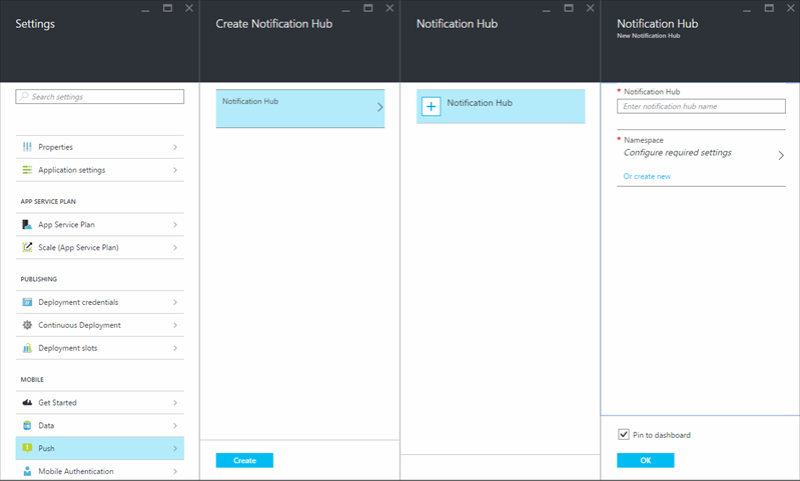
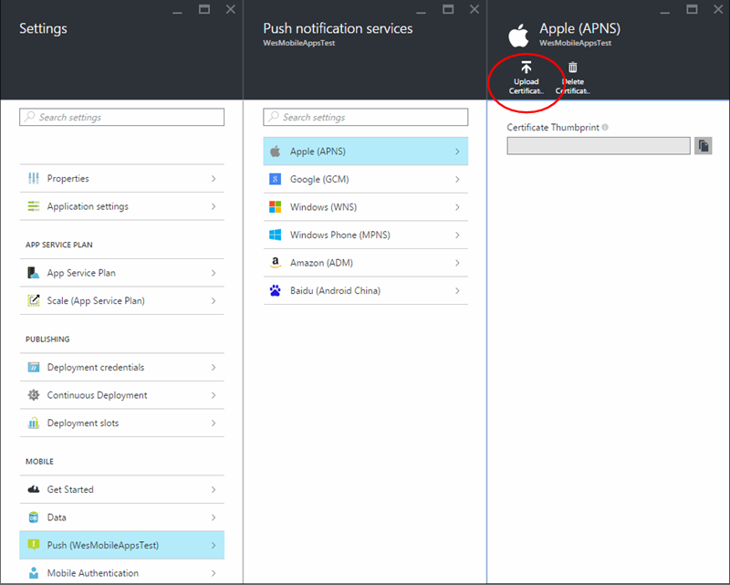

<properties 
    pageTitle="Add push notifications to your Xamarin.iOS app with Azure App Service" 
    description="Learn how to use Azure App Service to send push notifications to your Xamarin.iOS app" 
    services="app-service\mobile" 
    documentationCenter="xamarin" 
    authors="wesmc7777"
    manager="dwrede" 
    editor=""/>

<tags 
    ms.service="app-service-mobile" 
    ms.workload="mobile" 
    ms.tgt_pltfrm="mobile-xamarin-ios" 
    ms.devlang="dotnet" 
    ms.topic="article"
    ms.date="12/18/2015" 
    ms.author="wesmc"/>

# Add push notifications to your Xamarin.iOS App
> [AZURE.SELECTOR]
- [Android](../articles/app-service-mobile-android-get-started-push.md)
- [iOS](../articles/app-service-mobile-ios-get-started-push.md)
- [Windows](../articles/app-service-mobile-windows-store-dotnet-get-started-push.md)
- [Xamarin.Android](../articles/app-service-mobile-xamarin-android-get-started-push.md)
- [Xamarin.iOS](../articles/app-service-mobile-xamarin-ios-get-started-push.md)
- [Xamarin.Forms](../articles/app-service-mobile-xamarin-forms-get-started-push.md)

&nbsp;  
>[AZURE.NOTE] This is an **Azure Mobile Apps** topic. For Mobile Services topics, see the [Mobile Services documentation center](/documentation/services/mobile-services/).
>
>App Service Mobile Apps is our newest mobile backend platform and [gives you additional advantages](app-service-mobile-value-prop-migration-from-mobile-services.md) over Mobile Services. [Migrating to App Service](app-service-mobile-migrating-from-mobile-services.md) is  recommended for customers using the .NET backend SDK. However, [Mobile Apps Node SDK](https://github.com/azure/azure-mobile-apps-node) is currently in Preview and is not yet recommended for production use. SDK and API contracts are subject to change within minor version releases.

## Overview
This tutorial is based on the [Xamarin.iOS quickstart tutorial](app-service-mobile-xamarin-ios-get-started.md), which you must complete first. You will add push notifications to the Xamarin.iOS quick start project so that every time a record is inserted, a push notification is sent. If you do not use the downloaded quick start server project, you must add the push notification extension package to your project. For more information about server extension packages, see [Work with the .NET backend server SDK for Azure Mobile Apps](app-service-mobile-dotnet-backend-how-to-use-server-sdk.md). 

## Prerequisites
To complete this tutorial, you need the following:

* An active Azure account.  
If you don't have an account yet, sign up for an Azure trial and get up to 10 free Mobile App backends. You can keep using them even after your trial ends. See [Azure Free Trial](https://azure.microsoft.com/pricing/free-trial/).

* A Mac with [Xamarin Studio](http://xamarin.com/platform) and [Xcode](https://go.microsoft.com/fwLink/?LinkID=266532) v4.4 or later installed it. You can run the Xamarin.iOS app using Visual Studio on a Windows computer if you want, but it's a bit more complicated because you have to connect to a networked Mac running the Xamarin.iOS Build Host. If you're interested in doing that, see [Installing Xamarin.iOS on Windows](http://developer.xamarin.com/guides/ios/getting_started/installation/windows/).

* A physical iOS device. Push notifications are not supported by the iOS simulator.

* An [Apple Developer Program membership](https://developer.apple.com/programs/ios/), required to register with the Apple Push Notification Service (APNS).

* Complete the [Xamarin.iOS quickstart tutorial](app-service-mobile-xamarin-ios-get-started.md).

## Register the app for push notifications on Apple's developer portal

To register the app for push notifications through Apple Push Notification Service (APNS), you must create a new push certificate, App ID, and provisioning profile for the project on Apple's developer portal. The App ID will contain the configuration settings that enable your app to send and receive push notifications. These settings will include the push notification certificate needed to authenticate with Apple Push Notification Service (APNS) when sending and receiving push notifications. For more information on these concepts see the official [Apple Push Notification Service](http://go.microsoft.com/fwlink/p/?LinkId=272584) documentation.

####Generate the Certificate Signing Request file for the push certificate

These steps walk you through creating the certificate signing request. This will be used to generate a push certificate to be used with APNS.

1. On your Mac, run the Keychain Access tool. It can be opened from the **Utilities** folder or the **Other** folder on the launch pad.

2. Click **Keychain Access**, expand **Certificate Assistant**, then click **Request a Certificate from a Certificate Authority...**.

  	

3. Select your **User Email Address** and **Common Name** , make sure that **Saved to disk** is selected, and then click **Continue**. Leave the **CA Email Address** field blank as it is not required.

  	

4. Type a name for the Certificate Signing Request (CSR) file in **Save As**, select the location in **Where**, then click **Save**.

  	

  	This saves the CSR file in the selected location; the default location is in the Desktop. Remember the location chosen for this file.

####Register your app for push notifications

Create a new Explicit App ID for your application with Apple and also configure it for push notifications.  

1. Navigate to the [iOS Provisioning Portal](http://go.microsoft.com/fwlink/p/?LinkId=272456) at the Apple Developer Center, log on with your Apple ID, click **Identifiers**, then click **App IDs**, and finally click on the **+** sign to register a new app.

   	

2. Update the following three fields for your new app and then click **Continue**:

	* **Name**: Type a descriptive name for your app in the **Name** field in the **App ID Description** section.
	
	* **Bundle Identifier**: Under the **Explicit App ID** section, enter a **Bundle Identifier** in the form `<Organization Identifier>.<Product Name>` as mentioned in the [App Distribution Guide](https://developer.apple.com/library/mac/documentation/IDEs/Conceptual/AppDistributionGuide/ConfiguringYourApp/ConfiguringYourApp.html#//apple_ref/doc/uid/TP40012582-CH28-SW8). This must match what is also used in the XCode or Xamarin project for your app.	 
	 
	* **Push Notifications**: Check the **Push Notifications** option in the **App Services** section, .

	

3.	On the Confirm your App ID screen, review the setting and after you have verified them click **Submit**

4. 	Once you have submitted the new App ID, you will see the **Registration complete** screen. Click **Done**.

5. In the Developer Center, under App IDs, locate the app ID that you just created, and click on its row. Clicking on the app ID row will display the app details. Click the **Edit** button at the bottom.

6. Scroll to the bottom of the screen, and click the **Create Certificate...** button under the section **Development Push SSL Certificate**.

   	

   	This will display the "Add iOS Certificate" assistant.

    > [AZURE.NOTE] This tutorial uses a development certificate. The same process is used when registering a production certificate. Just make sure that you use the same certificate type when sending notifications.

7. Click **Choose File**, browse to the location where you saved the CSR for your push certificate. Then click **Generate**.

  	

8. After the certificate is created by the portal, click the **Download** button.

  	

   	This downloads the signing certificate and saves it to your computer in your Downloads folder.

  	

    > [AZURE.NOTE] By default, the downloaded file a development certificate is named **aps_development.cer**.

9. Double-click the downloaded push certificate **aps_development.cer**. This installs the new certificate in the Keychain, as shown below:

   	

    > [AZURE.NOTE] The name in your certificate might be different, but it will be prefixed with **Apple Development iOS Push Services:**.

10. In Keychain Access, right-click the new push certificate that you just created in the **Certificates** category. Click **Export**, name the file, select the **.p12** format, and then click **Save**.

	Remember the file name and location of the exported .p12 push certificate. It will be used to enable authentication with APNS by uploading it on the Azure Classic Portal.

####Create a provisioning profile for the app

1. Back in the <a href="http://go.microsoft.com/fwlink/p/?LinkId=272456" target="_blank">iOS Provisioning Portal</a>, select **Provisioning Profiles**, select **All**, and then click the **+** button to create a new profile. This launches the **Add iOS Provisiong Profile** Wizard

   	

2. Select **iOS App Development** under **Development** as the provisiong profile type, and click **Continue**. 

3. Next, select the app ID you just created from the **App ID** drop-down list, and click **Continue**

   	

4. In the **Select certificates** screen, select your development certificate used for code signing, and click **Continue**. This is a signing certificate, not the push certificate you just created.

   	

5. Next, select the **Devices** to use for testing, and click **Continue**

   	

6. Finally, pick a name for the profile in **Profile Name**, click **Generate**.

   	

## Configure your Mobile App to send push notifications
To configure your app to send notifications, create a new hub and configure it for the platform notification services that you will use.  

1. In the [Azure portal](https://portal.azure.com/), click **Browse** > **Mobile Apps** > your Mobile App > **Settings** > **Mobile** > **Push** > **Notification Hub** > **+ Notification Hub**, and provide a name and namespace for a new notification hub, and then click the **OK** button.

    

2. In the Create Notification Hub blade, click **Create**.

3. Click **Push** > **Apple (APNS)** > **Upload Certificate**. Upload the .p12 push certificate file you exported earlier.  Make sure to select **Sandbox** if you created a development push certificate for development and testing.  Otherwise, choose **Production**. 

    

Your service is now configured to work with push notifications on iOS.

## Update the server project to send push notifications
Use the procedure that matches your backend project type&mdash;either [.NET backend](#dotnet) or [Node.js backend](#nodejs).

### .NET backend project
1. In Visual Studio, right-click the server project and click **Manage NuGet Packages**, search for `Microsoft.Azure.NotificationHubs`, then click **Install**. This installs the Notification Hubs library for sending notifications from your backend.

3. In the server project, open **Controllers** > **TodoItemController.cs**, and add the following using statements:

		using System.Collections.Generic;
		using Microsoft.Azure.NotificationHubs;
		using Microsoft.Azure.Mobile.Server.Config;
	

2. In the **PostTodoItem** method, add the following code after the call to **InsertAsync**:  

        // Get the settings for the server project.
        HttpConfiguration config = this.Configuration;
        MobileAppSettingsDictionary settings = 
			this.Configuration.GetMobileAppSettingsProvider().GetMobileAppSettings();
        
        // Get the Notification Hubs credentials for the Mobile App.
        string notificationHubName = settings.NotificationHubName;
        string notificationHubConnection = settings
            .Connections[MobileAppSettingsKeys.NotificationHubConnectionString].ConnectionString;

        // Create a new Notification Hub client.
        NotificationHubClient hub = NotificationHubClient
        .CreateClientFromConnectionString(notificationHubConnection, notificationHubName);

        // Sending the message so that all template registrations that contain "messageParam"
        // will receive the notifications. This includes APNS, GCM, WNS, and MPNS template registrations.
        Dictionary<string,string> templateParams = new Dictionary<string,string>();
        templateParams["messageParam"] = item.Text + " was added to the list.";

        try
        {
            // Send the push notification and log the results.
            var result = await hub.SendTemplateNotificationAsync(templateParams);

            // Write the success result to the logs.
            config.Services.GetTraceWriter().Info(result.State.ToString());
        }
        catch (System.Exception ex)
        {
            // Write the failure result to the logs.
            config.Services.GetTraceWriter()
                .Error(ex.Message, null, "Push.SendAsync Error");
        }

    This code tells the notification hub to send a a template notification to all template registrations that contain "messageParam". The string will be inserted in the place of messageParam across each PNS that has a registration using "messageParam". This allows you to send the notification to APNS, GCM, WNS, or any other PNS.

	For more information on templates with Notification Hubs, see [Templates](notification-hubs-templates.md).

4. Republish the server project. 

### Node.js backend project

1. If you haven't already done so, [download the quickstart project](app-service-mobile-node-backend-how-to-use-server-sdk.md#download-quickstart) or else use the [online editor in the Azure portal](app-service-mobile-node-backend-how-to-use-server-sdk.md#online-editor).

2. Replace the existing code in the todoitem.js file with the following:

		var azureMobileApps = require('azure-mobile-apps'),
	    promises = require('azure-mobile-apps/src/utilities/promises'),
	    logger = require('azure-mobile-apps/src/logger');
	
		var table = azureMobileApps.table();
		
		table.insert(function (context) {
	    // For more information about the Notification Hubs JavaScript SDK, 
	    // see http://aka.ms/nodejshubs
	    logger.info('Running TodoItem.insert');
	    
	    // Define the template payload.
	    var payload = '{"messageParam": context.item.text}'; 
	    
	    // Execute the insert.  The insert returns the results as a Promise,
	    // Do the push as a post-execute action within the promise flow.
	    return context.execute()
	        .then(function (results) {
	            // Only do the push if configured
	            if (context.push) {
					// Send a template notification.
	                context.push.send(null, payload, function (error) {
	                    if (error) {
	                        logger.error('Error while sending push notification: ', error);
	                    } else {
	                        logger.info('Push notification sent successfully!');
	                    }
	                });
	            }
	            // Don't forget to return the results from the context.execute()
	            return results;
	        })
	        .catch(function (error) {
	            logger.error('Error while running context.execute: ', error);
	        });
		});

		module.exports = table;  

	This sends a template notification that contains the item.text when a new todo item is inserted.

2. When editing the file on your local computer, republish the server project.

## Configure your Xamarin.iOS project
####Configuring the iOS project in Xamarin Studio

1. In Xamarin.Studio, open **Info.plist**, and update the **Bundle Identifier** with the Bundle ID that you created earlier with your new App ID.

    

2. Scroll down to **Background Modes** and check the **Enable Background Modes** box and the **Remote notifications** box. 

    

3. Double click your project in the Solution Panel to open **Project Options**.

4.  Choose **iOS Bundle Signing** under **Build**, and select the corresponding **Identity** and **Provisioning profile** you had just set up for this project. 

    

    This ensures that the project uses the new profile for code signing. For the official Xamarin device provisioning documentation, see [Xamarin Device Provisioning].

####Configuring the iOS project in Visual Studio

1. In Visual Studio, right-click the project, and then click **Properties**.

2. In the properties pages, click the **iOS Application** tab, and update the **Identifier** with the ID that you created earlier.

    

3. In the **iOS Bundle Signing** tab, select the corresponding **Identity** and **Provisioning profile** you had just set up for this project. 

    

    This ensures that the project uses the new profile for code signing. For the official Xamarin device provisioning documentation, see [Xamarin Device Provisioning].

4. Double click Info.plist to open it and then enable **RemoteNotifications** under Background Modes. 

[Xamarin Device Provisioning]: http://developer.xamarin.com/guides/ios/getting_started/installation/device_provisioning/

## Add push notifications to your app
1. In **QSTodoService**, add the following property so that **AppDelegate** can acquire the mobile client:

            public MobileServiceClient GetClient {
         get
         {
             return client;
         }
         private set
         {
             client = value;
         }
     }
2. Add the following `using` statement to the top of the **AppDelegate.cs** file.

        using Microsoft.WindowsAzure.MobileServices;
     using Newtonsoft.Json.Linq;
3. In **AppDelegate**, override the **FinishedLaunching** event: 

        public override bool FinishedLaunching(UIApplication application, NSDictionary launchOptions)
     {
         // registers for push for iOS8
         var settings = UIUserNotificationSettings.GetSettingsForTypes(
             UIUserNotificationType.Alert 
             | UIUserNotificationType.Badge 
             | UIUserNotificationType.Sound, 
             new NSSet());

         UIApplication.SharedApplication.RegisterUserNotificationSettings(settings); 
         UIApplication.SharedApplication.RegisterForRemoteNotifications();

         return true;
     }
4. In the same file, override the **RegisteredForRemoteNotifications** event. In this code you are registering for a simple template notification that will be sent across all supported platforms by the server. 

    For more information on templates with Notification Hubs, see [Templates](../notification-hubs/notification-hubs-templates.md). 

        public override void RegisteredForRemoteNotifications(UIApplication application, NSData deviceToken)
        {
            MobileServiceClient client = QSTodoService.DefaultService.GetClient;

            const string templateBodyAPNS = "{\"aps\":{\"alert\":\"$(messageParam)\"}}";

            JObject templates = new JObject();
            templates["genericMessage"] = new JObject
            {
                {"body", templateBodyAPNS}
            };

            // Register for push with your mobile app
            var push = client.GetPush();
            push.RegisterAsync(deviceToken, templates);
        }

1. Then, override the **DidReceivedRemoteNotification** event:

        public override void DidReceiveRemoteNotification (UIApplication application, NSDictionary userInfo, Action<UIBackgroundFetchResult> completionHandler)
     {
         NSDictionary aps = userInfo.ObjectForKey(new NSString("aps")) as NSDictionary;

         string alert = string.Empty;
         if (aps.ContainsKey(new NSString("alert")))
             alert = (aps [new NSString("alert")] as NSString).ToString();

         //show alert
         if (!string.IsNullOrEmpty(alert))
         {
             UIAlertView avAlert = new UIAlertView("Notification", alert, null, "OK", null);
             avAlert.Show();
         }
     }

Your app is now updated to support push notifications.

## Test push notifications in your app
1. Press the **Run** button to build the project and start the app in an iOS capable device, then click **OK** to accept push notifications.

   > [!NOTE]
> You must explicitly accept push notifications from your app. This request only occurs the first time that the app runs.
> 
2. In the app, type a task, and then click the plus (**+**) icon.

3. Verify that a notification is received, then click **OK** to dismiss the notification.

4. Repeat step 2 and immediately close the app, then verify that a notification is shown.

You have successfully completed this tutorial.

<!-- Images. -->

<!-- URLs. -->

[Xamarin Studio]: http://xamarin.com/platform
[Install Xcode]: https://go.microsoft.com/fwLink/p/?LinkID=266532
[Xcode]: https://go.microsoft.com/fwLink/?LinkID=266532
[Installing Xamarin.iOS on Windows]: http://developer.xamarin.com/guides/ios/getting_started/installation/windows/

