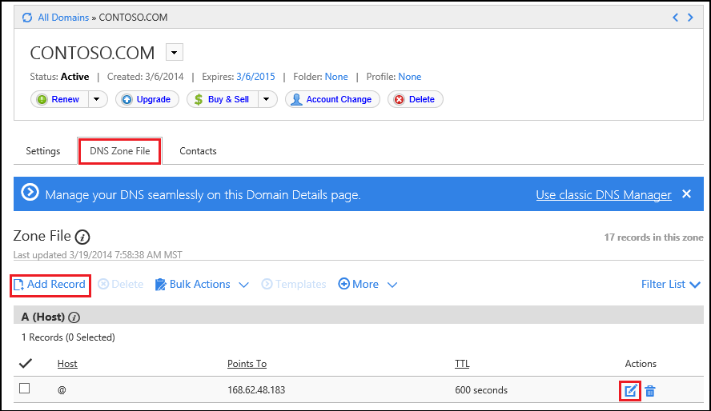

<properties
    pageTitle="Configure a custom domain name in Azure App Service (GoDaddy)"
    description="Learn how to use a domain name from GoDaddy with Azure Web Apps"
    services="app-service"
    documentationCenter=""
    authors="erikre"
    manager="wpickett"
    editor="jimbe"/>

<tags
    ms.service="app-service"
    ms.workload="na"
    ms.tgt_pltfrm="na"
    ms.devlang="na"
    ms.topic="article"
    ms.date="01/12/2016"
    ms.author="erikre"/>

# Configure a custom domain name in Azure App Service (Purchased directly from GoDaddy)
> [AZURE.SELECTOR]
- [Buy Domain for Web Apps](../article/app-service-web/custom-dns-web-site-buydomains-web-app.md)
- [Web Apps with External Domains](../article/app-service-web/web-sites-custom-domain-name.md)
- [Web Apps with Traffic Manager](../article/app-service-web/web-sites-traffic-manager-custom-domain-name.md)
- [GoDaddy](../article/app-service-web/web-sites-godaddy-custom-domain-name.md)

When you create a web app, Microsoft Azure provides a friendly subdomain on the azurewebsites.net domain so your users can access your web app using a URL like http://&lt;mywebapp&gt;.azurewebsites.net. You can also associate a custom domain name, such as contoso.com, with your web app in order to provide a more recognizable domain name for your users.

If you have purchased domain through Azure App Service Web Apps then refer to the final step of [Buy Domain for Web Apps](custom-dns-web-site-buydomains-web-app.md).

This article provides instructions on using a custom domain name that was purchased directly from [GoDaddy](https://godaddy.com) with [App Service Web Apps](http://go.microsoft.com/fwlink/?LinkId=529714).

This article is for App Service (Web Apps, API Apps, Mobile Apps, Logic Apps); for Cloud Services, see <a href="/develop/net/common-tasks/custom-dns/">Configuring a Custom Domain Name in Azure</a>.

> [AZURE.NOTE]  **For instructions on using Traffic Manager to load balance traffic to a web app**, use the selector at the top of this article to select the Traffic Manager specific steps.
>
> **Custom domain names cannot be used with Free web app**. You must configure your web app for **Shared**, **Basic**, or **Standard** mode, which may change how much you are billed for your subscription. See <a href=/pricing/details/web-sites/">Web Apps Pricing Details</a> for more information.

## Understanding DNS records
The Domain Name System (DNS) is used to locate resources on the internet. For example, when you enter a web app address in your browser, or click a link on a web page, it uses DNS to translate the domain into an IP address. The IP address is sort of like a street address, but it's not very human friendly. For example, it is much easier to remember a DNS name like **contoso.com** than it is to remember an IP address such as 192.168.1.88 or 2001:0:4137:1f67:24a2:3888:9cce:fea3.

The DNS system is based on *records*. Records associate a specific *name*, such as **contoso.com**, with either an IP address or another DNS name. When an application, such as a web browser, looks up a name in DNS, it finds the record, and uses whatever it points to as the address. If the value it points to is an IP address, the browser will use that value. If it points to another DNS name, then the application has to do resolution again. Ultimately, all name resolution will end in an IP address.

When you create an web app in App Service, a DNS name is automatically assigned to the web app. This name takes the form of **&lt;yourwebappname&gt;.azurewebsites.net**. There is also a virtual IP address available for use when creating DNS records, so you can either create records that point to the **.azurewebsites.net**, or you can point to the IP address.

> [AZURE.NOTE] The IP address of your web app will change if you delete and recreate your web app, or change the App Service plan mode to **Free** after it has been set to **Basic**, **Shared**, or **Standard**.

There are also multiple types of records, each with their own functions and limitations, but for web apps we only care about two, *A* and *CNAME* records.

###Address record (A record)

An A record maps a domain, such as **contoso.com** or **www.contoso.com**, *or a wildcard domain* such as **\*.contoso.com**, to an IP address. In the case of a web app in App Service, either the virtual IP of the service or a specific IP address that you purchased for your web app.

The main benefits of an A record over a CNAME record are:

* You can map a root domain such as **contoso.com** to an IP address; many registrars only allow this using A records

* You can have one entry that uses a wildcard, such as **\*.contoso.com**, which would handle requests for multiple sub-domains such as **mail.contoso.com**, **blogs.contoso.com**, or **www.contso.com**.

> [AZURE.NOTE] Since an A record is mapped to a static IP address, it cannot automatically resolve changes to the IP address of your web app. An IP address for use with A records is provided when you configure custom domain name settings for your web app; however, this value may change if you delete and recreate your web app, or change the App Service plan mode to back to **Free**.

###Alias record (CNAME record)

A CNAME record maps a *specific* DNS name, such as **mail.contoso.com** or **www.contoso.com**, to another (canonical) domain name. In the case of App Service Web Apps, the canonical domain name is the **&lt;yourwebappname>.azurewebsites.net** domain name of your web app. Once created, the CNAME creates an alias for the **&lt;yourwebappname>.azurewebsites.net** domain name. The CNAME entry will resolve to the IP address of your **&lt;yourwebappname>.azurewebsites.net** domain name automatically, so if the IP address of the web app changes, you do not have to take any action.

> [AZURE.NOTE] Some domain registrars only allow you to map subdomains when using a CNAME record, such as **www.contoso.com**, and not root names, such as **contoso.com**. For more information on CNAME records, see the documentation provided by your registrar, <a href="http://en.wikipedia.org/wiki/CNAME_record">the Wikipedia entry on CNAME record</a>, or the <a href="http://tools.ietf.org/html/rfc1035">IETF Domain Names - Implementation and Specification</a> document.

###Web app DNS specifics

Using an A record with Web Apps requires you to first create one of the following CNAME records:

* **For the root domain or wildcard sub-dodmains** - A DNS name of **awverify** to  **awverify.&lt;yourwebappname&gt;.azurewebsites.net**.

* **For a specific sub-domain** - A DNS name of **awverify.&lt;sub-domain>** to **awverify.&lt;yourwebappname&gt;.azurewebsites.net**. For example, **awverify.blogs** if the A record is for **blogs.contoso.com**.

This CNAME record is used to verify that you own the domain you are attempting to use. This is in addition to creating an A record pointing to the virtual IP address of your web ap.

You can find the IP address, as well as the **awverify** name and **.azurewebsites.net** names for your web app by performing the following steps:

1. In your browser, open the [Azure Portal](https://portal.azure.com).

2. In the **Web Apps** blade, click the name of your web app, select **All Settings**, and then select **Custom domains and SSL** from the bottom of the page.

	

3. In the **Custom Domains and SSL** blade, click **Bring external domains**.

	

	> [AZURE.NOTE] You cannot use custom domain names with a **Free** web app, and must upgrade the App Service plan to **Shared**, **Basic**, **Standard**, or **Premium** tier. For more information on the App Service plan's pricing tiers, including how to change the pricing tier of your web app, see [How to scale web apps](../articles/web-sites-scale.md).

6. In the **Bring external domains** blade, you will see the **awverify** information, the currently assigned **.azurewebsites.net** domain name, and the virtual IP address. Save this information, as it will be used when creating DNS records.

	

## Add a DNS record for your custom domain
To associate your custom domain with a web app in App Service, you must add a new entry in the DNS table for your custom domain by using tools provided by GoDaddy. Use the following steps to locate the DNS tools for GoDaddy.com

1. Log on to your account with GoDaddy.com, and select **My Account** and then **Manage my domains**. Finally, select the drop-down menu for the domain name that you wish to use with your Azure web app and select **Manage DNS**.

    

2. From the **Domain details** page, scroll to the **DNS Zone File** tab. This is the section used for adding and modifying DNS records for your domain name.

    

    Select **Add Record** to add an existing record.

    To **edit** an existing record, select the pen & paper icon beside the record.

   > [!NOTE]
> Before adding new records, note that GoDaddy has already created DNS records for popular sub-domains (called **Host** in editor,) such as **email**, **files**, **mail**, and others. If the name you wish to use already exists, modify the existing record instead of creating a new one.
> 
3. When adding a record, you must first select the record type.

    

    Next, you must provide the **Host** (the custom domain or sub-domain) and what it **Points to**.

    

   * When adding an **A (host) record** - you must set the **Host** field to either **@** (this represents root domain name, such as **contoso.com**,) * (a wildcard for matching multiple sub-domains,) or the sub-domain you wish to use (for example, **www**.) You must set the **Points to** field to the IP address of your Azure web app.

* When adding a **CNAME (alias) record** - you must set the **Host** field to the sub-domain you wish to use. For example, **www**. You must set the **Points to** field to the **.azurewebsites.net** domain name of your Azure web app. For example, **contoso.azurwebsites.net**.

4. Click **Add Another**.

5. Select **CNAME** as the record type, then specify a **Host** value of **awverify** and a **Points to** value of **awverify.&lt;yourwebappname&gt;.azurewebsites.net**.

   > [!NOTE]
> This CNAME record is used by Azure to validate that you own the domain described by the A record or the first CNAME record. Once the domain has been mapped to the web app in the Azure Portal, the **awverify** entry can be removed.
> 
6. When you have finished adding or modifying records, click **Finish** to save changes.

## Enable the domain name on your web app
After the records for your domain name have propagated, you must associate them with your Web App. Use the following steps to enable the domain names using your web browser.

> [AZURE.NOTE] It can take some time for CNAME records created in the previous steps to propagate through the DNS system. You cannot add the domain name of to your web app until the CNAME has propagated. If you are using an A record, you cannot add the A record domain name to your web app until the **awverify** CNAME record created in the previous step has propagated.
>
> You can use a service such as <a href="http://www.digwebinterface.com/">http://www.digwebinterface.com/</a> to verify that the CNAME is available.

1. In your browser, open the [Azure Management Portal](https://portal.azure.com).

2. In the **Web Apps** tab, click the name of your web app, select **Settings**, and then select **Custom domains and SSL**

	

3. In the **Custom domains and SSL** blade, click **Bring external domains**.

	

4. Use the **DOMAIN NAMES** text boxes to enter the domain names to associate with this web app.

	

5. Click **Save** to save the domain name configuration.

	Once configuration has completed, the custom domain name will be listed in the **domain names** section of your web app.

At this point, you should be able to enter the custom domain name in your browser and see that it successfully takes you to your web app.

> [!NOTE]
> If you want to get started with Azure App Service before signing up for an Azure account, go to [Try App Service](http://go.microsoft.com/fwlink/?LinkId=523751), where you can immediately create a short-lived starter web app in App Service. No credit cards required; no commitments.
> 
> 
## What's changed
* For a guide to the change from Websites to App Service see: [Azure App Service and Its Impact on Existing Azure Services](http://go.microsoft.com/fwlink/?LinkId=529714)

