<properties 
    pageTitle="Use Azure portal to manage Azure resources | Microsoft Azure" 
    description="Group multiple resources as a logical group that becomes the lifecycle boundary for resources contained within it." 
    services="azure-resource-manager,azure-portal" 
    documentationCenter="" 
    authors="tfitzmac" 
    manager="wpickett" 
    editor=""/>

<tags 
    ms.service="azure-resource-manager" 
    ms.workload="multiple" 
    ms.tgt_pltfrm="na" 
    ms.devlang="na" 
    ms.topic="article" 
    ms.date="12/29/2015" 
    ms.author="tomfitz"/>

# Using the Azure Portal to manage your Azure resources
## Introduction
Historically, managing a resource (such as a database server, database, or web app) in Microsoft Azure required you to perform operations against one resource at a time. If you had a complex application made up of multiple resources, you had to manually coordinate changes to the application infrastructure. In the Azure portal, you can utilize Azure Resource Manager to create resource groups to deploy and manage all the resources in an application together.

Typically, a resource group contains resources related to a specific application. For example, a group may contain a web app that hosts your public website, a SQL Database that stores relational data used by the site, and a Storage account that stores non-relational assets. Every resource in a resource group should share the same lifecycle. For more information about Resource Manager, see [Resource Manager overview](../resource-group-overview.md).

This topic provides an overview of how to use resource groups within the Azure portal. Currently, not every service supports the portal or Resource Manager. For those services, you will need to use the [classic portal](https://manage.windowsazure.com). For the status of each service, see [Azure portal availability chart](https://azure.microsoft.com/features/azure-portal/availability/)

## Create resource group and resources
If you need to create an empty resource group, you can select **New**, **Management**, and **Resource Group**.

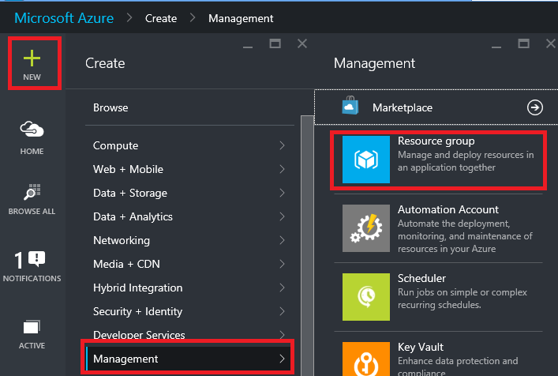

You give it a name and location, and, if necessary, select a subscription.

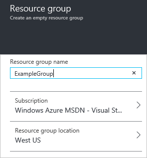

However, you do not need to explicitly create an empty resource group. When creating a new resource, you can choose to either create a new resource group or use an existing resource group. The following image shows how to create a new web app with the option of selecting an existing resource group or creating a new one. 

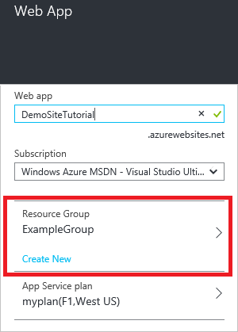

## Browse resource groups
You can browse all resource groups by clicking the **Browse All** and **Resource groups**. 

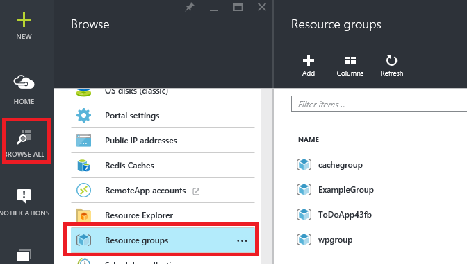

When you select a particular resource group, you see a resource group blade that gives you information about that resource group, including a list of all of the resources in the group.

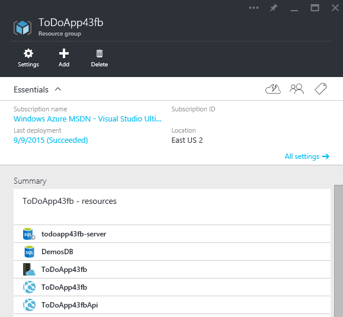

The resource group blade also gives you a unified view of your billing and monitoring information for all the resources in the resource group.

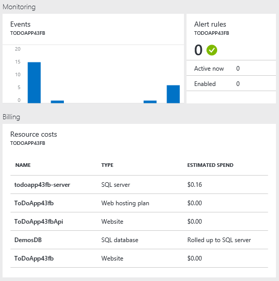

## Customizing the interface
For quick access to the resource group summary, you can pin the blade to your Startboard.

Or, you can pin a section of the blade to your Startboard by selecting the ellipsis (...) above the section. You can also customize the size the section in the blade or remove it completely. The following image shows how to pin, customize, or remove the Events section.

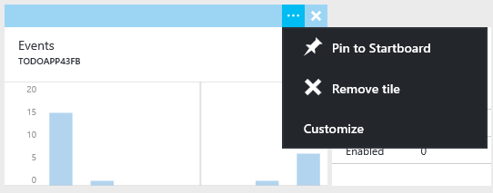

After pinning the Events section to the Startboard, you will see a summary of events on the Startboard.

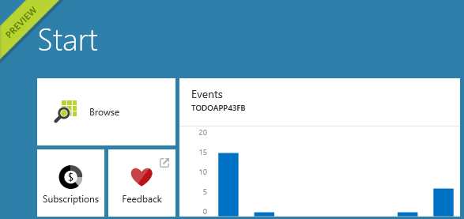

And, selecting it immediately takes you to more details about the events.

## Viewing past deployments
From within the resource group blade, you can see the date and status of the last deployment for this resource group. Selecting the link, displays a history of deployments for the group.

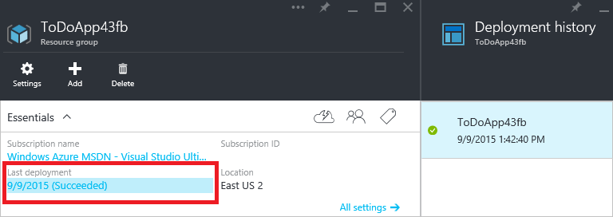

Selecting any deployment from the history shows details about that deployment.

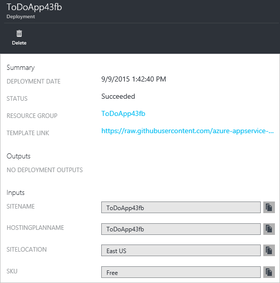

You can see the individual operations that were executed during the deployment. The following image shows one operation that succeeded and one that failed.

 

Selecting any of the operations shows more details about the operation. This can be especially helpful when an operation has failed, as shown below. It can help you troubleshoot why a deployment failed. In the following image, you can see that the web site was not deployed because the name was not unique.

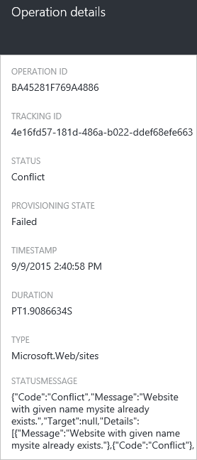

## Viewing audit logs
The audit log contains not just deployment operations, but all management operations taken on resources in your subscription. For example, you can see in the audit logs when someone in your organization stopped an app. To see the audit logs, select **Browse All** and **Audit Logs**.

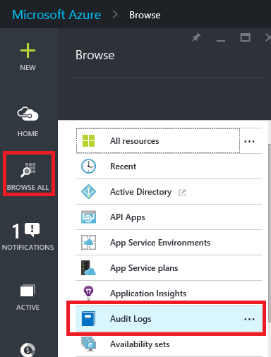

In the operations section, you can see the individual operations that have been performed across your subscription.

By selecting any of the operations, you can see greater details, including which user executed the operation.

You can filter what is shown in the audit log, by selecting **Filter**.

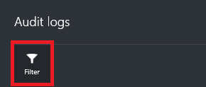

You can select what type of operations to show, such belonging to a resource group or resource, within a specified time span, initiated by a particular caller, or the levels of operation.

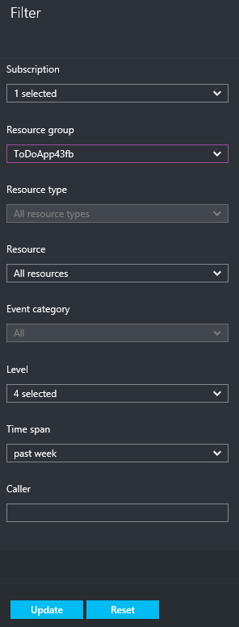  

## Adding resources to resource groups
You can add resources to a resource group using the **Add** command on the resource group blade.

You can select the resource you want from the available list.

## Deleting resource groups
Since resource groups allow you to manage the lifecycle of all the contained resources, deleting a resource group will delete all the resources contained within it. You can also delete individual resources within a resource group. You want to exercise caution when you are deleting a resource group since there might be other resources linked to it. You can see the linked resources in the resource map and take the necessary steps to avoid any unintentional consequences when you delete resource groups. The linked resources will not be deleted but they may not operate as expected.

## Tagging resources
You can apply tags to resource groups and resources to logically organize your assets. For information about working with tags through the portal, see [Using tags to organize your Azure resources](../resource-group-using-tags.md).

## Deploying a custom template
If you want to execute a deployment but not use any of the templates in the Marketplace, you can create customized template that defines the infrastructure for your solution. For more information about templates, see [Authoring Azure Resource Manager templates](../resource-group-authoring-templates.md).

To deploy a customized template through the portal, select **New**, **Marketplace**, and **Everything**.

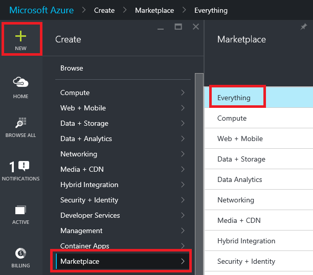

Search for **Template Deployment**, and select it from the returned list.

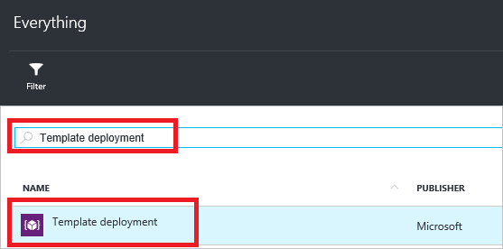

After launching the template deployment, you can create the custom template and set values for the deployment.

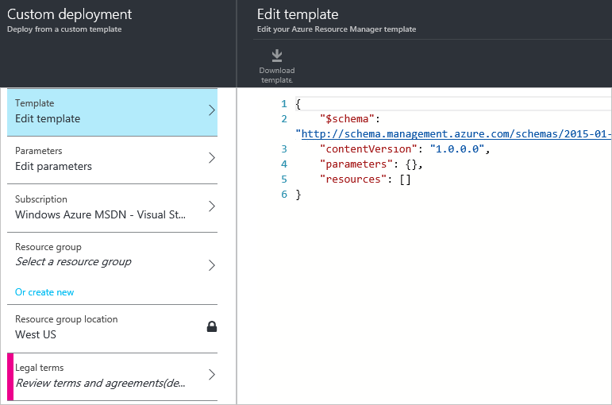

## Next Steps
Getting Started  

* For an introduction to the concepts in Resource Manager, see [Azure Resource Manager Overview](../resource-group-overview.md).  
* For an introduction to using Azure PowerShell when deploying resources, see [Using Azure PowerShell with Azure Resource Manager](../powershell-azure-resource-manager.md).
* For an introduction to using Azure CLI when deploying resources, see [Using the Azure CLI for Mac, Linux, and Windows with Azure Resource Management](../xplat-cli-azure-resource-manager.md). 

