<properties
   pageTitle="Restore  data to a Windows Server or Windows Client from Azure | Microsoft Azure"
   description="Learn how to restore from a Windows Server or Windows Client."
   services="backup"
   documentationCenter=""
   authors="Jim-Parker"
   manager="jwhit"
   editor=""/>

<tags
   ms.service="backup"
   ms.workload="storage-backup-recovery"
     ms.tgt_pltfrm="na"
     ms.devlang="na"
     ms.topic="article"
     ms.date="01/25/2016"
     ms.author="trinadhk; jimpark; markgal;"/>

# Restore files to a Windows server or Windows client machine
This article covers the steps required to perform two types of restore operations:

* Restore data to the same machine from which the backups were taken.
* Restore data to any other machine.

In both cases, the data is retrieved from the Azure Backup vault.

## Recover data to the same machine
If you accidentally deleted a file and wish to restore it to the same machine (from which the backup is taken), the following steps will help you recover the data.

1. Open the **Microsoft Azure Backup** snap in.
2. Click **Recover Data** to initiate the workflow.

    

3. Select the **This server (*yourmachinename*)** option to restore the backed up file on the same machine.

    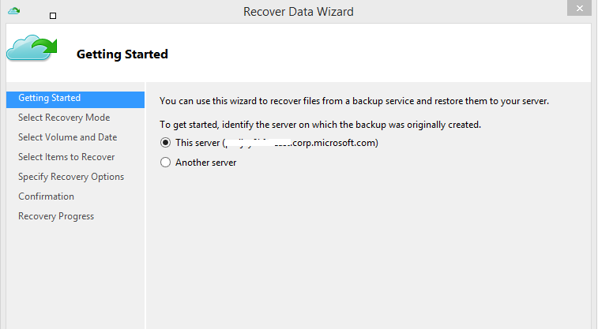

4. Choose to **Browse for files** or **Search for files**.

    Leave the default option if you plan to restore one or more files whose path is known. If you are not sure about the folder structure but would like to search for a file, pick the **Search for files** option. For the purpose of this section, we will proceed with the default option.

    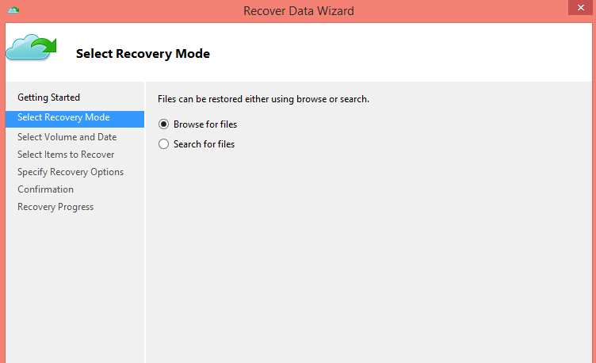

5. Select the volume from which you wish to restore the file.

    You can restore from any point in time. Dates which appear in **bold** in the calendar control indicate the availability of a restore point. Once a date is selected, based on your backup schedule (and the success of a backup operation), you can select a point in time from the **Time** drop down.

    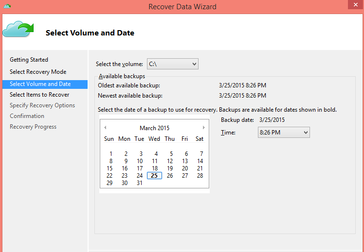

6. Select the items to recover. You can multi-select folders/files you wish to restore.

    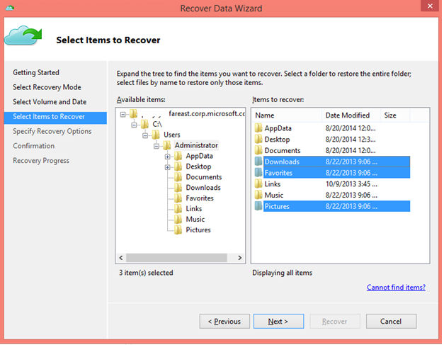

7. Specify the recovery parameters.

    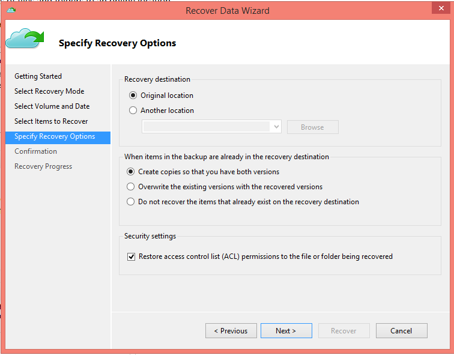

   * You have an option of restoring to the original location (in which the file/folder would be overwritten) or to another location in the same machine.
* If the file/folder you wish to restore exists in the target location, you can create copies (two versions of the same file), overwrite the files in the target location, or skip the recovery of the files which exist in the target.
* It is highly recommended that you leave the default option of restoring the ACLs on the files which are being recovered.

8. Once these inputs are provided, click **Next**. The recovery workflow, which restores the files to this machine, will begin.

## Recover to an alternate machine
If your entire server is lost, you can still recover data from Azure Backup to a different machine. The following steps illustrate the workflow.  

The terminology used in these steps includes:

* *Source machine* – The original machine from which the backup was taken and which is currently unavailable.
* *Target machine* – The machine to which the data is being recovered.
* *Sample vault* – The Backup vault to which the *Source machine* and *Target machine* are registered.  

> [!NOTE]
> Backups taken from a machine cannot be restored on a machine which is running an earlier version of the operating system. For example, if backups are taken from a Windows 7 machine, it can be restored on a Windows 8 or above machine. However the vice-versa does not hold true.
> 
> 
1. Open the **Microsoft Azure Backup** snap in on the *Target machine*.
2. Ensure that the *Target machine* and the *Source machine* are registered to the same backup vault.
3. Click **Recover Data** to initiate the workflow.

    

4. Select **Another server**

    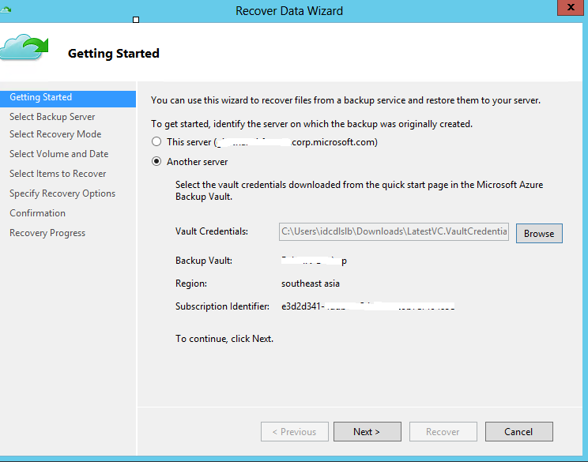

5. Provide the vault credential file that corresponds to the *Sample vault*. If the vault credential file is invalid (or expired) download a new vault credential file from the *Sample vault* in the Azure portal. Once the vault credential file is provided, the backup vault against the vault credential file is displayed.

6. Select the *Source machine* from the list of displayed machines.

    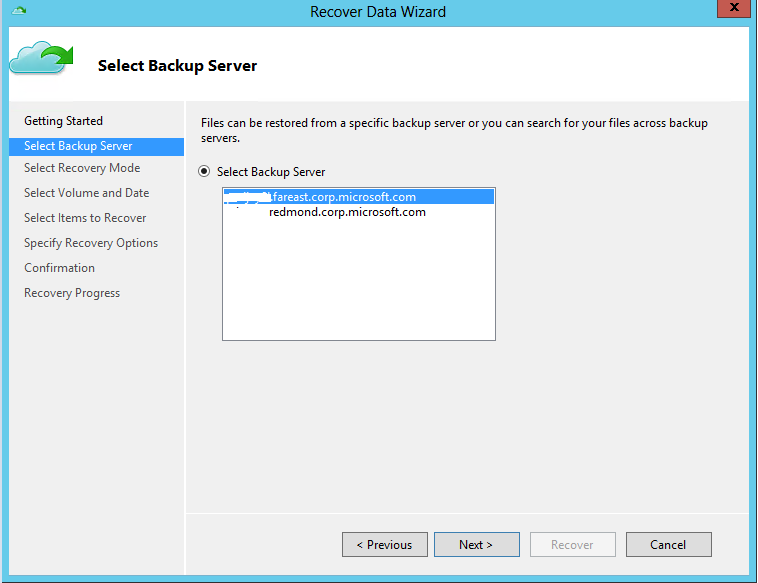

7. Select either the **Search for files** or **Browse for files** option. For the purpose of this section, we will use the **Search for files** option.

    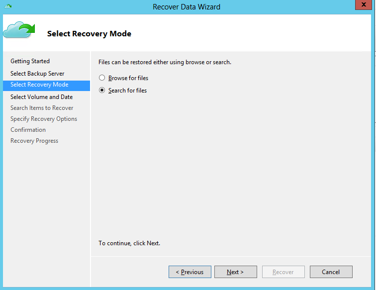

8. Select the volume and date in the next screen. Search for the folder/file name you want to restore.

    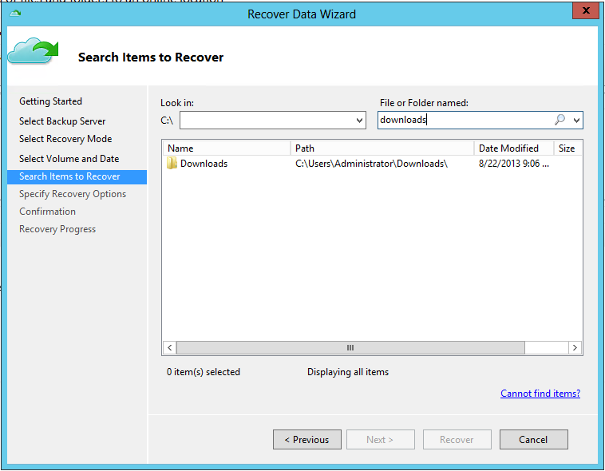

9. Select the location where the files need to be restored.

    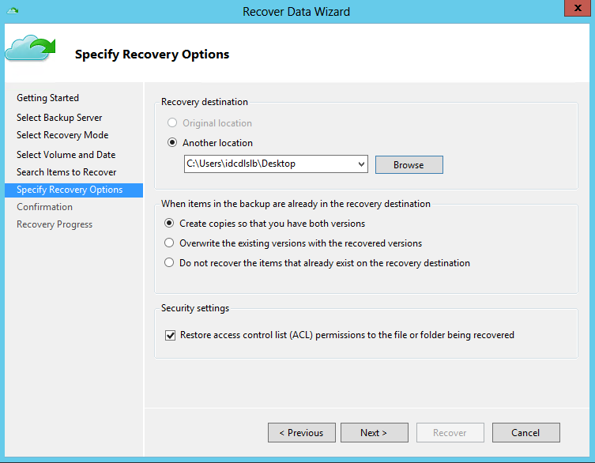

10. Provide the encryption passphrase that was provided during *Source machine’s* registration to *Sample vault*.

    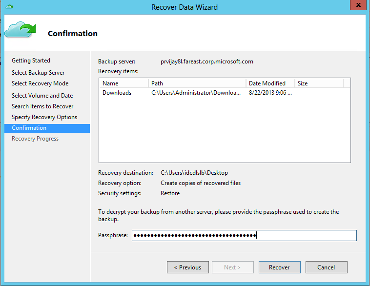

11. Once the input is provided, click **Recover**, which triggers the restore of the backed up files to the destination provided.

## Next steps
* [Azure Backup FAQ](backup-azure-backup-faq.md)
* Visit the [Azure Backup Forum](http://go.microsoft.com/fwlink/p/?LinkId=290933).

## Learn more
* [Azure Backup Overview](http://go.microsoft.com/fwlink/p/?LinkId=222425)
* [Backup Azure virtual machines](backup-azure-vms-introduction.md)
* [Backup up Microsoft workloads](backup-azure-dpm-introduction.md)

