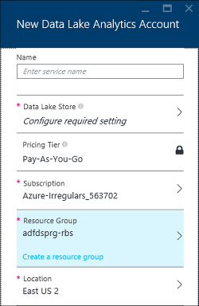
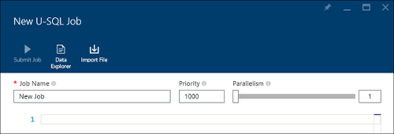
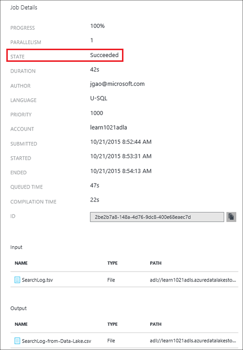
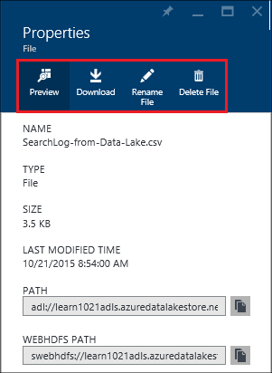

<properties 
   pageTitle="Get Started with Azure Data Lake Analytics using Azure Portal | Azure" 
   description="Learn how to use the Azure Portal to create a Data Lake Analytics account, create a Data Lake Analytics job using U-SQL, and submit the job. " 
   services="data-lake-analytics" 
   documentationCenter="" 
   authors="mumian" 
   manager="paulettm" 
   editor="cgronlun"/>

<tags
   ms.service="data-lake-analytics"
   ms.devlang="na"
   ms.topic="hero-article"
   ms.tgt_pltfrm="na"
   ms.workload="big-data" 
   ms.date="01/04/2016"
   ms.author="jgao"/>

# Tutorial: get started with Azure Data Lake Analytics using Azure Portal
> [AZURE.SELECTOR]
- [Portal](../articles/data-lake-analytics/data-lake-analytics-get-started-portal.md)
- [PowerShell](../articles/data-lake-analytics/data-lake-analytics-get-started-powershell.md)
- [.NET SDK](../articles/data-lake-analytics/data-lake-analytics-get-started-net-sdk.md)
- [Visual Studio](../articles/data-lake-analytics/data-lake-analytics-data-lake-tools-get-started.md)
- [CLI](../articles/data-lake-analytics/data-lake-analytics-get-started-cli.md)
- [Node.js](../articles/data-lake-analytics/data-lake-analytics-manage-use-nodejs.md)

Learn how to use the Azure Portal to create Azure Data Lake Analytics accounts, define Data Lake Analytics
jobs in [U-SQL](data-lake-analytics-u-sql-get-started.md), and submit jobs to Data Lake Analytics accounts. For more 
information about Data Lake Analytics, see [Azure Data Lake Analytics overview](data-lake-analytics-overview.md).

In this tutorial, you will develop a job that reads a tab separated values (TSV) file and converts it into a comma 
separated values (CSV) file. To go through the same tutorial using other supported tools, click the tabs on the top of this section. Once your first job succeeds, you can start to write more complex data transformations with U-SQL.

**The basic Data Lake Analytics process:**

1. Create a Data Lake Analytics account.
2. Prepare the source data. Data Lake Analytics jobs can read data from either Azure Data Lake Store accounts or Azure Blob storage accounts. In this example, we will read from Azure Data Lake Store.  
3. Develop a U-SQL script.
4. Submit a job (U-SQL script) to the Data Lake Analytics account. The job reads from the source data, process the data as instructed 
in the U-SQL script, and then save the output to either a Data Lake Store account or a Blob storage account.

### Prerequisites
Before you begin this tutorial, you must have the following:

* **An Azure subscription**. See [Get Azure free trial](https://azure.microsoft.com/pricing/free-trial/).

## Create Data Lake Analytics account
You must have a Data Lake Analytics account before you can run any jobs.

Each Data Lake Analytics account has an [Azure Data Lake Store]() account dependency.  This account is referred
as the default Data Lake Store account.  You can create the Data Lake Store account beforehand or when you create 
your Data Lake Analytics account. In this tutorial, you will create the Data Lake Store account with the Data Lake Analytics 
account.

**To create a Data Lake Analytics account**

1. Sign on to the new [Azure Classic Portal](https://portal.azure.com).
2. Click **New**, click **Data + Analytics**, and then click **Data Lake Analytics**.
3. Type or select the following:

    

   * **Name**: Name the Analytics account.
* **Data Lake Store**: Each Data Lake Analytics account has a dependent Data Lake Store account. The Data Lake Analytics account and the dependent Data Lake Store account must be located in the same Azure data center. Follow the instruction to create a new Data Lake Store account, or select an existing one.
* **Subscription**: Choose the Azure subscription used for the Analytics account.
* **Resource Group**. Select an existing Azure Resource Group or create a new one. Azure Resource Manager (ARM) enables you to work with the resources in your application as a group. For more information, see [Azure Resource Manager Overview](resource-group-overview.md). 
* **Location**. Select an Azure data center for the Data Lake Analytics account. 

4. Select **Pin to StartBoard**. This is required for following this tutorial.
5. Click **Create**. It takes you to the portal StartBoard. A new tile is added to the StartBoard with the label showing "Deploying Azure Data Lake Analytics". It takes a few moments to create a Data Lake Analytics account. When the account is created, the portal opens the account on a new blade on the portal.

    

After a Data Lake Analytics account is created, you can add additional Data Lake Store accounts and Azure Storage 
accounts. For instructions, see [Manage Data lake Analytics account data sources](data-lake-analytics-manage-use-portal.md#manage-account-data-sources).

## Prepare source data
In this tutorial, you will process some search logs.  The search log can be stored in either Data Lake store or Azure Blob storage. 

The Azure Portal provides a user interface for copying some sample data files to the default Data Lake account, which include a search log file.

**To copy sample data files**

1. From the Azure Portal, click **Microsoft Azure** in the upper left corner.
2. Click the tile with your Data Lake Analytics account name.  It was pinned here when the account was created.
If the account is not pinned there, see 
[Open a Data Lake  Analytics account from portal](data-lake-analytics-manage-use-portal.md#access-adla-account) to open the
account.
3. Expand the **Essentials** pane, and then click **Explore sample jobs**. It opens another blade called **Sample
Jobs**.
4. Click **Copy Sample Data**, and then click **OK** to confirm.
5. Click **Notification** which is a bell shaped icon. You shall see a log saying **Updating sample data completed**. Click anywhere outside the notification pane to close it.
6. From the Data Lake analytics account blade, click **Data Explorer** on the top. 

    

    It opens two blades. One is **Data Explorer**, and the other is the default Data Lake Store account.

7. In the default Data Lake Store account blade, click **Samples** to expand the folder, and the click **Data** to expand the folder. You shall see the following files and folders:

   * AmbulanceData/
* AdsLog.tsv
* SearchLog.tsv
* version.txt
* WebLog.log

  In this tutorial, you will use SearchLog.tsv.

In practice, you will either program your applications to write data into a linked storage accounts or upload data. For uploading files, see 
[Upload data to Data Lake Store](data-lake-analytics-manage-use-portal.md#upload-data-to-adls) or [Upload data to Blob storage](data-lake-analytics-manage-use-portal.md#upload-data-to-wasb).

## Create and submit Data Lake Analytics jobs
After you have prepared the source data, you can start developing a U-SQL script.  

**To submit the job**

1. From the Data Lake analytics account blade on the portal, click **New Job**. 

    

    If you don't see the blade, see [Open a Data Lake Analytics account from portal](data-lake-analytics-manage-use-portal.md#access-adla-account).

2. Enter **Job Name**, and the following U-SQL script:

    

        @searchlog =
         EXTRACT UserId          int,
                 Start           DateTime,
                 Region          string,
                 Query           string,
                 Duration        int?,
                 Urls            string,
                 ClickedUrls     string
         FROM "/Samples/Data/SearchLog.tsv"
         USING Extractors.Tsv();

     OUTPUT @searchlog   
         TO "/Output/SearchLog-from-Data-Lake.csv"
     USING Outputters.Csv();

    This U-SQL script reads the source data file using **Extractors.Tsv()**, and then creates a csv file using **Outputters.Csv()**. 

    Don't modify the two paths unless you copy the source file into a different location.  Data Lake Analytics will create the output folder if it doesn't exist.  In this case, we are using simple, relative paths.  

    It is simpler to use relative paths for files stored in default Data Lake accounts. You can also use absolute paths.  For example 

        adl://<Data LakeStorageAccountName>.azuredatalakestore.net:443/Samples/Data/SearchLog.tsv

    For more about U-SQL, see [Get started with Azure Data Lake Analytics U-SQL language](data-lake-analytics-u-sql-get-started.md) and [U-SQL language reference](http://go.microsoft.com/fwlink/?LinkId=691348).

1. Click **Submit Job** from the top. A new Job Details pane opens. On the title bar, it shows the job status.   
2. Wait until the job status is changed to **Succeeded**. When the job is completed, the portal opens the job details in a new blade:

    

    From the previous screenshot, you can see the job took roughly 1.5 minutes to complete from Submitted to Ended.

    In case the job failed, see [Monitor and troubleshoot Data Lake Analytics jobs](data-lake-analytics-monitor-and-troubleshoot-jobs-tutorials.md).

3. At the bottom of the **Job Detail** blade, click the job name in **SearchLog-from-Data-Lake.csv**. You can preview, download, rename, and delete the output file.

    

4. Click **Preview** to see the output file.

    

## See also
* To see a more complex query, see [Analyze Website logs using Azure Data Lake Analytics](data-lake-analytics-analyze-weblogs.md).
* To get started developing U-SQL applications, see [Develop U-SQL scripts using Data Lake Tools for Visual Studio](data-lake-analytics-data-lake-tools-get-started.md).
* To learn U-SQL, see [Get started with Azure Data Lake Analytics U-SQL language](data-lake-analytics-u-sql-get-started.md).
* For management tasks, see [Manage Azure Data Lake Analytics using Azure Portal](data-lake-analytics-manage-use-portal.md).
* To get an overview of Data Lake Analytics, see [Azure Data Lake Analytics overview](data-lake-analytics-overview.md).
* To see the same tutorial using other tools, click the tab selectors on the top of the page.

