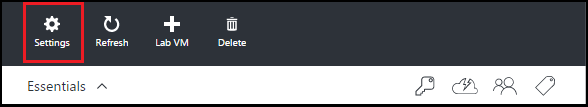
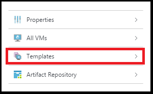
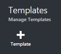
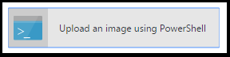

    <properties
    pageTitle="Create VM templates | Microsoft Azure"
    description="Learn how to create VM templates from VHD images"
    services="devtest-lab,virtual-machines"
    documentationCenter="na"
    authors="tomarcher"
    manager="douge"
    editor=""/>

<tags
    ms.service="devtest-lab"
    ms.workload="na"
    ms.tgt_pltfrm="na"
    ms.devlang="na"
    ms.topic="article"
    ms.date="11/01/2015"
    ms.author="tarcher"/>

# Create VM templates
## Overview
Once you have [created a lab](devtest-lab-create-lab.md), you can [add VMs to that lab](devtest-lab-add-vm-with-artifacts.md) from a list of VM templates. In this article, you'll learn how to upload and configure a Virtual Hard Disk (VHD) image file as a template from which to create your VMs. If you're unfamiliar with VHD images, refer to the [Create and upload a Windows Server VHD to Azure](../virtual-machines-create-upload-vhd-windows-server.md) article to learn how to create a VHD image. Once you've created or obtained access to a VHD image, this article will walk you through uploading it, and creating a template from it.

## Create a VM template
1. Sign in to the [Azure preview portal](https://portal.azure.com).

2. Tap **Browse**, and then tap **DevTest Labs** from the list.

3. From the list of labs, tap the desired lab.  

4. On the lab blade, tap **Settings**.

    

5. On the lab **Settings** blade, tap **Templates**.

    

6. On the **Templates** blade, tap **+ Template**.

    

7. On the **Add Template** blade:

   1. Enter the name of the template. This name is displayed in the list of templates when creating a new VM.

2. Enter the description of the template. This description is displayed in the list of templates when creating a new VM.

3. Tap **Image**.

4. If the image you want is not listed and you want to add it, skip to the [Add a new template image](#add-a-new-template-image.md) section, and return here when finished.

5. Select the desired image.

6. Tap **OK** to close the **Add Template** blade.

8. Tap **OS Configuration**.

9. On the **OS Configuration** tab, select either **Windows** or **Linux**.

10. If **Windows** is selected, specify via the checkbox whether or not *Sysprep* has been run on the machine.

11. Enter a **User name** for the machine.

12. Enter a **Password** for the machine. **Note:** The password will display in clear text.

13. Tap **OK** to close the **OS Configuration** blade.

14. Specify the **Location**.

15. Tap **OK** to create the template.

## Add a new template image
In order to add a new template image, you'll need to have access to a VHD image file.

1. On the **Add Template Image** blade, tap **Upload an image using PowerShell**.

    

2. The next blade will display instructions for modifying and running a PowerShell script that uploads to your Azure subscription a VHD image file. **Note:** This process can be lengthy depending on the size of the image file and your connection speed.

## Next steps
Once you have added a VM template for use when creating a VM, the next step is to [add a VM to your DevTest Lab](devtest-lab-add-vm-with-artifacts.md).

