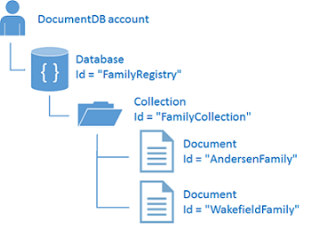

<properties
    pageTitle="NoSQL Node.js tutorial for DocumentDB | Microsoft Azure"
    description="A NoSQL Node.js tutorial that creates a node database and console application using the DocumentDB Node.js SDK. DocumentDB is a NoSQL database for JSON."
    keywords="node.js tutorial, node database"
    services="documentdb"
    documentationCenter="node.js"
    authors="AndrewHoh"
    manager="jhubbard"
    editor="monicar"/>

<tags
    ms.service="documentdb"
    ms.workload="data-services"
    ms.tgt_pltfrm="na"
    ms.devlang="node"
    ms.topic="hero-article" 
    ms.date="11/18/2015"
    ms.author="anhoh"/>

# NoSQL Node.js tutorial: DocumentDB Node.js console application
> [AZURE.SELECTOR]AZURE.SELECTOR]
> 
> * [.NET](documentdb-get-started.md)
> * [Node.js](documentdb-nodejs-get-started.md)
> 
> 
Welcome to the Node.js tutorial for the DocumentDB Node.js SDK! After following this tutorial, you'll have a console application that creates and queries DocumentDB resources, including a Node database.

We'll cover:

* Creating and connecting to a DocumentDB account
* Setting up your application
* Creating a node database
* Creating a collection
* Creating JSON documents
* Querying the collection
* Deleting the node database

Don't have time? Don't worry! The complete solution is available on [GitHub](https://github.com/Azure-Samples/documentdb-node-getting-started). See [Get the complete solution](#GetSolution.md) for quick instructions. 

After you've completed the Node.js tutorial, please use the voting buttons at the top and bottom of this page to give us feedback. If you'd like us to contact you directly, feel free to include your email address in your comments.

Now let's get started!

## Prerequisites for the Node.js tutorial
Please make sure you have the following:

* An active Azure account. If you don't have one, you can sign up for a [Free Azure Trial](https://azure.microsoft.com/pricing/free-trial/).
* [Node.js](https://nodejs.org/) version v0.10.29 or higher.

## Step 1: Create a DocumentDB account
Let's create a DocumentDB account. If you already have an account you want to use, you can skip ahead to [Setup your Node.js application](#SetupNode.md).

1.	Sign in to the online [Microsoft Azure portal](https://portal.azure.com/).
2.	In the Jumpbar, click **New**, then click **Data + Storage**, and then click **Azure DocumentDB**. 
  
	  

3. In the **New DocumentDB account** blade, specify the desired configuration for the DocumentDB account. 
 
	 


	- In the **ID** box, enter a name to identify the DocumentDB account.  When the **ID** is validated, a green check mark appears in the **ID** box. The **ID** value becomes the host name within the URI. The **ID** may contain only lowercase letters, numbers, and the '-' character, and must be between 3 and 50 characters. Note that *documents.azure.com* is appended to the endpoint name you choose, the result of which will become your DocumentDB account endpoint.
	

	- The **Account Tier** lens is locked because DocumentDB supports a single standard account tier. For more information, see [DocumentDB pricing](http://go.microsoft.com/fwlink/p/?LinkID=402317&clcid=0x409).
	
	- For **Subscription**, select the Azure subscription that you want to use for the DocumentDB account. If your account has only one subscription, that account is selected by default.

	- In **Resource Group**, select or create a resource group for your DocumentDB account.  By default, a new Resource group will be created.  You may, however, choose to select an existing resource group to which you would like to add your DocumentDB account. For more information, see [Using the Azure portal to manage your Azure resources](resource-group-portal.md).
 
	- Use **Location** to specify the geographic location in which to host your DocumentDB account.   

4.	Once the new DocumentDB account options are configured, click **Create**.  It can take a few minutes to create the DocumentDB account.  To check the status, you can monitor the progress on the Startboard.  
	  
  
	Or, you can monitor your progress from the Notifications hub.  

	  

	

5.	After the DocumentDB account is created, it is ready for use with the default settings in the online portal. Note that the default consistency of the DocumentDB account is set to **Session**.  You can adjust the default consistency setting by clicking the **Default Consistency** tile on the **DocumentDB account** blade.

      

[How to: Create a DocumentDB account]: #Howto
[Next steps]: #NextSteps
[documentdb-manage]:../articles/documentdb/documentdb-manage.md


## <a id="SetupNode"></a> Step 2: Setup your Node.js application
1. Open your favorite terminal.
2. Locate the folder or directory where you'd like to save your Node.js application.
3. Create two empty JavaScript files with the following commands:   * Windows:      * ```fsutil file createnew app.js 0```
* ```fsutil file createnew config.js 0```


* Linux/OS X:   * ```touch app.js```
* ```touch config.js```


4. Install the documentdb module via npm. Use the following command:   * ```npm install documentdb --save```


Great! Now that you've finished setting up, let's start writing some code.

## <a id="Config"></a> Step 3: Set your app's configurations
Open ```config.js``` in your favorite text editor. 

Then, create an empty object titled ```config``` and set properties ```config.endpoint``` and ```config.authKey``` to your DocumentDB endpoint and authorization key. Both these configurations can be found in the [Azure Portal](https://portal.azure.com).

![Node.js tutorial - Screen shot of the Azure Portal, showing a DocumentDB account, with the ACTIVE hub highlighted, the KEYS button highlighted on the DocumentDB account blade, and the URI, PRIMARY KEY and SECONDARY KEY values highlighted on the Keys blade - Node database][keys]

    var config = {}

    config.endpoint = "https://YOUR_ENDPOINT_URI.documents.azure.com:443/";
    config.authKey = "oqTveZeWlbtnJQ2yMj23HOAViIr0ya****YOUR_AUTHORIZATION_KEY****ysadfbUV+wUdxwDAZlCfcVzWp0PQg==";

Let's now add the ```database id```, ```collection id```, and ```JSON documents``` to your ```config``` object. Below where you set your ```config.endpoint``` and ```config.authKey``` properties, add the following code. If you already have data you'd like to store in your database, you can use DocumentDB's [Data Migration tool](documentdb-import-data.md) rather than adding the document definitions.

    config.dbDefinition = {"id": "FamilyRegistry"};
    config.collDefinition = {"id": "FamilyCollection"};

    var documents = {
      "Andersen": {
        "id": "AndersenFamily",
        "LastName": "Andersen",
        "Parents": [
          {
            "FirstName": "Thomas"
          },
          {
            "FirstName": "Mary Kay"
          }
        ],
        "Children": [
          {
            "FirstName": "Henriette Thaulow",
            "Gender": "female",
            "Grade": 5,
            "Pets": [
              {
                "GivenName": "Fluffy"
              }
            ]
          }
        ],
        "Address": {
          "State": "WA",
          "County": "King",
          "City": "Seattle"
        }
      },
      "Wakefield":   {
          "id": "WakefieldFamily",
          "Parents": [
            {
              "FamilyName": "Wakefield",
              "FirstName": "Robin"
            },
            {
              "FamilyName": "Miller",
              "FirstName": "Ben"
            }
          ],
          "Children": [
            {
              "FamilyName": "Merriam",
              "FirstName": "Jesse",
              "Gender": "female",
              "Grade": 8,
              "Pets": [
                {
                  "GivenName": "Goofy"
                },
                {
                  "GivenName": "Shadow"
                }
              ]
            },
            {
              "FamilyName": "Miller",
              "FirstName": "Lisa",
              "Gender": "female",
              "Grade": 1
            }
          ],
          "Address": {
            "State": "NY",
            "County": "Manhattan",
            "City": "NY"
          },
          "IsRegistered": false
        }
    };

    config.docsDefinitions = documents;

The database, collection, and document definitions will act as your DocumentDB ```database id```, ```collection id```, and documents' data.

Finally, export your ```config``` object, so that you can reference it within the ```app.js``` file.

    module.exports = config;

## <a id="Connect"></a> Step 4: Connect to a DocumentDB account
Open your empty ```app.js``` file in the text editor. Import the ```documentdb``` module and your newly created ```config``` module.

    var documentClient = require("documentdb").DocumentClient;
    var config = require("./config");

Next, let's use the previously saved ```config.endpoint``` and ```config.authKey``` to create a new DocumentClient.

    var client = new documentClient(config.endpoint, {"masterKey": config.authKey});

Now that you've connected to a DocumentDB account, let's take a look at working with DocumentDB resources.

## Step 5: Create a Node database
A [database](documentdb-resources.md#databases) can be created by using the [createDatabase](https://azure.github.io/azure-documentdb-node/DocumentClient.html) function of the **DocumentClient** class. A database is the logical container of document storage partitioned across collections. Add a function for creating your new database in the app.js file with the ```id``` specified in the ```config``` object. We'll first check to make sure a database with the same ```FamilyRegistry``` id does not already exist. If it does exist, we'll return that database instead of creating a new one.

    var getOrCreateDatabase = function(callback) {
        var querySpec = {
            query: 'SELECT * FROM root r WHERE r.id=@id',
            parameters: [{
                name: '@id',
                value: config.dbDefinition.id
            }]
        };

        client.queryDatabases(querySpec).toArray(function(err, results) {
            if(err) return callback(err);

            if (results.length === 0) {
                client.createDatabase(config.dbDefinition, function(err, created) {
                    if(err) return callback(err);

                    callback(null, created);
                });
            }
            else {
                callback(null, results[0]);
            }
        });
    };

## <a id="CreateColl"></a>Step 6: Create a collection
> [!WARNING]
> **CreateDocumentCollectionAsync** will create a new S1 collection, which has pricing implications. For more details, please visit our [pricing page](https://azure.microsoft.com/pricing/details/documentdb/).
> 
> 
A [collection](documentdb-resources.md#collections) can be created by using the [createCollection](https://azure.github.io/azure-documentdb-node/DocumentClient.html) function of the **DocumentClient** class. A collection is a container of JSON documents and associated JavaScript application logic. The newly created collection will be mapped to a [S1 performance level](documentdb-performance-levels.md). Add a function for creating your new collection in the app.js file with the ```id``` specified in the ```config``` object. Again, we'll check to make sure a collection with the same ```FamilyCollection``` id does not already exist. If it does exist, we'll return that collection instead of creating a new one.

    var getOrCreateCollection = function(callback) {

        var querySpec = {
            query: 'SELECT * FROM root r WHERE r.id=@id',
            parameters: [{
                name: '@id',
                value: config.collDefinition.id
            }]
        };

        var dbUri = "dbs/" + config.dbDefinition.id;

        client.queryCollections(dbUri, querySpec).toArray(function(err, results) {
            if(err) return callback(err);

            if (results.length === 0) {
                client.createCollection(dbUri, config.collDefinition, function(err, created) {
                    if(err) return callback(err);
                    callback(null, created);
                });
            }
            else {
                callback(null, results[0]);
            }
        });
    };

## <a id="CreateDoc"></a>Step 7: Create a document
A [document](documentdb-resources.md#documents) can be created by using the [createDocument](https://azure.github.io/azure-documentdb-node/DocumentClient.html) function of the **DocumentClient** class. Documents are user defined (arbitrary) JSON content. You can now insert a document into DocumentDB.

Next, add a function to app.js for creating the documents containing the JSON data saved in the ```config``` object. Again, we'll check to make sure a document with the same id does not already exist.

    var getOrCreateDocument = function(document, callback) {
        var querySpec = {
            query: 'SELECT * FROM root r WHERE r.id=@id',
            parameters: [{
                name: '@id',
                value: document.id
            }]
        };

        var collectionUri = "dbs/" + config.dbDefinition.id + "/colls/" + config.collDefinition.id;

        client.queryDocuments(collectionUri, querySpec).toArray(function(err, results) {
            if(err) return callback(err);

            if(results.length === 0) {
                client.createDocument(collectionUri, document, function(err, created) {
                    if(err) return callback(err);

                    callback(null, created);
                });
            } else {
                callback(null, results[0]);
            }
        });
    };

Congratulations! You now have functions for creating a database, collection, and document in DocumentDB!



## <a id="Query"></a>Step 8: Query DocumentDB resources
DocumentDB supports [rich queries](documentdb-sql-query.md) against JSON documents stored in each collection. The following sample code shows a query that you can run against the documents in your collection. Add the following function to the ```app.js``` file. DocumentDB supports SQL-like queries as shown below. For more information on building complex queries, check out the [Query Playground](https://www.documentdb.com/sql/demo) and the [query documentation](documentdb-sql-query.md).

    var queryCollection = function(documentId, callback) {
      var querySpec = {
          query: 'SELECT * FROM root r WHERE r.id=@id',
          parameters: [{
              name: '@id',
              value: documentId
          }]
      };

      var collectionUri = "dbs/" + config.dbDefinition.id + "/colls/" + config.collDefinition.id;

      client.queryDocuments(collectionUri, querySpec).toArray(function(err, results) {
          if(err) return callback(err);

          callback(null, results);
      });
    };

The following diagram illustrates how the DocumentDB SQL query syntax is called against the collection you created.


The [FROM](documentdb-sql-query.md/#from-clause.md) keyword is optional in the query because DocumentDB queries are already scoped to a single collection. Therefore, "FROM Families f" can be swapped with "FROM root r", or any other variable name you choose. DocumentDB will infer that Families, root, or the variable name you chose, reference the current collection by default.

## <a id="DeleteDatabase"></a>Step 9: Delete the Node database
Deleting the created database will remove the database and all children resources (collections, documents, etc.). You can delete the database by adding the following code snippet.

    // WARNING: this function will delete your database and all its children resources: collections and documents
    function cleanup(callback) {
        client.deleteDatabase("dbs/" + config.dbDefinition.id, function(err) {
            if(err) return callback(err);

            callback(null);
        });
    }

## <a id="Build"></a>Step 10: Put it together
Now that you've set all the necessary functions for your application, let's call them!

The order of function calls will be 

    * *getOrCreateDatabase*
        * *getOrCreateCollection*
            * *getOrCreateDocument*
                * *getOrCreateDocument*
                    * *queryCollection*
                        * *cleanup*

Add the following code snippet to the bottom of your code in ```app.js```.

    getOrCreateDatabase(function(err, db) {
        if(err) return console.log(err);
        console.log('Read or created db:\n' + db.id + '\n');

        getOrCreateCollection(function(err, coll) {
            if(err) return console.log(err);
            console.log('Read or created collection:\n' + coll.id + '\n');

            getOrCreateDocument(config.docsDefinitions.Andersen, function(err, doc) {
                if(err) return console.log(err);
                console.log('Read or created document:\n' + doc.id + '\n');

                getOrCreateDocument(config.docsDefinitions.Wakefield, function(err, doc) {
                    if(err) return console.log(err);
                    console.log('Read or created document:\n' + doc.id + '\n');

                    queryCollection("AndersenFamily", function(err, results) {
                        if(err) return console.log(err);
                        console.log('Query results:\n' + JSON.stringify(results, null, '\t') + '\n');

                        cleanup(function(err) {
                            if(err) return console.log(err);
                            console.log('Done.');
                        });
                    });
                });
            });
        });
    });

## <a id="Run"></a>Step 11: Run your Node.js application!
You are now ready to run your Node.js application!

In your terminal, locate your ```app.js``` file and run the command: ```node app.js```

You should see the output of your get started app. The output should match the example text below.

    Read or created db:
    FamilyRegistry

    Read or created collection:
    FamilyCollection

    Read or created document:
    AndersenFamily

    Read or created document:
    WakefieldFamily

    Query results:
    [
            {
                    "id": "AndersenFamily",
                    "LastName": "Andersen",
                    "Parents": [
                            {
                                    "FirstName": "Thomas"
                            },
                            {
                                    "FirstName": "Mary Kay"
                            }
                    ],
                    "Children": [
                            {
                                    "FirstName": "Henriette Thaulow",
                                    "Gender": "female",
                                    "Grade": 5,
                                    "Pets": [
                                            {
                                                    "GivenName": "Fluffy"
                                            }
                                    ]
                            }
                    ],
                    "Address": {
                            "State": "WA",
                            "County": "King",
                            "City": "Seattle"
                    },
                    "_rid": "tOErANjwoQcBAAAAAAAAAA==",
                    "_ts": 1444327141,
                    "_self": "dbs/tOErAA==/colls/tOErANjwoQc=/docs/tOErANjwoQcBAAAAAAAAAA==/",
                    "_etag": "\"00001200-0000-0000-0000-5616aee50000\"",
                    "_attachments": "attachments/"
            }
    ]

    Done.

Congratulations! You've created you've completed the Node.js tutorial and have your first DocumentDB console application! 

## <a id="GetSolution"></a> Get the complete Node.js tutorial solution
To build the GetStarted solution that contains all the samples in this article, you will need the following:

* [DocumentDB account](documentdb-create-account.md).
* The [GetStarted](https://github.com/Azure-Samples/documentdb-node-getting-started) solution available on GitHub.

Install the **documentdb** module via npm. Use the following command:

* ```npm install documentdb --save```

Next, in the ```config.js``` file, update the config.endpoint and config.authKey values as described in [Step 3: Set your app's configurations](#Config.md).

## Next steps
* Want a more complex Node.js sample? See [Build a Node.js web application using DocumentDB](documentdb-nodejs-application.md).
* Learn how to [monitor a DocumentDB account](documentdb-monitor-accounts.md).
* Run queries against our sample dataset in the [Query Playground](https://www.documentdb.com/sql/demo).
* Learn more about the programming model in the Develop section of the [DocumentDB documentation page](../../services/documentdb/.md).

[doc-landing-page]: ../../services/documentdb/
[documentdb-create-account]: documentdb-create-account.md
[documentdb-manage]: documentdb-manage.md

[keys]: media/documentdb-nodejs-get-started/node-js-tutorial-keys.png
