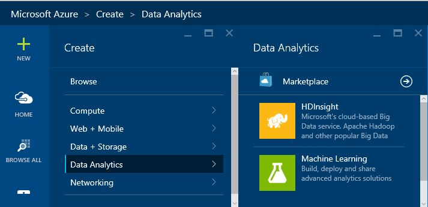
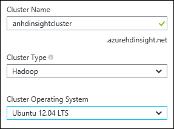
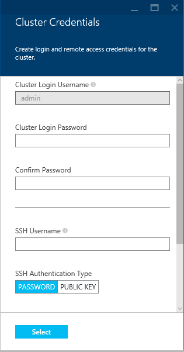
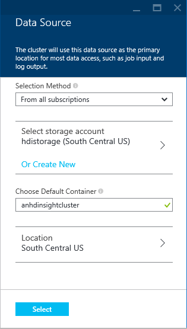
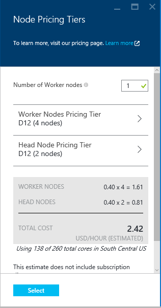
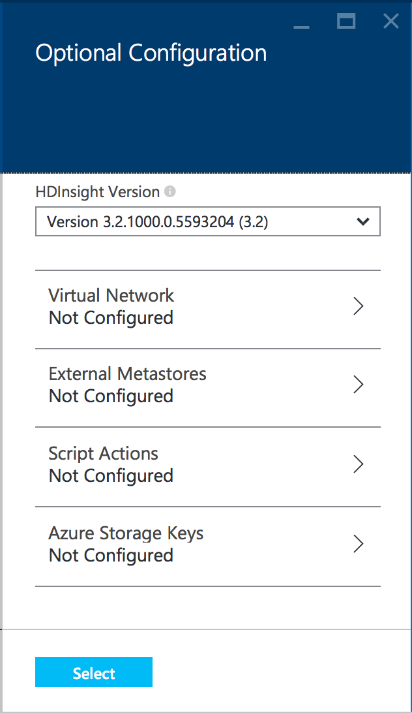
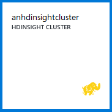
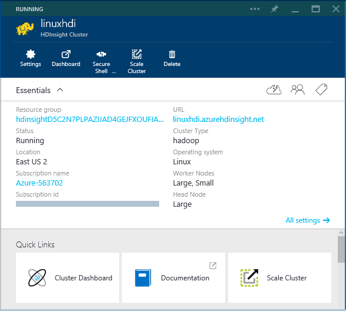
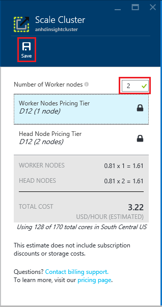
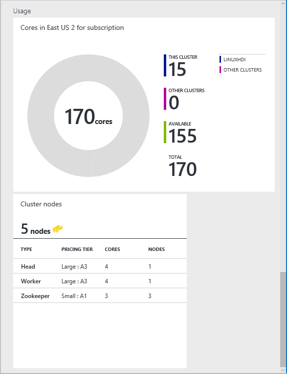

<properties
    pageTitle="Manage Linux-based Hadoop clusters in HDInsight using Azure portal | Microsoft Azure"
    description="Learn how to create and manage Linux-based HDInsight clusters using the Azure portal."
    services="hdinsight"
    documentationCenter=""
    authors="Blackmist"
    manager="paulettm"
    editor="cgronlun"
    tags="azure-portal"/>

<tags
    ms.service="hdinsight"
    ms.workload="big-data"
    ms.tgt_pltfrm="na"
    ms.devlang="na"
    ms.topic="article"
    ms.date="01/22/2016"
    ms.author="larryfr"/>

# Manage Hadoop clusters in HDInsight by using the Azure Portal
> [AZURE.SELECTOR]
- [Portal (Linux cluster)](../articles/hdinsight/hdinsight-administer-use-portal-linux.md)
- [Portal (Windows cluster)](../articles/hdinsight/hdinsight-administer-use-management-portal.md)
- [Azure CLI](../articles/hdinsight/hdinsight-administer-use-command-line.md)
- [Azure PowerShell](../articles/hdinsight/hdinsight-administer-use-powershell.md)

Using the [Azure Portal](https://portal.azure.com), you can provision and manage Linux-based Hadoop clusters in Azure HDInsight.

> [!NOTE]
> The steps in this document are specific to working with Linux-based Hadoop clusters. For information on working with Windows-based clusters, see [Manage Hadoop clusters in HDInsight by using the Azure Portal](hdinsight-administer-use-management-portal.md)
> 
> 
##Azure portal and Azure preview portal

> [AZURE.IMPORTANT] The steps in this document use the Azure preview portal. Microsoft recommends using the Azure preview portal when creating new services. For an explanation of the advantages of the preview portal, see [DevOps just got a whole lot more awesome](https://azure.microsoft.com/overview/preview-portal/). 
> 
> Services and resources created in the Azure preview portal are not visible in the Azure portal, as they use a new resource model.

## Other tools for administering HDInsight
There are also other tools available for administering HDInsight in addition to the Azure portal.

* [Administer HDInsight Using Azure CLI](hdinsight-administer-use-command-line.md): The Azure CLI is a cross-platform command line tool that allows you to manage Azure services

* [Administer HDInsight Using Azure PowerShell](hdinsight-administer-use-powershell.md): Azure PowerShell provides PowerShell cmdlets for managing Azure services

## Prerequisites
Before you begin this article, you must have the following:

* **An Azure subscription**. See [Get Azure free trial](https://azure.microsoft.com/documentation/videos/get-azure-free-trial-for-testing-hadoop-in-hdinsight/)

## Provision HDInsight clusters
You can provision HDInsight clusters from the Azure portal by using the following steps:

1. Sign in to the [Azure Portal](https://portal.azure.com).

2. Select **NEW**, select **Data Analytics**, and then select **HDInsight**

    

3. Enter a **Cluster Name**, then select the **Cluster Type** you wish to create. A green check will appear beside the **Cluster Name** if it is available.

    

4. If you have more than one subscription, select the **Subscription** entry to select the Azure subscription that will be used for the cluster.

5. For **Resource Group**, you can select the entry to see a list of existing resource groups and then select the one to create the cluster in. Or you can select **Create New** and then enter the name of the new resource group. A green check will appear to indicate if the new group name is available.

   > [!NOTE]
> This entry will default to one of your existing resource groups, if any are available.
> 
6. Select **Credentials**, then enter a **Cluster Login Password** for the **Cluster Login Username**. You must also enter an **SSH Username** and either a **PASSWORD** or **PUBLIC KEY**, which will be used to authenticate the SSH user. Finally, use the **Select** button to set the credentials. Remote desktop will not be used in this document, so you can leave it disabled.

    

   > [!NOTE]
> SSH is used to remotely access the HDInsight cluster using a command-line. The user name and password or public key you use here will be used when connecting to the cluster through SSH.
> 
> 
    For more information on using SSH with HDInsight, see one of the following articles:

   * [Use SSH with Linux-based Hadoop on HDInsight from Linux, Unix, or OS X](hdinsight-hadoop-linux-use-ssh-unix.md)

* [Use SSH with Linux-based Hadoop on HDInsight from Windows](hdinsight-hadoop-linux-use-ssh-windows.md)

7. For **Data Source**, you can select the entry to choose an existing data source, or create a new one.

    

    Currently you can select an Azure Storage Account as the data source for an HDInsight cluster. Use the following to understand the entries on the **Data Source** blade.

   * **Selection Method**: Set this to **From all subscriptions** to enable browsing of storage accounts on your subscriptions. Set to **Access Key** if you want to enter the **Storage Name** and **Access Key** of an existing storage account.

* **Create New**: Use this to create a new storage account. Use the field that appears to enter the name of the storage account. A green check will appear if the name is available.

* **Choose Default Container**: Use this to enter the name of the default container to use for the cluster. While you can enter any name here, we recommend using the same name as the cluster so that you can easily recognize that the container is used for this specific cluster.

* **Location**: The geographic region that the storage account will be is in, or will be created in.

  > [!IMPORTANT]
> Selecting the location for the default data source will also set the location of the HDInsight cluster. The cluster and default data source must be located in the same region.
> 
* **Select**: Use this to save the data source configuration.

1. Select **Node Pricing Tiers** to display information about the nodes that will be created for this cluster. By default, the number of worker nodes will be set to **4**. 

    The estimated cost of the cluster will be shown at the bottom of this blade.

    

    Use the **Select** button to save the **Node Pricing Tiers** information.

   > [!NOTE]
> The nodes used by your cluster do not count as Virtual Machines, as the Virtual Machines images used for the nodes are an implementation detail of the HDInsight service; however, the compute cores used by the nodes do count against the total number of compute cores available to your subscription. You can see the number of cores that will be used by the cluster, as well as the number of cores available, in the summary section of the Node Pricing Tiers blade when creating an HDInsight cluster.
> 
2. Select **Optional Configuration**. This blade allows you to configure the following items:

   * **HDInsight Version**: The version of HDInsight used for the cluster. For more information on HDInsight versioning, see [HDInsight component versioning](hdinsight-component-versioning.md)

* **External Metastores**: This allows you to select a SQL Database, which will be used to store configuration information for Oozie and Hive. This allows you to reuse the configuration when deleting and recreating a cluster, instead of having to recreate the Hive and Oozie configuration each time.

* **Virtual Network**: This allows you to place the HDInsight cluster on the same virtual network as other resources, such as SQL Database or an Azure Virtual Machine. Placing resources on a virtual network allows the to directly communicate with each other, bypassing the public gateways that handle incoming traffic from the Internet.

    For information on using HDInsight with a Virtual Network, including specific configuration requirements for the Virtual Network, see [Extend HDInsight capbilities by using an Azure Virtual Network](hdinsight-extend-hadoop-virtual-network.md).

* **Script Actions**: This allows you to specify Bash scripts that customize the HDInsight cluster during provisioning. For example, there is a [script that installs Hue](hdinsight-hadoop-hue-linux.md) (a graphical client for working with Hadoop.) For more information on Script Actions, see [Customize HDInsight clusters using Script Action](hdinsight-hadoop-customize-cluster-linux.md).

* **Azure Storage Keys**: This allows you to associate additional storage accounts with the HDInsight server.

  > [!NOTE]
> HDInsight can only access Azure Storage accounts used as the default data store, added through this configuration section, or that are publicly accessible.
> 
> 
  

3. Ensure that **Pin to Startboard** is selected, and then select **Create**. This will create the cluster and add a tile for it to the Startboard of your Azure Portal. The icon will indicate that the cluster is provisioning, and will change to display the HDInsight icon once provisioning has completed.

   | While provisioning | Provisioning complete |
| --- | --- |
|  | |

   > [!NOTE]
> It will take some time for the cluster to be created, usually around 15 minutes. Use the tile on the Startboard, or the __Notifications__ entry on the left of the page to check on the provisioning process.
> 
> 

## Manage a cluster
Selecting a cluster from the Azure Portal will display essential information about the cluster, such as the name, resource group, operating system, and the URL for the cluster dashboard (used to access Ambari Web for Linux clusters.)

Use the following to understand the icons at the top of this blade, and in the **Essentials** and **Quick Links** section:

* **Settings** and **All Settings**: Displays the **Settings** blade for the cluster, which allows you to access detailed configuration information for the cluster.

* **Dashboard**, **Cluster Dashboard**, and **URL**: These are all ways to access the cluster dashboard, which is Ambari Web for Linux-based clusters.

* **Secure Shell**: Information needed to access the cluster using SSH.

* **Scale Cluster**: Allows you to change the number of worker nodes for this cluster.

* **Delete**: Deletes the HDInsight cluster.

* **Quickstart ()**: Displays information that will help you get started using HDInsight.

* **Users ()**: Allows you to set permissions for *portal management* of this cluster for other users on your Azure subscription.

  > [!IMPORTANT]
> This _only_ affects access and permissions to this cluster in the Azure Portal, and has no effect on who can connect to or submit jobs to the HDInsight cluster.
> 
* **Tags ()**: Tags allows you to set key/value pairs to define a custom taxonomy of your cloud services. For example, you may create a key named **project**, and then use a common value for all services associated with a specific project.

* **Documentation**: Links to documentation for Azure HDInsight.

> [!IMPORTANT]
> To manage the services provided by the HDInsight cluster, you must use Ambari Web or the Ambari REST API. For more information on using Ambari, see [Manage HDInsight clusters using Ambari](hdinsight-hadoop-manage-ambari.md).
> 
> 
### Scaling
To scale a cluster using the portal, select your HDInsight cluster and then select **Scale Cluster**. Enter the **Number of worker nodes** you wish to set for the cluster, and then click **Save**.

For more information on scaling operations, see [Information about using HDInsight on Linux](hdinsight-hadoop-linux-information.md#scaling).

## Monitor a cluster
The **Usage** section of the HDInsight cluster blade dislays information about the number of cores available to your subscription for use with HDInsight, as well as the number of cores allocated to this cluster and how they are allocated for the nodes within this cluster.

> [!IMPORTANT]
> To monitor the services provided by the HDInsight cluster, you must use Ambari Web or the Ambari REST API. For more information on using Ambari, see [Manage HDInsight clusters using Ambari](hdinsight-hadoop-manage-ambari.md)
> 
> 
## Next steps
In this article, you have learned how to create an HDInsight cluster by using the Azure portal, and how to open the Hadoop command-line tool. To learn more, see the following articles:

* [Administer HDInsight Using Azure PowerShell](hdinsight-administer-use-powershell.md)
* [Administer HDInsight Using Azure CLI](hdinsight-administer-use-command-line.md)
* [Provision HDInsight clusters](hdinsight-provision-clusters.md)
* [Submit Hadoop jobs programmatically](hdinsight-submit-hadoop-jobs-programmatically.md)
* [Get Started with Azure HDInsight](hdinsight-hadoop-linux-tutorial-get-started.md)
* [What version of Hadoop is in Azure HDInsight?](hdinsight-component-versioning.md)

[preview-portal]: https://portal.azure.com
