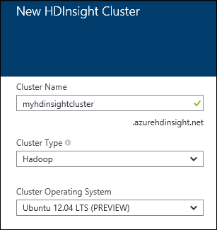
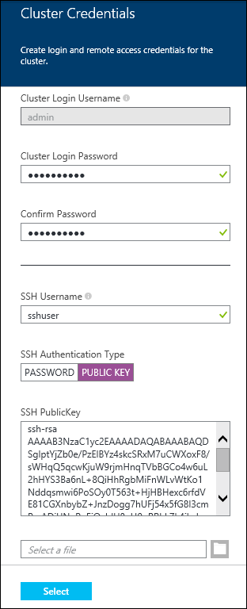
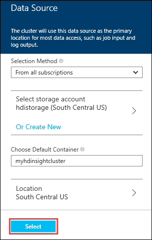
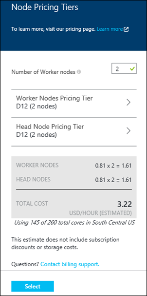
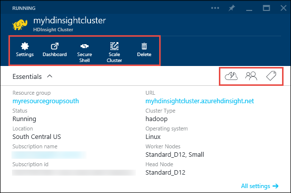

<properties
       pageTitle="Create Hadoop, HBase, Storm, or Spark clusters on Linux in HDInsight using the portal | Microsoft Azure"
       description="Learn how to create Hadoop, HBase, Storm, or Spark clusters on Linux for HDInsight using a web browser and the Azure preview portal."
       services="hdinsight"
       documentationCenter=""
       authors="nitinme"
       manager="paulettm"
       editor="cgronlun"
    tags="azure-portal"/>

<tags
       ms.service="hdinsight"
       ms.devlang="na"
       ms.topic="article"
       ms.tgt_pltfrm="na"
       ms.workload="big-data"
       ms.date="12/08/2015"
       ms.author="nitinme"/>

# Create Linux-based clusters in HDInsight using the Azure preview portal
> [AZURE.SELECTOR]
- [Windows-based](hdinsight-provision-clusters.md)
- [Overview](hdinsight-hadoop-provision-linux-clusters.md)
- [Azure portal](hdinsight-hadoop-create-linux-clusters-portal.md)
- [Azure CLI](hdinsight-hadoop-create-linux-clusters-azure-cli.md)
- [Azure PowerShell](hdinsight-hadoop-create-linux-clusters-azure-powershell.md)
- [REST API (cURL)](hdinsight-hadoop-create-linux-clusters-curl-rest.md)
- [.NET SDK](hdinsight-hadoop-create-linux-clusters-dotnet-sdk.md)

The Azure preview portal is a web-based management tool for services and resources hosted in the Microsoft Azure cloud. Use the information in this document to create a new Linux-based HDInsight cluster using the preview portal and your web browser

## Prerequisites
* **An Azure subscription**. See [Get Azure free trial](https://azure.microsoft.com/documentation/videos/get-azure-free-trial-for-testing-hadoop-in-hdinsight/).

* **A modern web browser**. The Azure preview portal uses HTML5 and Javascript, and may not function correctly in older web browsers.

## Create clusters
1. Sign in to the [Azure preview portal](https://portal.azure.com).

2. Click **NEW**, Click **Data Analytics**, and then click **HDInsight**.

    

3. Enter a **Cluster Name**, select **Hadoop** for the **Cluster Type**, and from the **Cluster Operating System** drop-down, select **Ubuntu**. A green check will appear beside the cluster name if it is available.

   > [!NOTE]
> To provision HBase or Storm clusters, select the approprite value for the **Cluster Type** drop-down.
> 
> 
    

4. If you have more than one subscription, click the **Subscription** entry to select the Azure subscription that will be used for the cluster.

5. Click **Resource Group** to see a list of existing resource groups and then select the one to create the cluster in. Or, you can click **Create New** and then enter the name of the new resource group. A green check will appear to indicate if the new group name is available.

   > [!NOTE]
> This entry will default to one of your existing resource groups, if any are available.
> 
6. Click **Credentials** and then enter a password for the admin user. You must also enter an **SSH Username** and either a **PASSWORD** or **PUBLIC KEY**, which will be used to authenticate the SSH user. Using a public key is the recommended approach. Click **Select** at the bottom to save the credentials configuration.

    

    For more information on using SSH with HDInsight, see one of the following articles:

   * [Use SSH with Linux-based Hadoop on HDInsight from Linux, Unix, or OS X](hdinsight-hadoop-linux-use-ssh-unix.md)
* [Use SSH with Linux-based Hadoop on HDInsight from Windows](hdinsight-hadoop-linux-use-ssh-windows.md)

1. Click **Data Source** to choose an existing data source for the cluster, or create a new one.

    

    Currently you can select an Azure Storage Account as the data source for an HDInsight cluster. Use the following to understand the entries on the **Data Source** blade.

   * **Selection Method**: Set this to **From all subscriptions** to enable browsing of storage accounts from all your subscriptions. Set this to **Access Key** if you want to enter the **Storage Name** and **Access Key** of an existing storage account.

* **Select storage account / Create New**: Click **Select storage account** to browse and select an existing storage account you want to associate with the cluster. Or, click **Create New** to create a new storage account. Use the field that appears to enter the name of the storage account. A green check will appear if the name is available.

* **Choose Default Container**: Use this to enter the name of the default container to use for the cluster. While you can enter any name here, we recommend using the same name as the cluster so that you can easily recognize that the container is used for this specific cluster.

* **Location**: The geographic region that the storage account is in, or will be created in.

  > [!IMPORTANT]
> Selecting the location for the default data source will also set the location of the HDInsight cluster. The cluster and default data source must be located in the same region.
> 
> 
  Click **Select** to save the data source configuration.

2. Click **Node Pricing Tiers** to display information about the nodes that will be created for this cluster. Set the number of worker nodes that you need for the cluster. The estimated cost of the cluster will be shown within the blade.

    

   > [!IMPORTANT]
> If you plan on more than 32 worker nodes, either at cluster creation or by scaling the cluster after creation, then you must select a head node size with at least 8 cores and 14GB ram.
> 
> For more information on node sizes and associated costs, see [HDInsight pricing](https://azure.microsoft.com/pricing/details/hdinsight/).
> 
> 
    Click **Select** to save the node pricing configuration.

3. Click **Optional Configuration** to select the cluster version, as well as configure other optional settings such as joining a **Virtual Network**, setting up an **External Metastore** to hold data for Hive and Oozie, use Script Actions to customize a cluster to install custom components, or use additional storage accounts with the cluster.

   * Click the **HDInsight Version** drop-down and select the version you want to use for the cluster. For more information, see [HDInsight cluster versions](hdinsight-component-versioning.md).

* **Virtual Network**: Select an Azure virtual network and the subnet if you want to place the cluster into a virtual network.  

    

    For information on using HDInsight with a Virtual Network, including specific configuration requirements for the Virtual Network, see [Extend HDInsight capbilities by using an Azure Virtual Network](hdinsight-extend-hadoop-virtual-network.md).

* Click **External Metastores** to specify SQL database that you want to use to save Hive and Oozie metadata associated with the cluster.

  > [!NOTE]
> Metastore configuration is not available for HBase cluster types.
> 
> 
    

    For **Use an existing SQL DB for Hive** metadata, click **Yes**, select a SQL database, and then provide the username/password for the database. Repeat these steps if you want to **Use an existing SQL DB for Oozie metadata**. Click **Select** till you are back on the **Optional Configuration** blade.

  > [!NOTE]
> The Azure SQL database used for the metastore must allow connectivity to other Azure services, including Azure HDInsight. On the Azure SQL database dashboard, on the right side, click the server name. This is the server on which the SQL database instance is running. Once you are on the server view, click **Configure**, and then for **Azure Services**, click **Yes**, and then click **Save**.
> 
* **Script Actions** if you want to use a custom script to customize a cluster, as the cluster is being created. For more information about script actions, see [Customize HDInsight clusters using Script Action](hdinsight-hadoop-customize-cluster-linux.md). On the Script Actions blade provide the details as shown in the screen capture.

    

* Click **Azure Storage Keys** to specify additional storage accounts to associate with the cluster. In the **Azure Storage Keys** blade, click **Add a storage key**, and then select an existing storage account or create a new account.

    

    Click **Select** till you are back on the **New HDInsight cluster** blade.

4. On the **New HDInsight Cluster** blade, ensure that **Pin to Startboard** is selected, and then click **Create**. This will create the cluster and add a tile for it to the Startboard of your Azure Portal. The icon will indicate that the cluster is provisioning, and will change to display the HDInsight icon once provisioning has completed.

   | While provisioning | Provisioning complete |
| --- | --- |
|  | |

   > [!NOTE]
> It will take some time for the cluster to be created, usually around 15 minutes. Use the tile on the Startboard, or the **Notifications** entry on the left of the page to check on the provisioning process.
> 
5. Once the provisioning completes, click the tile for the cluster from the Startboard to launch the cluster blade. The cluster blade provides essential information about the cluser such as the name, the resource group it belongs to, the location, the operating system, URL for the cluster dashboard, etc.

   

   Use the following to understand the icons at the top of this blade, and in the **Essentials** section:

   * **Settings** and **All Settings**: Displays the **Settings** blade for the cluster, which allows you to access detailed configuration information for the cluster.

* **Dashboard**, **Cluster Dashboard**, and **URL**: These are all ways to access the cluster dashboard, which is a Web portal to run jobs on the cluster.

* **Secure Shell**: Information needed to access the cluster using SSH.

* **Delete**: Deletes the HDInsight cluster.

* **Quickstart** (): Displays information that will help you get started using HDInsight.

* **Users** (): Allows you to set permissions for *portal management* of this cluster for other users on your Azure subscription.

  > [!IMPORTANT]
> This _only_ affects access and permissions to this cluster in the Azure preview portal, and has no effect on who can connect to or submit jobs to the HDInsight cluster.
> 
* **Tags** (): Tags allows you to set key/value pairs to define a custom taxonomy of your cloud services. For example, you may create a key named **project**, and then use a common value for all services associated with a specific project.

## Customize clusters
* See [Customize HDInsight clusters using Bootstrap](hdinsight-hadoop-customize-cluster-bootstrap.md).
* See [Customize Windows-based HDInsight clusters using Script Action](hdinsight-hadoop-customize-cluster.md).

## Next steps
Now that you have successfully created an HDInsight cluster, use the following to learn how to work with your cluster:

### Hadoop clusters
* [Use Hive with HDInsight](hdinsight-use-hive.md)
* [Use Pig with HDInsight](hdinsight-use-pig.md)
* [Use MapReduce with HDInsight](hdinsight-use-mapreduce.md)

### HBase clusters
* [Get started with HBase on HDInsight](hdinsight-hbase-tutorial-get-stared-linux.md)
* [Develop Java applications for HBase on HDInsight](hdinsight-hbase-build-java-maven-linux.md)

### Storm clusters
* [Develop Java topologies for Storm on HDInsight](hdinsight-storm-develop-java-topology.md)
* [Use Python components in Storm on HDInsight](hdinsight-storm-develop-python.md)
* [Deploy and monitor topologies with Storm on HDInsight](hdinsight-storm-deploy-monitor-topology-linux.md)

### Spark clusters
* [Create a standalone application using Scala](hdinsight-apache-spark-create-standalone-application.md)
* [Run jobs remotely on a Spark cluster using Livy](hdinsight-apache-spark-livy-rest-interface.md)
* [Spark with BI: Perform interactive data analysis using Spark in HDInsight with BI tools](hdinsight-apache-spark-use-bi-tools.md)
* [Spark with Machine Learning: Use Spark in HDInsight to predict food inspection results](hdinsight-apache-spark-machine-learning-mllib-ipython.md)
* [Spark Streaming: Use Spark in HDInsight for building real-time streaming applications](hdinsight-apache-spark-eventhub-streaming.md)

