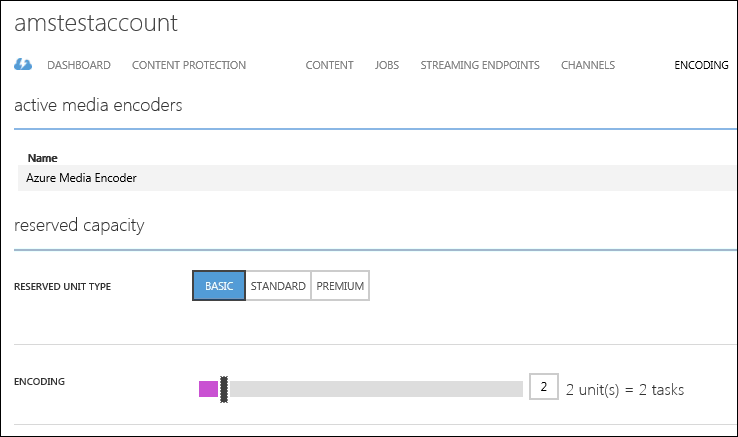

<properties
    pageTitle="How to Scale Media Processing using the Azure Classic Portal"
    description="Learn how to scale Media Services by specifying the number of On-Demand Streaming Reserved Units and Encoding Reserved Units that you would like your account to be provisioned with."
    services="media-services"
    documentationCenter=""
    authors="juliako,milangada"
    manager="dwrede"
    editor=""/>

<tags
    ms.service="media-services"
    ms.workload="media"
    ms.tgt_pltfrm="na"
    ms.devlang="na"
    ms.topic="article"
    ms.date="10/15/2015"
    ms.author="juliako"/>

# How to Scale Media Processing using the Azure Classic Portal
> [AZURE.SELECTOR]AZURE.SELECTOR]
> 
> * [.NET](media-services-dotnet-encoding-units.md)
> * [Portal](media-services-portal-encoding-units.md)
> * [REST](https://msdn.microsoft.com/library/azure/dn859236.aspx)
> * [Java](https://github.com/southworkscom/azure-sdk-for-media-services-java-samples)
> * [PHP](https://github.com/Azure/azure-sdk-for-php/tree/master/examples/MediaServices)
> 
> 
## Overview
A Media Services account is associated with a Reserved Unit Type which determines the speed with which your media processing tasks are processed. You can pick between the following reserved unit types: **Basic**, **Standard**, or **Premium**. For example, the same encoding job runs faster when you use the **Standard** reserved unit type compare to the **Basic** type. For more information, see the [Encoding Reserved Unit Types](https://azure.microsoft.com/blog/author/milanga/).

In addition to specifying the reserved unit type, you can specify to provision your account with encoding reserved units. The number of provisioned encoding reserved units determines the number of media tasks that can be processed concurrently in a given account. For example, if your account has 5 reserved units, then 5 media tasks will be running concurrently as long as there are tasks to be processed. The remaining tasks will wait in the queue and will get picked up for processing sequentially as soon as a running task finishes. If an account does not have any reserved units provisioned, then tasks will be picked up sequentially. In this case, the wait time between one task finishing and the next one starting will depend on the availability of resources in the system.

> [!IMPORTANT]
> Reserved Units work for parallelizing all media processing, including indexing jobs using Azure Media Indexer.  However, unlike encoding,  indexing jobs will not process faster with faster reserved units.
> 
> 
To change the reserved unit type and the number of encoding reserved units, do the following:

1. In the [Azure Classic Portal](https://manage.windowsazure.com/), click **Media Services**. Then, click the name of the media service.

2. Select the **ENCODING** page.

    To change the **RESERVED UNIT TYPE**, press BASIC, STANDARD, or PREMIUM.

    To change the number of reserved units for the selected reserved unit type, use the **ENCODING** slider.

    

    >[AZURE.NOTE] The following data centers do not offer the Premium reserved unit type: Singapore, Hong Kong, Osaka, Beijing, Shanghai.

1. Press the SAVE button to save your changes.

    The new encoding reserved units are allocated as soon as you press SAVE.

   > [!NOTE]
> The highest number of units specified for the 24-hour period is used in calculating the cost.
> 
> 

## Quotas and limitations
For information about quotas and limitations and how to open a support ticket, see [Quotas and limitations](media-services-quotas-and-limitations.md).

## Media Services learning paths
You can view AMS learning paths here:

- [AMS Live Streaming Workflow](https://azure.microsoft.com/documentation/learning-paths/media-services-streaming-live/)
- [AMS on Demand Streaming Workflow](https://azure.microsoft.com/documentation/learning-paths/media-services-streaming-on-demand/)

## Provide feedback
Use the [User Voice](http://go.microsoft.com/fwlink/?linkid=698785&clcid=0x409) forum to provide feedback and make suggestions on how to improve Azure Media Services. You can also go directly to one of the following categories: 

- [Azure Media Player](https://feedback.azure.com/forums/169396-media-services/category/109320-azure-media-player/)
- [Client SDK Libraries](https://feedback.azure.com/forums/169396-media-services/category/144435-client-sdks/)
- [Encoding and Processing](https://feedback.azure.com/forums/169396-media-services/category/144411-encoding-and-processing/)
- [Live Streaming](https://feedback.azure.com/forums/169396-media-services/category/144414-live-streaming/)
- [Azure Portal](https://feedback.azure.com/forums/169396-media-services/category/144432-portal/)
- [REST API and Platform](https://feedback.azure.com/forums/169396-media-services/category/144423-rest-api-and-platform/)
- [VoD Streaming](https://feedback.azure.com/forums/169396-media-services/category/144429-vod-streaming/)

