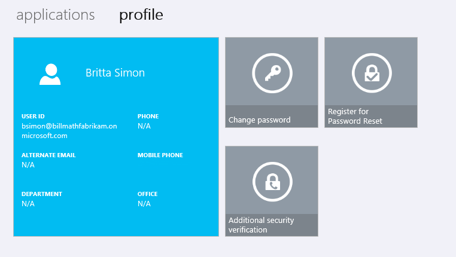
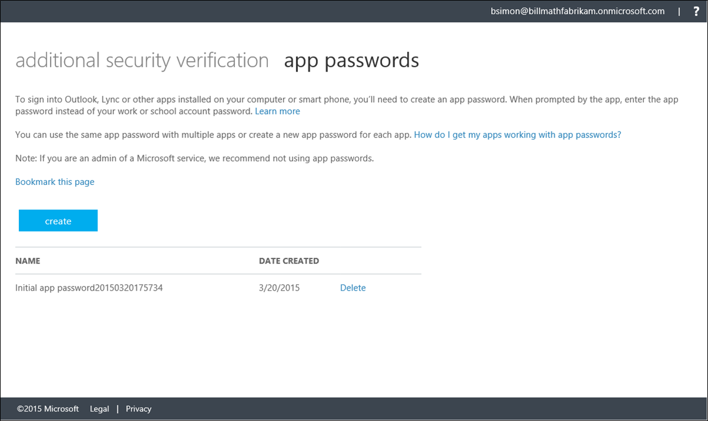

<properties 
    pageTitle="Create app passwords in the Myapps portal for Azure Multi-Factor Authentication" 
    description="This page shows users how they can create additional app passwords in the Myapps portal." 
    services="multi-factor-authentication" 
    documentationCenter="" 
    authors="billmath" 
    manager="stevenp" 
    editor="curtland"/>

<tags 
    ms.service="multi-factor-authentication" 
    ms.workload="identity" 
    ms.tgt_pltfrm="na" 
    ms.devlang="na" 
    ms.topic="article" 
    ms.date="11/19/2015" 
    ms.author="billmath"/>

# Create app passwords in the myapps 365 portal for Azure Multi-Factor Authentication
If you do not use multi-factor authentication with Office 365 have an Azure subscription then you will want to create app passwords through myapps portal.

## To create app passwords if you do not have an Office 365 or Azure subscription
- - -
<ol>

<li>Sign-in to [https://myapps.microsoft.com](https://myapps.microsoft.com)</li>    
<li>At the top, select profile.</li>

<li>Click on your user name and select Additional Security Verification.</li>
<li>On the proofup page, at the top, select app passwords</li>
<li>Click **Create**</li>

<li>Enter a name for the app password and click **Next**</li>
<li>Copy the app password to the clipboard and paste it into your app.</li>

