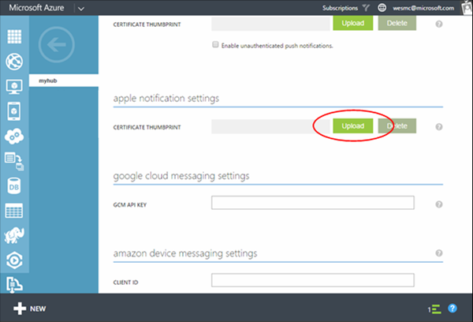
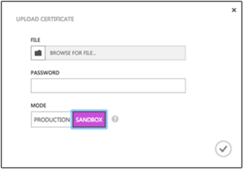

<properties
    pageTitle="Get started with Azure Notification Hubs for iOS apps | Microsoft Azure"
    description="In this tutorial, you learn how to use Azure Notification Hubs to push notifications to an iOS application."
    services="notification-hubs"
    documentationCenter="ios"
    authors="wesmc7777"
    manager="dwrede"
    editor=""/>

<tags
    ms.service="notification-hubs"
    ms.workload="mobile"
    ms.tgt_pltfrm="mobile-ios"
    ms.devlang="objective-c"
    ms.topic="hero-article"
    ms.date="12/15/2015"
    ms.author="wesmc"/>

# Get started with Notification Hubs for iOS apps
> [AZURE.SELECTOR]
- [Windows Runtime 8.1 universal](../articles/notification-hubs/notification-hubs-windows-store-dotnet-get-started.md)
- [Windows Phone Silverlight 8.x](../articles/notification-hubs/notification-hubs-windows-phone-get-started.md)
- [iOS](../articles/notification-hubs/notification-hubs-ios-get-started.md)
- [Android](../articles/notification-hubs/notification-hubs-android-get-started.md)
- [Kindle](../articles/notification-hubs/notification-hubs-kindle-get-started.md)
- [Baidu](../articles/notification-hubs/notification-hubs-baidu-get-started.md)
- [Xamarin.iOS](../articles/notification-hubs/partner-xamarin-notification-hubs-ios-get-started.md)
- [Xamarin.Android](../articles/notification-hubs/partner-xamarin-notification-hubs-android-get-started.md)
- [Chrome](../articles/notification-hubs/notification-hubs-chrome-get-started.md)

## Overview
This tutorial shows you how to use Azure Notification Hubs to send push notifications to an iOS application. You'll create a blank iOS app that receives push notifications by using the Apple Push Notification service (APNs). When you're finished, you'll be able to use your notification hub to broadcast push notifications to all the devices running your app.

This tutorial demonstrates the simple broadcast scenario in using Notification Hubs.

## Before you begin

The goal of this topic is to help you get started using Notification Hubs quickly as possible. This topic presents a very simple broadcast scenario example in order to concentrate on the basic concepts for Notification Hubs.

If you are already familiar with Notification Hubs, you may want to select another topic from the left-navigation or see the relevant links in [Next steps](#next-steps).

We do take your feedback seriously. If you have any difficulties completing this topic, or recommendations for improving this content, we would appreciate your feedback at the bottom of the page.

The completed code for this tutorial can be found on GitHub [here](https://github.com/Azure/azure-notificationhubs-samples/tree/master/iOS/GetStartedNH/GetStarted). 

## Prerequisites
This tutorial requires the following:

* [Mobile Services iOS SDK version 1.2.4](http://aka.ms/kymw2g)
* [Xcode 7](https://go.microsoft.com/fwLink/p/?LinkID=266532)
* An iOS 8 (or later version) capable device
* iOS Developer Program membership

  > [!NOTE]
> Because of configuration requirements for push notifications, you must deploy and test push notifications on an iOS capable device (iPhone or iPad) instead of the iOS Simulator.
> 
> 

Completing this tutorial is a prerequisite for all other Notification Hubs tutorials for iOS apps.

> [!NOTE]
> To complete this tutorial, you must have an active Azure account. If you don't have an account, you can create a free trial account in just a couple of minutes. For details, see [Azure Free Trial](https://azure.microsoft.com/pricing/free-trial/?WT.mc_id=A0E0E5C02returnurl=http%3A%2F%2Fazure.microsoft.com%2Fen-us%2Fdocumentation%2Farticles%2Fnotification-hubs-ios-get-started).
> 
> 

##Generate the Certificate Signing Request file

The Apple Push Notification Service (APNS) uses certificates to authenticate your push notifications. Follow these instructions to create the necessary push certificate to send and receive notifications. For more information on these concepts see the official [Apple Push Notification Service](http://go.microsoft.com/fwlink/p/?LinkId=272584) documentation.

Generate the Certificate Signing Request (CSR) file, which is used by Apple to generate a signed push certificate.

1. On your Mac, run the Keychain Access tool. It can be opened from the **Utilities** folder or the **Other** folder on the launch pad.

2. Click **Keychain Access**, expand **Certificate Assistant**, then click **Request a Certificate from a Certificate Authority...**.

  	

3. Select your **User Email Address** and **Common Name** , make sure that **Saved to disk** is selected, and then click **Continue**. Leave the **CA Email Address** field blank as it is not required.

  	

4. Type a name for the Certificate Signing Request (CSR) file in **Save As**, select the location in **Where**, then click **Save**.

  	

  	This saves the CSR file in the selected location; the default location is in the Desktop. Remember the location chosen for this file.

Next, you will register your app with Apple, enable push notifications, and upload this exported CSR to create a push certificate.

##Register your app for push notifications

To be able to send push notifications to an iOS app, you must register your application with Apple and also register for push notifications.  

1. If you have not already registered your app, navigate to the <a href="http://go.microsoft.com/fwlink/p/?LinkId=272456" target="_blank">iOS Provisioning Portal</a> at the Apple Developer Center, log on with your Apple ID, click **Identifiers**, then click **App IDs**, and finally click on the **+** sign to register a new app.

   	

2. Update the following three fields for your new app and then click **Continue**:

	* **Name**: Type a descriptive name for your app in the **Name** field in the **App ID Description** section.
	
	* **Bundle Identifier**: Under the **Explicit App ID** section, enter a **Bundle Identifier** in the form `<Organization Identifier>.<Product Name>` as mentioned in the [App Distribution Guide](https://developer.apple.com/library/mac/documentation/IDEs/Conceptual/AppDistributionGuide/ConfiguringYourApp/ConfiguringYourApp.html#//apple_ref/doc/uid/TP40012582-CH28-SW8). The *Organization Identifier* and *Product Name* you use must match the organization identifier and product name you will use when you create your XCode project. In the screeshot below *NotificationHubs* is used as a organization idenitifier and *GetStarted* is used as the product name. Making sure this matches the values you will use in your XCode project will allow you to use the correct publishing profile with XCode. 
	
	* **Push Notifications**: Check the **Push Notifications** option in the **App Services** section, .

	

   	This generates your app ID and requests you to confirm the information. Click **Submit**

    

   	Once you click **Submit**, you will see the **Registration complete** screen, as shown below. Click **Done**.

    

3. In the Developer Center, under App IDs, locate the app ID that you just created, and click on its row.

   	

   	Clicking on the app ID will display the app details. Click the **Edit** button at the bottom.

   	

4. Scroll to the bottom of the screen, and click the **Create Certificate...** button under the section **Development Push SSL Certificate**.

   	

   	This displays the "Add iOS Certificate" assistant.

    > [AZURE.NOTE] This tutorial uses a development certificate. The same process is used when registering a production certificate. Just make sure that you use the same certificate type when sending notifications.

5. Click **Choose File**, browse to the location where you saved the CSR file that you created in the first task, then click **Generate**.

  	

6. After the certificate is created by the portal, click the **Download** button, and click **Done**.

  	

   	This downloads the certificate and saves it to your computer in your Downloads folder.

  	

    > [AZURE.NOTE] By default, the downloaded file a development certificate is named **aps_development.cer**.

7. Double-click the downloaded push certificate **aps_development.cer**.

   	This installs the new certificate in the Keychain, as shown below:

   	

    > [AZURE.NOTE] The name in your certificate might be different, but it will be prefixed with **Apple Development iOS Push Services:**.

8. In Keychain Access, right-click the new push certificate that you created in the **Certificates** category. Click **Export**, name the file, select the **.p12** format, and then click **Save**.

	

	Make a note of the file name and location of the exported .p12 certificate. It will be used to enable authentication with APNS.

	>[AZURE.NOTE] This tutorial creates a QuickStart.p12 file. Your file name and location might be different.

##Create a provisioning profile for the app

1. Back in the <a href="http://go.microsoft.com/fwlink/p/?LinkId=272456" target="_blank">iOS Provisioning Portal</a>, select **Provisioning Profiles**, select **All**, and then click the **+** button to create a new profile. This launches the **Add iOS Provisiong Profile** Wizard

   	

2. Select **iOS App Development** under **Development** as the provisiong profile type, and click **Continue**. 

3. Next, select the app ID you just created from the **App ID** drop-down list, and click **Continue**

   	

4. In the **Select certificates** screen, select your usual development certificate used for code signing, and click **Continue**. This is not the push certificate you just created.

   	

5. Next, select the **Devices** to use for testing, and click **Continue**

   	

6. Finally, pick a name for the profile in **Profile Name**, click **Generate**.

   	

7. When the new provisioning profile is created click to download it and install it on your Xcode development machine. Then click **Done**.

   	

## Configure your notification hub
This section walks you through creating a new notification hub and configuring authentication with APNS using the **.p12** push certificate that you created. If you want to use a notification hub that you have already created, you can skip to step 5.

1. Log on to the [Azure Classic Portal](https://manage.windowsazure.com/), and then click **+NEW** at the bottom of the screen.

2. Click on **App Services**, then **Service Bus**, then **Notification Hub**, then **Quick Create**.

   	

3. Enter a **Notification Hub Name**. Select your desired **region** and **subscription**. 
 
	If you already have a service bus namespace that you want create the hub in, select your **Namespace Name**.  Otherwise, you can use the default **Namespace Name** which will be created based on the hub name as long as the namespace name is available. 

	Click **Create a new Notification Hub**.

   	

4. Once the namespace and notification hub are created, your namespaces in service bus will be displayed. Click the namespace that you just created your hub in (usually ***notification hub name*-ns**). 

5. On your namespace page, click the **Notification Hubs** tab at the top, and then click on the notification hub you just created. This will open the dashboard for your new notification hub.

6. On the dashboard for your new hub click **View Connection String**. Take note of the two connection strings. You will use these later.

   	

	

<ol start="7">

<li>

Click the <b>Configure</b> tab at the top, and then click the <b>Upload</b> button in the Apple notification settings to upload the certificate thumbprint. Then select the <b>.p12</b> certificate that you exported earlier, and the password for the certificate.

Make sure to select <b>Sandbox</b> mode since this is for development. Only use the <b>Production</b> if you want to send push notifications to users who purchased your app from the store.

</li>
</ol>
&emsp;&emsp;

&emsp;&emsp;

Your notification hub is now configured to work with APNS, and you have the connection strings to register your app and send notifications.

## Connect your app to the notification hub
1. In Xcode, create a new iOS project and select the **Single View Application** template.

       ![][8]
2. When setting the options for your new project, make sure to use the same **Product Name** and **Organization Identifier** that you used when you previously set the bundle ID on the Apple Developer portal.

    ![][11]

3. Under **Targets**, click your project name, click the **Build Settings** tab and expand **Code Signing Identity**, and then under **Debug**, set your code-signing identity. Toggle **Levels** from **Basic** to **All**, and set **Provisioning Profile** to the provisioning profile that you created previously.

    If you don't see the new provisioning profile that you created in Xcode, try refreshing the profiles for your signing identity. Click **Xcode** on the menu bar, click **Preferences**, click the **Account** tab, click the **View Details** button, click your signing identity, and then click the refresh button in the bottom-right corner.

       ![][9]
4. Download the [Mobile Services iOS SDK version 1.2.4](http://aka.ms/kymw2g) and unzip the file. In Xcode, right-click your project and click the **Add Files to** option to add the **WindowsAzureMessaging.framework** folder to your Xcode project. Select **Copy items if needed**, and then click **Add**.

   > [!NOTE]
> The notification hubs SDK does not currently support bitcode on Xcode 7.  You must set **Enable Bitcode** to **No** in the **Build Options** for your project.
> 
> 
       ![][10]
5. Add a new header file to your project named **HubInfo.h**. This file will hold the constants for your notification hub.  Add the following definitions and replace the string literal placeholders with your *hub name* and the *DefaultListenSharedAccessSignature* that you noted earlier.

        #ifndef HubInfo_h
     #define HubInfo_h

         #define HUBNAME @"<Enter the name of your hub>"
         #define HUBLISTENACCESS @"<Enter your DefaultListenSharedAccess connection string"

     #endif /* HubInfo_h */
6. Open your AppDelegate.h file add the following import directives:

         #import <WindowsAzureMessaging/WindowsAzureMessaging.h> 
      #import "HubInfo.h"
7. In your AppDelegate.m file, add the following code in the `didFinishLaunchingWithOptions` method based on your version of iOS. This code registers your device handle with APNs:

    For iOS 8:

         UIUserNotificationSettings *settings = [UIUserNotificationSettings settingsForTypes:UIUserNotificationTypeSound |
                                             UIUserNotificationTypeAlert | UIUserNotificationTypeBadge categories:nil];

     [[UIApplication sharedApplication] registerUserNotificationSettings:settings];
     [[UIApplication sharedApplication] registerForRemoteNotifications];

    For iOS versions prior to 8:

         [[UIApplication sharedApplication] registerForRemoteNotificationTypes: UIRemoteNotificationTypeAlert | UIRemoteNotificationTypeBadge | UIRemoteNotificationTypeSound];

1. In the same file, add the following methods. This code connects to the notification hub using the connection information you specified in HubInfo.h. It then gives the device token to the notification hub so that the notification hub can send notifications:

        - (void)application:(UIApplication *)application didRegisterForRemoteNotificationsWithDeviceToken:(NSData *) deviceToken {
         SBNotificationHub* hub = [[SBNotificationHub alloc] initWithConnectionString:HUBLISTENACCESS
                                     notificationHubPath:HUBNAME];

         [hub registerNativeWithDeviceToken:deviceToken tags:nil completion:^(NSError* error) {
             if (error != nil) {
                 NSLog(@"Error registering for notifications: %@", error);
             }
             else {
                 [self MessageBox:@"Registration Status" message:@"Registered"];
             }
         }];
     }

     -(void)MessageBox:(NSString *)title message:(NSString *)messageText
     {
         UIAlertView *alert = [[UIAlertView alloc] initWithTitle:title message:messageText delegate:self
             cancelButtonTitle:@"OK" otherButtonTitles: nil];
         [alert show];
     }

1. In the same file, add the following method to display a **UIAlert** if the notification is received while the app is active:

        - (void)application:(UIApplication *)application didReceiveRemoteNotification: (NSDictionary *)userInfo {
            NSLog(@"%@", userInfo);
            [self MessageBox:@"Notification" message:[[userInfo objectForKey:@"aps"] valueForKey:@"alert"]];
        }

1. Build and run the app on your device to verify that there are no failures.

## Send notifications
You can test receiving notifications in your app by sending notifications in the [Azure Classic Portal](https://manage.windowsazure.com/) via the debug tab on the notification hub, as shown in the screen below.

![][30]

Push notifications are normally sent in a back-end service like Mobile Services or ASP.NET using a compatible library. You can also use the REST API directly to send notification messages if a library is not available for your back-end. 

Here is a list of some other tutorials you may want to review for sending notifications:

- Azure Mobile Services : For an example of how to send notifications from an Azure Mobile Services backend integrated with Notification Hubs, see [Get started with push notifications in Mobile Services].  
- ASP.NET : [Use Notification Hubs to push notifications to users].
- Azure Notification Hub Java SDK: See [How to use Notification Hubs from Java](../articles/notification-hubs/notification-hubs-java-backend-how-to.md) for sending notifications from Java. This has been tested in Eclipse for Android Development.
- PHP: [How to use Notification Hubs from PHP](../articles/notification-hubs/notification-hubs-php-backend-how-to.md).

In the next section of the tutorial, you will learn how to use the [Notification Hub REST interface](http://msdn.microsoft.com/library/windowsazure/dn223264.aspx) to send the notification message directly in your app. All registered devices receive the notification sent by any device.  

## (Optional) Send notifications from the app
If you want to send notifications within an app. This section provides an example of how to do this using the REST interface.

1. In Xcode, open Main.storyboard and add the following UI components from the object library to allow the user to send push notifications in the app:

   * A label with no label text. It will be used to report errors in sending notifications. The **Lines** property should be set to **0** so that it will automatically size constrained to the right and left margins and the top of the view.
* A text field with **Placeholder** text set to **Enter Notification Message**. Constrain the field just below the label as shown below. Set the View Controller as the outlet delegate.
* A button titled **Send Notification** constrained just below the text field and in the horizontal center.

  The view should look as follows:

  ![][32]

1. [Add outlets](https://developer.apple.com/library/ios/recipes/xcode_help-IB_connections/chapters/CreatingOutlet.html) for the label and text field connected your view, and update your `interface` definition to support `UITextFieldDelegate` and `NSXMLParserDelegate`. Add the three property declarations shown below to help support calling the REST API and parsing the response.

    Your ViewController.h file should look as follows:

        #import <UIKit/UIKit.h>

     @interface ViewController : UIViewController <UITextFieldDelegate, NSXMLParserDelegate>
     {
         NSXMLParser *xmlParser;
     }

     // Make sure these outlets are connected to your UI by ctrl+dragging
     @property (weak, nonatomic) IBOutlet UITextField *notificationMessage;
     @property (weak, nonatomic) IBOutlet UILabel *sendResults;

     @property (copy, nonatomic) NSString *statusResult;
     @property (copy, nonatomic) NSString *currentElement;

     @end
2. Open HubInfo.h and add the following constants which will be used for sending notifications to your hub. Replace the placeholder string literal with your actual *DefaultFullSharedAccessSignature* connection string.

        #define API_VERSION @"?api-version=2015-01"
     #define HUBFULLACCESS @"<Enter Your DefaultFullSharedAccess Connection string>"
3. Add the following `#import` statements to your ViewController.h file.

        #import <CommonCrypto/CommonHMAC.h>
     #import "HubInfo.h"
4. In ViewController.m add the following code to the interface implementation. This code will parse your *DefaultFullSharedAccessSignature* connection string. As mentioned in the [REST API reference](http://msdn.microsoft.com/library/azure/dn495627.aspx), this parsed information will be used to generate a SaS token for the **Authorization** request header.

        NSString *HubEndpoint;
     NSString *HubSasKeyName;
     NSString *HubSasKeyValue;

     -(void)ParseConnectionString
     {
         NSArray *parts = [HUBFULLACCESS componentsSeparatedByString:@";"];
         NSString *part;

         if ([parts count] != 3)
         {
             NSException* parseException = [NSException exceptionWithName:@"ConnectionStringParseException"
                 reason:@"Invalid full shared access connection string" userInfo:nil];

             @throw parseException;
         }

         for (part in parts)
         {
             if ([part hasPrefix:@"Endpoint"])
             {
                 HubEndpoint = [NSString stringWithFormat:@"https%@",[part substringFromIndex:11]];
             }
             else if ([part hasPrefix:@"SharedAccessKeyName"])
             {
                 HubSasKeyName = [part substringFromIndex:20];
             }
             else if ([part hasPrefix:@"SharedAccessKey"])
             {
                 HubSasKeyValue = [part substringFromIndex:16];
             }
         }
     }
5. In ViewController.m, update the `viewDidLoad` method to parse the connection string when the view loads. Also add the utility methods, shown below, to the interface implementation.  

        - (void)viewDidLoad
        {
            [super viewDidLoad];
            [self ParseConnectionString];
            [_notificationMessage setDelegate:self];
        }

        -(NSString *)CF_URLEncodedString:(NSString *)inputString
        {
           return (__bridge NSString *)CFURLCreateStringByAddingPercentEscapes(NULL, (CFStringRef)inputString,
                NULL, (CFStringRef)@"!*'();:@&=+$,/?%#[]", kCFStringEncodingUTF8);
        }

        -(void)MessageBox:(NSString *)title message:(NSString *)messageText
        {
            UIAlertView *alert = [[UIAlertView alloc] initWithTitle:title message:messageText delegate:self
                cancelButtonTitle:@"OK" otherButtonTitles: nil];
            [alert show];
        }

1. In ViewController.m, add the following code to the interface implementation to generate the SaS authorization token that will be provided in the **Authorization** header, as mentioned in the [REST API Reference](http://msdn.microsoft.com/library/azure/dn495627.aspx).

        -(NSString*) generateSasToken:(NSString*)uri
     {
         NSString *targetUri;
         NSString* utf8LowercasedUri = NULL;
         NSString *signature = NULL;
         NSString *token = NULL;

         @try
         {
             // Add expiration
             uri = [uri lowercaseString];
             utf8LowercasedUri = [self CF_URLEncodedString:uri];
             targetUri = [utf8LowercasedUri lowercaseString];
             NSTimeInterval expiresOnDate = [[NSDate date] timeIntervalSince1970];
             int expiresInMins = 60; // 1 hour
             expiresOnDate += expiresInMins * 60;
             UInt64 expires = trunc(expiresOnDate);
             NSString* toSign = [NSString stringWithFormat:@"%@\n%qu", targetUri, expires];

             // Get an hmac_sha1 Mac instance and initialize with the signing key
             const char *cKey  = [HubSasKeyValue cStringUsingEncoding:NSUTF8StringEncoding];
             const char *cData = [toSign cStringUsingEncoding:NSUTF8StringEncoding];
             unsigned char cHMAC[CC_SHA256_DIGEST_LENGTH];
             CCHmac(kCCHmacAlgSHA256, cKey, strlen(cKey), cData, strlen(cData), cHMAC);
             NSData *rawHmac = [[NSData alloc] initWithBytes:cHMAC length:sizeof(cHMAC)];
             signature = [self CF_URLEncodedString:[rawHmac base64EncodedStringWithOptions:0]];

             // Construct authorization token string
             token = [NSString stringWithFormat:@"SharedAccessSignature sig=%@&se=%qu&skn=%@&sr=%@",
                 signature, expires, HubSasKeyName, targetUri];
         }
         @catch (NSException *exception)
         {
             [self MessageBox:@"Exception Generating SaS Token" message:[exception reason]];
         }
         @finally
         {
             if (utf8LowercasedUri != NULL)
                 CFRelease((CFStringRef)utf8LowercasedUri);
             if (signature != NULL)
             CFRelease((CFStringRef)signature);
         }

         return token;
     }

1. Ctrl+drag from the **Send Notification** button to ViewController.m to add an action named **SendNotificationMessage** for the **Touch Down** event. Update method with the following code to send the notification using the REST API.

        - (IBAction)SendNotificationMessage:(id)sender
     {
         self.sendResults.text = @"";
         [self SendNotificationRESTAPI];
     }

     - (void)SendNotificationRESTAPI
     {
         NSURLSession* session = [NSURLSession
                          sessionWithConfiguration:[NSURLSessionConfiguration defaultSessionConfiguration]
                          delegate:nil delegateQueue:nil];

         // Apple Notification format of the notification message
         NSString *json = [NSString stringWithFormat:@"{\"aps\":{\"alert\":\"%@\"}}",
                             self.notificationMessage.text];

         // Construct the message's REST endpoint
         NSURL* url = [NSURL URLWithString:[NSString stringWithFormat:@"%@%@/messages/%@", HubEndpoint,
                                             HUBNAME, API_VERSION]];

         // Generate the token to be used in the authorization header
         NSString* authorizationToken = [self generateSasToken:[url absoluteString]];

         //Create the request to add the APNs notification message to the hub
         NSMutableURLRequest *request = [NSMutableURLRequest requestWithURL:url];
         [request setHTTPMethod:@"POST"];
         [request setValue:@"application/json;charset=utf-8" forHTTPHeaderField:@"Content-Type"];

         // Signify Apple notification format
         [request setValue:@"apple" forHTTPHeaderField:@"ServiceBusNotification-Format"];

         //Authenticate the notification message POST request with the SaS token
         [request setValue:authorizationToken forHTTPHeaderField:@"Authorization"];

         //Add the notification message body
         [request setHTTPBody:[json dataUsingEncoding:NSUTF8StringEncoding]];

         // Send the REST request
         NSURLSessionDataTask* dataTask = [session dataTaskWithRequest:request
             completionHandler:^(NSData *data, NSURLResponse *response, NSError *error)
         {
             NSHTTPURLResponse* httpResponse = (NSHTTPURLResponse*) response;
             if (error || (httpResponse.statusCode != 200 && httpResponse.statusCode != 201))
             {
                 NSLog(@"\nError status: %d\nError: %@", httpResponse.statusCode, error);
             }
             if (data != NULL)
             {
                 xmlParser = [[NSXMLParser alloc] initWithData:data];
                 [xmlParser setDelegate:self];
                    [xmlParser parse];
             }
         }];
         [dataTask resume];
     }

1. In ViewController.m, add the following delegate method to support closing the keyboard for the text field. Ctrl+drag from the text field to the View Controller icon in the interface designer to set the view controller as the outlet delegate.

        //===[ Implement UITextFieldDelegate methods ]===

     -(BOOL)textFieldShouldReturn:(UITextField *)textField
     {
         [textField resignFirstResponder];
         return YES;
     }

1. In ViewController.m, add the following delegate methods to support parsing the response by using `NSXMLParser`.

       //===[ Implement NSXMLParserDelegate methods ]===

    -(void)parserDidStartDocument:(NSXMLParser *)parser
    {
        self.statusResult = @"";
    }

    -(void)parser:(NSXMLParser *)parser didStartElement:(NSString *)elementName
        namespaceURI:(NSString *)namespaceURI qualifiedName:(NSString *)qName
        attributes:(NSDictionary *)attributeDict
    {
        NSString * element = [elementName lowercaseString];
        NSLog(@"*** New element parsed : %@ ***",element);

        if ([element isEqualToString:@"code"] | [element isEqualToString:@"detail"])
        {
            self.currentElement = element;
        }
    }

    -(void) parser:(NSXMLParser *)parser foundCharacters:(NSString *)parsedString
    {
        self.statusResult = [self.statusResult stringByAppendingString:
            [NSString stringWithFormat:@"%@ : %@\n", self.currentElement, parsedString]];
    }

    -(void)parserDidEndDocument:(NSXMLParser *)parser
    {
        // Set the status label text on the UI thread
        dispatch_async(dispatch_get_main_queue(),
        ^{
            [self.sendResults setText:self.statusResult];
        });
    }

1. Build the project and verify that there are no errors.

> [!NOTE]
> If you encounter a build error in Xcode7 about bitcode support, you should change the "Build Settings" -> "Enable Bitcode"(ENABLE_BITCODE) to 'NO' in Xcode. The Notification Hubs SDK does not currently support bitcode. 
> 
> 
You can find all the possible notification payloads in the Apple [Local and Push Notification Programming Guide](http://developer.apple.com/library/mac/#documentation/NetworkingInternet/Conceptual/RemoteNotificationsPG/Chapters/ApplePushService.html#//apple_ref/doc/uid/TP40008194-CH100-SW1.md).

## Test your app
To test push notifications on iOS, you must deploy the app to a device. You cannot send Apple push notifications by using the iOS Simulator.

1. Run the app and verify that registration succeeds, and then press **OK**.

    ![][33]

2. You can send a test notification from the [Azure Classic Portal](https://manage.windowsazure.com/). If you added code for sending the notification in the app, touch inside the text field to enter a notification message. Then press the **Send** button on the keyboard or the **Send Notification** button in the view to send the notification message.

    ![][34]

3. The notification is sent to all devices that are registered to receive the notification.

    ![][35]

If you have any problems or recommendations for improving this tutorial for all readers, please leave us a comment in the Disqus section below.

## Next steps
In this simple example, you broadcasted notifications to all your iOS devices. We suggest as a next step in your learning that you proceed the the [Use Notification Hubs to push notifications to users](notification-hubs-aspnet-backend-ios-notify-users.md) tutorial. That tutorial will walk you through creating a backend to send your notifications using tags. 

If you want to segment your users by interest groups, you can additionally move on to [Use Notification Hubs to send breaking news](notification-hubs-ios-send-breaking-news.md). 

For more general information about Notification Hubs, see [Notification Hubs Guidance](http://msdn.microsoft.com/library/jj927170.aspx).

<!-- Images. -->

[6]: ./media/notification-hubs-ios-get-started/notification-hubs-configure-ios.png
[8]: ./media/notification-hubs-ios-get-started/notification-hubs-create-ios-app.png
[9]: ./media/notification-hubs-ios-get-started/notification-hubs-create-ios-app2.png
[10]: ./media/notification-hubs-ios-get-started/notification-hubs-create-ios-app3.png
[11]: ./media/notification-hubs-ios-get-started/notification-hubs-xcode-product-name.png

[30]: ./media/notification-hubs-ios-get-started/notification-hubs-debug-hub-ios.png

[31]: ./media/notification-hubs-ios-get-started/notification-hubs-ios-ui.png
[32]: ./media/notification-hubs-ios-get-started/notification-hubs-storyboard-view.png
[33]: ./media/notification-hubs-ios-get-started/notification-hubs-test1.png
[34]: ./media/notification-hubs-ios-get-started/notification-hubs-test2.png
[35]: ./media/notification-hubs-ios-get-started/notification-hubs-test3.png

<!-- URLs. -->

[Mobile Services iOS SDK version 1.2.4]: http://aka.ms/kymw2g
[Mobile Services iOS SDK]: http://go.microsoft.com/fwLink/?LinkID=266533
[Submit an app page]: http://go.microsoft.com/fwlink/p/?LinkID=266582
[My Applications]: http://go.microsoft.com/fwlink/p/?LinkId=262039
[Live SDK for Windows]: http://go.microsoft.com/fwlink/p/?LinkId=262253

[Get started with Mobile Services]: /develop/mobile/tutorials/get-started-ios
[Azure Classic Portal]: https://manage.windowsazure.com/
[Notification Hubs Guidance]: http://msdn.microsoft.com/library/jj927170.aspx
[Install Xcode]: https://go.microsoft.com/fwLink/p/?LinkID=266532
[iOS Provisioning Portal]: http://go.microsoft.com/fwlink/p/?LinkId=272456

[Get started with push notifications in Mobile Services]: ../mobile-services-javascript-backend-ios-get-started-push.md
[Use Notification Hubs to push notifications to users]: notification-hubs-aspnet-backend-ios-notify-users.md
[Use Notification Hubs to send breaking news]: notification-hubs-ios-send-breaking-news.md

[Local and Push Notification Programming Guide]: http://developer.apple.com/library/mac/#documentation/NetworkingInternet/Conceptual/RemoteNotificationsPG/Chapters/ApplePushService.html#//apple_ref/doc/uid/TP40008194-CH100-SW1
