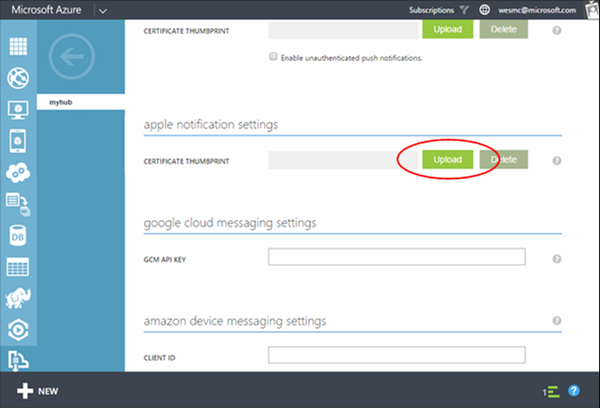
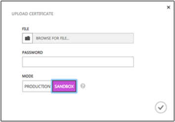

<properties
    pageTitle="Get started with Notification Hubs for Xamarin iOS apps | Microsoft Azure"
    description="In this tutorial, you learn how to use Azure Notification Hubs to send push notifications to a Xamarin iOS application."
    services="notification-hubs"
    documentationCenter="xamarin"
    authors="ysxu"
    manager="dwrede"
    editor=""/>

<tags
    ms.service="notification-hubs"
    ms.workload="mobile"
    ms.tgt_pltfrm="mobile-xamarin-ios"
    ms.devlang="dotnet"
    ms.topic="hero-article"
    ms.date="11/17/2015"
    ms.author="yuaxu"/>

# Get started with Notification Hubs
> [AZURE.SELECTOR]
- [Windows Runtime 8.1 universal](../articles/notification-hubs/notification-hubs-windows-store-dotnet-get-started.md)
- [Windows Phone Silverlight 8.x](../articles/notification-hubs/notification-hubs-windows-phone-get-started.md)
- [iOS](../articles/notification-hubs/notification-hubs-ios-get-started.md)
- [Android](../articles/notification-hubs/notification-hubs-android-get-started.md)
- [Kindle](../articles/notification-hubs/notification-hubs-kindle-get-started.md)
- [Baidu](../articles/notification-hubs/notification-hubs-baidu-get-started.md)
- [Xamarin.iOS](../articles/notification-hubs/partner-xamarin-notification-hubs-ios-get-started.md)
- [Xamarin.Android](../articles/notification-hubs/partner-xamarin-notification-hubs-android-get-started.md)
- [Chrome](../articles/notification-hubs/notification-hubs-chrome-get-started.md)

## Overview
This tutorial shows you how to use Azure Notification Hubs to send push notifications to an iOS application.
You'll create a blank Xamarin.iOS app that receives push notifications by using the Apple Push Notification Service (APNs). When you're finished, you'll be able to use your notification hub to broadcast push notifications to all the devices running your app. The finished code is available in the [NotificationHubs app](http://go.microsoft.com/fwlink/p/?LinkId=331329) sample.

This tutorial demonstrates the simple broadcast scenario in using Notification Hubs.

## Prerequisites
This tutorial requires the following:

* [Xcode 6.0](https://go.microsoft.com/fwLink/p/?LinkID=266532)
* An iOS 7.0 (or later version) capable device
* iOS Developer Program membership
* [Xamarin.iOS](http://xamarin.com/download)
* [Azure Mobile Services Component](http://components.xamarin.com/view/azure-mobile-services/)

  > [!NOTE]
> Because of configuration requirements for push notifications, you must deploy and test push notifications on an iOS capable device (iPhone or iPad) instead of in the simulator.
> 
> 

Completing this tutorial is a prerequisite for all other Notification Hubs tutorials for Xamarin.iOS apps.

> [!IMPORTANT]
> To complete this tutorial, you must have an active Azure account. If you don't have an account, you can create a free trial account in just a couple of minutes. For details, see [Azure Free Trial](https://azure.microsoft.com/pricing/free-trial/?WT.mc_id=A643EE910returnurl=http%3A%2F%2Fazure.microsoft.com%2Fen-us%2Fdocumentation%2Farticles%2Fpartner-xamarin-notification-hubs-ios-get-started).
> 
> 

##Generate the Certificate Signing Request file

The Apple Push Notification Service (APNS) uses certificates to authenticate your push notifications. Follow these instructions to create the necessary push certificate to send and receive notifications. For more information on these concepts see the official [Apple Push Notification Service](http://go.microsoft.com/fwlink/p/?LinkId=272584) documentation.

Generate the Certificate Signing Request (CSR) file, which is used by Apple to generate a signed push certificate.

1. On your Mac, run the Keychain Access tool. It can be opened from the **Utilities** folder or the **Other** folder on the launch pad.

2. Click **Keychain Access**, expand **Certificate Assistant**, then click **Request a Certificate from a Certificate Authority...**.

  	

3. Select your **User Email Address** and **Common Name** , make sure that **Saved to disk** is selected, and then click **Continue**. Leave the **CA Email Address** field blank as it is not required.

  	

4. Type a name for the Certificate Signing Request (CSR) file in **Save As**, select the location in **Where**, then click **Save**.

  	

  	This saves the CSR file in the selected location; the default location is in the Desktop. Remember the location chosen for this file.

Next, you will register your app with Apple, enable push notifications, and upload this exported CSR to create a push certificate.

##Register your app for push notifications

To be able to send push notifications to an iOS app, you must register your application with Apple and also register for push notifications.  

1. If you have not already registered your app, navigate to the <a href="http://go.microsoft.com/fwlink/p/?LinkId=272456" target="_blank">iOS Provisioning Portal</a> at the Apple Developer Center, log on with your Apple ID, click **Identifiers**, then click **App IDs**, and finally click on the **+** sign to register a new app.

   	

2. Update the following three fields for your new app and then click **Continue**:

	* **Name**: Type a descriptive name for your app in the **Name** field in the **App ID Description** section.
	
	* **Bundle Identifier**: Under the **Explicit App ID** section, enter a **Bundle Identifier** in the form `<Organization Identifier>.<Product Name>` as mentioned in the [App Distribution Guide](https://developer.apple.com/library/mac/documentation/IDEs/Conceptual/AppDistributionGuide/ConfiguringYourApp/ConfiguringYourApp.html#//apple_ref/doc/uid/TP40012582-CH28-SW8). The *Organization Identifier* and *Product Name* you use must match the organization identifier and product name you will use when you create your XCode project. In the screeshot below *NotificationHubs* is used as a organization idenitifier and *GetStarted* is used as the product name. Making sure this matches the values you will use in your XCode project will allow you to use the correct publishing profile with XCode. 
	
	* **Push Notifications**: Check the **Push Notifications** option in the **App Services** section, .

	

   	This generates your app ID and requests you to confirm the information. Click **Submit**

    

   	Once you click **Submit**, you will see the **Registration complete** screen, as shown below. Click **Done**.

    

3. In the Developer Center, under App IDs, locate the app ID that you just created, and click on its row.

   	

   	Clicking on the app ID will display the app details. Click the **Edit** button at the bottom.

   	

4. Scroll to the bottom of the screen, and click the **Create Certificate...** button under the section **Development Push SSL Certificate**.

   	

   	This displays the "Add iOS Certificate" assistant.

    > [AZURE.NOTE] This tutorial uses a development certificate. The same process is used when registering a production certificate. Just make sure that you use the same certificate type when sending notifications.

5. Click **Choose File**, browse to the location where you saved the CSR file that you created in the first task, then click **Generate**.

  	

6. After the certificate is created by the portal, click the **Download** button, and click **Done**.

  	

   	This downloads the certificate and saves it to your computer in your Downloads folder.

  	

    > [AZURE.NOTE] By default, the downloaded file a development certificate is named **aps_development.cer**.

7. Double-click the downloaded push certificate **aps_development.cer**.

   	This installs the new certificate in the Keychain, as shown below:

   	

    > [AZURE.NOTE] The name in your certificate might be different, but it will be prefixed with **Apple Development iOS Push Services:**.

8. In Keychain Access, right-click the new push certificate that you created in the **Certificates** category. Click **Export**, name the file, select the **.p12** format, and then click **Save**.

	

	Make a note of the file name and location of the exported .p12 certificate. It will be used to enable authentication with APNS.

	>[AZURE.NOTE] This tutorial creates a QuickStart.p12 file. Your file name and location might be different.

##Create a provisioning profile for the app

1. Back in the <a href="http://go.microsoft.com/fwlink/p/?LinkId=272456" target="_blank">iOS Provisioning Portal</a>, select **Provisioning Profiles**, select **All**, and then click the **+** button to create a new profile. This launches the **Add iOS Provisiong Profile** Wizard

   	

2. Select **iOS App Development** under **Development** as the provisiong profile type, and click **Continue**. 

3. Next, select the app ID you just created from the **App ID** drop-down list, and click **Continue**

   	

4. In the **Select certificates** screen, select your usual development certificate used for code signing, and click **Continue**. This is not the push certificate you just created.

   	

5. Next, select the **Devices** to use for testing, and click **Continue**

   	

6. Finally, pick a name for the profile in **Profile Name**, click **Generate**.

   	

7. When the new provisioning profile is created click to download it and install it on your Xcode development machine. Then click **Done**.

   	

## Configure your notification hub
This section walks you through creating a new notification hub and configuring authentication with APNS using the **.p12** push certificate that you created. If you want to use a notification hub that you have already created, you can skip to step 5.

1. Log on to the [Azure Classic Portal](https://manage.windowsazure.com/), and then click **+NEW** at the bottom of the screen.

2. Click on **App Services**, then **Service Bus**, then **Notification Hub**, then **Quick Create**.

   	

3. Enter a **Notification Hub Name**. Select your desired **region** and **subscription**. 
 
	If you already have a service bus namespace that you want create the hub in, select your **Namespace Name**.  Otherwise, you can use the default **Namespace Name** which will be created based on the hub name as long as the namespace name is available. 

	Click **Create a new Notification Hub**.

   	

4. Once the namespace and notification hub are created, your namespaces in service bus will be displayed. Click the namespace that you just created your hub in (usually ***notification hub name*-ns**). 

5. On your namespace page, click the **Notification Hubs** tab at the top, and then click on the notification hub you just created. This will open the dashboard for your new notification hub.

6. On the dashboard for your new hub click **View Connection String**. Take note of the two connection strings. You will use these later.

   	

	

<ol start="7">

<li>

Click the <b>Configure</b> tab at the top, and then click the <b>Upload</b> button in the Apple notification settings to upload the certificate thumbprint. Then select the <b>.p12</b> certificate that you exported earlier, and the password for the certificate.

Make sure to select <b>Sandbox</b> mode since this is for development. Only use the <b>Production</b> if you want to send push notifications to users who purchased your app from the store.

</li>
</ol>
&emsp;&emsp;

&emsp;&emsp;

Your notification hub is now configured to work with APNS, and you have the connection strings to register your app and send notifications.

## Connect your app to the notification hub
#### Create a new project
1. In Xamarin Studio, create a new iOS project and select the **Unified API** > **Single View Application** template.

       ![][31]
2. Add a reference to the Azure Messaging component. In the Solution view, right-click the **Components** folder for your project and choose **Get More Components**. Search for the **Azure Messaging** component and add the component to your project.

3. In **AppDelegate.cs**, add the following using statement:

        using WindowsAzure.Messaging;
4. Declare an instance of **SBNotificationHub**:

        private SBNotificationHub Hub { get; set; }
5. Create a **Constants.cs** class with the following variables:

        // Azure app-specific connection string and hub path
     public const string ConnectionString = "<Azure connection string>";
     public const string NotificationHubPath = "<Azure hub path>";

1. In **AppDelegate.cs**, update **FinishedLaunching()** to match the following:

        public override bool FinishedLaunching(UIApplication application, NSDictionary launchOptions)
     {
         if (UIDevice.CurrentDevice.CheckSystemVersion (8, 0)) {
             var pushSettings = UIUserNotificationSettings.GetSettingsForTypes (
                    UIUserNotificationType.Alert | UIUserNotificationType.Badge | UIUserNotificationType.Sound,
                    new NSSet ());

             UIApplication.SharedApplication.RegisterUserNotificationSettings (pushSettings);
             UIApplication.SharedApplication.RegisterForRemoteNotifications ();
         } else {
             UIRemoteNotificationType notificationTypes = UIRemoteNotificationType.Alert | UIRemoteNotificationType.Badge | UIRemoteNotificationType.Sound;
             UIApplication.SharedApplication.RegisterForRemoteNotificationTypes (notificationTypes);
         }

         return true;
     }
2. Override the **RegisteredForRemoteNotifications()** method in **AppDelegate.cs**:

        public override void RegisteredForRemoteNotifications(UIApplication application, NSData deviceToken)
     {
         Hub = new SBNotificationHub(Constants.ConnectionString, Constants.NotificationHubPath);

         Hub.UnregisterAllAsync (deviceToken, (error) => {
             if (error != null)
             {
                 Console.WriteLine("Error calling Unregister: {0}", error.ToString());
                 return;
             }

             NSSet tags = null; // create tags if you want
             Hub.RegisterNativeAsync(deviceToken, tags, (errorCallback) => {
                 if (errorCallback != null)
                     Console.WriteLine("RegisterNativeAsync error: " + errorCallback.ToString());
             });
         });
     }
3. Override the **ReceivedRemoteNotification()** method in **AppDelegate.cs**:

        public override void ReceivedRemoteNotification(UIApplication application, NSDictionary userInfo)
     {
         ProcessNotification(userInfo, false);
     }
4. Create the following **ProcessNotification()** method in **AppDelegate.cs**:

        void ProcessNotification(NSDictionary options, bool fromFinishedLaunching)
     {
         // Check to see if the dictionary has the aps key.  This is the notification payload you would have sent
         if (null != options && options.ContainsKey(new NSString("aps")))
         {
             //Get the aps dictionary
             NSDictionary aps = options.ObjectForKey(new NSString("aps")) as NSDictionary;

             string alert = string.Empty;

             //Extract the alert text
             // NOTE: If you're using the simple alert by just specifying
             // "  aps:{alert:"alert msg here"}  ", this will work fine.
             // But if you're using a complex alert with Localization keys, etc.,
             // your "alert" object from the aps dictionary will be another NSDictionary.
             // Basically the JSON gets dumped right into a NSDictionary,
             // so keep that in mind.
             if (aps.ContainsKey(new NSString("alert")))
                 alert = (aps [new NSString("alert")] as NSString).ToString();

             //If this came from the ReceivedRemoteNotification while the app was running,
             // we of course need to manually process things like the sound, badge, and alert.
             if (!fromFinishedLaunching)
             {
                 //Manually show an alert
                 if (!string.IsNullOrEmpty(alert))
                 {
                     UIAlertView avAlert = new UIAlertView("Notification", alert, null, "OK", null);
                     avAlert.Show();
                 }
             }
         }
     }

   > [!NOTE]
> You can choose to override **FailedToRegisterForRemoteNotifications()** to handle situations such as no network connection.
> 
> 
> 

1. Run the app on your device.

## Sending Notifications
You can test receiving notifications in your app by sending notifications in the [Azure Classic Portal](https://manage.windowsazure.com/) via the debug tab on the notification hub, as shown in the screen below.

Push notifications are normally sent in a back-end service like Mobile Services or ASP.NET using a compatible library. You can also use the REST API directly to send notification messages if a library is not available for your back-end. 

In this tutorial, we will keep it simple and just demonstrate testing your client app by sending notifications using the .NET SDK for notification hubs in a console application instead of a backend service. We recommend the [Use Notification Hubs to push notifications to users](notification-hubs-aspnet-backend-ios-notify-users.md) tutorial as the next step for sending notifications from an ASP.NET backend. However, the following approaches can be used for sending notifications:

* **REST Interface**:  You can support notification on any backend platform using  the [REST interface](http://msdn.microsoft.com/library/windowsazure/dn223264.aspx).

* **Microsoft Azure Notification Hubs .NET SDK**: In the Nuget Package Manager for Visual Studio, run [Install-Package Microsoft.Azure.NotificationHubs](https://www.nuget.org/packages/Microsoft.Azure.NotificationHubs/).

* **Node.js** : [How to use Notification Hubs from Node.js](notification-hubs-nodejs-how-to-use-notification-hubs.md).

* **Azure Mobile Services**: For an example of how to send notifications from an Azure Mobile Services backend that's integrated with Notification Hubs, see "Get started with push notifications in Mobile Services" ([.NET backend](../mobile-services/mobile-services-javascript-backend-windows-store-dotnet-get-started-push.md) | [JavaScript backend](../mobile-services/mobile-services-javascript-backend-windows-store-dotnet-get-started-push.md)).

* **Java / PHP**: For an example of how to send notifications by using the REST APIs, see "How to use Notification Hubs from Java/PHP" ([Java](notification-hubs-java-backend-how-to.md) | [PHP](notification-hubs-php-backend-how-to.md)).

#### (Optional) Send notifications from a .NET console app
In this section, we will send notifications by using a .NET console app

1. Create a new Visual C# console application:

       ![][213]
2. In Visual Studio, click **Tools**, click **NuGet Package Manager**, and then click **Package Manager Console**.

    This displays the Package Manager Console in Visual Studio.

3. In the Package Manager Console window, set the **Default project** to your new console application project, and then in the console window, execute the following command:

        Install-Package Microsoft.Azure.NotificationHubs

    This adds a reference to the Azure Notification Hubs SDK using the <a href="http://www.nuget.org/packages/Microsoft.Azure.NotificationHubs/">Microsoft.Azure.Notification Hubs NuGet package</a>.

    

1. Open the Program.cs file and add the following `using` statement:

        using Microsoft.Azure.NotificationHubs;
2. In your `Program` class, add the following method:

        private static async void SendNotificationAsync()
     {
         NotificationHubClient hub = NotificationHubClient.CreateClientFromConnectionString("<connection string with full access>", "<hub name>");
         var alert = "{\"aps\":{\"alert\":\"Hello from .NET!\"}}";
         await hub.SendAppleNativeNotificationAsync(alert);
     }
3. Add the following lines in your `Main` method:

         SendNotificationAsync();
      Console.ReadLine();
4. Press the F5 key to run the app. You should receive an alert on your device. If you are using Wi-Fi, make sure that your connection is working.

You can find all the possible payloads in the Apple [Local and Push Notification Programming Guide](http://developer.apple.com/library/mac/#documentation/NetworkingInternet/Conceptual/RemoteNotificationsPG/Chapters/ApplePushService.html#//apple_ref/doc/uid/TP40008194-CH100-SW1.md).

#### (Optional) Send notifications from a Mobile Service
In this section, we will send notifications using a mobile service through a node script.

To send a notification by using a mobile service, follow [Get started with Mobile Services](/develop/mobile/tutorials/get-started-xamarin-ios), and then:

1. Sign in to the [Azure Classic Portal](https://manage.windowsazure.com/), and select your mobile service.

2. Select the **Scheduler** tab on the top.

       ![][215]
3. Create a new scheduled job, insert a name, and select **On demand**.

       ![][216]
4. When the job is created, click the job name. Then click the **Script** tab on the top bar.

5. Insert the following script inside your scheduler function. Make sure to replace the placeholders with your notification hub name and the connection string for *DefaultFullSharedAccessSignature* that you obtained earlier. Click **Save**.

        var azure = require('azure');
     var notificationHubService = azure.createNotificationHubService('<Hubname>', '<SAS Full access >');
     notificationHubService.apns.send(
         null,
         {"aps":
             {
               "alert": "Hello from Mobile Services!"
             }
         },
         function (error)
         {
             if (!error) {
                 console.warn("Notification successful");
             }
         }
     );

1. Click **Run Once** on the bottom bar. You should receive an alert on your device.

## Next steps
In this simple example, you broadcasted notifications to all your iOS devices. In order to target specific users, refer to the tutorial [Use Notification Hubs to push notifications to users](/manage/services/notification-hubs/notify-users-aspnet). If you want to segment your users by interest groups, you can read [Use Notification Hubs to send breaking news](/manage/services/notification-hubs/breaking-news-dotnet). Learn more about how to use Notification Hubs in [Notification Hubs Guidance](http://msdn.microsoft.com/library/jj927170.aspx) and in the [Notification Hubs How-To for iOS](http://msdn.microsoft.com/library/jj927168.aspx).

<!-- Images. -->

[213]: ./media/partner-xamarin-notification-hubs-ios-get-started/notification-hub-create-console-app.png

[215]: ./media/partner-xamarin-notification-hubs-ios-get-started/notification-hub-scheduler1.png
[216]: ./media/partner-xamarin-notification-hubs-ios-get-started/notification-hub-scheduler2.png

[31]: ./media/partner-xamarin-notification-hubs-ios-get-started/notification-hub-create-ios-app.png

<!-- URLs. -->

[Mobile Services iOS SDK]: http://go.microsoft.com/fwLink/?LinkID=266533
[Submit an app page]: http://go.microsoft.com/fwlink/p/?LinkID=266582
[My Applications]: http://go.microsoft.com/fwlink/p/?LinkId=262039
[Live SDK for Windows]: http://go.microsoft.com/fwlink/p/?LinkId=262253

[Get started with Mobile Services]: /develop/mobile/tutorials/get-started-xamarin-ios
[Azure Classic Portal]: https://manage.windowsazure.com/
[Notification Hubs Guidance]: http://msdn.microsoft.com/library/jj927170.aspx
[Notification Hubs How-To for iOS]: http://msdn.microsoft.com/library/jj927168.aspx
[Install Xcode]: https://go.microsoft.com/fwLink/p/?LinkID=266532
[iOS Provisioning Portal]: http://go.microsoft.com/fwlink/p/?LinkId=272456

[Use Notification Hubs to push notifications to users]: /manage/services/notification-hubs/notify-users-aspnet
[Use Notification Hubs to send breaking news]: /manage/services/notification-hubs/breaking-news-dotnet

[Local and Push Notification Programming Guide]: http://developer.apple.com/library/mac/#documentation/NetworkingInternet/Conceptual/RemoteNotificationsPG/Chapters/ApplePushService.html#//apple_ref/doc/uid/TP40008194-CH100-SW1
[Apple Push Notification Service]: http://go.microsoft.com/fwlink/p/?LinkId=272584

[Azure Mobile Services Component]: http://components.xamarin.com/view/azure-mobile-services/
[GitHub]: http://go.microsoft.com/fwlink/p/?LinkId=331329
[Xamarin.iOS]: http://xamarin.com/download
[WindowsAzure.Messaging]: https://github.com/infosupport/WindowsAzure.Messaging.iOS
