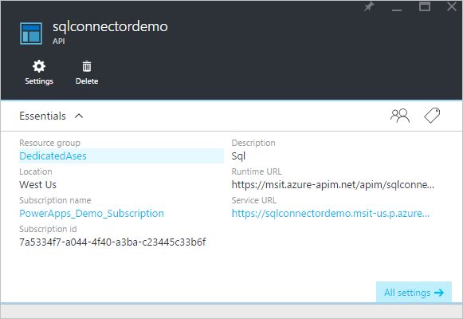
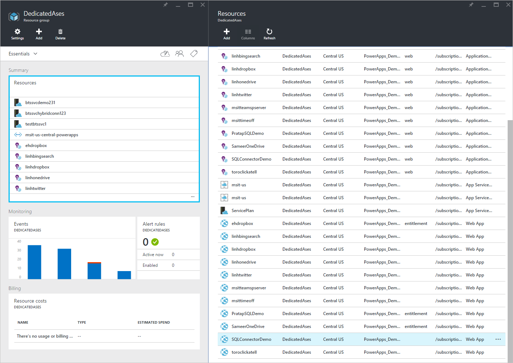
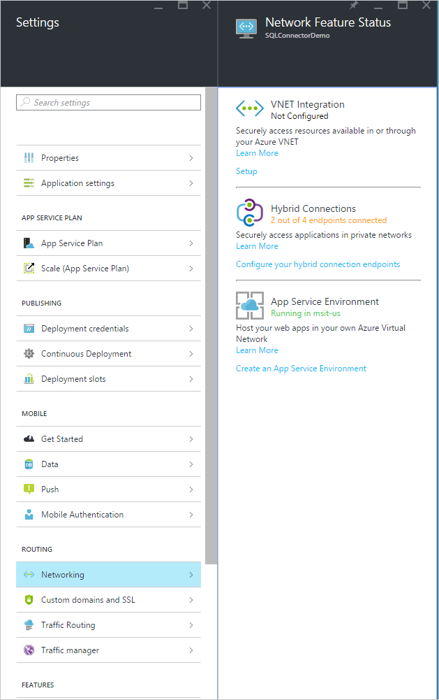
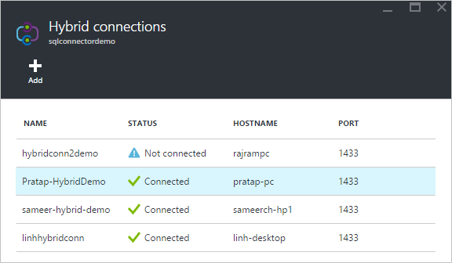
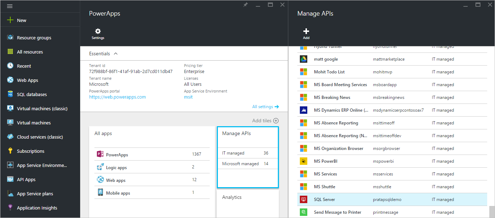
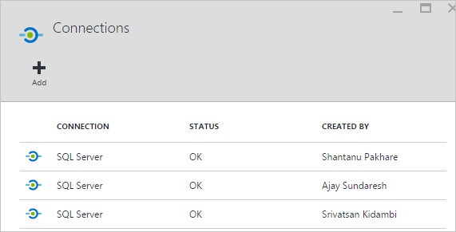

<properties
    pageTitle="Add the SQL Server API to PowerApps Enterprise | Microsoft Azure"
    description="Create or configure a new SQL Server API in your organization's app service environment and add connection to data on-premises"
    services=""
    suite="powerapps"
    documentationCenter="" 
    authors="linhtranms"
    manager="dwrede"
    editor=""/>

<tags
   ms.service="powerapps"
   ms.devlang="na"
   ms.topic="article"
   ms.tgt_pltfrm="na"
   ms.workload="na" 
   ms.date="11/25/2015"
   ms.author="litran"/>

# Create a new SQL Server API in your organization's app service environment
## Create the API in the Azure portal
1. In the [Azure portal](https://portal.azure.com/), sign-in with your work account. For example, sign-in with *yourUserName*@*YourCompany*.com. When you do this, you are automatically signed in to your company subscription. 
2. Select **Browse** in the task bar:  
![][14]  
3. In the list, you can scroll to find PowerApps or type in *powerapps*:  
![][15]  
4. In **PowerApps**, select **Manage APIs**.
5. In **Manage APIs**, select **Add** to add the new API.
6. Enter a descriptive **name** for your API. For example, you're adding the SQL Server API for demo, you can name it *SQLServerDemo*.      
7. In **Source**, select **Available APIs** to select the pre-built APIs, and select **SQL Server**. 
8. Select **OK** to complete the steps.

When finished, a new SQL Server API is added to your app service environment.

## Configure connectivity to SQL Server on-premises
You can connect to SQL Server on-premises. To establish this hybrid connectivity, you can leverage existing hybrid networking solutions in Azure, including:

* [ExpressRoute](../expressroute-introduction.md)
* [Site-to-site VPN](../vpn-gateway-create-site-to-site-rm-powershell.md)
* [Point-to-site connectivity](../vpn-gateway-point-to-site-create.md)  

  > [!NOTE]
> Every app service environment has a virtual  network associated with it. You can establish this network connectivity to this virtual network.  
* [Hybrid connections](../web-sites-hybrid-connection-get-started.md)  

  > [!NOTE]
> Every registered API in your app service environment has a corresponding web app. You can establish hybrid connections from this web app just like you can from any other web app.
> 
> 

The following example shows how to create a hybrid connection:  

1. Select the SQL Server API you just created and select the Resource group. In this example, select the API called *sqlconnectordemo*, and select the *DedicatedAses* Resource Group:  

2. Select the **Resources** tile, and then select the web app with the same name as your SQL Server API. In this example, select *sqlconnectordemo*:  

3. In **Settings**, select **Networking**. Select **Configure your hybrid connection endpoints**, and then follow [these instructions](../web-sites-hybrid-connection-get-started.md) to create the hybrid connection:  

Once your hybrid connection is created and connected, you have enabled the connection to your on-premises server. Next, create the connection to your data and give users access:  

## Create connection for SQL Server API
1. In the Azure portal, open PowerApps, and select **Manage APIs**. A list of the configured APIs is displayed:  

2. Select the API you want. In this example, select **SQLServerDemo**, and select **Connections**. 

3. In Connections, select **Add connection**:  

4. Enter a name for the connection and enter the connection string. Entering the connection string requires you to know some specific properties about the service you're connecting to. For example, if you're connecting to on-premises SQL Server, then you need to know the username, password, and other properties required to successfully make the connection. 

5. Select **Add** to save your changes.

## Summary and next steps
In this topic, you added the SQL Server API to connect to SQL Server on-premises. Next, give users access to the API so it can be added to their apps: 

[Add a connection and give users access](powerapps-manage-api-connection-user-access.md)

[14]: ./media/powerapps-create-api-sqlserver/browseall.png
[15]: ./media/powerapps-create-api-sqlserver/allresources.png