<properties
   pageTitle="Security health monitoring in Azure Security Center | Microsoft Azure"
   description="This document helps you to get started with monitoring capabilities in Azure Security Center."
   services="security-center"
   documentationCenter="na"
   authors="YuriDio"
   manager="swadhwa"
   editor=""/>

<tags
   ms.service="security-center"
   ms.devlang="na"
   ms.topic="article"
   ms.tgt_pltfrm="na"
   ms.workload="na"
   ms.date="01/29/2016"
   ms.author="yurid"/>

# Security health monitoring in Azure Security Center
This document helps you to use monitoring capabilities in Azure Security Center to monitor compliance with policies.

> [!NOTE]
> The information in this document applies to the preview release of Azure Security Center.
> 
> 
## What is Azure Security Center?
Azure Security Center helps you prevent, detect, and respond to threats with increased visibility into, and control over, the security of your Azure resources. It provides integrated security monitoring and policy management across your subscriptions, helps detect threats that might otherwise go unnoticed, and works with a broad ecosystem of security solutions

## What is security health monitoring?
We often think of monitoring as watching and waiting for an event to occur so that we can react to the situation. Security monitoring refers to having a proactive strategy that audits your resources to identify systems that do not meet organizational standards or best practices. 

## Monitoring security health
After enabling [security policies](security-center-policies.md) for the subscription’s resources, Azure Security Center will analyze the security of your resources to identify potential vulnerabilities.  While information about your network configuration is available instantly, it may take an hour or more for information about virtual machine configuration, such as security update status and OS configuration, to be available. You can view the security state of your resources, along with any issues in the **Resource Security Health** blade. You can also view a list of those issues on the **Recommendations** blade.

For more information on how to apply recommendations read [Implementing security recommendations in Azure Security Center](security-center-recommendations.md).

The **Resources health** tile allows you to monitor the security state of your resources. You will see a number of issues with high and medium severity that require attention as shown below:

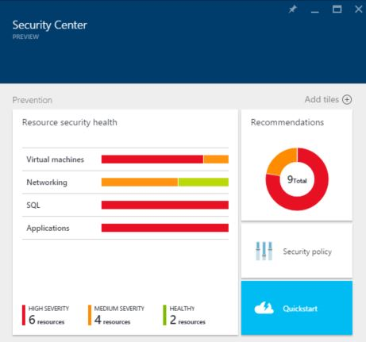

The security policies that are enabled will impact the types of controls being monitored here. If Azure Security Center identifies a vulnerability which needs to addressed, such as a VM with missing security updates or a subnet without a [Network Security Group](virtual-networks-nsg.md), it will be identified here. 

### Virtual machine
When you click on **Virtual Machines** in the **Resources health** tile, the **Virtual Machines** blade will open with more details about the onboarding and prevention steps as well as a list of all VMs monitored by Azure Security Center as shown below:

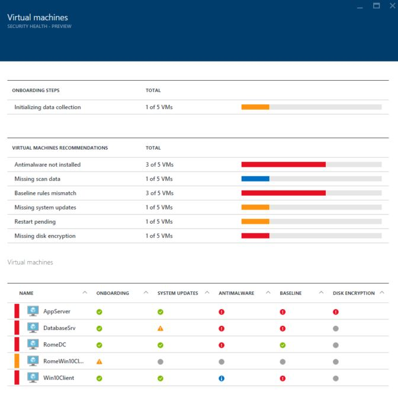

Once you open this blade you will see three sections:

* Onboarding steps
* Virtual machine recommendations
* Virtual machines

For each section you can select an individual option to see more details regarding the recommended step to address that issue. The sections below will cover these areas in more details.

#### Onboarding steps
This section shows the total amount of VMs that were initialized for data collection and its current status. Once each VM has data collection initialized, they will be ready to receive Azure Security Center security policies. When you click in this entry, the **Initializing data collection** blade opens and you will be able to see the name of the VMs and the current status of data collection as in the **installation status** column as shown below:

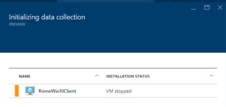

#### Virtual machine recommendations
This section has a set of recommendations for each VM monitored by Azure Security Center. The first column has the recommendation’s description, the second column the total amount of VMs that are affected by that recommendations and in the third column you have the severity as shown below:

Each recommendation has a set of actions that can be performed once you click on it. For example, if you click **Missing system updates**, the **Missing system updates** blade will open with the list of VMs that are missing patches and the severity level for each one as shown below:

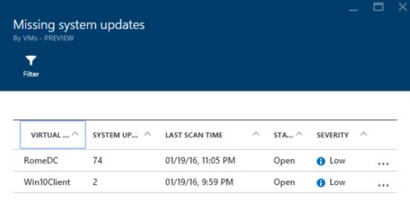

The Missing system updates blade will show a table with the following information:

* **VIRTUAL MACHINE**: the name of the virtual machine that is missing updates.
* **SYSTEM UPDATES**: the amount of system updates that are missing.
* **LAST SCAN TIME**: last time Azure Security Center scanned the VM for updates.
* **STATE**: the current state of the recommendation:   * **Open**: not addressed yet
* **In Progress**: recommendation is currently being applied to those resources, no action is required by you
* **Resolved**: recommendation was already completed (when state is resolved, the color of the line is grayed out)

* **SEVERITY**: describes the severity of that particular recommendation:   * **High**: a vulnerability exists with a meaningful resource (application, VM, network security group) and requires attention
* **Medium**: non-critical or additional steps required to complete a process or eliminate a vulnerability
* **Low**: a vulnerability that should be addressed but does not require immediate attention. (By default, a low recommendation is not presented but you can filter on Low recommendations if you choose to view them.)

To view the recommended updates details, click the VM’s name. A new blade for that VM opens up with the list of updates that are missing as shown below:

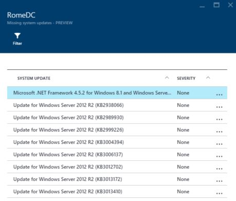

> [!NOTE]
> The security recommendations here are the same as those in the Recommendations blade. See the article [Implementing security recommendations in Azure Security Center](security-center-recommendations.md) for more information on resolving recommendations. This is applicable not only for VMs, but for all resources that are available in the Resource Health tile.
> 
> 
#### Virtual machines
The virtual machines section gives you an overview of all VMs and recommendations. Each recommendation column represents one set of recommendations as shown below:

The icon that appears under each recommendation helps you to quickly identify which VMs need attention and for what type of recommendation. 

In the example above, one VM has a critical recommendation regarding antimalware. To obtain more information about the VM, click on it and a new blade that represents this VM will open as shown below:

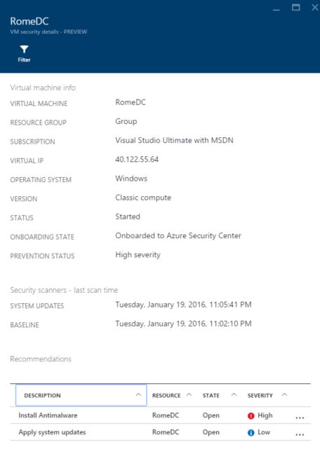

This blade has the security details for the VM. At the bottom of this blade you can see the recommended action and the severity of each recommendation.

### Networking
The prevention status for networking shows the virtual networks monitored by Azure Security Center. When you click on **Networking** in the Resources health tile, the **Networking** blade will open with more details as shown below:

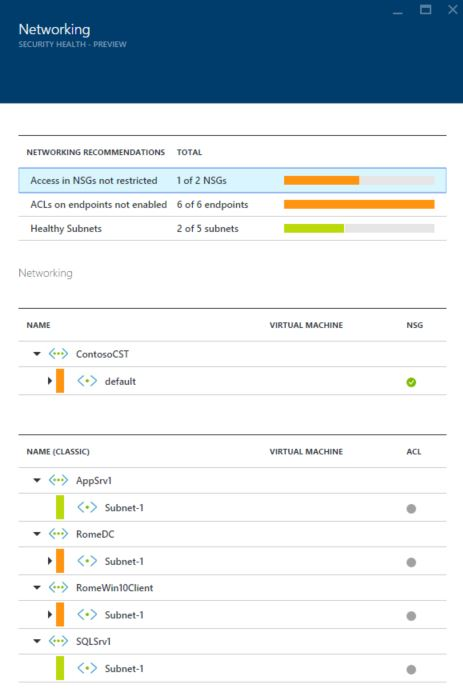

Once you open this blade you will see two sections:

* Networking recommendations
* Networking

For each section you can select an individual option to see more details regarding the recommended step to address that issue. The sections below will cover these areas in more detail.

#### Networking recommendations
Similar to the virtual machines resource health information, this blade provides a summarized list of issues on the top of the blade and a list of monitored networks on the bottom.

In the networking status breakdown section, prevention steps such as [ACLs on endpoints](virtual-machines-set-up-endpoints.md) not enabled, [Network Security Groups](virtual-networks-nsg.md) not enabled, Healthy Subnets and **Access in NSG not restricted** are listed. When you click in one of those recommendations a new blade will open with more details regarding the recommendation as shown in the example below:

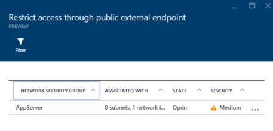 

In this example the **Restrict access through public external endpoint** blade has a list of Network Security Groups (NSG) that are part of this alert, the subnet and network in which this NSG is associated with, the current state of this recommendation and the severity. If you click on the network security group, another blade will open as shown below:

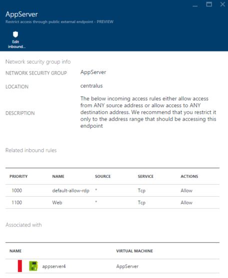

This blade has the network security group information, location and the list of inbound rules that are currently enabled. The bottom part of this blade has the VM that is associated with this network security group. If you want to enable the inbound rules to block an undesired port that is currently opened or change source of the current inbound rule you can click in **Edit inbound rule** button on the top of the blade.

#### Networking
Under the **Networking** section you have a hierarchical view of resource group, subnet and network interface associated with your VM as shown below:

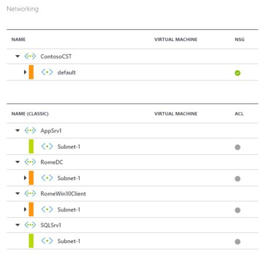

This section divides [Resource Manager based VMs from Classic VMs](resource-manager-deployment-model.md), this helps you to quickly identify if Azure Service Management (ASM/Classic) or Azure Resource Management (ARM) networking capabilities are available to the virtual machine. If you decide to access the properties of a network interface card from this location, you will need to expand the subnet and click on the VM name. If you perform this action for a resource manager based VM, a new blade similar to the one below will appear:

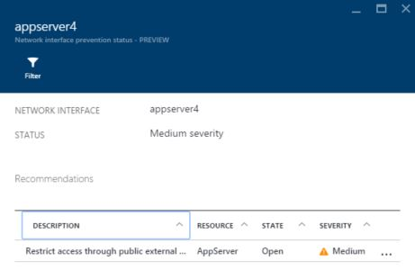

This blade has a summary of the network interface card and the current recommendations for it. If the VM that you selected is a classic VM, a new blade with different options will appear as shown below:

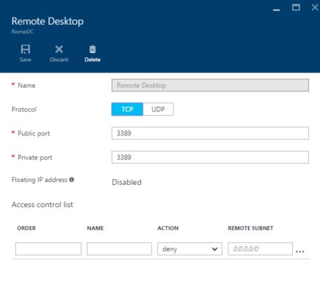

This blade allows you to make changes to the public port, private port and allows you to create an ACL for this VM.

### SQL
When you click in **SQL** in the **Resources health** tile, the SQL blade will open with recommendations related to issues such as auditing not enabled, transparent data encryption not enabled and the database’s general health state. 

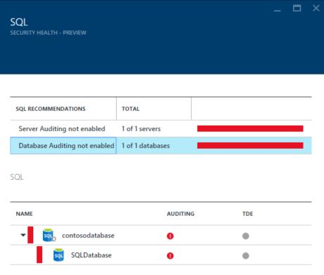

You can click on any one of these recommendations and get more details and to take further actions to resolve the issue. The example below has the expansion of the **Database Auditing not enabled** recommendation.

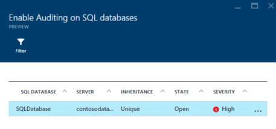

In the **Enable Auditing on SQL databases** blade you have a list of SQL databases, the server on which they are located, if this setting was inherited from the server or if it is unique in this database, the current state of this issue and the severity. When you click on the database to address this recommendation, the **Auditing & Threat detection** blade will open as shown below:

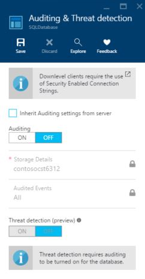

To enable this capability, simply select **ON** under **Auditing** option and then click **Save**.

### Applications
If your Azure workload has applications located in [resource manager VMs](resource-manager-deployment-model.md) with exposed web ports (TCP ports 80 and 443), Azure Security Center can monitor those to identify potential security issues and recommend remediation steps. When you click in the **Applications** tile, the **Applications** blade will open up with a series of recommendations in the prevention steps section and it also shows the application breakdown per host/virtual IP as shown below:

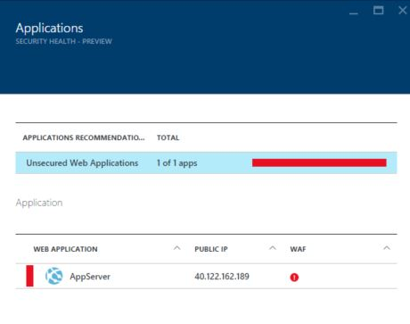

Just like any of the other recommendations for the previous resources, you can click on it to see more details about the issue and how to remediate. The example shown in figure below is an application that was identified as **Unsecure Web Application**. When you select the application that was considered not secure, another blade will open with the following option available:

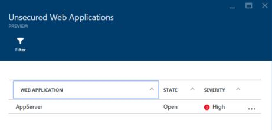

The **Unsecured Web Applications** blade will have a list of all VMs that contains applications that are not considered secure. The list shows the VM name, the current state of the issue and the security. If you click on this web application, the **Add a Web Application Firewall** blade will open with options for you to install a third party WAF (Web Application Firewall) as shown below:

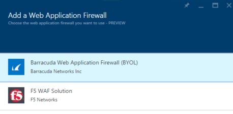

## Next steps
In this document, you learned how to use monitoring capabilities in Azure Security Center. To learn more about Azure Security Center, see the following:

* [Setting security policies in Azure Security Center](security-center-policies.md)
– Learn how to configure security settings in Azure Security Center
* [Managing and responding to security alerts in Azure Security Center](security-center-managing-and-responding-alerts.md) - Learn how to manage and respond to security alerts
* [Azure Security Center FAQ](security-center-faq.md) – Find frequently asked questions about using the service
* [Azure Security Blog](http://blogs.msdn.com/b/azuresecurity/) – Find blog posts about Azure security and compliance

