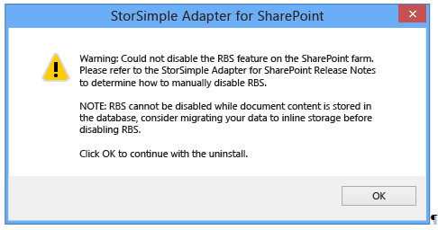
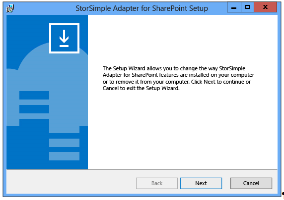
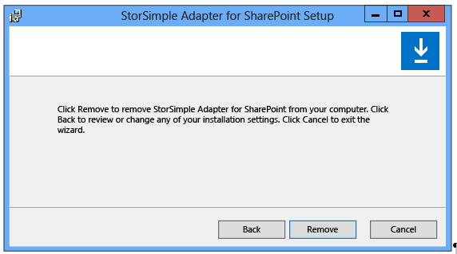

<properties 
   pageTitle="StorSimple Adapter for SharePoint | Microsoft Azure"
   description="Describes how to install and configure or remove the StorSimple Adapter for SharePoint in a SharePoint server farm."
   services="storsimple"
   documentationCenter="NA"
   authors="SharS"
   manager="carolz"
   editor="" />

<tags 
   ms.service="storsimple"
   ms.devlang="NA"
   ms.topic="article"
   ms.tgt_pltfrm="NA"
   ms.workload="TBD"
   ms.date="01/14/2016"
   ms.author="v-sharos" />

# Install and configure the StorSimple Adapter for SharePoint
## Overview
The StorSimple Adapter for SharePoint is a component that lets you provide Microsoft Azure StorSimple flexible storage and data protection to SharePoint server farms. You can use the adapter to move Binary Large Object (BLOB) content from the SQL Server content databases to the Microsoft Azure StorSimple hybrid cloud storage device.

The StorSimple Adapter for SharePoint functions as a Remote BLOB Storage (RBS) provider and uses the SQL Server Remote BLOB Storage feature to store unstructured SharePoint content (in the form of BLOBs) on a file server that is backed by a StorSimple device.

> [!NOTE]
> The StorSimple Adapter for SharePoint supports SharePoint Server 2010 Remote BLOB Storage (RBS). It does not support SharePoint Server 2010 External BLOB Storage (EBS).
> 
> 
* To download the StorSimple Adapter for SharePoint, go to [StorSimple Adapter for SharePoint](https://www.microsoft.com/download/details.aspx?id=44073) in the Microsoft Download Center.

* For information about planning for RBS and RBS limitations, go to [Deciding to use RBS in SharePoint 2013](https://technet.microsoft.com/library/ff628583(v=office.15).aspx) or [Plan for RBS (SharePoint Server 2010)](https://technet.microsoft.com/library/ff628583(v=office.14).aspx).

The rest of this overview briefly describes the role of the StorSimple Adapter for SharePoint and the SharePoint capacity and performance limits that you should be aware of before you install and configure the adapter. After you review this information, go to [StorSimple Adapter for SharePoint installation](#storsimple-adapter-for-sharepoint-installation.md) to begin setting up the adapter.

### StorSimple Adapter for SharePoint benefits
In a SharePoint site, content is stored as unstructured BLOB data in one or more content databases. By default, these databases are hosted on computers that are running SQL Server and are located in the SharePoint server farm. BLOBs can rapidly increase in size, consuming large amounts of on-premises storage. For this reason, you might want to find another, less-expensive storage solution. SQL Server provides a technology called Remote Blob Storage (RBS) that lets you store BLOB content in the file system, outside the SQL Server database. With RBS, BLOBs can reside in the file system on the computer that is running SQL Server, or they can be stored in the file system on another server computer.

RBS requires that you use an RBS provider, such as the StorSimple Adapter for SharePoint, to enable RBS in SharePoint. The StorSimple Adapter for SharePoint works with RBS, letting you move BLOBs to a server backed up by the Microsoft Azure StorSimple system. Microsoft Azure StorSimple then stores the BLOB data locally or in the cloud, based on usage. BLOBs that are very active (typically referred to as Tier 1 or hot data) reside locally. Less active data and archival data reside in the cloud. After you enable RBS on a content database, any new BLOB content created in SharePoint is stored on the StorSimple device and not in the content database.

The Microsoft Azure StorSimple implementation of RBS provides the following benefits:

* By moving BLOB content to a separate server, you can reduce the query load on SQL Server, which can improve SQL Server responsiveness. 

* Azure StorSimple uses deduplication and compression to reduce data size.

* Azure StorSimple provides data protection in the form of local and cloud snapshots. Also, if you place the database itself on the StorSimple device, you can back up the content database and BLOBs together in a crash consistent way. (Moving the content database to the device is only supported for the StorSimple 8000 series device. This feature is not supported for the 5000 or 7000 series.)

* Azure StorSimple includes disaster recovery features including failover, file and volume recovery (including test recovery), and rapid restoration of data.

* You can use data recovery software, such as Kroll Ontrack PowerControls, with StorSimple snapshots of BLOB data to perform item-level recovery of SharePoint content. (This data recovery software is a separate purchase.)

* The StorSimple Adapter for SharePoint plugs into the SharePoint Central Administration portal, allowing you to manage your entire SharePoint solution from a central location.

Moving BLOB content to the file system can provide other cost savings and benefits. For example, using RBS can reduce the need for expensive Tier 1 storage and, because it shrinks the content database, RBS can reduce the number of databases required in the SharePoint server farm. However, other factors, such as database size limits and the amount of non-RBS content, can also affect storage requirements. For more information about the costs and benefits of using RBS, see [Plan for RBS (SharePoint Foundation 2010)](https://technet.microsoft.com/library/ff628569(v=office.14).aspx) and [Deciding to use RBS in SharePoint 2013](https://technet.microsoft.com/library/ff628583(v=office.15).aspx).

### Capacity and performance limits
Before you consider using RBS in your SharePoint solution, you should be aware of the tested performance and capacity limits of SharePoint Server 2010 and SharePoint Server 2013, and how these limits relate to acceptable performance. For more information, see [Software Boundaries and Limits for SharePoint 2013](https://technet.microsoft.com/library/cc262787.aspx).

Review the following before you configure RBS:

* Make sure that the total size of the content (the size of a content database plus the size of any associated externalized BLOBs) does not exceed the RBS size limit supported by SharePoint. This limit is 200 GB. 

    **To measure content database and BLOB size**

  1. Run this query on the Central Administration WFE. Start the SharePoint Management Shell, and then enter the following Windows PowerShell command to get the size of the content databases:

   `Get-SPContentDatabase | Select-Object -ExpandProperty DiskSizeRequired`

    This step gets the size of the content database on the disk.

2. Run one of the following SQL queries in SQL Management Studio on the SQL server box on each content database, and add the result to the number obtained in step 1.

   On SharePoint 2013 content databases, enter:

   `SELECT SUM([Size]) FROM [ContentDatabaseName].[dbo].[DocStreams] WHERE [Content] IS NULL`

   On SharePoint 2010 content databases, enter:

   `SELECT SUM([Size]) FROM [ContentDatabaseName].[dbo].[AllDocs] WHERE [Content] IS NULL`

   This step gets the size of the BLOBs that have been externalized.

* We recommend that you store all BLOB and database content locally on the StorSimple device. The StorSimple device is a two-node cluster for high availability. Placing the content databases and BLOBs on the StorSimple device provides high availability.

    Use traditional SQL Server migration best practices to move the content database to the StorSimple device. Move the database only after all BLOB content from the database has been moved to the file share via RBS. If you choose to move the content database to the StorSimple device, we recommend that you configure the content database storage on the device as a primary volume.

* In Microsoft Azure StorSimple, there is no way to guarantee that content stored locally on the StorSimple device will not be tiered to Microsoft Azure cloud storage. To ensure that the content database remains on the StorSimple device and is not moved to Microsoft Azure (which would adversely affect SharePoint transaction response times), it is important to understand and manage the other workloads on the StorSimple device. We recommend that you do not configure a StorSimple device to host workloads that have a high rate of data writes if the device is already hosting SharePoint content database workloads and SharePoint file share workloads.

* If you do not store the content databases on the StorSimple device, use traditional SQL Server high availability best practices that support RBS. SQL Server clustering supports RBS, while SQL Server mirroring does not. 

> [!WARNING]
> If you have not enabled RBS, we do not recommend moving the content database to the StorSimple device. This is an untested configuration.
> 
> 
## StorSimple Adapter for SharePoint installation
Before you can install the StorSimple Adapter for SharePoint, you must configure the StorSimple device and make sure that the SharePoint server farm and SQL Server instantiation meet all prerequisites. This tutorial describes configuration requirements, as well as procedures for installing and upgrading the StorSimple Adapter for SharePoint. 

## Configure prerequisites
Before you can install the StorSimple Adapter for SharePoint, make sure that the StorSimple device, SharePoint server farm, and SQL Server instantiation meet the following prerequisites.

### System requirements
The StorSimple Adapter for SharePoint works with the following hardware and software:

* Supported operating system – Windows Server 2008 R2 SP1, Windows Server 2012, or Windows Server 2012 R2 

* Supported SharePoint versions – SharePoint Server 2010 or SharePoint Server 2013

* Supported SQL Server versions – SQL Server 2008 Enterprise Edition, SQL Server 2008 R2 Enterprise Edition, or SQL Server 2012 Enterprise Edition

* Supported StorSimple devices – StorSimple 8000 series, StorSimple 7000 series, or StorSimple 5000 series.

### StorSimple device configuration prerequisites
The StorSimple device is a block device and as such requires a file server on which the data can be hosted. We recommend that you use a separate server rather than an existing server from the SharePoint farm. This file server must be on the same local area network (LAN) as the SQL Server computer that hosts the content databases. 

> [!TIP]
> 
> * If you configure your SharePoint farm for high availability, you should deploy the file server for high availability also.
> 
> * If you do not store the content database on the StorSimple device, use traditional high availability best practices that support RBS. SQL Server clustering supports RBS, while SQL Server mirroring does not. 
> 
> 
> 
Make sure that your StorSimple device is configured correctly, and that appropriate volumes to support your SharePoint deployment are configured and accessible from your SQL Server computer. Go to [Deploy your on-premises StorSimple device](storsimple-deployment-walkthrough.md) if you have not yet deployed and configured your StorSimple device. Note the IP address of the StorSimple device; you will need it during StorSimple Adapter for SharePoint installation. 

In addition, make sure that the volume to be used for BLOB externalization meets the following requirements:

* The volume must be formatted with a 64 KB allocation unit size.

* Your web front end (WFE) and application servers must be able to access the volume via a Universal Naming Convention (UNC) path. 

* The SharePoint server farm must be configured to write to the volume.

> [!NOTE]
> After you install and configure the adapter, all BLOB externalization must go through the StorSimple device (the device will present the volumes to SQL Server and manage the storage tiers). You cannot use any other targets for BLOB externalization.
> 
> 
If you plan to use StorSimple Snapshot Manager to take snapshots of the BLOB and database data, be sure to install StorSimple Snapshot Manager on the database server so that it can use the SQL Writer Service to implement the Windows Volume Shadow Copy Service (VSS). 

> [!IMPORTANT]
> StorSimple Snapshot Manager does not support the SharePoint VSS Writer and cannot take application-consistent snapshots of SharePoint data. In a SharePoint scenario, StorSimple Snapshot Manager provides only crash-consistent backups. 
> 
> 
## SharePoint farm configuration prerequisites
Make sure that your SharePoint server farm is correctly configured, as follows:

* Verify that your SharePoint server farm is in a healthy state, and check the following: 

* All SharePoint WFE and application servers registered in the farm are running and can be pinged from the server on which you will be installing the StorSimple Adapter for SharePoint.

* The SharePoint Timer service (SPTimerV3 or SPTimerV4) is running on each WFE server and application server.

* Both the SharePoint Timer service and the IIS application pool under which the SharePoint Central Administration site is running have administrative privileges. 

* Make sure that Internet Explorer Enhanced Security Context (IE ESC) is disabled. Follow these steps to disable IE ESC:

  1. Close all instances of Internet Explorer.

2. Start the Server Manager.

3. In the left pane, click **Local Server**.

4. On the right pane, next to **IE Enhanced Security Configuration**, click **On**.

5. Under **Administrators**, click **Off**.

6. Click **OK**.

## Remote BLOB Storage (RBS) prerequisites
Make sure that you are using a supported version of SQL Server. Only the following versions are supported and able to use RBS:

* SQL Server 2008 Enterprise Edition

* SQL Server 2008 R2 Enterprise Edition

* SQL Server 2012 Enterprise Edition

BLOBs can be externalized on only those volumes that the StorSimple device presents to SQL Server. No other targets for BLOB externalization are supported.

When you have completed all prerequisite configuration steps, go to [Install the StorSimple Adapter for SharePoint](#install-the-storsimple-adapter-for-sharepoint.md).

## Install the StorSimple Adapter for SharePoint
Use the following steps to install the StorSimple Adapter for SharePoint. If you are reinstalling the software, see [Upgrade or reinstall the StorSimple Adapter for SharePoint](#upgrade-or-reinstall-the-storsimple-adapter-for-sharepoint.md). The time required for the installation depends on the total number of SharePoint databases in your SharePoint server farm.

<!--author=SharS last changed: 9/17/15-->

#### To install the StorSimple Adapter for SharePoint

1. Copy the installer to the web front end (WFE) server that is also configured to run the SharePoint Central Administration web application. 

2. Use an account with administrator privileges to log on to the WFE server.

3. Double-click the installer. The StorSimple Adapter for SharePoint Setup Wizard starts. Click **Next** to begin the installation.

    

4. In the StorSimple Adapter for SharePoint setup configuration page, select an installation location, type the IP address for the DATA 0 network interface on your StorSimple device, and then click **Next**. 

     

5. In the setup confirmation page, click **Install**.

     

6. Click **Finish** to close the Setup Wizard.

     

7. Open the SharePoint Central Administration page. You should see a StorSimple Configuration group that contains the StorSimple Adapter for SharePoint links.

8. Go to the next step: [Configure RBS](#configure-rbs).

## Configure RBS
After you install the StorSimple Adapter for SharePoint, configure RBS as described in the following procedure.

> [!TIP]
> The StorSimple Adapter for SharePoint plugs into the SharePoint Central Administration page, allowing RBS to be enabled or disabled on each content database in the SharePoint farm. However, enabling or disabling RBS on the content database causes an IIS reset, which, depending on your farm configuration, can momentarily disrupt the availability of the SharePoint web front end (WFE). (Factors such as the use of a front-end load balancer, the current server workload, and so on, can limit or eliminate this disruption.) To protect users from a disruption, we recommend that you enable or disable RBS only during a planned maintenance window.
> 
> 
<!--author=SharS last changed: 1/14/2016 -->

>[AZURE.NOTE] When making changes to the StorSimple Adapter for SharePoint RBS configuration, you must be logged on with a user account that belongs to the Domain Admins group. Additionally, you must access the configuration page from a browser running on the same host as Central Administration.

#### To configure RBS

1. Open the SharePoint Central Administration page, and browse to **System Settings**. 

2. In the **Azure StorSimple** section, click **Configure StorSimple Adapter**.

     

3. On the **Configure StorSimple Adapter** page:

    1. Make sure that the **Enable editing path** check box is selected.

    2. In the text box, type the Universal Naming Convention (UNC) path of the BLOB store.

          >[AZURE.NOTE] The BLOB store volume must be hosted on an iSCSI volume configured on the StorSimple device.

    3. Click the **Enable** button below each of the content databases that you want to configure for remote storage.

          >[AZURE.NOTE] The BLOB store must be shared and reachable by all web front-end (WFE) servers, and the user account that is configured for the SharePoint server farm must have access to the share.

          

           When you enable or disable RBS, you will also see the following message.

          

    4. Click the **Update** button to apply the configuration. When you click the **Update** button, the RBS configuration status will be updated on all WFE servers, and the entire farm will be RBS-enabled. The following message appears.

           

           >[AZURE.NOTE] If you are configuring RBS for a SharePoint farm with a very large number of databases (greater than 200), the SharePoint Central Administration web page might time out. If that occurs, refresh the page. This does not affect the configuration process.
 
4. Verify the configuration:

    1. Log on to the SharePoint Central Administration website, and browse to the **Configure StorSimple Adapter** page.

    2. Check the configuration details to make sure that they match the settings that you entered. 

5. Verify that RBS works correctly:

    1. Upload a document to SharePoint. 

    2. Browse to the UNC path that you configured. Make sure that the RBS directory structure was created and that it contains the uploaded object.

6. (Optional) You can use the Microsoft RBS `Migrate()` PowerShell cmdlet included with SharePoint to migrate existing BLOB content to the StorSimple device. For more information, see [Migrate content into or out of RBS in SharePoint 2013][6] or [Migrate content into or out of RBS (SharePoint Foundation 2010)][7].

7. (Optional) On test installations, you can verify that the BLOBs were moved out of the content database as follows: 

    1. Start SQL Management Studio.

    2. Run the ListBlobsInDB_2010.sql or ListBlobsInDB_2013.sql query, as follows.

     **ListBlobsInDB_2013.sql**

         USE WSS_Content
         GO
    
         SELECT DocStreams.DocId,
                LeafName AS Name,
                Content,
                AllDocs.Size AS OrigSizeOfContent,
                LEN(CAST(Content AS VARBINARY(MAX))) AS SizeOfContentInDB,
                DocStreams.RbsId,
                TimeLastModified
    
         FROM DocStreams
              INNER JOIN AllDocs ON DocStreams.DocId = AllDocs.Id
         ORDER BY TimeLastModified DESC
         GO

     **ListBlobsInDB_2010.sql**

         USE WSS_Content
         GO

         SELECT AllDocStreams.Id,
                LeafName AS Name,
                Content,
                AllDocs.Size AS OrigSizeOfContent,
                LEN(CAST(Content AS VARBINARY(MAX))) AS SizeOfContentInDB,
                RbsId,
                TimeLastModified
         FROM AllDocStreams
              INNER JOIN AllDocs ON AllDocStreams.Id = AllDocs.Id
         ORDER BY TimeLastModified DESC
         GO

     If RBS was configured correctly, a NULL value should appear in the SizeOfContentInDB column for any object that was uploaded and successfully externalized with RBS.

8. (Optional) After you configure RBS and move all BLOB content to the StorSimple device, you can move the content database to the device. If you choose to move the content database, we recommend that you configure the content database storage on the device as a primary volume. Then, use established SQL Server best practices to migrate the content database to the StorSimple device. 

     >[AZURE.NOTE] Moving the content database to the device is only supported for the StorSimple 8000 series (it is not supported for the 5000 or 7000 series).
 
     If you store BLOBs and the content database in separate volumes on the StorSimple device, we recommend that you configure them in the same volume container. This ensures that they will be backed up together.

       >[AZURE.WARNING] If you have not enabled RBS, we do not recommend moving the content database to the StorSimple device. This is an untested configuration.
 
9. Go to the next step: [Configure garbage collection](#configure-garbage-collection).

[6]: https://technet.microsoft.com/library/ff628254(v=office.15).aspx
[7]: https://technet.microsoft.com/library/ff628255(v=office.14).aspx

## Configure garbage collection
When objects are deleted from a SharePoint site, they are not automatically deleted from the RBS store volume. Instead, an asynchronous, background maintenance program deletes orphaned BLOBs from the file store. System administrators can schedule this process to run periodically or they can start it whenever necessary.

This maintenance program (Microsoft.Data.SqlRemoteBlobs.Maintainer.exe) is automatically installed on all SharePoint WFE servers and application servers when you enable RBS. The program is installed in the following location: *boot drive*:\Program Files\Microsoft SQL Remote Blob Storage 10.50\Maintainer\

For information about configuring and using the maintenance program, see [Maintain RBS in SharePoint Server 2013](https://technet.microsoft.com/en-us/library/ff943565.aspx).

> [!IMPORTANT]
> The RBS maintainer program is resource intensive. You should schedule it to run only during periods of light activity on the SharePoint farm.
> 
> 
### Delete orphaned BLOBs immediately
If you need to delete orphaned BLOBs immediately, you can use the following instructions. Note that these instructions are an example of how this can be done in a SharePoint 2013 environment with the following components:

* The content database name is WSS_Content.
* The SQL Server name is SHRPT13-SQL12\SHRPT13.
* The web application name is SharePoint – 80.

<!--author=SharS last changed: 9/17/15-->

In this procedure, you will:

1. [Prepare to run the Maintainer executable](#to-prepare-to-run-the-maintainer) .

2. [Prepare the content database and Recycle Bin for immediate deletion of orphaned BLOBs](#to-prepare-the-content-database-and-recycle-bin-to-immediately-delete-orphaned-blobs).

3. [Run Maintainer.exe](#to-run-the-maintainer).

4. [Revert the content database and Recycle Bin settings](#to-revert-the-content-database-and-recycle-bin-settings).

#### To prepare to run the Maintainer

1. On the Web front-end server, open the SharePoint 2013 Management Shell as an administrator.

2. Navigate to the folder *boot drive*:\Program Files\Microsoft SQL Remote Blob Storage 10.50\Maintainer\.

3. Rename **Microsoft.Data.SqlRemoteBlobs.Maintainer.exe.config** to **web.config**.

4. Use `aspnet_regiis -pdf connectionStrings` to decrypt the web.config file.

5. In the decrypted web.config file, under the `connectionStrings` node, add the connection string for your SQL server instance and the content database name. See the following example.

    `<add name=”RBSMaintainerConnectionWSSContent” connectionString="Data Source=SHRPT13-SQL12\SHRPT13;Initial Catalog=WSS_Content;Integrated Security=True;Application Name=&quot;Remote Blob Storage Maintainer for WSS_Content&quot;" providerName="System.Data.SqlClient" />`

6. Use `aspnet_regiis –pef connectionStrings` to re-encrypt the web.config file. 

7. Rename web.config to Microsoft.Data.SqlRemoteBlobs.Maintainer.exe.config. 

#### To prepare the content database and Recycle Bin to immediately delete orphaned BLOBs

1. On the SQL Server, in SQL Management Studio, run the following update queries for the target content database: 

       `use WSS_Content`

       `exec mssqlrbs.rbs_sp_set_config_value ‘garbage_collection_time_window’ , ’time 00:00:00’`

       `exec mssqlrbs.rbs_sp_set_config_value ‘delete_scan_period’ , ’time 00:00:00’`

2. On the web front-end server, under **Central Administration**, edit the **Web Application General Settings** for the desired content database to temporarily disable the Recycle Bin. This action will also empty the Recycle Bin for any related site collections. To do this, click **Central Administration** -> **Application Management** -> **Web Applications (Manage web applications)** -> **SharePoint - 80** -> **General Application Settings**. Set the **Recycle Bin Status** to **OFF**.

    

#### To run the Maintainer

- On the web front-end server, in the SharePoint 2013 Management Shell, run the Maintainer as follows:

      `Microsoft.Data.SqlRemoteBlobs.Maintainer.exe -ConnectionStringName RBSMaintainerConnectionWSSContent -Operation GarbageCollection -GarbageCollectionPhases rdo`

    >[AZURE.NOTE] Only the `GarbageCollection` operation is supported for StorSimple at this time. Also note that the parameters issued for Microsoft.Data.SqlRemoteBlobs.Maintainer.exe are case sensitive. 
 
#### To revert the content database and Recycle Bin settings

1. On the SQL Server, in SQL Management Studio, run the following update queries for the target content database:

      `use WSS_Content`

      `exec mssqlrbs.rbs_sp_set_config_value ‘garbage_collection_time_window’ , ‘days 30’`

      `exec mssqlrbs.rbs_sp_set_config_value ‘delete_scan_period’ , ’days 30’`

      `exec mssqlrbs.rbs_sp_set_config_value ‘orphan_scan_period’ , ’days 30’`

2. On the web front-end server, in **Central Administration**, edit the **Web Application General Settings** for the desired content database to re-enable the Recycle Bin. To do this, click **Central Administration** -> **Application Management** -> **Web Applications (Manage web applications)** -> **SharePoint - 80** -> **General Application Settings**. Set the Recycle Bin Status to **ON**.

## Upgrade or reinstall the StorSimple Adapter for SharePoint
Use the following procedure to upgrade SharePoint server and then reinstall StorSimple Adapter for SharePoint or to simply upgrade or reinstall the adapter in an existing SharePoint server farm. 

> [!IMPORTANT]
> Review the following information before you attempt to upgrade your SharePoint software and/or upgrade or reinstall the StorSimple Adapter for SharePoint:
> 
> * Any files that were previously moved to external storage via RBS will not be available until the reinstallation is finished and the RBS feature is enabled again. To limit user impact, perform any upgrade or reinstallation during a planned maintenance window.
> 
> * The time required for the upgrade/reinstallation can vary, depending on the total number of SharePoint databases in the SharePoint server farm.
> 
> * After the upgrade/reinstallation is complete, you need to enable RBS for the content databases. See [Configure RBS](#configure-rbs.md) for more information.
> 
> * If you are configuring RBS for a SharePoint farm that has a very large number of databases (greater than 200), the **SharePoint Central Administration** page might time out. If that occurs, refresh the page. This does not affect the configuration process.
> 
> 
> 
<!--author=SharS last changed: 9/17/15-->

### Upgrade SharePoint 2010 to SharePoint 2013 and then install the StorSomple Adapter for SharePoint

>[AZURE.IMPORTANT] Any files that were previously moved to external storage via RBS will not be available until the upgrade is finished and the RBS feature is enabled again. To limit user impact, perform any upgrade or reinstallation during a planned maintenance window.

#### To upgrade SharePoint 2010 to SharePoint 2013 and then install the adapter

1. In the SharePoint 2010 farm, note the BLOB store path for the externalized BLOBs and the content databases for which RBS is enabled. 

2. Install and configure the new SharePoint 2013 farm. 

3. Move databases, applications, and site collections from the SharePoint 2010 farm to the new SharePoint 2013 farm. For instructions, go to [Overview of the upgrade process to SharePoint 2013](https://technet.microsoft.com/library/cc262483.aspx).

4. Install the StorSimple Adapter for SharePoint on the new farm. Go to [Install the StorSimple Adapter for SharePoint](#install-the-storsimple-adapter-for-sharepoint) for procedures.

5. Using the information that you noted in step 1, enable RBS for the same set of content databases and provide the same BLOB store path that was used in the SharePoint 2010 installation. Go to [Configure RBS](#configure-rbs) for procedures. After you complete this step, previously externalized files should be accessible from the new farm. 

### Upgrade the StorSimple Adapter for SharePoint

>[AZURE.IMPORTANT] You should schedule this upgrade to occur during a planned maintenance window for the following reasons:
>
>- Previously externalized content will not be available until the adapter is reinstalled.
>
>- Any content uploaded to the site after you uninstall the previous version of the StorSimple Adapter for SharePoint, but before you install the new version, will be stored in the content database. You will need to move that content to the StorSimple device after you install the new adapter. You can use the Microsoft` RBS Migrate()` PowerShell cmdlet included with SharePoint to migrate the content. For more information, see [Migrate content into or out of RBS](https://technet.microsoft.com/library/ff628255.aspx). 

#### To upgrade the StorSimple Adapter for SharePoint 

1. Uninstall the previous version of StorSimple Adapter for SharePoint.

    >[AZURE.NOTE] This will automatically disable RBS on the content databases. However, existing BLOBs will remain on the StorSimple device. Because RBS is disabled and the BLOBs have not been migrated back to the content databases, any requests for those BLOBs will fail. 
 
2. Install the new StorSimple Adapter for SharePoint. The new adapter will automatically recognize the content databases that were previously enabled or disabled for RBS and will use the previous settings.

## StorSimple Adapter for SharePoint removal
The following procedures describe how to move the BLOBs back to the SQL Server content databases and then uninstall the StorSimple Adapter for SharePoint. 

> [!IMPORTANT]
> You have to move the BLOBs back to the content databases before you uninstall the adapter software. 
> 
> 
### Before you begin
Collect the following information before you move the data back to the SQL Server content databases and begin the adapter removal process:

* The names of all the databases for which RBS is enabled
* The UNC path of the configured BLOB store

### Move the BLOBs back to the content databases
Before you uninstall the StorSimple Adapter for SharePoint software, you must migrate all of the BLOBs that were externalized back to the SQL Server content databases. If you attempt to uninstall the StorSimple Adapter for SharePoint before you move all the BLOBs back to the content databases, you will see the following warning message.

#### To move the BLOBs back to the content databases
1. Download each of the externalized objects.

2. Open the **SharePoint Central Administration** page, and browse to **System Settings**. 

3. Under **Azure StorSimple**, click **Configure StorSimple Adapter**.

4. On the **Configure StorSimple Adapter** page, click the **Disable** button below each of the content databases that you want to remove from external BLOB storage. 

5. Delete the objects from SharePoint, and then upload them again.

Alternatively, you can use the Microsoft` RBS Migrate()` PowerShell cmdlet included with SharePoint. For more information, see [Migrate content into or out of RBS](https://technet.microsoft.com/library/ff628255.aspx).

After you move the BLOBs back to the content database, go to the next step: [Uninstall the adapter](#uninstall-the-adapter.md).

### Uninstall the adapter
After you move the BLOBs back to the SQL Server content databases, use one of the following options to uninstall the StorSimple Adapter for SharePoint.

#### To use the installation program to uninstall the adapter
1. Use an account with administrator privileges to log on to the web front-end (WFE) server.
2. Double-click the StorSimple Adapter for SharePoint installer. The Setup Wizard starts.

    

3. Click **Next**. The following page appears.

    

4. Click **Remove** to select the removal process. The following page appears.

    

5. Click **Remove** to confirm the removal. The following progress page appears.

    

6. When the removal is complete, the finish page appears. Click **Finish** to close the Setup Wizard.

#### To use the Control Panel to uninstall the adapter
1. Open the Control Panel, and then click **Programs and Features**.

2. Select **StorSimple Adapter for SharePoint**, and then click **Uninstall**. 

## Next steps
[Learn more about StorSimple](storsimple-overview.md).

<!--Reference links-->

[1]: https://www.microsoft.com/download/details.aspx?id=44073
[2]: https://technet.microsoft.com/library/ff628583(v=office.15).aspx
[3]: https://technet.microsoft.com/library/ff628583(v=office.14).aspx
[4]: https://technet.microsoft.com/library/ff628569(v=office.14).aspx
[5]: https://technet.microsoft.com/library/ff628583(v=office.15).aspx
[8]: https://technet.microsoft.com/en-us/library/ff943565.aspx