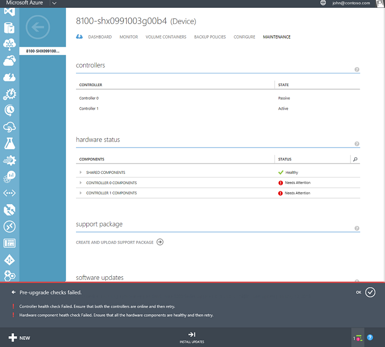

<properties 
   pageTitle="Install Update 1.2 on your StorSimple device | Microsoft Azure"
   description="Explains how to install StorSimple 8000 Series Update 1.2 on your StorSimple 8000 series device."
   services="storsimple"
   documentationCenter="NA"
   authors="alkohli"
   manager="carolz"
   editor="" />

<tags 
   ms.service="storsimple"
   ms.devlang="NA"
   ms.topic="article"
   ms.tgt_pltfrm="NA"
   ms.workload="TBD"
   ms.date="12/01/2015"
   ms.author="alkohli" />

# Install Update 1.2 on your StorSimple device
## Overview
This tutorial explains how to install Update 1.2 on a StorSimple device that is running a software version prior to Update 1. The tutorial also covers the additional steps required for the update when a gateway is configured on a network interface other than DATA 0 of the StorSimple device. 

Update 1.2 includes device software updates, LSI driver updates and disk firmware updates. The software and LSI driver updates are non-disruptive updates and can be applied via the Azure classic portal. The disk firmware updates are disruptive updates and can only be applied via the Windows PowerShell interface of the device. 

Depending upon which version your device is running, you can determine if Update 1.2 will be applied. You can check the software version of your device by navigating to the **quick glance** section of your device **Dashboard**.

</br>

| If running software version … | What happens in the portal? |
| --- | --- |
| Release - GA |If you are running Release version (GA), do not apply this update. Please [contact Microsoft Support](storsimple-contact-microsoft-support.md) to update your device. |
| Update 0.1 |Portal applies Update 1.2. |
| Update 0.2 |Portal applies Update 1.2. |
| Update 0.3 |Portal applies Update 1.2. |
| Update 1 |This update will not be available. |
| Update 1.1 |This update will not be available. |

</br>

> [!IMPORTANT]
> 
> * You may not see Update 1.2 immediately because we do a phased rollout of the updates. Scan for updates in a few days again as this Update will become available soon.
> * This update includes a set of manual and automatic pre-checks to determine the device health in terms of hardware state and network connectivity. These pre-checks are performed only if you apply the updates from the Azure classic portal. 
> * We recommend that you install the software and driver updates via the Azure  classic portal. You should only go to the Windows PowerShell interface of the device (to install updates) if the pre-update gateway check fails in the portal. The updates may take 5-10 hours to install (including the Windows Updates). The maintenance mode updates must be installed via the Windows PowerShell interface of the device. As maintenance mode updates are disruptive updates, these will result in a down time for your device.
> 
> 
## Preparing for updates
You will need to perform the following steps before you scan and apply the update:

1. Take a cloud snapshot of the device data.

2. Ensure that your controller fixed IPs are routable and can connect to the Internet. These fixed IPs will be used to service updates to your device. You can test this by running the following cmdlet on each controller from the Windows PowerShell interface of the device:

     `Test-Connection -Source <Fixed IP of your device controller> -Destination <Any IP or computer name outside of datacenter network> `

    **Sample output for Test-Connection when fixed IPs can connect to the Internet**


        Controller0>Test-Connection -Source 10.126.173.91 -Destination bing.com

        Source      Destination     IPV4Address      IPV6Address
        ----------------- -----------  -----------
        HCSNODE0  bing.com        204.79.197.200
        HCSNODE0  bing.com        204.79.197.200
        HCSNODE0  bing.com        204.79.197.200
        HCSNODE0  bing.com        204.79.197.200

        Controller0>Test-Connection -Source 10.126.173.91 -Destination  204.79.197.200

        Source      Destination       IPV4Address    IPV6Address
        ----------------- -----------  -----------
        HCSNODE0  204.79.197.200  204.79.197.200
        HCSNODE0  204.79.197.200  204.79.197.200
        HCSNODE0  204.79.197.200  204.79.197.200
        HCSNODE0  204.79.197.200  204.79.197.200

After you have successfully completed these manual pre-checks, you can proceed to scan and install the updates.

## Install Update 1.2 via the Azure classic portal
Use this procedure only if you have a gateway configured on DATA 0 network interface on your device. Perform the following steps to update your device.

<!--author=SharS last changed: 01/15/2016-->

#### To install Update 1.2 from the Azure classic portal

1. On the StorSimple service page, select your device. Navigate to **Devices** > **Maintenance**.

2. At the bottom of the page, click **Scan Updates**. A job will be created to scan for available updates. You will be notified when the job has completed successfully.

3. In the **Software Updates** section on the same page, you will see that new software updates are available. We recommend that you review the release notes before you apply Update 1.2 on your device.

    

4. At the bottom of the page, click **Install Updates**.

5. You will be prompted for confirmation. Click **OK**.

6. An **Install Updates** dialog box will be presented. Your device should satisfy the checks listed in this dialog box. These steps were completed prior to the update. Select **I understand the above requirement and am ready to update my device**. Click the check icon.

    

7. A set of automatic pre-checks will now start. These include:

	- **Controller health checks** to verify that both the device controllers are healthy and online.
	
	- **Hardware component health checks** to verify that all the hardware components on your StorSimple device are healthy.
	
	- **DATA 0 checks** to verify that DATA 0 is enabled on your device. If this interface is not enabled, you will need to enable it and then retry.
	
	- **DATA 2 and DATA 3 checks** to verify that DATA 2 and DATA 3 network interfaces are not enabled. If these interfaces are enabled, then you will need to disable them and then try to update your device. This check is performed only if you are updating from a device running GA software. Devices running versions 0.1, 0.2, or 0.3 will not need this check.
	
	- **Gateway check** on any device running a version prior to Update 1. This check is performed on all the device running pre-update 1 software but fails on the devices that have a gateway configured for a network interface other than DATA 0.
 
	Update 1.2 will only be applied if all the above pre-update checks are successfully completed. You will be notified that pre-update checks are in progress.
  
    

    The following is an example in which the pre-upgrade check failed. You will need to verify that both the device controllers are healthy and online. You will also need to check the health of the hardware components. In this example, Controller 0 and Controller 1 components need attention. You may need to contact Microsoft Support if you cannot address these issues by yourself.

   	 

	> [AZURE.NOTE] After you have applied Update 1.2 on your StorSimple device, DATA 2 and DATA 3 checks and the gateway check will no longer be necessary for the future updates. The other pre-checks will still be required.


8. After the pre-upgrade checks are successfully completed, an update job will be created. You will be notified when the update job is successfully created.
 
    

    The update will then be applied on your device.
 
9. To monitor the progress of the update job, click **View Job**. On the **Jobs** page, you can see the update progress. 

    

10. The update will take a few hours to complete. You can view the details of the job at any time.

    

11. After the job is complete, navigate to the **Maintenance** page and scroll down to **Software Updates**.

12. Verify that your device is running **StorSimple 8000 Series Update 1.2 (6.3.9600.17584)**. The **Last updated date** should also be modified.

    

13. You will now see that Maintenance mode updates are available. These updates are disruptive updates that result in device downtime and can only be applied via the Windows PowerShell interface of your device. Follow the instructions in [Install maintenance mode updates](storsimple-update-device.md#install-maintenance-mode-updates-via-windows-powershell-for-storsimple) to install these updates via the Windows PowerShell for StorSimple.

> [AZURE.NOTE] In certain instances, the message indicating maintenance mode updates are available may be displayed up to 24 hours after the maintenance mode updates are successfully applied on the device.  


## Install Update 1.2 on a device that has a gateway configured for a non-DATA 0 network interface
You should use this procedure only if you fail the gateway check when trying to install the updates through the Azure classic portal. The check fails as you have a gateway assigned to a non-DATA 0 network interface and your device is running a software version prior to Update 1. If your device does not have a gateway on a non-DATA 0 network interface, you can update your device directly from the Azure classic portal. See [Install update 1.2 via the Azure classic portal](#install-update-12-via-the-azure-portal.md).

The software versions that can be upgraded using this method are Update 0.1, Update 0.2, and Update 0.3. 

> [!IMPORTANT]
> 
> * If your device is running Release (GA) version, please contact [Microsoft Support](storsimple-contact-microsoft-support.md) to assist you with the update.
> * This procedure needs to be performed only once to apply Update 1.2. You can use the Azure classic portal to apply subsequent updates.
> 
> 
If your device is running pre-Update 1 software and it has a gateway set for a network interface other than DATA 0, you can apply Update 1.2 in the following two ways:

* **Option 1**: Download the update and apply it by using the `Start-HcsHotfix` cmdlet from the Windows PowerShell interface of the device. This is the recommended method. **Do not use this method to apply Update 1.2 if your device is running Update 1.0 or Update 1.1.** 

* **Option 2**: Remove the gateway configuration and install the update directly from the Azure classic portal.


Detailed instructions for each of these are provided in the following sections.

## Option 1: Use Windows PowerShell for StorSimple to apply Update 1.2 as a hotfix
You should use this procedure only if you are running Update 0.1, 0.2, 0.3 and if your gateway check has failed when trying to install updates from the Azure classic portal. If you are running Release (GA) software, please [Microsoft Support](storsimple-contact-microsoft-support.md) to update your device. 

Before using this procedure to apply the update, make sure that:

* Both device controllers are online.

Perform the following steps to apply Update 1.2. **The updates could take around 2 hours to complete (approximately 30 minutes for software, 30 minutes for driver, 45 minutes for disk firmware).**

<!--author=SharS last changed: 11/16/15-->

#### To install Update 1.2 from Windows PowerShell for StorSimple

1. Perform the following steps to download the software update.

    1. Start Internet Explorer and navigate to [http://catalog.update.microsoft.com/v7/site/Home.aspx](http://catalog.update.microsoft.com/v7/site/Home.aspx).
    2. If you are a first-time user, you will be prompted to install a Microsoft Update Catalog. Click **Install**.
    
        

    3. You will see a catalog search screen. Enter **3063418** in the search box, and click **Search**.

        

    4. You will see the **StorSimple Update 1.2 Appliance Update** bundle. Click **Add**. The update will be added to the basket. 

         

    5. Click **View Basket**.
 
         

    6. Click **Download**. Specify or **Browse** to a local location where you want the download to appear. The update will be downloaded in a **StorSimple Update 1.2 Appliance Update bundle** (KB3063418) folder to the chosen location. The folder can also be copied to a network share that is reachable from the device. 
    
	This procedure describes how to install software device update as a hotfix, the disk firmware updates from the Microsoft Update server, and the LSI driver and Windows Updates from the Azure classic portal. You could however choose to install software, driver and disk firmware updates all as hotfixes. You will then need to download StorSimple 1.2 SAS Controller Update (KB3043005) and StorSimple 1.2 Disk Firmware Update (KB3063416) and copy to the same shared folder. To install disk firmware updates as a hotfix, follow the instructions in [installing maintenance mode hotfixes via Windows PowerShell for StorSimple](storsimple-update-device.md#install-hotfixes-via-windows-powershell-for-storsimple).
    
	> [AZURE.NOTE] The hotfix must be accessible from both controllers to detect any potential error messages from the peer controller. 
            
2. To install the software update, access the Windows PowerShell interface on your StorSimple device serial console. Follow the detailed instructions in [Use PuTTy to connect to the serial console](storsimple-deployment-walkthrough.md#use-putty-to-connect-to-the-device-serial-console).

3. At the command prompt, press **Enter**.

4. Select **Option 1** to log on to the device with full access.

5. To install the update package, at the command prompt, type:

    `Start-HcsHotfix -Path <path to update file> -Credential <credentials in domain\username format>`

    Use IP rather than DNS in share path in the above command. The credential parameter is used only if you are accessing an authenticated share. 

	We recommend that you use the credential parameter to access shares. Even shares that are open to “everyone” are typically not open to unauthenticated users.

    A sample output is shown below.

        ````
        Controller0>Start-HcsHotfix -Path \\10.100.100.100\share
        \hcsmdssoftwareupdate.exe -Credential contoso\John
      
        Confirm

        This operation starts the hotfix installation and could reboot one or
        both of the controllers. If the device is serving I/Os, these will not 
        be disrupted. Are you sure you want to continue?
        [Y] Yes [N] No [?] Help (default is "Y"): Y

        ````
 
6. Type **Y** when prompted to confirm the hotfix installation.

7. Monitor the update by using the `Get-HcsUpdateStatus` cmdlet.

    The following sample output shows the update in progress. The `RunInprogress` will be `True` when the update is in progress.

        ````
        Controller0>Get-HcsUpdateStatus
        RunInprogress       : True
        LastHotfixTimestamp : 9/02/2015 10:36:13 PM
        LastUpdateTimestamp : 9/02/2015 10:35:25 PM
        Controller0Events   :
        Controller1Events   : 
        ````
 
     The following sample output indicates that the update is finished. The `RunInProgress` will be `False` when the update has completed.

        ````
        Controller1>Get-HcsUpdateStatus

        RunInprogress       : False
        LastHotfixTimestamp : 9/02/2015 10:56:13 PM
        LastUpdateTimestamp : 9/02/2015 10:35:25 PM
        Controller0Events   :
        Controller1Events   :

        ````
		

	> [AZURE.NOTE] Occasionally, the cmdlet reports `False` when the update is still in progress. To ensure that the hotfix is complete, wait for a few minutes, rerun this command and verify that the `RunInProgress` is `False`. If it is, then the hotfix has completed. 
	
8. After the software update is complete, verify the system software versions. Type the following command:

    `Get-HcsSystem`

    You should see the following versions:

    - HcsSoftwareVersion: 6.3.9600.17584
    - CisAgentVersion: 1.0.9049.0
    - MdsAgentVersion: 26.0.4696.1433 
    
	If the version numbers do not change after applying the update, it indicates that the hotfix has failed to apply. Should you see this, please contact [Microsoft Support](storsimple-contact-microsoft-support.md) for further assistance.
    
9. You will now install the disk firmware updates that are disruptive and take around 30-45 minutes to complete. You can choose to install these in a planned maintenance window by connecting to the device serial console. To install disk firmware updates, follow the instructions in [Install Maintenance mode updates via Windows PowerShell for StorSimple](storsimple-update-device.md#install-maintenance-mode-updates-via-windows-powershell-for-storsimple).  

10. After the disk firmware updates are successfully applied and the device has exited maintenance mode, return to the Azure classic portal. Maintenance mode updates are not updated on the portal until 24 hours have elapsed. You may need to wait before you apply the remaining non-disruptive updates from the Azure classic portal. 

11. When you are ready to apply updates, navigate to **Maintenance** page and from the bottom of the page, click **Scan Updates**. You will be notified that updates are available, these include the driver and the Windows Updates. Click **Install Updates** to begin the install. You are done after all the updates are successfully installed. 


 
 


## Option 2: Use the Azure classic portal to apply Update 1.2 after removing the gateway configuration
This procedure applies only to StorSimple devices that are running a software version prior to Update 1 and have a gateway set on a network interface other than DATA 0. You will need to clear the gateway setting prior to applying the update.

The update may take a few hours to complete. If your hosts are in different subnets, removing the gateway configuration on the iSCSI interfaces could result in downtime. We recommend that you configure DATA 0 for iSCSI traffic to reduce the downtime.

Perform the following steps to disable the network interface with the gateway and then apply the update.

<!--author=SharS last changed: 12/1/2015-->

#### To install Update 1.2 from the Azure classic portal

1. In the Azure classic portal, go to the **Devices** page and select your device.
 
2. Navigate to **Devices** > **Configure**. 

3. Under **Network Interfaces**, first verify that you have at least one network interface that is iSCSI-enabled. Then locate the network interface (other than DATA 0) that has a gateway assigned. 

4. Disable the network interface that has an assigned gateway and save the modified configuration. Note the network interface settings are retained and so when you re-enable this network interface later, the portal will revert to the original settings.

7. You can now [use the Azure classic portal to install Update 1.2](#install-update-12-via-the-azure-portal). Follow the instructions starting from step 3 of this procedure. After you have installed all the updates, you can re-enable the network interface that you disabled. 


## Troubleshooting update failures
**What if you see a notification that the pre-upgrade checks have failed?**

If a pre-check fails, make sure that you have looked at the detailed notification bar at the bottom of the page. This provides guidance as to which pre-check has failed. The following illustration shows an instance in which such a notification appears. In this case, the controller health check and hardware component health check have failed. Under the **Hardware Status** section, you can see that both **Controller 0** and **Controller 1** components need attention. 

  

You will need to make sure that both controllers are healthy and online. You will also need to make sure that all the hardware components in the StorSimple device are shown to be healthy on the Maintenance page. You can then try to install updates. If you are not able to fix the hardware component issues, then you will need to contact Microsoft Support for next steps.

**What if you receive a "Could not install updates" error message, and the recommendation is to refer to the update troubleshooting guide to determine the cause of the failure?**

One likely cause for this could be that you do not have connectivity to the Microsoft Update servers. This is a manual check that needs to be performed. If you lose connectivity to the update server, your update job would fail. You can check the connectivity by running the following cmdlet from the Windows PowerShell interface of your StorSimple device:

 `Test-Connection -Source <Fixed IP of your device controller> -Destination <Any IP or computer name outside of datacenter>`

Run the cmdlet on both controllers.

If you have verified the connectivity exists, and you continue to see this issue, please contact Microsoft Support for next steps.

## Next steps
Learn more about the [Update 1.2 release](storsimple-update1-release-notes.md).

