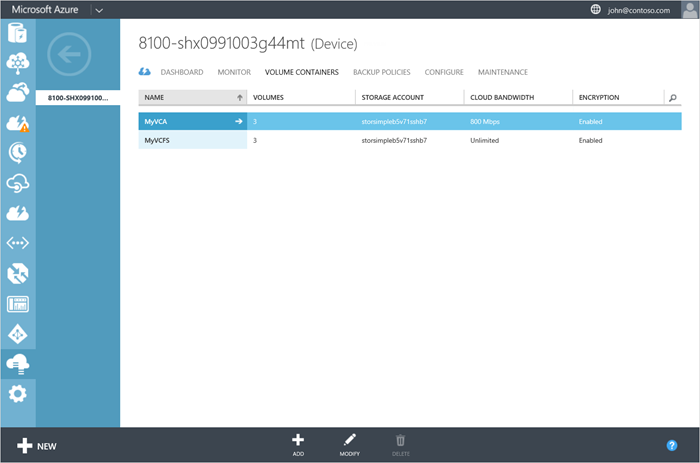

<properties 
   pageTitle="Manage your StorSimple volume containers | Microsoft Azure"
   description="Explains how you can use the StorSimple Manager service volume containers page to add, modify, or delete a volume container."
   services="storsimple"
   documentationCenter="NA"
   authors="SharS"
   manager="carolz"
   editor="" />

<tags 
   ms.service="storsimple"
   ms.devlang="NA"
   ms.topic="article"
   ms.tgt_pltfrm="NA"
   ms.workload="TBD"
   ms.date="01/08/2016"
   ms.author="v-sharos" />

# Use the StorSimple Manager service to manage StorSimple volume containers
## Overview
This tutorial explains how to use the StorSimple Manager service to create and manage StorSimple volume containers.

A volume container in a Microsoft Azure StorSimple device contains one or more volumes that share storage account, encryption, and bandwidth consumption settings. A device can have multiple volume containers for all its volumes. 

A volume container has the following attributes:

* **Volumes** – The tiered or locally pinned StorSimple volumes that are contained within the volume container. A volume container may contain up to 256 StorSimple volumes.

* **Encryption** – An encryption key that can be defined for each volume container. This key is used for encrypting the data that is sent from your StorSimple device to the cloud. A military-grade AES-256 bit key is used with the user-entered key. To secure your data, we recommend that you always enable cloud storage encryption.

* **Storage account** – The storage account that is linked to your cloud storage service provider. All the volumes residing in a volume container share this storage account. You can choose a storage account from an existing list, or create a new account when you create the volume container and then specify the access credentials for that account.

* **Cloud bandwidth** – The bandwidth consumed by the device when the data from the device is being sent to the cloud. You can enforce a bandwidth control by specifying a value between 1 and 1000 Mbps when you define this container. If you want the device to consume all available bandwidth, set this field to Unlimited. You can also create and apply a bandwidth template to allocate bandwidth based on schedule.

This following procedures explain how to use the StorSimple **Volume containers** page to complete the following common operations:

* Add a volume container 
* Modify a volume container 
* Delete a volume container 

## Add a volume container
Perform the following steps to add a volume container.

<!--author=SharS last changed: 1/7/2016-->

#### To add a volume container

1. On the **Devices** page, select the device, double-click it, and then click the **Volume containers** tab.

2. Click **Add** at the bottom of the page. In the **Create volume container** dialog box, do the following:

  1. Supply a unique **Name** for your volume container. This name can contain a maximum of 32 characters.
  2. Select a **Storage Account** to be associated with this volume container. You can choose from an existing storage account within the same subscription or select **Add more** to select a storage account from another subscription. You can also choose the storage account that was first generated when the service was created.
  3. Specify bandwidth as **Unlimited** if you want to consume all available bandwidth, or **Custom** to employ bandwidth controls. For a custom bandwidth, supply a value between 1 and 1000 Mbps. To allocate bandwidth based on a schedule, you can **Select a bandwidth template**.
  4. We recommend that you keep **Enable Cloud Storage Encryption** selected to encrypt the data that is going to the cloud. Disable encryption only if you are employing other means to encrypt your data. You cannot modify the encryption setting once the volume container has been created.
  5. Provide a **Cloud Storage Encryption Key** that contains between 8 and 32 characters. The device uses this key to access the encrypted data. In the **Confirm Cloud Storage Encryption Key** field, enter the cloud storage encryption key again to confirm it. 
  6. Click the arrow to proceed to the next page.

     

3. If you specified **Select a bandwidth template**, choose from the dropdown list of existing bandwidth templates. Review the schedule settings and click the check icon .

     

The volume container will be saved and the newly created volume container will be listed on the **Volume container** page.
 

## Modify a volume container
Perform the following steps to modify a volume container.

<!--author=SharS last changed: 1/7/2016-->

#### To modify a volume container

1. On the **Devices** page, select the device, double-click it, and then click the **Volume containers** tab.

2. In the tabular listing of the volume containers, select the setting that you want to modify, and click **Modify**.

3. In the **Modify Volume container** dialog box, do the following:

    1. Change the name of the volume container and modify the associated bandwidth setting. 

        

    2. The encryption key and storage account cannot be changed after they are specified. If you specified **Select a bandwidth template**, click the arrow to proceed to the next page.

4. In the next page of the **Modify Volume Container** dialog box:

    1. From the drop-down list, choose an existing bandwidth template.

    2. Review the schedule settings for the specified bandwidth template.

        

    3. Click the check icon  to save the updated settings. The **Volume containers** page will be updated to reflect the changes.

 

## Delete a volume container
A volume container has volumes within it. It can be deleted only if all the volumes contained in it are first deleted. Perform the following steps to delete a volume container.

<!--author=SharS last changed: 9/16/15-->

#### To delete a volume container

1. On the **Devices** page, select the device, double-click it, and then click the **Volume containers** tab.

2. Select the volume container you want to delete.

3. If a volume container has no associated volumes, then it can be deleted. Click **Delete** at the bottom of the page to delete this container. When prompted for confirmation, click **Yes**. This will delete the volume container.

If the volume container has associated volumes, you will first need to take those volumes offline by following the steps in [Take a volume offline](../articles/storsimple/storsimple-manage-volumes.md#take-a-volume-offline). After the volumes are offline, you can delete them. When the volume container has no associated volumes, delete the volume container as described above.

## Next steps
* Learn more about [managing StorSimple volumes](storsimple-manage-volumes.md). 
* Learn more about [using the StorSimple Manager service to administer your StorSimple device](storsimple-manager-service-administration.md).

