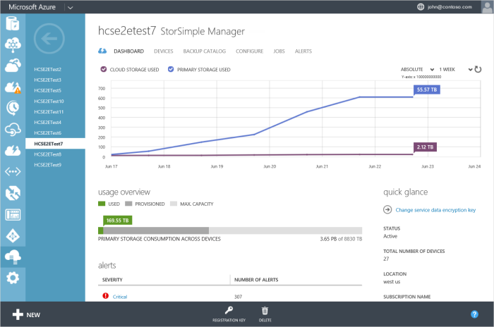

<properties 
   pageTitle="StorSimple Manager service dashboard | Microsoft Azure"
   description="Describes the StorSimple Manager service dashboard and explains how to use it to monitor the health of your StorSimple solution."
   services="storsimple"
   documentationCenter=""
   authors="SharS"
   manager="carolz"
   editor="" />

<tags 
   ms.service="storsimple"
   ms.devlang="na"
   ms.topic="article"
   ms.tgt_pltfrm="na"
   ms.workload="na"
   ms.date="12/02/2015"
   ms.author="v-sharos" />

# Use the StorSimple Manager service dashboard
## Overview
The StorSimple Manager service dashboard page provides a summary view of all the devices that are connected to the StorSimple Manager service, highlighting those that need a system administrator's attention. This tutorial introduces the dashboard page, explains the dashboard content and function, and describes the tasks that you can perform from this page.

**Figure 1: StorSimple Manager service dashboard**

The StorSimple Manager service dashboard displays the following information:

* In the **chart** area, you can see the relevant metrics chart for your devices. You can view the primary storage used across all the devices, as well as the cloud storage consumed by devices over a period of time. Use the controls in the top-right corner of the chart to specify a 1-week, 1-month, 3-month, or 1-year time scale.

* The **usage overview** shows the primary storage that is provisioned and consumed by all devices relative to the total storage available across all devices. **Provisioned** refers to the amount of storage that is prepared and allocated for use, while **Used** refers to usage of volumes as viewed by the initiators that are connected to the devices.

* The **alerts** area provides a snapshot of all the active alerts across all the devices, grouped by alert severity. Clicking the severity level opens the **Alerts** page, scoped to show those alerts. On the **Alerts** page, you can click an individual alert to view additional details about that alert, including any recommended actions. You can also clear the alert if the issue has been resolved.

* The **jobs** area provides a snapshot of recent jobs across all devices that are connected to your service. There are links that you can use to look at jobs that are currently in progress, those that failed in the last 24 hours, or those that are scheduled to run in the next 24 hours. 

* The **quick glance** area provides useful information such as service status, number of devices connected to the service, location of the service, and details of the subscription that is associated with the service. There is also a link to the operations log. Click the link to see a list of all completed StorSimple Manager service operations.

You can use the StorSimple Manager service dashboard page to initiate the following tasks:

* View or regenerate the service registration key.
* Change the service data encryption key.
* View the operation logs.

## View or regenerate the service registration key
The service registration key is used to register a Microsoft Azure StorSimple device with the StorSimple Manager service, so that the device appears in the Azure classic portal for further management actions. The key is created on the first device and shared with the rest of your devices. 

Clicking **Registration Key** (at the bottom of the page) opens the **Service Registration Key** dialog box, where you can either copy the current service registration key to the clipboard or regenerate the service registration key.

Regenerating the key does not affect previously registered devices: it affects only the devices that are registered with the service after the key is regenerated.

For more information about viewing and generating the service registration key, go to [Get the service registration key](storsimple-manage-service.md#get-the-service-registration-key).

## Change the service data encryption key
Service data encryption keys are used to encrypt confidential customer data, such as storage account credentials, that are sent from your StorSimple Manager service to the StorSimple device. You will need to change these keys periodically if your IT organization has a key rotation policy on the storage devices. The key change process can be slightly different depending on whether there is a single device or multiple devices managed by the StorSimple Manager service.

Changing the service data encryption key is a 3-step process:

1. Using the Azure classic portal, authorize a device to change the service data encryption key.
2. Using Windows PowerShell for StorSimple, initiate the service data encryption key change.
3. If you have more than one StorSimple device, update the service data encryption key on the other devices.

The following steps describe the rollover process for the service data encryption key.

<!--author=SharS last changed: 12/01/15-->

### Step 1: Authorize a device to change the service data encryption key in the Azure classic portal

Typically, the device administrator will request that the service administrator authorize a device to change service data encryption keys. The service administrator will then authorize the device to change the key.

This step is performed in the Azure classic portal. The service administrator can select a device from a displayed list of the devices that are eligible to be authorized. The device is then authorized to start the service data encryption key change process.

#### Which devices can be authorized to change service data encryption keys?

A device must meet the following criteria before it can be authorized to initiate service data encryption key changes:

- The device must be online to be eligible for service data encryption key change authorization.

- You can authorize the same device again after 30 minutes if the key change has not been initiated.

- You can authorize a different device, provided that the key change has not been initiated by the previously authorized device. After the new device has been authorized, the old device cannot initiate the change.

- You cannot authorize a device while the rollover of the service data encryption key is in progress.

- You can authorize a device when some of the devices registered with the service have rolled over the encryption while others have not. In such cases, the eligible devices are the ones that have completed the service data encryption key change.

> [AZURE.NOTE]
> In the Azure classic portal, StorSimple virtual devices are not shown in the list of devices that can be authorized to start the key change.

Perform the following steps to select and authorize a device to initiate the service data encryption key change.

#### To authorize a device to change the key

1. On the service dashboard page, click **Change service data encryption key**.

    

2. In the **Change service data encryption key** dialog box, select and authorize a device to initiate the service data encryption key change. The drop-down list has all the eligible devices that can be authorized.

3. Click the check icon .

### Step 2: Use Windows PowerShell for StorSimple to initiate the service data encryption key change

This step is performed in the Windows PowerShell for StorSimple interface on the authorized StorSimple device.

> [AZURE.NOTE] No operations can be performed in the Azure classic portal of your StorSimple Manager service until the key rollover is completed.

If you are using the device serial console to connect to the Windows PowerShell interface, perform the following steps.

#### To initiate the service data encryption key change

1. Select option 1 to log on with full access.

2. At the command prompt, type:

     `Invoke-HcsmServiceDataEncryptionKeyChange`

3. After the cmdlet has successfully completed, you will get a new service data encryption key. Copy and save this key for use in step 3 of this process. This key will be used to update all the remaining devices registered with the StorSimple Manager service.

    > [AZURE.NOTE] This process must be initiated within four hours of authorizing a StorSimple device.

   This new key is then sent to the service to be pushed to all the devices that are registered with the service. An alert will then appear on the service dashboard. The service will disable all the operations on the registered devices, and the device administrator will then need to update the service data encryption key on the other devices. However, the I/Os (hosts sending data to the cloud) will not be disrupted.

   If you have a single device registered to your service, the rollover process is now complete and you can skip the next step. If you have multiple devices registered to your service, proceed to step 3.

### Step 3: Update the service data encryption key on other StorSimple devices

These steps must be performed in the Windows PowerShell interface of your StorSimple device if you have multiple devices registered to your StorSimple Manager service. The key that you obtained in Step 2: Use Windows PowerShell for StorSimple to initiate the service data encryption key change must be used to update all the remaining StorSimple device registered with the StorSimple Manager service.

Perform the following steps to update the service data encryption on your device.

#### To update the service data encryption key

1. Use Windows PowerShell for StorSimple to connect to the console. Select option 1 to log on with full access.

2. At the command prompt, type:

    `Invoke-HcsmServiceDataEncryptionKeyChange – ServiceDataEncryptionKey`

3. Provide the service data encryption key that you obtained in [Step 2: Use Windows PowerShell for StorSimple to initiate the service data encryption key change](#to-initiate-the-service-data-encryption-key-change).

## View the operations logs
You can view the operation logs by clicking the operation logs link available in the **quick glance** pane of the dashboard. This will take you to the management services page, where you can filter and see the logs specific to your StorSimple Manager service.

## Next steps
* Learn how to [troubleshoot a StorSimple device](storsimple-troubleshoot-operational-device.md).

* Learn more about how to [use the StorSimple Manager service to administer your StorSimple device](storsimple-manager-service-administration.md).

