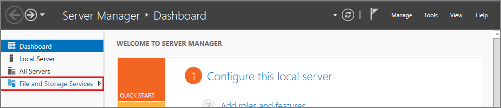
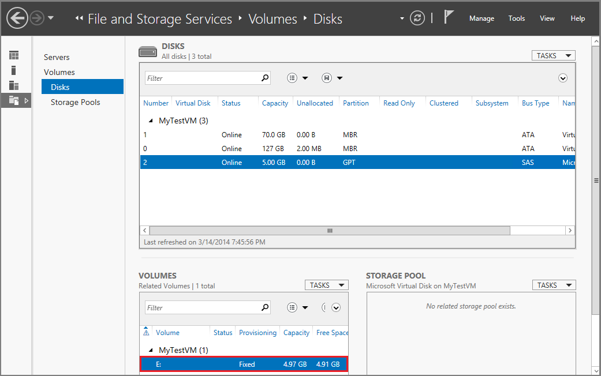

<properties
    pageTitle="Attach a disk to a VM | Microsoft Azure"
    description="Attach a data disk to a Windows virtual machine created with the classic deployment model and initialize it."
    services="virtual-machines, storage"
    documentationCenter=""
    authors="cynthn"
    manager="timlt"
    editor="tysonn"
    tags="azure-service-management"/>

<tags
    ms.service="virtual-machines"
    ms.workload="infrastructure-services"
    ms.tgt_pltfrm="vm-windows"
    ms.devlang="na"
    ms.topic="article"
    ms.date="10/14/2015"
    ms.author="cynthn"/>

# Attach a data disk to a Windows virtual machine created with the classic deployment model
> [AZURE.IMPORTANT] Azure has two different deployment models for creating and working with resources:  [Resource Manager and classic](../resource-manager-deployment-model.md).  This article covers using the classic deployment model. Microsoft recommends that most new deployments use the [Resource Manager model](virtual-machines-attach-disk-preview.md).

If you need an additional data disk, you can attach an empty disk or an existing disk with data to a VM. In both cases, the disks are actually .vhd files that need to reside in an Azure storage account. In the case of a new disk, after you attach the disk, you'll also need to initialize it so it's ready for use by a Windows VM.

It's a best practice to use one or more separate disks to store a virtual machine's data. When you create an Azure virtual machine, it has a disk for the operating system mapped to drive C and a temporary disk mapped to drive D. **Do not use the temporary disk to store data**. As the name implies, the temporary disk provides temporary storage only. It offers no redundancy or backup because it doesn't reside in Azure Storage.

## Video walkthrough
Here's a walkthrough of the steps in this tutorial.

[AZURE.VIDEO attaching-a-data-disk-to-a-windows-vm]AZURE.VIDEO attaching-a-data-disk-to-a-windows-vm]

For more details about disks, see [About Disks and VHDs for Virtual Machines](../articles/virtual-machines-disks-vhds.md).

##How to: Attach an empty disk

Attaching an empty disk is the simpler way to add a data disk, because Azure creates the .vhd file for you and stores it in the storage account.

1. Click **Virtual Machines**, and then select the appropriate virtual machine.

2. On the command bar, click **Attach**, and then click **Attach Empty Disk**.

	

3.	The **Attach an Empty Disk** dialog box appears.

	

	Do the following:

	- In **File Name**, accept the default name or type another one for the .vhd file, which is used for the disk. The data disk uses an automatically generated name, even if you type another name for the .vhd file.

	- Type the **Size (GB)** of the data disk.

	- Click the check mark to finish.

4.	After the data disk is created and attached, it's listed in the dashboard of the virtual machine.

	
	
> [AZURE.NOTE]
> After you add a new data disk, you'll need to log on to the virtual machine and initialize the disk so the virtual machine can use the disk for storage. 

##How to: Attach an existing disk

Attaching an existing disk requires that you have a .vhd available in a storage account. Use the [Add-AzureVhd](http://go.microsoft.com/FWLink/p/?LinkID=391684) cmdlet to upload the .vhd file to the storage account. After you've created and uploaded the .vhd file, you can attach it to a virtual machine.

1. Click **Virtual Machines**, and then select the appropriate virtual machine.

2. On the command bar, click **Attach**, and then select **Attach Disk**.

	

	The **Attach Disk** dialog box appears.

	

3. Select the data disk that you want to attach to the virtual machine.

4. Click the check mark to attach the data disk to the virtual machine.

5.	After the data disk is attached, it's listed in the dashboard of the virtual machine.

	

## How to: initialize a new data disk in Windows Server
1. Connect to the virtual machine. For instructions, see [How to log on to a virtual machine running Windows Server](virtual-machines-log-on-windows-server.md).

2. After you log on to the virtual machine, open **Server Manager**. In the left pane, select **File and Storage Services**.

    

3. Expand the menu and select **Disks**.

4. The **Disks** section lists the disks. In most cases, it will have disk 0, disk 1, and disk 2. Disk 0 is the operating system disk, disk 1 is the temporary disk (which should not be used for data storage), and disk 2 is the data disk you just attached to the virtual machine. The new data disk will list the Partition as **Unknown**. Right-click the disk and select **Initialize**.

5. You're notified that all data will be erased when the disk is initialized. Click **Yes** to acknowledge the warning and initialize the disk. Once complete, the Partion will be listed as **GPT**. Right-click the disk again and select **New Volume**.

6. Complete the wizard using the default values. When the wizard is done, the **Volumes** section lists the new volume. The disk is now online and ready to store data.

   

> [!NOTE]
> The size of the virtual machine determines how many disks you can attach to it. For details, see [Sizes for virtual machines](virtual-machines-size-specs.md).
> 
> 
## Additional resources
[How to detach a disk from a Windows virtual machine](storage-windows-detach-disk.md)

[About disks and VHDs for virtual machines](virtual-machines-disks-vhds.md)

[logon]: virtual-machines-log-on-windows-server.md
