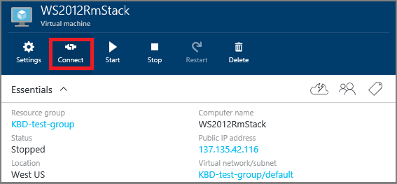

<properties
    pageTitle="Log on to a Windows Server VM | Microsoft Azure"
    description="Learn how to log on to a Windows Server VM using the Azure portal and the Resource Manager deployment model."
    services="virtual-machines"
    documentationCenter=""
    authors="cynthn"
    manager="timlt"
    editor="tysonn"
    tags="azure-resource-manager"/>

<tags
    ms.service="virtual-machines"
    ms.workload="infrastructure-services"
    ms.tgt_pltfrm="vm-windows"
    ms.devlang="na"
    ms.topic="article"
    ms.date="01/21/2016"
    ms.author="cynthn"/>

# How to log on to a virtual machine running Windows Server
> [AZURE.NOTE] Azure has two different deployment models for creating and working with resources:  [Resource Manager and classic](../resource-manager-deployment-model.md).  This article covers using the Resource Manager deployment model, which Microsoft recommends for most new deployments instead of the [classic deployment model](virtual-machines-log-on-windows-server.md).

You'll use the **Connect** button in the Azure portal to start a Remote Desktop session. First you'll connect to the virtual machine, then you'll log on.

## Connect to the virtual machine
1. If you haven't already done so, sign in to the [Azure portal](https://portal.azure.com/).

2. On the Hub menu, click **Virtual Machines**.

3. Select the virtual machine from the list.

4. On the blade for the virtual machine, click **Connect**.

    

## Log on to the virtual machine
<properties services="virtual-machines" title="How to Log on to a Virtual Machine Running Windows Server" authors="cynthn" solutions="" manager="timlt" editor="tysonn" />

4. Clicking **Connect** creates and downloads a Remote Desktop Protocol file (.rdp file). Click **Open** to use this file.

5. In the Remote Desktop window, click **Connect** to continue.

	

6. In the Windows Security window, type the credentials for an account on the virtual machine and then click **OK**.

 	In most cases, the credentials are the local account user name and password that you specified when you created the virtual machine. In this case, the domain is the name of the virtual machine and it is entered as *vmname*&#92;*username*.  
	
	If the virtual machine belongs to a domain in your organization, make sure the user name includes the name of the domain in the format *Domain*&#92;*Username*. The account will also need to either be in the Admnistrators group or have been granted remote access privledges to the VM.
	
	If the virtual machine is a domain controller, type the user name and password of a domain administrator account for that domain.

7.	Click **Yes** to verify the identity of the virtual machine and finish logging on.

	

## Troubleshooting
If the tips about logging on don't help or aren't what you need, see [Troubleshoot Remote Desktop connections to a Windows-based Azure Virtual Machine](virtual-machines-troubleshoot-remote-desktop-connections.md). This article walks you through diagnosing and resolving common problems.

