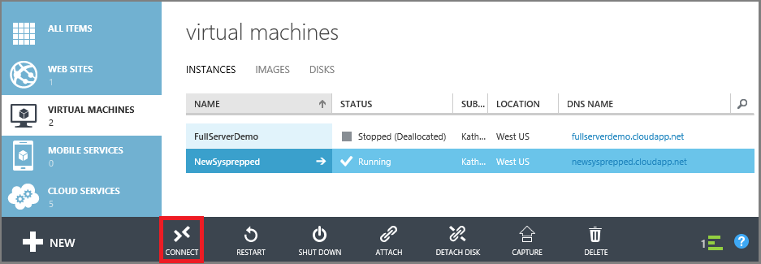

<properties
    pageTitle="Log on to a VM | Microsoft Azure"
    description="Use the Azure classic portal to log on to a Windows virtual machine created with the classic deployment model."
    services="virtual-machines"
    documentationCenter=""
    authors="cynthn"
    manager="timlt"
    editor="tysonn"
    tags="azure-service-management"/>

<tags
    ms.service="virtual-machines"
    ms.workload="infrastructure-services"
    ms.tgt_pltfrm="vm-windows"
    ms.devlang="na"
    ms.topic="article"
    ms.date="10/05/2015"
    ms.author="cynthn"/>

# Log on to a Windows virtual machine using the Azure classic portal
In the Azure classic portal, you use the **Connect** button to start a Remote Desktop session and log on to a Windows VM.

Do you want to connect to a Linux VM? See [How to log on to a virtual machine running Linux](virtual-machines-linux-how-to-log-on.md).

> [AZURE.IMPORTANT] Azure has two different deployment models for creating and working with resources:  [Resource Manager and classic](../resource-manager-deployment-model.md).  This article covers using the classic deployment model. Microsoft recommends that most new deployments use the Resource Manager model.

## Video walkthrough
Here's a video walkthrough of the steps in this tutorial. It also covers endpoints and public and private ports used for connecting to a Windows VM in Azure.

[AZURE.VIDEO logging-on-to-vm-running-windows-server-on-azure]AZURE.VIDEO logging-on-to-vm-running-windows-server-on-azure]

## Connect to the virtual machine
1. Sign in to the Azure classic portal.

2. Click **Virtual Machines**, and then select the virtual machine.

3. On the command bar at the bottom of the page, click **Connect**.

    

> [!TIP]
> If the Connect button isn't available, see the troubleshooting tips at the end of this article.
> 
> 
## Log on to the virtual machine
<properties services="virtual-machines" title="How to Log on to a Virtual Machine Running Windows Server" authors="cynthn" solutions="" manager="timlt" editor="tysonn" />

4. Clicking **Connect** creates and downloads a Remote Desktop Protocol file (.rdp file). Click **Open** to use this file.

5. In the Remote Desktop window, click **Connect** to continue.

	

6. In the Windows Security window, type the credentials for an account on the virtual machine and then click **OK**.

 	In most cases, the credentials are the local account user name and password that you specified when you created the virtual machine. In this case, the domain is the name of the virtual machine and it is entered as *vmname*&#92;*username*.  
	
	If the virtual machine belongs to a domain in your organization, make sure the user name includes the name of the domain in the format *Domain*&#92;*Username*. The account will also need to either be in the Admnistrators group or have been granted remote access privledges to the VM.
	
	If the virtual machine is a domain controller, type the user name and password of a domain administrator account for that domain.

7.	Click **Yes** to verify the identity of the virtual machine and finish logging on.

	

## Troubleshooting tips
Here are a few things to try:

* If the **Connect** button is inactive or you are having other problems with the Remote Desktop connection, try resetting the configuration. From the virtual machine dashboard, under **Quick Glance**, click **Reset remote configuration**.
* For problems with your password, try resetting it. From the virtual machine dashboard, under **Quick Glance**, click **Reset password**.

If those tips don't work or aren't what you need, see [Troubleshoot Remote Desktop connections to a Windows-based Azure Virtual Machine](virtual-machines-troubleshoot-remote-desktop-connections.md). This article walks you through diagnosing and resolving common problems.

