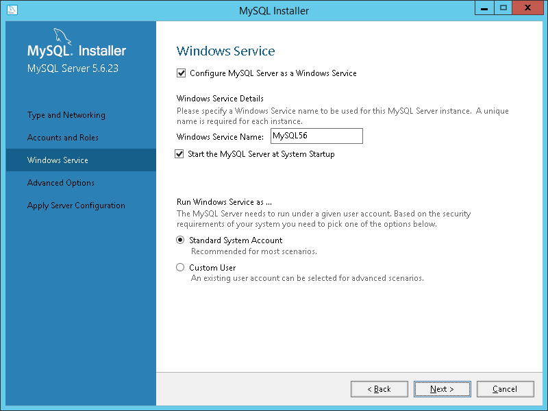

<properties
    pageTitle="Create a VM running MySQL | Microsoft Azure"
    description="Create an Azure virtual machine created with the classic deployment model running Windows Server 2012 R2, and then install and configure the MySQL database on it."
    services="virtual-machines"
    documentationCenter=""
    authors="cynthn"
    manager="timlt"
    editor="tysonn"
    tags="azure-service-management"/>

<tags
    ms.service="virtual-machines"
    ms.workload="infrastructure-services"
    ms.tgt_pltfrm="vm-windows"
    ms.devlang="na"
    ms.topic="article"
    ms.date="11/09/2015"
    ms.author="cynthn"/>

# Install MySQL on a virtual machine created with the classic deployment model running Windows Server 2012 R2
> [AZURE.IMPORTANT] Azure has two different deployment models for creating and working with resources:  [Resource Manager and classic](../resource-manager-deployment-model.md).  This article covers using the classic deployment model. Microsoft recommends that most new deployments use the Resource Manager model.

[MySQL](http://www.mysql.com) is a popular open source, SQL database. Using the [Azure classic portal](http://manage.windowsazure.com), you can create a virtual machine running Windows Server 2012 R2 from the Image Gallery. You can then install and configure it as a MySQL Server.

For instructions on installing MySQL on Linux, refer to: [How to install MySQL on Azure](virtual-machines-linux-install-mysql.md).

This tutorial shows you how to:

* Use the Azure classic portal to create a virtual machine running Windows Server 2012 R2.

* Install and run the community version of MySQL 5.6.23 as a MySQL Server on the virtual machine.

## Create a virtual machine running Windows Server
1. Sign in to the [classic portal](http://manage.windowsazure.com). Check out the [Free Trial](https://azure.microsoft.com/pricing/free-trial/) offer if you don't have a subscription yet.

2. On the command bar at the bottom of the window, click **New**.

3. Under **Compute**, click **Virtual Machine**, and then click **From Gallery**.

	

4. The first screen after this lets you **Choose an Image** for your virtual machine from the list of available images. You can choose an image from the gallery or select from images and disks that you have uploaded. The available images may differ depending on the subscription you're using.

5. The second screen lets you pick a computer name, size, and administrative user name and password. Use the tier and size required to run your app or workload. Here are some tips:

	- **Virtual Machine Name** can only contain letters, numbers and hypens. It also must start with a letter and end with a letter or a number.
	- **New User Name** refers to the administrative account that you use to manage the server. The password must be at 8-123 characters long and have at least 3 of the following: 1 lower case character, 1 upper case character, 1 number, and 1 special character. **You'll need the user name and password to log on to the virtual machine**.
	- A virtual machine's size affects the cost of using it, as well as configuration options such as how many data disks you can attach. For details, see [Sizes for virtual machines](../articles/virtual-machines-size-specs.md).

6. The third screen lets you configure resources for networking, storage, and availability. Here are some tips:

	- The **Cloud Service DNS Name** is the global DNS name that becomes part of the URI that's used to contact the virtual machine. You'll need to come up with your own cloud service name because it must be unique in Azure. Cloud services are important for scenarios using [multiple virtual machines](../articles/cloud-services-connect-virtual-machine.md).

	- For **Region/Affinity Group/Virtual Network**, use a region that's appropriate to your location. You can also choose to specify a virtual network instead.

	>[AZURE.NOTE] If you want a virtual machine to use a virtual network, you **must** specify the virtual network when you create the virtual machine. You can't join the virtual machine to a virtual network after you create the VM. For more information, see [Azure Virtual Network Overview](virtual-networks-overview.md).
	>
	> For details about configuring endpoints, see [How to Set Up Endpoints to a Virtual Machine](../articles/virtual-machines-set-up-endpoints.md).

7. The fourth configuration screen lets you install the VM Agent and configure some of the available extensions.

	>[AZURE.NOTE] The VM agent provides the environment for you to install extensions that can help you interact with or manage the virtual machine. For details, see [About the VM agent and extensions](virtual-machines-extensions-agent-about.md).  

8. After the virtual machine is created, the classic portal lists the new virtual machine under **Virtual Machines**. The corresponding cloud service and storage account also are created and are listed in those sections. Both the virtual machine and cloud service are started automatically and their status is listed as **Running**.

	

## Attach a data disk
After the virtual machine is created, you can optionally attach an additional data disk. This is recommended for production workloads and to avoid running out of space on the OS drive (C:), which  includes the operating system.

See [How to attach a data disk to a Windows virtual machine](storage-windows-attach-disk.md) and follow the instructions for attaching an empty disk. Set the host cache setting to **None** or **Read-only**.

## Log on to the virtual machine
Next, you'll log on to the virtual machine so you can install MySQL.

<properties services="virtual-machines" title="How to Log on to a Virtual Machine Running Windows Server" authors="cynthn" solutions="" manager="timlt" editor="tysonn" />

4. Clicking **Connect** creates and downloads a Remote Desktop Protocol file (.rdp file). Click **Open** to use this file.

5. In the Remote Desktop window, click **Connect** to continue.

	

6. In the Windows Security window, type the credentials for an account on the virtual machine and then click **OK**.

 	In most cases, the credentials are the local account user name and password that you specified when you created the virtual machine. In this case, the domain is the name of the virtual machine and it is entered as *vmname*&#92;*username*.  
	
	If the virtual machine belongs to a domain in your organization, make sure the user name includes the name of the domain in the format *Domain*&#92;*Username*. The account will also need to either be in the Admnistrators group or have been granted remote access privledges to the VM.
	
	If the virtual machine is a domain controller, type the user name and password of a domain administrator account for that domain.

7.	Click **Yes** to verify the identity of the virtual machine and finish logging on.

	

## Install and run MySQL Community Server on the virtual machine
Follow these steps to install, configure, and run the Community version of MySQL Server:

> [!NOTE]
> These steps are for the 5.6.23.0 Community version of MySQL and Windows Server 2012 R2. Your experience might be different for different versions of MySQL or Windows Server.
> 
> 
1. After you've connected to the virtual machine using Remote Desktop, click **Internet Explorer** from the start screen.
2. Select the **Tools** button in the upper-right corner (the cogged wheel icon), and then click **Internet Options**. Click the **Security** tab, click the **Trusted Sites** icon, and then click the **Sites** button. Add http://*.mysql.com to the list of trusted sites. Click **Close**, and then click **OK**.
3. In the address bar of Internet Explorer, type http://dev.mysql.com/downloads/mysql/.
4. Use the MySQL site to locate and download the latest version of the MySQL Installer for Windows. When choosing the MySQL Installer, download the version that has the complete file set (for example, the mysql-installer-community-5.6.23.0.msi with a file size of 282.4 MB), and save the installer.
5. When the installer has finished downloading, click **Run** to launch setup.
6. On the **License Agreement** page, accept the license agreement and click **Next**.
7. On the **Choosing a Setup Type** page, click the setup type that you want, and then click **Next**. The following steps assume the selection of the **Server only** setup type.
8. On the **Installation** page, click **Execute**. When installation is complete, click **Next**.
9. On the **Product Configuration** page, click **Next**.
10. On the **Type and Networking** page, specify your desired configuration type and connectivity options, including the TCP port if needed. Select **Show Advanced Options**, and then click **Next**.

    

11. On the **Accounts and Roles** page, specify a strong MySQL root password. Add additional MySQL user accounts as needed, and then click **Next**.

    

12. On the **Windows Service** page, specify changes to the default settings for running the MySQL Server as a Windows service as needed, and then click **Next**.

    

13. On the **Advanced Options** page, specify changes to logging options as needed, and then click **Next**.

    

14. On the **Apply Server Configuration** page, click **Execute**. When the configuration steps are complete, click **Finish**.

15. On the **Product Configuration** page, click **Next**.
16. On the **Installation Complete** page, click **Copy Log to Clipboard** if you want to examine it later, and then click **Finish**.
17. From the start screen, type **mysql**, and then click **MySQL 5.6 Command Line Client**.
18. Enter the root password that you specified in step 11 and you'll be presented with a prompt where you can issue commands to configure MySQL. For the details of commands and syntax, see [MySQL Reference Manuals](http://dev.mysql.com/doc/refman/5.6/en/server-configuration-defaults.html).

    

19. You can also configure server configuration default settings, such as the base and data directories and drives, with entries in the C:\Program Files (x86)\MySQL\MySQL Server 5.6\my-default.ini file. For more information, see [5.1.2 Server Configuration Defaults](http://dev.mysql.com/doc/refman/5.6/en/server-configuration-defaults.html).

## Configure endpoints
If you want the MySQL Server service to be available to MySQL client computers on the Internet, you must configure an endpoint for the TCP port on which the MySQL Server service is listening and create an additional Windows Firewall rule. This is TCP port 3306 unless you specified a different port on the **Type and Networking** page (step 10 of the previous procedure).

> [!NOTE]
> You should carefully consider the security implications of doing this, because this will make the MySQL Server service available to all computers on the Internet. You can define the set of source IP addresses that are allowed to use the endpoint with an Access Control List (ACL). For more information, see [How to Set Up Endpoints to a Virtual Machine](virtual-machines-set-up-endpoints.md).
> 
> 
To configure an endpoint for the MySQL Server service:

1. In the Azure classic portal, click **Virtual Machines**, click the name of your MySQL virtual machine, and then click **Endpoints**.
2. In the command bar, click **Add**.
3. On the **Add an endpoint to a virtual machine** page, click the right arrow.
4. If you are using the default MySQL TCP port of 3306, click **MySQL** in **Name**, and then click the check mark.
5. If you are using a different TCP port, type a unique name in **Name**. Select **TCP** in protocol, type the port number in both **Public Port** and **Private Port**, and then click the check mark.

## Add a Windows Firewall rule to allow MySQL traffic
To add a Windows Firewall rule that allows MySQL traffic from the Internet, run the following command at an elevated Windows PowerShell command prompt on the MySQL server virtual machine.

    New-NetFirewallRule -DisplayName "MySQL56" -Direction Inbound –Protocol TCP –LocalPort 3306 -Action Allow -Profile Public

## Test your remote connection
To test your remote connection to the MySQL Server service running on the Azure virtual machine, you must first determine the DNS name corresponding to the cloud service that contains the virtual machine running MySQL Server.

1. In the Azure classic portal, click **Virtual Machines**, click the name of your MySQL server virtual machine, and then click **Dashboard**.
2. From the virtual machine dashboard, note the **DNS Name** value under the **Quick Glance** section. Here is an example:

   

3. From a local computer running MySQL or the MySQL client, run the following command to log in as a MySQL user.

     mysql -u <yourMysqlUsername> -p -h <yourDNSname>

   For example, for the MySQL user name dbadmin3 and the testmysql.cloudapp.net DNS name for the virtual machine, use the following command.

     mysql -u dbadmin3 -p -h testmysql.cloudapp.net

## Additional resources
For information on MySQL, see the [MySQL Documentation](http://dev.mysql.com/doc/).

