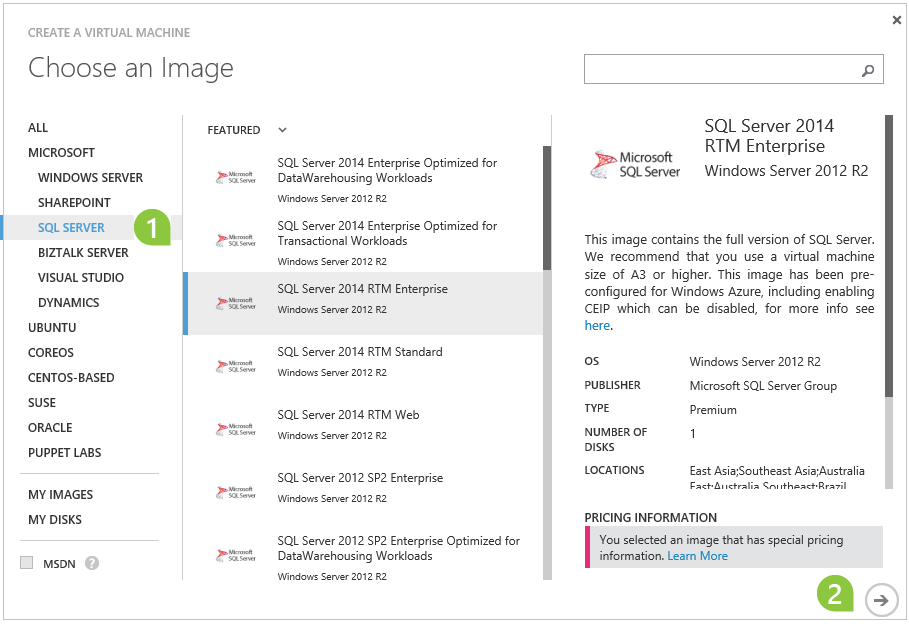
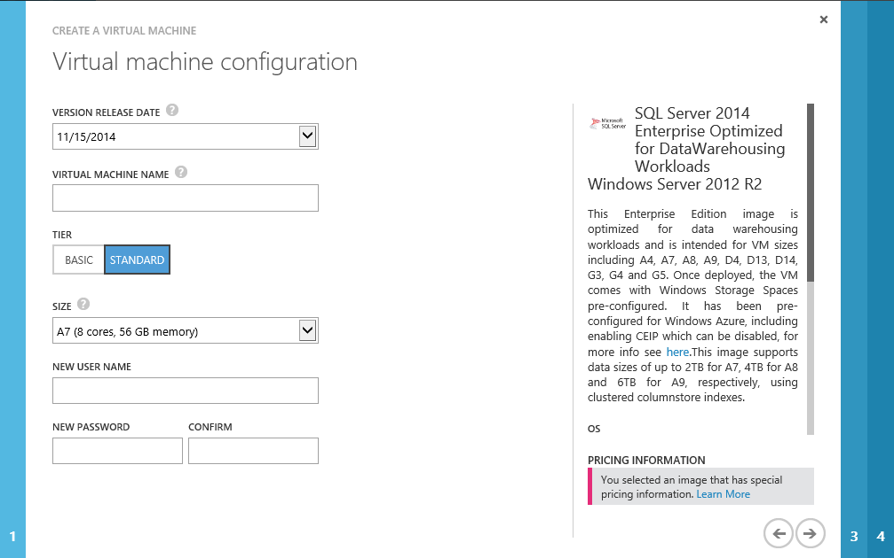
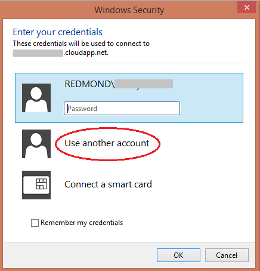

<properties
    pageTitle="Provision a SQL Server virtual machine | Microsoft Azure"
    description="This tutorial teaches you how to create and configure a SQL Server VM on Azure."
    services="virtual-machines"
    documentationCenter=""
    authors="rothja"
    manager="jeffreyg"
    editor="monicar"
    tags="azure-service-management"    />

<tags
    ms.service="virtual-machines"
    ms.workload="infrastructure-services"
    ms.tgt_pltfrm="vm-windows-sql-server"
    ms.devlang="na"
    ms.topic="article"
    ms.date="12/22/2015"
    ms.author="jroth"/>

# Provision a SQL Server virtual machine in Azure
> [AZURE.SELECTOR]AZURE.SELECTOR]
> 
> * [Classic portal](virtual-machines-provision-sql-server.md)
> * [PowerShell](virtual-machines-sql-server-create-vm-with-powershell.md)
> * [Azure Resource Manager portal](virtual-machines-sql-server-provision-resource-manager.md)
> 
> 
## Overview
> [AZURE.IMPORTANT] Azure has two different deployment models for creating and working with resources:  [Resource Manager and classic](../resource-manager-deployment-model.md).  This article covers using the classic deployment model. Microsoft recommends that most new deployments use the Resource Manager model.
.

The Azure virtual machine gallery includes several images that contain Microsoft SQL Server. You can select one of the virtual machine images from the gallery and with a few clicks you can provision the virtual machine to your Azure environment.

In this tutorial, you will:

* [Connect to the Azure classic portal and provision a virtual machine from the gallery](#Provision.md)
* [Open the virtual machine using Remote Desktop and complete setup](#RemoteDesktop.md)
* [Complete configuration steps to connect to the virtual machine using SQL Server Management Studio on another computer](#SSMS.md)
* [Next steps](#Optional.md)

> [!NOTE]
> This article describes how to provision a SQL Server VM with the existing portal. However, it is also possible to create and manage SQL Server VMs in the [new portal](https://manage.windowsazure.com). There are some advantages to the new portal, such as defaulting to the use of Premium Storage, and other options, such as Automated Patching, Automated Backup, and AlwaysOn configurations. Future content will cover step-by-step instructions.
> 
> 
## <a id="Provision">Provision a SQL Server virtual machine from the gallery</a>
1. Log in to the [Azure classic portal](http://manage.windowsazure.com) using your account. If you do not have an Azure account, visit [Azure free trial](https://azure.microsoft.com/pricing/free-trial/).

2. On the Azure classic portal, at the bottom left of the web page, click **+NEW**, click **COMPUTE**, click **VIRTUAL MACHINE**, and then click **FROM GALLERY**.

3. On the **Choose an Image** page, click **SQL SERVER**. Then select a SQL Server image. Click the next arrow at the bottom right of the page.

    

For the most up-to-date information on the supported SQL Server images on Azure, see [SQL Server on Azure Virtual Machines Overview](virtual-machines-sql-server-infrastructure-services.md).

> [!NOTE]
> If you have a virtual machine created by using the platform image SQL Server Evaluation edition, you cannot upgrade it to a per-minute paid edition image in the gallery. You can choose one of the following two options:
> 
> * You can create a new virtual machine by using the per-minute paid SQL Server edition from the gallery and migrate your database files to this new virtual machine by following the steps at [Migrating a Database to SQL Server on an Azure VM](virtual-machines-migrate-onpremises-database.md)
> * Or, you can upgrade an existing instance of SQL Server Evaluation edition to a different edition of SQL Server under the [License Mobility through Software Assurance on Azure](https://azure.microsoft.com/pricing/license-mobility/) agreement by following the steps at [Upgrade to a Different Edition of SQL Server](https://msdn.microsoft.com/library/cc707783.aspx). For information on how to purchase the licensed copy of SQL Server, see [How to Buy SQL Server](http://www.microsoft.com/sqlserver/get-sql-server/how-to-buy.aspx).
> 
> 
1. On the first **Virtual Machine Configuration** page, provide the following information:

   * A **VERSION RELEASE DATE**. If multiple images are available, select the latest.
* A unique **VIRTUAL MACHINE NAME**.
* In the **NEW USER NAME** box, a unique user name for the machine's local administrator account.
* In the **NEW PASSWORD** box, type a strong password.
* In the **CONFIRM PASSWORD** box, retype the password.
* Select the appropriate **SIZE** from the drop down list.

  

  > [!NOTE]
> The size of the virtual machine is specified during provisioning:
> 
> * For production workloads, we recommend using Premium Storage with the following minimum recommended sizes: **DS3** for SQL Server Enterprise edition and **DS2** for SQL Server Standard edition. For more information, see [Performance Best Practices for SQL Server in Azure Virtual Machines](virtual-machines-sql-server-performance-best-practices.md).
> * The selected size limits the number of data disks you can configure. For most up-to-date information on available virtual machine sizes and the number of data disks that you can attach to a virtual machine, see [Virtual Machine Sizes for Azure](virtual-machines-size-specs.md).
> 
> 

2. After entering your VM configuration details, click the next arrow on the bottom right to continue.

3. On the second **Virtual machine configuration** page, configure resources for networking, storage, and availability:

   * In the **Cloud Service** box, choose **Create a new cloud service**.
* In the **Cloud Service DNS Name** box, provide the first portion of a DNS name of your choice, so that it completes a name in the format **TESTNAME.cloudapp.net**
* Select a **SUBSCRIPTION**, if you have multiple subscriptions to choose from. The choice determines which **storage accounts **are available.
* In the **REGION/AFFINITY GROUP/VIRTUAL NETWORK** box, select a region where this virtual image will be hosted.
* In the **Storage Account**, automatically generate an account, or select one from the list. Change the **SUBSCRIPTION** to see more accounts.
* In the **AVAILABILITY SET** box, select **(none)**.
* Read and accept the legal terms.

1. Click the next arrow to continue.

1. Click the check mark in the bottom right corner to continue.

2. Wait while Azure prepares your virtual machine. Expect the virtual machine status to proceed through:

   * **Starting (Provisioning)**
* **Stopped**
* **Starting (Provisioning)**
* **Running (Provisioning)**
* **Running**

## <a id="RemoteDesktop">Open the VM using Remote Desktop to complete setup</a>
1. When provisioning completes, click on the name of your virtual machine to go to the DASHBOARD page. At the bottom of the page, click **Connect**.

2. Click the **Open** button.

    

3. At the **Windows Security** dialog box, click **Use another account**.

    

4. Use the name of the machine as the domain name, followed by your administrator name in this format: `machinename\username`. Type your password and connect to the machine.

5. The first time you log on, several processes will complete, including setup of your desktop, Windows updates, and completion of the Windows initial configuration tasks (sysprep). After Windows sysprep completes, SQL Server setup  completes configuration tasks. These tasks make cause a delay of a few minutes while they complete. `SELECT @@SERVERNAME` may not return the correct name until SQL Server setup completes, and SQL Server Management Studio may not be visible on the start page.

Once you are connected to the virtual machine with Windows Remote Desktop, the virtual machine works much like any other computer. Connect to the default instance of SQL Server with SQL Server Management Studio (running on the virtual machine) in the normal way.

## <a id="SSMS">Connect to the SQL Server VM instance from SSMS on another computer</a>
The following steps demonstrate how to connect to the SQL Server instance in over the internet using SQL Server Management Studio (SSMS). However, the same steps apply to making your SQL Server virtual machine accessible for your applications, running both on-premises and in Azure classic deployment model. If your virtual machine is deployed in resource manager model see [Connect to a SQL Server Virtual Machine on Azure (Resource Manager)](virtual-machines-sql-server-connectivity-resource-manager.md)

Before you can connect to the instance of SQL Server from another VM or the internet, you must complete the following tasks as described in the sections that follow:

* [Create a TCP endpoint for the virtual machine](#create-a-tcp-endpoint-for-the-virtual-machine.md)
* [Open TCP ports in the Windows firewall](#open-tcp-ports-in-the-windows-firewall-for-the-default-instance-of-the-database-engine.md)
* [Configure SQL Server to listen on the TCP protocol](#configure-sql-server-to-listen-on-the-tcp-protocol.md)
* [Configure SQL Server for mixed mode authentication](#configure-sql-server-for-mixed-mode-authentication.md)
* [Create SQL Server authentication logins](#create-sql-server-authentication-logins.md)
* [Determine the DNS name of the virtual machine](#determine-the-dns-name-of-the-virtual-machine.md)
* [Connect to the Database Engine from another computer](#connect-to-the-database-engine-from-another-computer.md)

The connection path is summarized by the following diagram:

### Create a TCP endpoint for the virtual machine

In order to access SQL Server from the internet, the virtual machine must have an endpoint to listen for incoming TCP communication. This Azure configuration step, directs incoming TCP port traffic to a TCP port that is accessible to the virtual machine.

>[AZURE.NOTE] If you are connecting within the same cloud service or virtual network, you do not have to create a publically accessible endpoint. In that case, you could continue to the next step. For more information, see [Connection Scenarios](../articles/virtual-machines/virtual-machines-sql-server-connectivity.md#connection-scenarios).

1. On the Azure Management Portal, click on **VIRTUAL MACHINES**.
	
2. Click on your newly created virtual machine. Information about your virtual machine is presented.
	
3. Near the top of the page, select the **ENDPOINTS** page, and then at the bottom of the page, click **ADD**.
	
4. On the **Add an Endpoint to a Virtual Machine** page, click **Add a Stand-alone Endpoint**, and then click the Next arrow to continue.
	
5. On the **Specify the details of the endpoint** page, provide the following information.

	- In the **NAME** box, provide a name for the endpoint.
	- In the **PROTOCOL** box, select **TCP**. You may type **57500** in the **PUBLIC PORT** box. Similarly, you may type SQL Server's default listening port **1433** in the **Private Port** box. Note that many organizations select different port numbers to avoid malicious security attacks. 

6. Click the check mark to continue. The endpoint is created.

### Open TCP ports in the Windows firewall for the default instance of the Database Engine

1. Connect to the virtual machine via Windows Remote Desktop. Once logged in, at the Start screen, type **WF.msc**, and then hit ENTER. 

	
2. In the **Windows Firewall with Advanced Security**, in the left pane, right-click **Inbound Rules**, and then click **New Rule** in the action pane.

	

3. In the **New Inbount Rule Wizard** dialog box, under **Rule Type**, select **Port**, and then click **Next**.

4. In the **Protocol and Ports** dialog, use the default **TCP**. In the **Specific local ports** box, then type the port number of the instance of the Database Engine (**1433** for the default instance or your choice for the private port in the endpoint step). 

	

5. Click **Next**.

6. In the **Action** dialog box, select **Allow the connection**, and then click **Next**.

	**Security Note:** Selecting **Allow the connection if it is secure** can provide additional security. Select this option if you want to configure additional security options in your environment.

	

7. In the **Profile** dialog box, select **Public**, **Private**, and **Domain**. Then click **Next**. 

    **Security Note:**  Selecting **Public** allows access over the internet. Whenever possible, select a more restrictive profile.

	

8. In the **Name** dialog box, type a name and description for this rule, and then click **Finish**.

	

Open additional ports for other components as needed. For more information, see [Configuring the Windows Firewall to Allow SQL Server Access](http://msdn.microsoft.com/library/cc646023.aspx).

### Configure SQL Server to listen on the TCP protocol

1. While connected to the virtual machine, on the Start page, type **SQL Server Configuration Manager** and hit ENTER.
	
	

2. In SQL Server Configuration Manager, in the console pane, expand **SQL Server Network Configuration**.

3. In the console pane, click **Protocols for MSSQLSERVER** (he default instance name.) In the details pane, right-click TCP, it should be Enabled for the gallery images by default. For your custom images, click **Enable** (if its status is Disabled.)

	

5. In the console pane, click **SQL Server Services**. In the details pane, right-click **SQL Server (_instance name_)** (the default instance is **SQL Server (MSSQLSERVER)**), and then click **Restart**, to stop and restart the instance of SQL Server. 

	

7. Close SQL Server Configuration Manager.

For more information about enabling protocols for the SQL Server Database Engine, see [Enable or Disable a Server Network Protocol](http://msdn.microsoft.com/library/ms191294.aspx).

### Configure SQL Server for mixed mode authentication

The SQL Server Database Engine cannot use Windows Authentication without domain environment. To connect to the Database Engine from another computer, configure SQL Server for mixed mode authentication. Mixed mode authentication allows both SQL Server Authentication and Windows Authentication.

>[AZURE.NOTE] Configuring mixed mode authentication might not be necessary if you have configured an Azure Virtual Network with a configured domain environment.

1. While connected to the virtual machine, on the Start page, type **SQL Server 2014 Management Studio** and click the selected icon.

	

	The first time you open Management Studio it must create the users Management Studio environment. This may take a few moments.

2. Management Studio presents the **Connect to Server** dialog box. In the **Server name** box, type the name of the virtual machine to connect to the Database Engine  with the Object Explorer. (Instead of the virtual machine name you can also use **(local)** or a single period as the **Server name**. Select **Windows Authentication**, and leave **_your_VM_name_\your_local_administrator** in the **User name** box. Click **Connect**.

	

3. In SQL Server Management Studio Object Explorer, right-click the name of the instance of SQL Server (the virtual machine name), and then click **Properties**.

	

4. On the **Security** page, under **Server authentication**, select **SQL Server and Windows Authentication mode**, and then click **OK**.

	

5. In the SQL Server Management Studio dialog box, click **OK** to acknowledge the requirement to restart SQL Server.

6. In Object Explorer, right-click your server, and then click **Restart**. (If SQL Server Agent is running, it must also be restarted.)

	

7. In the SQL Server Management Studio dialog box, click **Yes** to agree that you want to restart SQL Server.

### Create SQL Server authentication logins

To connect to the Database Engine from another computer, you must create at least one SQL Server authentication login.

1. In SQL Server Management Studio Object Explorer, expand the folder of the server instance in which you want to create the new login.

2. Right-click the **Security** folder, point to **New**, and select **Login...**.

	

3. In the **Login - New** dialog box, on the **General** page, enter the name of the new user in the **Login name** box.

4. Select **SQL Server authentication**.

5. In the **Password** box, enter a password for the new user. Enter that password again into the **Confirm Password** box.

6. To enforce password policy options for complexity and enforcement, select **Enforce password policy** (recommended). This is a default option when SQL Server authentication is selected.

7. To enforce password policy options for expiration, select **Enforce password expiration** (recommended). Enforce password policy must be selected to enable this checkbox. This is a default option when SQL Server authentication is selected.

8. To force the user to create a new password after the first time the login is used, select **User must change password at next login** (Recommended if this login is for someone else to use. If the login is for your own use, do not select this option.) Enforce password expiration must be selected to enable this checkbox. This is a default option when SQL Server authentication is selected. 

9. From the **Default database** list, select a default database for the login. **master** is the default for this option. If you have not yet created a user database, leave this set to **master**.

10. In the **Default language** list, leave **default** as the value.
    
	

11. If this is the first login you are creating, you may want to designate this login as a SQL Server administrator. If so, on the **Server Roles** page, check **sysadmin**. 

	**Security Note:** Members of the sysadmin fixed server role have complete control of the Database Engine. You should carefully restrict membership in this role.

	

12. Click OK.

For more information about SQL Server logins, see [Create a Login](http://msdn.microsoft.com/library/aa337562.aspx).

### Determine the DNS name of the virtual machine

To connect to the SQL Server Database Engine from another computer, you must know the Domain Name System (DNS) name of the virtual machine. (This is the name the internet uses to identify the virtual machine. You can use the IP address, but the IP address might change when Azure moves resources for redundancy or maintenance. The DNS name will be stable because it can be redirected to a new IP address.)  

1. In the Azure Management Portal (or from the previous step), select **VIRTUAL MACHINES**. 

2. On the **VIRTUAL MACHINE INSTANCES** page, under the **Quick Glance** column, find and copy the DNS name for the virtual machine.

	
	

### Connect to the Database Engine from another computer
 
1. On a computer connected to the internet, open SQL Server Management Studio.
2. In the **Connect to Server** or **Connect to Database Engine** dialog box, in the**Server name** box, enter the DNS name of the virtual machine (determined in the previous task) and a public endpoint port number in the format of *DNSName,portnumber* such as **tutorialtestVM.cloudapp.net,57500**.
To get the port number, log in to the Azure Management Portal and find the Virtual Machine. On the Dashboard, click **ENDPOINTS** and use the **PUBLIC PORT** assigned to **MSSQL**.
	
3. In the **Authentication** box, select **SQL Server Authentication**.
5. In the **Login** box, type the name of a login that you created in an earlier task.
6. In the **Password** box, type the password of the login that you create in an earlier task.
7. Click **Connect**.

	

## <a id="cdea">Connect to the Database Engine from your application</a>
If you can connect to an instance of SQL Server running on an Azure virtual machine by using Management Studio, you should be able to connect by using a connection string similar to the following.

    connectionString = "Server=tutorialtestVM.cloudapp.net,57500;Integrated Security=false;User ID=<login_name>;Password=<your_password>"

For more information, see [How to Troubleshoot Connecting to the SQL Server Database Engine](http://social.technet.microsoft.com/wiki/contents/articles/how-to-troubleshoot-connecting-to-the-sql-server-database-engine.aspx).

## <a id="Optional">Next Steps</a>
You've seen how to create and configure a SQL Server on an Azure virtual machine using the platform image. In many cases, the next step is to migrate your databases to this new SQL Server VM. For database migration guidance, see [Migrating a Database to SQL Server on an Azure VM](virtual-machines-migrate-onpremises-database.md).

The following list provides additional resources for SQL Server in Azure virtual machines.

### Recommended resources for SQL Server on Azure VMs:
* [SQL Server on Azure Virtual Machines Overview](virtual-machines-sql-server-infrastructure-services.md)

* [Connect to a SQL Server Virtual Machine on Azure](virtual-machines-sql-server-connectivity.md)

* [Performance Best Practices for SQL Server in Azure Virtual Machines](virtual-machines-sql-server-performance-best-practices.md)

* [Security Considerations for SQL Server in Azure Virtual Machines](virtual-machines-sql-server-security-considerations.md)

### High Availability and Disaster Recovery:
* [High Availability and Disaster Recovery for SQL Server in Azure Virtual Machines](virtual-machines-sql-server-high-availability-and-disaster-recovery-solutions.md)

* [Backup and Restore for SQL Server in Azure Virtual Machines](virtual-machines-sql-server-backup-and-restore.md)

### SQL Server Workloads in Azure:
* [SQL Server Business Intelligence in Azure Virtual Machines](virtual-machines-sql-server-business-intelligence.md)

### Whitepapers:
* [Understand Azure SQL Database and SQL Server in Azure Virtual Machines](sql-database/data-management-azure-sql-database-and-sql-server-iaas.md)

* [Application Patterns and Development Strategies for SQL Server in Azure Virtual Machines](virtual-machines-sql-server-application-patterns-and-development-strategies.md)

