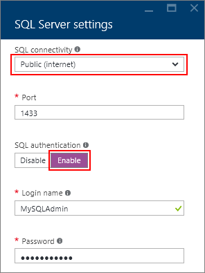

<properties 
    pageTitle="Connect to a SQL Server Virtual Machine (Resource Manager) | Microsoft Azure"
    description="This topic uses resources created with the classic deployment model, and describes how to connect to SQL Server running on a Virtual Machine in Azure. The scenarios differ depending on the networking configuration and the location of the client."
    services="virtual-machines"
    documentationCenter="na"
    authors="rothja"
    manager="jeffreyg"
    editor="monicar"    
    tags="azure-service-management"/>

<tags 
    ms.service="virtual-machines"
    ms.devlang="na"
    ms.topic="article"
    ms.tgt_pltfrm="vm-windows-sql-server"
    ms.workload="infrastructure-services"
    ms.date="12/18/2015"
    ms.author="jroth" />

# Connect to a SQL Server Virtual Machine on Azure (Resource Manager)
> [AZURE.SELECTOR]AZURE.SELECTOR]
> 
> * [Resource Manager](virtual-machines-sql-server-connectivity-resource-manager.md)
> * [Classic](virtual-machines-sql-server-connectivity.md)
> 
> 
## Overview
Configuring connectivity to SQL Server running on an Azure Virtual Machine in Resource Manager does not differ dramatically from the steps required for an on-premises SQL Server instance. You still have to work with configuration steps involving the firewall, authentication, and database logins.

But there are some SQL Server connectivity aspects that are specific to Azure VMs. This article covers some [general connectivity scenarios](#connection-scenarios.md) and then provides [detailed steps for configuring SQL Server connectivity in an Azure VM](#steps-for-manually-configuring-sql-server-connectivity-in-an-azure-vm.md).

This article focuses on connectivity. For a full walk-through of both provisioning and connectivity, see [Provisioning a SQL Server Virtual Machine on Azure](virtual-machines-provision-sql-server.md).

> [AZURE.NOTE] Azure has two different deployment models for creating and working with resources:  [Resource Manager and classic](../resource-manager-deployment-model.md).  This article covers using the Resource Manager deployment model, which Microsoft recommends for most new deployments instead of the classic deployment model.

## Connection scenarios
The way a client connects to SQL Server running on a Virtual Machine differs depending on the location of the client and the machine/networking configuration. These scenarios include:

* [Connect to SQL Server over the internet](#connect-to-sql-server-over-the-internet.md)
* [Connect to SQL Server in the same virtual network](#connect-to-sql-server-in-the-same-virtual-network.md)

### Connect to SQL Server over the Internet
If you want to connect to your SQL Server database engine from the Internet, there are several steps required, such as configuring the firewall, enabling SQL Authentication, and configuring your network security group you must have a Network Security Group rule to allow TCP traffic on port 1433. 

If you use the portal to provision a SQL Server virtual machine image with the resource manager, these steps are done for you when you select **Public** for the SQL connectivity option:

If this was not one during provisioning, then you can manually configure SQL Server and your virtual machines by following the [steps in this article to manually configure connectivity](#steps-for-manually-configuring-sql-server-connectivity-in-an-azure-vm.md). 

Once this is done, any client with internet access can connect to the SQL Server instance by specifying either the public IP address of the virtual machine or the DNS label assigned to that IP address. If the SQL Server port is 1433, you do not need to specify it in the connection string.

    "Server=sqlvmlabel.eastus.cloudapp.azure.com;Integrated Security=false;User ID=<login_name>;Password=<your_password>"

Although this enables connectivity for clients over the internet, this does not imply that anyone can connect to your SQL Server. Outside clients have to the correct username and password. For additional security, you can avoid the well-known port 1433. For example, if you configured SQL Server to listen on port 1500 and established proper firewall and network security group rules, you could connect by appending the port number to the Server name as in the following example:

    "Server=sqlvmlabel.eastus.cloudapp.azure.com,1500;Integrated Security=false;User ID=<login_name>;Password=<your_password>"

> [!NOTE]
> It is important to note that when you use this technique to communicate with SQL Server, all data returned is considered outgoing traffic from the datacenter. It is subject to normal [pricing on outbound data transfers](https://azure.microsoft.com/pricing/details/data-transfers/). This is true even if you use this technique from another machine or cloud service within the same Azure datacenter, because traffic still goes through Azure's public load balancer.
> 
> 
### Connect to SQL Server in the same virtual network
[Virtual Network](..\virtual-network\virtual-networks-overview.md) enables additional scenarios. You can connect VMs in the same virtual network, even if those VMs exist in different resource groups. And with a [site-to-site VPN](../vpn-gateway/vpn-gateway-site-to-site-create.md), you can create a hybrid architecture that connects VMs with on-premises networks and machines.

Virtual networks also enables you to join your Azure VMs to a domain. This is the only way to use Windows Authentication to SQL Server. The other connection scenarios require SQL Authentication with user names and passwords.

If you use the portal to provision a SQL Server virtual machine image with the resource manager, the proper firewall rules for communication on the virtual network are setup when you select **Private** for the SQL connectivity option. If this was not one during provisioning, then you can manually configure SQL Server and your virtual machines by following the [steps in this article to manually configure connectivity](#steps-for-manually-configuring-sql-server-connectivity-in-an-azure-vm.md). But if you are planning to configure a domain environment and Windows Authentication, you do not need to use the steps in this article to configure SQL Authentication and logins. You also do not need to configure Network Security Group rules for access over the internet.

Assuming that you have configured DNS in your virtual network, you can connect to your SQL Server instance by specifying the SQL Server VM computer name in the connection string. The following example also assumes that Windows Authentication has also been configured and that the user has been granted access to the SQL Server instance.

    "Server=mysqlvm;Integrated Security=true" 

Note that in this scenario, you could also specify the IP address of the VM.

## Steps for manually configuring SQL Server connectivity in an Azure VM
The following steps demonstrate how to manually setup connectivity to the SQL Server instance and then optionally connect over the internet using SQL Server Management Studio (SSMS). Note that many of these steps are done for you when you select the appropriate SQL Server connectivity options in the portal.

Before you can connect to the instance of SQL Server from another VM or the internet, you must complete the following tasks as described in the sections that follow:

* [Open TCP ports in the Windows firewall](#open-tcp-ports-in-the-windows-firewall-for-the-default-instance-of-the-database-engine.md)
* [Configure SQL Server to listen on the TCP protocol](#configure-sql-server-to-listen-on-the-tcp-protocol.md)
* [Configure SQL Server for mixed mode authentication](#configure-sql-server-for-mixed-mode-authentication.md)
* [Create SQL Server authentication logins](#create-sql-server-authentication-logins.md)
* [Configure a DNS Label for the public IP address](#configure-a-dns-label-for-the-public-ip-address.md)
* [Connect to the Database Engine from another computer](#connect-to-the-database-engine-from-another-computer.md)

### Open TCP ports in the Windows firewall for the default instance of the Database Engine

1. Connect to the virtual machine via Windows Remote Desktop. Once logged in, at the Start screen, type **WF.msc**, and then hit ENTER. 

	
2. In the **Windows Firewall with Advanced Security**, in the left pane, right-click **Inbound Rules**, and then click **New Rule** in the action pane.

	

3. In the **New Inbount Rule Wizard** dialog box, under **Rule Type**, select **Port**, and then click **Next**.

4. In the **Protocol and Ports** dialog, use the default **TCP**. In the **Specific local ports** box, then type the port number of the instance of the Database Engine (**1433** for the default instance or your choice for the private port in the endpoint step). 

	

5. Click **Next**.

6. In the **Action** dialog box, select **Allow the connection**, and then click **Next**.

	**Security Note:** Selecting **Allow the connection if it is secure** can provide additional security. Select this option if you want to configure additional security options in your environment.

	

7. In the **Profile** dialog box, select **Public**, **Private**, and **Domain**. Then click **Next**. 

    **Security Note:**  Selecting **Public** allows access over the internet. Whenever possible, select a more restrictive profile.

	

8. In the **Name** dialog box, type a name and description for this rule, and then click **Finish**.

	

Open additional ports for other components as needed. For more information, see [Configuring the Windows Firewall to Allow SQL Server Access](http://msdn.microsoft.com/library/cc646023.aspx).

### Configure SQL Server to listen on the TCP protocol

1. While connected to the virtual machine, on the Start page, type **SQL Server Configuration Manager** and hit ENTER.
	
	

2. In SQL Server Configuration Manager, in the console pane, expand **SQL Server Network Configuration**.

3. In the console pane, click **Protocols for MSSQLSERVER** (he default instance name.) In the details pane, right-click TCP, it should be Enabled for the gallery images by default. For your custom images, click **Enable** (if its status is Disabled.)

	

5. In the console pane, click **SQL Server Services**. In the details pane, right-click **SQL Server (_instance name_)** (the default instance is **SQL Server (MSSQLSERVER)**), and then click **Restart**, to stop and restart the instance of SQL Server. 

	

7. Close SQL Server Configuration Manager.

For more information about enabling protocols for the SQL Server Database Engine, see [Enable or Disable a Server Network Protocol](http://msdn.microsoft.com/library/ms191294.aspx).

### Configure SQL Server for mixed mode authentication

The SQL Server Database Engine cannot use Windows Authentication without domain environment. To connect to the Database Engine from another computer, configure SQL Server for mixed mode authentication. Mixed mode authentication allows both SQL Server Authentication and Windows Authentication.

>[AZURE.NOTE] Configuring mixed mode authentication might not be necessary if you have configured an Azure Virtual Network with a configured domain environment.

1. While connected to the virtual machine, on the Start page, type **SQL Server 2014 Management Studio** and click the selected icon.

	

	The first time you open Management Studio it must create the users Management Studio environment. This may take a few moments.

2. Management Studio presents the **Connect to Server** dialog box. In the **Server name** box, type the name of the virtual machine to connect to the Database Engine  with the Object Explorer. (Instead of the virtual machine name you can also use **(local)** or a single period as the **Server name**. Select **Windows Authentication**, and leave **_your_VM_name_\your_local_administrator** in the **User name** box. Click **Connect**.

	

3. In SQL Server Management Studio Object Explorer, right-click the name of the instance of SQL Server (the virtual machine name), and then click **Properties**.

	

4. On the **Security** page, under **Server authentication**, select **SQL Server and Windows Authentication mode**, and then click **OK**.

	

5. In the SQL Server Management Studio dialog box, click **OK** to acknowledge the requirement to restart SQL Server.

6. In Object Explorer, right-click your server, and then click **Restart**. (If SQL Server Agent is running, it must also be restarted.)

	

7. In the SQL Server Management Studio dialog box, click **Yes** to agree that you want to restart SQL Server.

### Create SQL Server authentication logins

To connect to the Database Engine from another computer, you must create at least one SQL Server authentication login.

1. In SQL Server Management Studio Object Explorer, expand the folder of the server instance in which you want to create the new login.

2. Right-click the **Security** folder, point to **New**, and select **Login...**.

	

3. In the **Login - New** dialog box, on the **General** page, enter the name of the new user in the **Login name** box.

4. Select **SQL Server authentication**.

5. In the **Password** box, enter a password for the new user. Enter that password again into the **Confirm Password** box.

6. To enforce password policy options for complexity and enforcement, select **Enforce password policy** (recommended). This is a default option when SQL Server authentication is selected.

7. To enforce password policy options for expiration, select **Enforce password expiration** (recommended). Enforce password policy must be selected to enable this checkbox. This is a default option when SQL Server authentication is selected.

8. To force the user to create a new password after the first time the login is used, select **User must change password at next login** (Recommended if this login is for someone else to use. If the login is for your own use, do not select this option.) Enforce password expiration must be selected to enable this checkbox. This is a default option when SQL Server authentication is selected. 

9. From the **Default database** list, select a default database for the login. **master** is the default for this option. If you have not yet created a user database, leave this set to **master**.

10. In the **Default language** list, leave **default** as the value.
    
	

11. If this is the first login you are creating, you may want to designate this login as a SQL Server administrator. If so, on the **Server Roles** page, check **sysadmin**. 

	**Security Note:** Members of the sysadmin fixed server role have complete control of the Database Engine. You should carefully restrict membership in this role.

	

12. Click OK.

For more information about SQL Server logins, see [Create a Login](http://msdn.microsoft.com/library/aa337562.aspx).

### Configure a Network Security Group inbound rule for the VM

If you want to be able to connect to SQL Server over the internet, you have to configure an inbound rule on the Network Security Group for the port that your SQL Server instance is listening. By default, this is TCP port 1433.

1. In the portal, select **Virtual machines**, and then select your SQL Server VM.

2. Click the **All settings** link.

3. Expand **Nework interfaces**.

	

4. Then select the Network Interface for your VM. 

4. Click the **Network security group** link.

	

6. In the properties of the Network Security Group, expand **Inbound security rules**.

5. Click the **Add** button.

6. Provide a **Name** of "SQLServerPublicTraffic".

7. Change **Protocol** to **TCP**.

8. Specify a **Destination port range** of 1433 (or the port that your SQL Server Instance is listening on). 

9. Verify that **Action** is set to **Allow**. The security rule dialog should look similar to the following screenshot.

	

9. Click **OK** to save the rule for your VM.

### Configure a DNS Label for the public IP address

To connect to the SQL Server Database Engine from the Internet, first configure a DNS Label for your public IP address. Note that this step is not necessary if you plan to only connect to the SQL Server instance within the same Virtual Network or only locally.

To create a DNS Lable, first select **Virtual machines** in the portal. Select your SQL Server VM to bring up its properties.

1. In the virtual machine blade, select your **Public IP address.**

	

2. In the properties for your Public IP address, expand **Configuration**.

3. Enter a DNS Label name. This is an A Record that can be used to connect to your SQL Server VM by name instead of by IP Address directly.

	

### Connect to the Database Engine from another computer
 
1. On a computer connected to the internet, open SQL Server Management Studio (SSMS).

2. In the **Connect to Server** or **Connect to Database Engine** dialog box, in the**Server name** box, enter the full DNS name of the virtual machine (determined in the previous task).

3. In the **Authentication** box, select **SQL Server Authentication**.

5. In the **Login** box, type the name of a valid SQL login.

6. In the **Password** box, type the password of the login.

7. Click **Connect**.

	

## Next Steps
To see provisioning instructions along with these connectivity steps, see [Provisioning a SQL Server Virtual Machine on Azure](virtual-machines-provision-sql-server.md).

It is important to review all of the security best practices for SQL Server running on an Azure virtual machine. For more information, see [Security Considerations for SQL Server in Azure Virtual Machines](virtual-machines-sql-server-security-considerations.md).

For other topics related to running SQL Server in Azure VMs, see [SQL Server on Azure Virtual Machines](virtual-machines-sql-server-infrastructure-services.md). 

