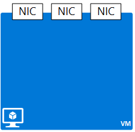

<properties 
   pageTitle="Network Resource Provider Overview | Microsoft Azure"
   description="Learn about the new Network Resource Provider in Azure Resource Manager"
   services="virtual-network"
   documentationCenter="na"
   authors="telmosampaio"
   manager="carmonm"
   editor="tysonn" />

<tags 
   ms.service="virtual-network"
   ms.devlang="na"
   ms.topic="article"
   ms.tgt_pltfrm="na"
   ms.workload="infrastructure-services"
   ms.date="12/11/2015"
   ms.author="telmos" />

# Network Resource Provider
An underpinning need in today’s business success, is the ability to build and manage large scale network aware applications in an agile, flexible, secure and repeatable way. Azure Resource Manager (ARM) enables you to create such applications, as a single collection of resources in resource groups. Such resources are managed through various resource providers under ARM. 

Azure Resource Manager relies on different resource providers to provide access to your resources. There are three main resource providers: Network, Storage and Compute. This document discusses the characteristics and benefits of the Network Resource Provider, including:

* **Metadata** – you can add information to resources using tags. These tags can be used to track resource utilization across resource groups and subscriptions.
* **Greater control of your network** - network resources are loosely coupled and you can control them in a more granular fashion. This means you have more flexibility in managing the networking resources.
* **Faster configuration** - because network resources are loosely coupled, you can create and orchestrate network resources in parallel. This has drastically reduced configuration time.
* **Role Based Access Control** - RBAC provides default roles, with specific security scope, in addition to allowing the creation of custom roles for secure management. 
* **Easier management and deployment** - it’s easier to deploy and manage applications since you can can create an entire application stack as a single collection of resources in a resource group. And faster to deploy, since you can deploy by simply providing a template JSON payload.
* **Rapid customization** - you can use declarative-style templates to enable repeatable and rapid customization of deployments. 
* **Repeatable customization** - you can use declarative-style templates to enable repeatable and rapid customization of deployments.
* **Management interfaces** - you can use any of the following interfaces to manage your resources:  * REST based API
* PowerShell
* .NET SDK
* Node.JS SDK
* Java SDK
* Azure CLI
* Preview Portal
* ARM template language

## Network resources
You can now manage network resources independently, instead of having them all managed through a single compute resource (a virtual machine). This ensures a higher degree of flexibility and agility in composing a complex and large scale infrastructure in a resource group.

A conceptual view of a sample deployment involving a multi-tiered application is presented below. Each resource you see, such as NICs, public IP addresses, and VMs, can be managed independently. 

Every resource contains a common set of properties, and their individual property set. The common properties are:

| Property | Description | Sample values |
| --- | --- | --- |
| **name** |Unique resource name. Each resource type has its own naming restrictions. |PIP01, VM01, NIC01 |
| **location** |Azure region in which the resource resides |westus, eastus |
| **id** |Unique URI based identification |/subscriptions/<subGUID>/resourceGroups/TestRG/providers/Microsoft.Network/publicIPAddresses/TestPIP |

You can check the individual properties of resources in the sections below.

## Public IP address
A public IP address resource provides either a reserved or dynamic Internet facing IP address. Although you can create a public IP address as a stand alone object, you need to associate it to another object to actually use the address. You can associate a public IP address to a load balancer, application  gateway, or a NIC to provide Internet access to those resources.  

|Property|Description|Sample values|
|---|---|---|
|**publicIPAllocationMethod**|Defines if the IP address is *static* or *dynamic*.|static, dynamic|
|**idleTimeoutInMinutes**|Defines the idle time out, with a default value of 4 minutes. If no more packets for a given session is received within this time, the session is terminated.|any value between 4 and 30|
|**ipAddress**|IP address assigned to object. This is a read-only property.|104.42.233.77|

### DNS settings
Public IP addresses have a child object named **dnsSettings** containing the following properties:

|Property|Description|Sample values|
|---|---|---|
|**domainNameLabel**|Host named used for name resolution.|www, ftp, vm1|
|**fqdn**|Fully qualified name for the public IP.|www.westus.cloudapp.azure.com|
|**reverseFqdn**|Fully qualified domain name that resolves to the IP address and is registered in DNS as a PTR record.|www.contoso.com.|

Sample public IP address in JSON format:

	{
	   "name": "PIP01",
	   "location": "North US",
	   "tags": { "key": "value" },
	   "properties": {
	      "publicIPAllocationMethod": "Static",
	      "idleTimeoutInMinutes": 4,
		  "ipAddress": "104.42.233.77",
	      "dnsSettings": {
	         "domainNameLabel": "mylabel",
			 "fqdn": "mylabel.westus.cloudapp.azure.com",
	         "reverseFqdn": "contoso.com."
	      }
	   }
	} 

### Additional resources

- Get more information about [public IP addresses](virtual-networks-reserved-public-ip.md).
- Learn about [instance level public IP addresses](virtual-networks-instance-level-public-ip.md).
- Read the [REST API reference documentation](https://msdn.microsoft.com/library/azure/mt163638.aspx) for public IP addresses.

## NIC
 
A network interface card (NIC) resource provides network connectivity to an existing subnet in a VNet resource. Although you can create a NIC as a stand alone object, you need to associate it to another object to actually provide connectivity. A NIC can be used to connect a VM to a subnet, a public IP address, or a load balancer.  

|Property|Description|Sample values|
|---|---|---|
|**virtualMachine**|VM the NIC is associated with.|/subscriptions/{guid}/../Microsoft.Compute/virtualMachines/vm1|
|**macAddress**|MAC address for the NIC|any value between 4 and 30|
|**networkSecurityGroup**|NSG associated to the NIC|/subscriptions/{guid}/../Microsoft.Network/networkSecurityGroups/myNSG1|
|**dnsSettings**|DNS settings for the NIC|see [PIP](#Public-IP-address)|

A Network Interface Card, or NIC, represents a network interface that can be associated to a virtual machine (VM). A VM can have one or more NICs.

### IP configurations
NICs have a child object named **ipConfigurations** containing the following properties:

|Property|Description|Sample values|
|---|---|---|
|**subnet**|Subnet the NIC is onnected to.|/subscriptions/{guid}/../Microsoft.Network/virtualNetworks/myvnet1/subnets/mysub1|
|**privateIPAddress**|IP address for the NIC in the subnet|10.0.0.8|
|**privateIPAllocationMethod**|IP allocation method|Dynamic or Static|
|**enableIPForwarding**|Whether the NIC can be used for routing|true or false|
|**primary**|Whether the NIC is the primary NIC for the VM|true or false|
|**publicIPAddress**|PIP associated with the NIC|see [DNS Settings](#DNS-settings)|
|**loadBalancerBackendAddressPools**|Back end address pools the NIC is associated with||
|**loadBalancerInboundNatRules**|Inbound load balancer NAT rules the NIC is associated with||

Sample public IP address in JSON format:

	{
	    "name": "lb-nic1-be",
	    "id": "/subscriptions/xxxxxxxx-xxxx-xxxx-xxxx-xxxxxxxxxxxx/resourceGroups/nrprg/providers/Microsoft.Network/networkInterfaces/lb-nic1-be",
	    "etag": "W/\"xxxxxxxx-xxxx-xxxx-xxxx-xxxxxxxxxxxx\"",
	    "type": "Microsoft.Network/networkInterfaces",
	    "location": "eastus",
	    "properties": {
	        "provisioningState": "Succeeded",
	        "resourceGuid": "xxxxxxxx-xxxx-xxxx-xxxx-xxxxxxxxxxxx",
	        "ipConfigurations": [
	            {
	                "name": "NIC-config",
	                "id": "/subscriptions/xxxxxxxx-xxxx-xxxx-xxxx-xxxxxxxxxxxx/resourceGroups/nrprg/providers/Microsoft.Network/networkInterfaces/lb-nic1-be/ipConfigurations/NIC-config",
	                "etag": "W/\"0027f1a2-3ac8-49de-b5d5-fd46550500b1\"",
	                "properties": {
	                    "provisioningState": "Succeeded",
	                    "privateIPAddress": "10.0.0.4",
	                    "privateIPAllocationMethod": "Dynamic",
	                    "subnet": {
	                        "id": "/subscriptions/xxxxxxxx-xxxx-xxxx-xxxx-xxxxxxxxxxxx/resourceGroups/NRPRG/providers/Microsoft.Network/virtualNetworks/NRPVnet/subnets/NRPVnetSubnet"
	                    },
	                    "loadBalancerBackendAddressPools": [
	                        {
	                            "id": "/subscriptions/xxxxxxxx-xxxx-xxxx-xxxx-xxxxxxxxxxxx/resourceGroups/nrprg/providers/Microsoft.Network/loadBalancers/nrplb/backendAddressPools/NRPbackendpool"
	                        }
	                    ],
	                    "loadBalancerInboundNatRules": [
	                        {
	                            "id": "/subscriptions/xxxxxxxx-xxxx-xxxx-xxxx-xxxxxxxxxxxx/resourceGroups/nrprg/providers/Microsoft.Network/loadBalancers/nrplb/inboundNatRules/rdp1"
	                        }
	                    ]
	                }
	            }
	        ],
	        "dnsSettings": { ... },
	        "macAddress": "00-0D-3A-10-F1-29",
	        "enableIPForwarding": false,
	        "primary": true,
	        "virtualMachine": {
	            "id": "/subscriptions/xxxxxxxx-xxxx-xxxx-xxxx-xxxxxxxxxxxx/resourceGroups/nrprg/providers/Microsoft.Compute/virtualMachines/web1"
	        }
	    }
	}

### Additional resources

- Read the [REST API reference documentation](https://msdn.microsoft.com/library/azure/mt163579.aspx) for NICs.

## Network Security Group
An NSG resource enables the creation of security boundary for workloads, by implementing allow and deny rules. Such rules can be applied to a VM, a NIC, or a subnet.

|Property|Description|Sample values|
|---|---|---|
|**subnets**|List of subnet ids the NSG is applied to.|/subscriptions/xxxxxxxx-xxxx-xxxx-xxxx-xxxxxxxxxxxx/resourceGroups/TestRG/providers/Microsoft.Network/virtualNetworks/TestVNet/subnets/FrontEnd|
|**securityRules**|List of security rules that make up the NSG|See [Security rule](#Security-rule) below|
|**defaultSecurityRules**|List of default security rules present in every NSG|See [Default security rules](#Default-security-rules) below|

- **Security rule** - An NSG can have multiple security rules defined. Each rule can allow or deny different types of traffic.

### Security rule
A security rule is a child resource of an NSG containing the properties below.

|Property|Description|Sample values|
|---|---|---|
|**description**|Description for the rule|Allow inbound traffic for all VMs in subnet X|
|**protocol**|Protocol to match for the rule|TCP, UDP, or *|
|**sourcePortRange**|Source port range to match for the rule|80, 100-200, *|
|**destinationPortRange**|Destination port range to match for the rule|80, 100-200, *|
|**sourceAddressPrefix**|Source address prefix to match for the rule|10.10.10.1, 10.10.10.0/24, VirtualNetwork|
|**destinationAddressPrefix**|Destination address prefix to match for the rule|10.10.10.1, 10.10.10.0/24, VirtualNetwork|
|**direction**|Direction of traffic to match for the rule|inbound or outbound|
|**priority**|Priority for the rule. Rules are checked int he order of priority, once a rule applies, no more rules are tested for matching.|10, 100, 65000|
|**access**|Type of access to apply if the rule matches|allow or deny|

Sample NSG in JSON format:

	{
	    "name": "NSG-BackEnd",
	    "id": "/subscriptions/xxxxxxxx-xxxx-xxxx-xxxx-xxxxxxxxxxxx/resourceGroups/TestRG/providers/Microsoft.Network/networkSecurityGroups/NSG-BackEnd",
	    "etag": "W/\"xxxxxxxx-xxxx-xxxx-xxxx-xxxxxxxxxxxx\"",
	    "type": "Microsoft.Network/networkSecurityGroups",
	    "location": "westus",
	    "tags": {
	        "displayName": "NSG - Front End"
	    },
	    "properties": {
	        "provisioningState": "Succeeded",
	        "resourceGuid": "xxxxxxxx-xxxx-xxxx-xxxx-xxxxxxxxxxxx",
	        "securityRules": [
	            {
	                "name": "rdp-rule",
	                "id": "/subscriptions/xxxxxxxx-xxxx-xxxx-xxxx-xxxxxxxxxxxx/resourceGroups/TestRG/providers/Microsoft.Network/networkSecurityGroups/NSG-BackEnd/securityRules/rdp-rule",
	                "etag": "W/\"xxxxxxxx-xxxx-xxxx-xxxx-xxxxxxxxxxxx\"",
	                "properties": {
	                    "provisioningState": "Succeeded",
	                    "description": "Allow RDP",
	                    "protocol": "Tcp",
	                    "sourcePortRange": "*",
	                    "destinationPortRange": "3389",
	                    "sourceAddressPrefix": "Internet",
	                    "destinationAddressPrefix": "*",
	                    "access": "Allow",
	                    "priority": 100,
	                    "direction": "Inbound"
	                }
	            }
	        ],
	        "defaultSecurityRules": [
	            { [...],
	        "subnets": [
	            {
	                "id": "/subscriptions/xxxxxxxx-xxxx-xxxx-xxxx-xxxxxxxxxxxx/resourceGroups/TestRG/providers/Microsoft.Network/virtualNetworks/TestVNet/subnets/FrontEnd"
	            }
	        ]
	    }
	}

### Default security rules
Default security rules have the same properties available in security rules. They exist to provide basic connectivity between resources that have NSGs applied to them. Make sure you know which [default security rules](./virtual-networks-nsg.md#Default-Rules) exist. 

### Additional resources

- Get more information about [NSGs](virtual-networks-nsg.md).
- Read the [REST API reference documentation](https://msdn.microsoft.com/library/azure/mt163615.aspx) for NSGs.
- Read the [REST API reference documentation](https://msdn.microsoft.com/library/azure/mt163580.aspx) for security rules.

## Route tables
Route table resources contains routes used to define how traffic flows within your Azure infrastructure. You can use user defined routes (UDR) to send all traffic from a given subnet to a virtual appliance, such as a firewall or intrusion detection system (IDS). You can associate a route table to subnets. 

Route tables contain the following properties.

|Property|Description|Sample values|
|---|---|---|
|**routes**|Collection of user defined routes in the route table|see [user defined routes](#User-defined-routes)|
|**subnets**|Collection of subnets the route table is applied to|see [subnets](#Subnets)|

### User defined routes
You can create UDRs to specify where traffic should be sent to, based on its destination address. You can think of a route as the default gateway definition based on the destination address of a network packet.

UDRs contain the following properties. 

|Property|Description|Sample values|
|---|---|---|
|**addressPrefix**|Address prefix, or full IP address for the destination|192.168.1.0/24, 192.168.1.101|
|**nextHopType**|Type of device the traffic will be sent to|VirtualAppliance, VPN Gateway, Internet|
|**nextHopIpAddress**|IP address for the next hop|192.168.1.4|

Sample route table in JSON format:

	{
	    "name": "UDR-BackEnd",
	    "id": "/subscriptions/xxxxxxxx-xxxx-xxxx-xxxx-xxxxxxxxxxxx/resourceGroups/TestRG/providers/Microsoft.Network/routeTables/UDR-BackEnd",
	    "etag": "W/\"xxxxxxxx-xxxx-xxxx-xxxx-xxxxxxxxxxxx\"",
	    "type": "Microsoft.Network/routeTables",
	    "location": "westus",
	    "properties": {
	        "provisioningState": "Succeeded",
	        "routes": [
	            {
	                "name": "RouteToFrontEnd",
	                "id": "/subscriptions/xxxxxxxx-xxxx-xxxx-xxxx-xxxxxxxxxxxx/resourceGroups/TestRG/providers/Microsoft.Network/routeTables/UDR-BackEnd/routes/RouteToFrontEnd",
	                "etag": "W/\"v\"",
	                "properties": {
	                    "provisioningState": "Succeeded",
	                    "addressPrefix": "192.168.1.0/24",
	                    "nextHopType": "VirtualAppliance",
	                    "nextHopIpAddress": "192.168.0.4"
	                }
	            }
	        ],
	        "subnets": [
	            {
	                "id": "/subscriptions/xxxxxxxx-xxxx-xxxx-xxxx-xxxxxxxxxxxx/resourceGroups/TestRG/providers/Microsoft.Network/virtualNetworks/TestVNet/subnets/BackEnd"
	            }
	        ]
	    }
	}

### Additional resources

- Get more information about [UDRs](virtual-networks-udr-overview.md).
- Read the [REST API reference documentation](https://msdn.microsoft.com/library/azure/mt502549.aspx) for route tables.
- Read the [REST API reference documentation](https://msdn.microsoft.com/library/azure/mt502539.aspx) for user defined routes (UDRs).

## Virtual Network
Virtual Networks (VNET) and subnets resources help define a security boundary for workloads running in Azure. A VNet is characterized by a collection of address spaces, defined as CIDR blocks. 

>[AZURE.NOTE] Network administrators are familiar with CIDR notation. If you are not familiar with CIDR, [learn more about it](http://whatismyipaddress.com/cidr).

VNets contain the following properties.

|Property|Description|Sample values|
|---|---|---|
|**addressSpace**|Collection of address prefixes that make up the VNet in CIDR notation|192.168.0.0/16|
|**subnets**|Collection of subnets that make up the VNet|see [subnets](#Subnets) below.|
|**ipAddress**|IP address assigned to object. This is a read-only property.|104.42.233.77|

### Subnets
A subnet is a child resource of a VNet, and helps define segments of address spaces within a CIDR block, using IP address prefixes. NICs can be added to subnets, and connected to VMs, providing connectivity for various workloads.

Subnets contain the following properties. 

|Property|Description|Sample values|
|---|---|---|
|**addressPrefix**|Single address prefix that make up the subnet in CIDR notation|192.168.1.0/24|
|**networkSecurityGroup**|NSG applied to the subnet|see [NSGs](#Network-Security-Group)|
|**routeTable**|Route table applied to the subnet|see [UDR](#Route-table)|
|**ipConfigurations**|Collection of IP configruation objects used by NICs connected to the subnet|see [UDR](#Route-table)|

Sample VNet in JSON format:

	{
	    "name": "TestVNet",
	    "id": "/subscriptions/xxxxxxxx-xxxx-xxxx-xxxx-xxxxxxxxxxxx/resourceGroups/TestRG/providers/Microsoft.Network/virtualNetworks/TestVNet",
	    "etag": "W/\"xxxxxxxx-xxxx-xxxx-xxxx-xxxxxxxxxxxx\"",
	    "type": "Microsoft.Network/virtualNetworks",
	    "location": "westus",
	    "tags": {
	        "displayName": "VNet"
	    },
	    "properties": {
	        "provisioningState": "Succeeded",
	        "resourceGuid": "xxxxxxxx-xxxx-xxxx-xxxx-xxxxxxxxxxxx",
	        "addressSpace": {
	            "addressPrefixes": [
	                "192.168.0.0/16"
	            ]
	        },
	        "subnets": [
	            {
	                "name": "FrontEnd",
	                "id": "/subscriptions/xxxxxxxx-xxxx-xxxx-xxxx-xxxxxxxxxxxx/resourceGroups/TestRG/providers/Microsoft.Network/virtualNetworks/TestVNet/subnets/FrontEnd",
	                "etag": "W/\"xxxxxxxx-xxxx-xxxx-xxxx-xxxxxxxxxxxx\"",
	                "properties": {
	                    "provisioningState": "Succeeded",
	                    "addressPrefix": "192.168.1.0/24",
	                    "networkSecurityGroup": {
	                        "id": "/subscriptions/xxxxxxxx-xxxx-xxxx-xxxx-xxxxxxxxxxxx/resourceGroups/TestRG/providers/Microsoft.Network/networkSecurityGroups/NSG-BackEnd"
	                    },
	                    "routeTable": {
	                        "id": "/subscriptions/xxxxxxxx-xxxx-xxxx-xxxx-xxxxxxxxxxxx/resourceGroups/TestRG/providers/Microsoft.Network/routeTables/UDR-FrontEnd"
	                    },
	                    "ipConfigurations": [
	                        {
	                            "id": "/subscriptions/xxxxxxxx-xxxx-xxxx-xxxx-xxxxxxxxxxxx/resourceGroups/TestRG/providers/Microsoft.Network/networkInterfaces/NICWEB1/ipConfigurations/ipconfig1"
	                        },
	                        ...]
	                }
	            },
	            ...]
	    }
	}

### Additional resources

- Get more information about [VNet](virtual-networks-overview.md).
- Read the [REST API reference documentation](https://msdn.microsoft.com/library/azure/mt163650.aspx) for VNets.
- Read the [REST API reference documentation](https://msdn.microsoft.com/library/azure/mt163618.aspx) for Subnets.

## Azure DNS

Azure DNS is a hosting service for DNS domains, providing name resolution using Microsoft Azure infrastructure.

| Property | Description | Sample Value |
|---|---|---|
| **DNSzones** | Domain zone information to host DNS records of a particular domain | /subscriptions/{guid}/.../providers/Microsoft.Network/dnszones/contoso.com"| 

### DNS record sets

DNS zones have a child object named record set. Record sets are a collection of host records by type for a DNS zone. Record types are A, AAAA, CNAME, MX, NS, SOA,SRV and TXT.

| Property | Description | Sample value |
|---|---|---|
| A | IPv4 record type | /subscriptions/{guid}/.../providers/Microsoft.Network/dnszones/contoso.com/A/www |
| AAAA | IPv6 record type| /subscriptions/{guid}/.../providers/Microsoft.Network/dnszones/contoso.com/AAAA/hostrecord |
| CNAME | canonical name record type 1 | /subscriptions/{guid}/.../providers/Microsoft.Network/dnszones/contoso.com/CNAME/www |
| MX | mail record type | /subscriptions/{guid}/.../providers/Microsoft.Network/dnszones/contoso.com/MX/mail |
| NS | name server record type | /subscriptions/{guid}/.../providers/Microsoft.Network/dnszones/contoso.com/NS/ |
| SOA | Start of Authority record type 2 | /subscriptions/{guid}/.../providers/Microsoft.Network/dnszones/contoso.com/SOA |
| SRV | service record type | /subscriptions/{guid}/.../providers/Microsoft.Network/dnszones/contoso.com/SRV |

1 only allows one value per record set.

2 only allows one record type SOA per DNS zone. 

Sample of DNS zone in Json format:

	{
	  "$schema": "http://schema.management.azure.com/schemas/2014-04-01-preview/deploymentTemplate.json",
	  "contentVersion": "1.0.0.0",
	  "parameters": {
	    "newZoneName": {
	      "type": "String",
	      "metadata": {
	          "description": "The name of the DNS zone to be created."
	      }
	    },
	    "newRecordName": {
	      "type": "String",
	      "defaultValue": "www",
	      "metadata": {
	          "description": "The name of the DNS record to be created.  The name is relative to the zone, not the FQDN."
	      }
	    }
	  },
	  "resources": 
	  [
	    {
	      "type": "microsoft.network/dnszones",
	      "name": "[parameters('newZoneName')]",
	      "apiVersion": "2015-05-04-preview",
	      "location": "global",
	      "properties": {
	      }
	    },
	    {
	      "type": "microsoft.network/dnszones/a",
		  "name": "[concat(parameters('newZoneName'), concat('/', parameters('newRecordName')))]",
      	"apiVersion": "2015-05-04-preview",
      	"location": "global",
	  	"properties": 
	  	{
        	"TTL": 3600,
			"ARecords": 
			[
			    {
				    "ipv4Address": "1.2.3.4"
				},
				{
				    "ipv4Address": "1.2.3.5"
				}
			]
	  	},
	  	"dependsOn": [
        	"[concat('Microsoft.Network/dnszones/', parameters('newZoneName'))]"
      	]
    	}
	  	]
	}

## Additional resources

Read the [REST API documentation for DNS zones ](https://msdn.microsoft.com/library/azure/mt130626.aspx) for more information.

Read the [REST API documentation for DNS record sets](https://msdn.microsoft.com/library/azure/mt130627.aspx) for more information.

## Load Balancer
A load balancer is used when you want to scale your applications. Typical deployment scenarios involve applications running on multiple VM instances. The VM instances are fronted by a load balancer that helps to distribute network traffic to the various instances. 

| Property | Description |
|---|---|
| *frontendIPConfigurations* | a Load balancer can include one or more front end IP addresses, otherwise known as a virtual IPs (VIPs). These IP addresses serve as ingress for the traffic and can be public IP or private IP |
|*backendAddressPools* | these are IP addresses associated with the VM NICs to which load will be distributed |
|*loadBalancingRules* | a rule property maps a given front end IP and port combination to a set of back end IP addresses and port combination. With a single definition of a load balancer resource, you can define multiple load balancing rules, each rule reflecting a combination of a front end IP and port and back end IP and port associated with virtual machines. The rule is one port in the front end pool to many virtual machines in the back end pool |  
| *Probes* | probes enable you to keep track of the health of VM instances. If a health probe fails, the virtual machine instance will be taken out of rotation automatically |
| *inboundNatRules* | NAT rules defining the inbound traffic flowing through the front end IP and distributed to the back end IP to a specific virtual machine instance. NAT rule is one port in the front end pool to one virtual machine in the back end pool | 

Example of load balancer template in Json format:

	{
	  "$schema": "https://schema.management.azure.com/schemas/2015-01-01/deploymentTemplate.json#",
	  "contentVersion": "1.0.0.0",
	  "parameters": {
	    "dnsNameforLBIP": {
	      "type": "string",
	      "metadata": {
	        "description": "Unique DNS name"
	      }
	    },
	    "location": {
	      "type": "string",
	      "allowedValues": [
	        "East US",
	        "West US",
	        "West Europe",
	        "East Asia",
	        "Southeast Asia"
	      ],
	      "metadata": {
	        "description": "Location to deploy"
	      }
	    },
	    "addressPrefix": {
	      "type": "string",
	      "defaultValue": "10.0.0.0/16",
	      "metadata": {
	        "description": "Address Prefix"
	      }
	    },
	    "subnetPrefix": {
	      "type": "string",
	      "defaultValue": "10.0.0.0/24",
	      "metadata": {
	        "description": "Subnet Prefix"
	      }
	    },
	    "publicIPAddressType": {
	      "type": "string",
	      "defaultValue": "Dynamic",
	      "allowedValues": [
	        "Dynamic",
	        "Static"
	      ],
	      "metadata": {
	        "description": "Public IP type"
	      }
	    }
	  },
	  "variables": {
	    "virtualNetworkName": "virtualNetwork1",
	    "publicIPAddressName": "publicIp1",
	    "subnetName": "subnet1",
	    "loadBalancerName": "loadBalancer1",
	    "nicName": "networkInterface1",
	    "vnetID": "[resourceId('Microsoft.Network/virtualNetworks',variables('virtualNetworkName'))]",
	    "subnetRef": "[concat(variables('vnetID'),'/subnets/',variables('subnetName'))]",
	    "publicIPAddressID": "[resourceId('Microsoft.Network/publicIPAddresses',variables('publicIPAddressName'))]",
	    "lbID": "[resourceId('Microsoft.Network/loadBalancers',variables('loadBalancerName'))]",
	    "nicId": "[resourceId('Microsoft.Network/networkInterfaces',variables('nicName'))]",
	    "frontEndIPConfigID": "[concat(variables('lbID'),'/frontendIPConfigurations/loadBalancerFrontEnd')]",
	    "backEndIPConfigID": "[concat(variables('nicId'),'/ipConfigurations/ipconfig1')]"
	  },
	  "resources": [
    {
      "apiVersion": "2015-05-01-preview",
      "type": "Microsoft.Network/publicIPAddresses",
      "name": "[variables('publicIPAddressName')]",
      "location": "[parameters('location')]",
      "properties": {
        "publicIPAllocationMethod": "[parameters('publicIPAddressType')]",
        "dnsSettings": {
          "domainNameLabel": "[parameters('dnsNameforLBIP')]"
        }
      }
    },
    {
      "apiVersion": "2015-05-01-preview",
      "type": "Microsoft.Network/virtualNetworks",
      "name": "[variables('virtualNetworkName')]",
      "location": "[parameters('location')]",
      "properties": {
        "addressSpace": {
          "addressPrefixes": [
            "[parameters('addressPrefix')]"
          ]
        },
        "subnets": [
          {
            "name": "[variables('subnetName')]",
            "properties": {
              "addressPrefix": "[parameters('subnetPrefix')]"
            }
          }
        ]
      }
    },
    {
      "apiVersion": "2015-05-01-preview",
      "type": "Microsoft.Network/networkInterfaces",
      "name": "[variables('nicName')]",
      "location": "[parameters('location')]",
      "dependsOn": [
        "[concat('Microsoft.Network/virtualNetworks/', variables('virtualNetworkName'))]",
        "[concat('Microsoft.Network/loadBalancers/', variables('loadBalancerName'))]"
      ],
      "properties": {
        "ipConfigurations": [
          {
            "name": "ipconfig1",
            "properties": {
              "privateIPAllocationMethod": "Dynamic",
              "subnet": {
                "id": "[variables('subnetRef')]"
              },
              "loadBalancerBackendAddressPools": [
                {
                  "id": "[concat(variables('lbID'), '/backendAddressPools/LoadBalancerBackend')]"
                }
              ],
              "loadBalancerInboundNatRules": [
                {
                  "id": "[concat(variables('lbID'),'/inboundNatRules/RDP')]"
                }
              ]
            }
          }
        ]
      }
    },
    {
      "apiVersion": "2015-05-01-preview",
      "name": "[variables('loadBalancerName')]",
      "type": "Microsoft.Network/loadBalancers",
      "location": "[parameters('location')]",
      "dependsOn": [
        "[concat('Microsoft.Network/publicIPAddresses/', variables('publicIPAddressName'))]"
      ],
      "properties": {
        "frontendIPConfigurations": [
          {
            "name": "loadBalancerFrontEnd",
            "properties": {
              "publicIPAddress": {
                "id": "[variables('publicIPAddressID')]"
              }
            }
          }
        ],
        "backendAddressPools": [
          {
            "name": "loadBalancerBackEnd"
          }
        ],
        "inboundNatRules": [
          {
            "name": "RDP",
            "properties": {
              "frontendIPConfiguration": {
                "id": "[variables('frontEndIPConfigID')]"
              },
              "protocol": "tcp",
              "frontendPort": 3389,
              "backendPort": 3389,
              "enableFloatingIP": false
            }
          }
        ]
      }
    }
	  ]
	}

### Additional resources

Read [load balancer REST API](https://msdn.microsoft.com/library/azure/mt163651.aspx) for more information.

## Application Gateway

Application Gateway provides an Azure-managed HTTP load balancing solution based on layer 7 load balancing. Application load balancing allows the use of routing rules for network traffic based on HTTP. 
 
| Property | Description | 
|---|---|
| **backendAddressPools** | The list of IP addresses of the back end servers. The IP addresses listed should either belong to the virtual network subnet, or should be a public IP/VIP or private IP |
| **backendHttpSettingsCollection** |  Every pool has settings like port, protocol, and cookie based affinity. These settings are tied to a pool and are applied to all servers within the pool |
| **frontendPorts** | This port is the public port opened on the application gateway. Traffic hits this port, and then gets redirected to one of the back end servers |
| **httpListeners** | Listener has a frontend port, a protocol (Http or Https, these are case-sensitive), and the SSL certificate name (if configuring SSL offload) |
| **requestRoutingRules** | The rule binds the listener and the back end server pool and defines which back end server pool the traffic should be directed. Currently works only as Round-robin |

Example of an application gateway Json template:

	{
	  "$schema": "https://schema.management.azure.com/schemas/2015-01-01/deploymentTemplate.json#",
	  "contentVersion": "1.0.0.0",
	  "parameters": {
	    "location": {
	      "type": "string",
	      "metadata": {
	        "description": "Location to deploy to"
	      }
	    },
	    "addressPrefix": {
	      "type": "string",
	      "defaultValue": "10.0.0.0/16",
	      "metadata": {
	        "description": "Address prefix for the Virtual Network"
	      }
	    },
	    "subnetPrefix": {
	      "type": "string",
	      "defaultValue": "10.0.0.0/28",
	      "metadata": {
	        "description": "Subnet prefix"
	      }
	    },
	    "skuName": {
	      "type": "string",
	      "allowedValues": [
	        "Standard_Small",
	        "Standard_Medium",
	        "Standard_Large"
	      ],
	      "defaultValue": "Standard_Medium",
	      "metadata": {
	        "description": "Sku Name"
	      }
	    },
	    "capacity": {
	      "type": "int",
	      "defaultValue": 2,
	      "metadata": {
	        "description": "Number of instances"
	      }
	    },
	    "backendIpAddress1": {
	      "type": "string",
	      "metadata": {
	        "description": "IP Address for Backend Server 1"
	      }
	    },
	    "backendIpAddress2": {
	      "type": "string",
	      "metadata": {
	        "description": "IP Address for Backend Server 2"
	      }
	    }
	  },
	  "variables": {
	    "applicationGatewayName": "applicationGateway1",
	    "publicIPAddressName": "publicIp1",
	    "virtualNetworkName": "virtualNetwork1",
	    "subnetName": "appGatewaySubnet",
	    "vnetID": "[resourceId('Microsoft.Network/virtualNetworks',variables('virtualNetworkName'))]",
    	"subnetRef": "[concat(variables('vnetID'),'/subnets/',variables('subnetName'))]",
    	"publicIPRef": "[resourceId('Microsoft.Network/publicIPAddresses',variables('publicIPAddressName'))]",
    	"applicationGatewayID": "[resourceId('Microsoft.Network/applicationGateways',variables('applicationGatewayName'))]",
		"apiVersion": "2015-05-01-preview"
  	},
 	 "resources": [
    	{
    	  "apiVersion": "[variables('apiVersion')]",
    	  "type": "Microsoft.Network/publicIPAddresses",
    	  "name": "[variables('publicIPAddressName')]",
    	  "location": "[parameters('location')]",
    	  "properties": {
    	    "publicIPAllocationMethod": "Dynamic"
    	  }
    	},
    	{
    	  "apiVersion": "[variables('apiVersion')]",
    	  "type": "Microsoft.Network/virtualNetworks",
    	  "name": "[variables('virtualNetworkName')]",
    	  "location": "[parameters('location')]",
    	  "properties": {
    	    "addressSpace": {
    	      "addressPrefixes": [
    	        "[parameters('addressPrefix')]"
    	      ]
    	    },
    	    "subnets": [
    	      {
    	        "name": "[variables('subnetName')]",
    	        "properties": {
    	          "addressPrefix": "[parameters('subnetPrefix')]"
    	        }
    	      }
    	    ]
    	  }
    	},
    	{
    	  "apiVersion": "[variables('apiVersion')]",
    	  "name": "[variables('applicationGatewayName')]",
    	  "type": "Microsoft.Network/applicationGateways",
    	  "location": "[parameters('location')]",
    	  "dependsOn": [
    	    "[concat('Microsoft.Network/virtualNetworks/', variables	('virtualNetworkName'))]",
    	    "[concat('Microsoft.Network/publicIPAddresses/', variables	('publicIPAddressName'))]"
    	  ],
    	  "properties": {
    	    "sku": {
    	      "name": "[parameters('skuName')]",
    	      "tier": "Standard",
    	      "capacity": "[parameters('capacity')]"
    	    },
    	    "gatewayIPConfigurations": [
    	      {
    	        "name": "appGatewayIpConfig",
    	        "properties": {
    	          "subnet": {
    	            "id": "[variables('subnetRef')]"
    	          }
    	        }
    	      }
    	    ],
    	    "frontendIPConfigurations": [
    	      {
    	        "name": "appGatewayFrontendIP",
    	        "properties": {
    	          "PublicIPAddress": {
    	            "id": "[variables('publicIPRef')]"
    	          }
    	        }
    	      }
    	    ],
    	    "frontendPorts": [
    	      {
    	        "name": "appGatewayFrontendPort",
    	        "properties": {
    	          "Port": 80
    	        }
    	      }
    	    ],
    	    "backendAddressPools": [
    	      {
    	        "name": "appGatewayBackendPool",
    	        "properties": {
    	          "BackendAddresses": [
    	            {
    	              "IpAddress": "[parameters('backendIpAddress1')]"
    	            },
    	            {
    	              "IpAddress": "[parameters('backendIpAddress2')]"
    	            }
    	          ]
    	        }
    	      }
    	    ],
    	    "backendHttpSettingsCollection": [
    	      {
    	        "name": "appGatewayBackendHttpSettings",
    	        "properties": {
    	          "Port": 80,
    	          "Protocol": "Http",
    	          "CookieBasedAffinity": "Disabled"
    	        }
    	      }
    	    ],
    	    "httpListeners": [
    	      {
    	        "name": "appGatewayHttpListener",
    	        "properties": {
    	          "FrontendIPConfiguration": {
    	            "Id": "[concat(variables('applicationGatewayID'), '/	frontendIPConfigurations/appGatewayFrontendIP')]"
    	          },
    	          "FrontendPort": {
    	            "Id": "[concat(variables('applicationGatewayID'), '/	frontendPorts/appGatewayFrontendPort')]"
    	          },
    	          "Protocol": "Http",
    	          "SslCertificate": null
    	        }
    	      }
    	    ],
    	    "requestRoutingRules": [
    	      {
    	        "Name": "rule1",
    	        "properties": {
    	          "RuleType": "Basic",
    	          "httpListener": {
    	            "id": "[concat(variables('applicationGatewayID'), '/	httpListeners/appGatewayHttpListener')]"
    	          },
    	          "backendAddressPool": {
    	            "id": "[concat(variables('applicationGatewayID'), '/	backendAddressPools/appGatewayBackendPool')]"
    	          },
    	          "backendHttpSettings": {
    	            "id": "[concat(variables('applicationGatewayID'), '/	backendHttpSettingsCollection/	appGatewayBackendHttpSettings')]"
    	          }
    	        }
    	      }
    	    ]
    	  }
    	}
  	]	
	}

### Additional resources

Read [ application gateway REST API](https://msdn.microsoft.com/library/azure/mt299388.aspx) for more information.

## VPN Gateway 
A VPN gateway resource enables you to create a secure connection between their on-premises data center and Azure. A VPN gateway resource can be configured in three different ways:
 
- **Point to Site** – you can securely access your Azure resources hosted in a VNET by using a VPN client from any computer. 
- **Multi-site connection** – you can securely connect from your on-premises data centers to resources running in a VNET. 
- **VNET to VNET** – you can securely connect across Azure VNETS within the same region, or across regions to build workloads with geo-redundancy.

Key properties of a VPN gateway include:
 
- **Gateway type** - dynamically routed or a static routed gateway. 
- **VPN Client Address Pool Prefix** – IP addresses to be assigned to clients connecting in a point to site configuration.

## Traffic Manager Profile

Traffic manager and its child endpoint resource enable DNS routing to endpoints in Azure and outside of Azure. Such traffic distribution is governed by routing  policy methods. Traffic manager also allows endpoint health to be monitored, and traffic diverted appropriately based on the health of an endpoint. 

| Property | Description |
|---|---|
|**trafficRoutingMethod**| possible values are *Performance*, *Weighted*, and *Priority* | 
| **dnsConfig** | FQDN for the profile | 
| **Protocol** | monitoring protocol, possible values are *HTTP* and *HTTPS*|
| **Port** | monitoring port |  
| **Path** | monitoring path |
| **Endpoints** |  container for endpoint resources | 

### Endpoint 

An endpoint is a child resource of a Traffic Manager Profile. It represents a service or web endpoint to which user traffic is distributed based on the configured policy in the Traffic Manager Profile resource. 

| Property | Description | 
|---|---| 
| **Type** |  the type of the endpoint, possible values are *Azure End point*, *External Endpoint*, and  *Nested Endpoint* | 
| **targetResourceId** |  public IP address of a service or web endpoint. This can be an Azure or external endpoint. | 
| **Weight** | endpoint weight used in traffic management. | 
| **Priority** | priority of the endpoint, used to define a failover action |

Sample of Traffic Manager in Json format: 

        {
            "apiVersion": "[variables('tmApiVersion')]",
            "type": "Microsoft.Network/trafficManagerProfiles",
            "name": "VMEndpointExample",
            "location": "global",
            "dependsOn": [
                "[concat('Microsoft.Network/publicIPAddresses/', variables('publicIPAddressName'), '0')]",
                "[concat('Microsoft.Network/publicIPAddresses/', variables('publicIPAddressName'), '1')]",
                "[concat('Microsoft.Network/publicIPAddresses/', variables('publicIPAddressName'), '2')]",
            ],
            "properties": {
                "profileStatus": "Enabled",
                "trafficRoutingMethod": "Weighted",
                "dnsConfig": {
                    "relativeName": "[parameters('dnsname')]",
                    "ttl": 30
                },
                "monitorConfig": {
                    "protocol": "http",
                    "port": 80,
                    "path": "/"
                },
                "endpoints": [
                    {
                        "name": "endpoint0",
                        "type": "Microsoft.Network/trafficManagerProfiles/azureEndpoints",
                        "properties": {
                            "targetResourceId": "[resourceId('Microsoft.Network/publicIPAddresses',concat(variables('publicIPAddressName'), 0))]",
                            "endpointStatus": "Enabled",
                            "weight": 1
                        }
                    },
                    {
                        "name": "endpoint1",
                        "type": "Microsoft.Network/trafficManagerProfiles/azureEndpoints",
                        "properties": {
                            "targetResourceId": "[resourceId('Microsoft.Network/publicIPAddresses',concat(variables('publicIPAddressName'), 1))]",
                            "endpointStatus": "Enabled",
                            "weight": 1
                        }
                    },
                    {
                        "name": "endpoint2",
                        "type": "Microsoft.Network/trafficManagerProfiles/azureEndpoints",
                        "properties": {
                            "targetResourceId": "[resourceId('Microsoft.Network/publicIPAddresses',concat(variables('publicIPAddressName'), 2))]",
                            "endpointStatus": "Enabled",
                            "weight": 1
                        }
                    }
                ]
            }
        }

 
## Additional resources

Read [REST API documentation for Traffic Manager](https://msdn.microsoft.com/library/azure/mt163664.aspx) for more information.

## Management interfaces
You can manage your Azure networking resources using different interfaces. In this document we will focus on tow of those interfaces: REST API, and templates.

### REST API
As mentioned earlier, network resources can be managed via a variety of interfaces, including REST API,.NET SDK, Node.JS SDK, Java SDK, PowerShell, CLI, Azure Portal and templates. 

The Rest API’s conform to the HTTP 1.1 protocol specification. The general URI structure of the API is presented below: 

    https://management.azure.com/subscriptions/{subscription-id}/providers/{resource-provider-namespace}/locations/{region-location}/register?api-version={api-version}

And the parameters in braces represent the following elements:

* **subscription-id** - your Azure subscription id.
* **resource-provider-namespace** - namespace for the provider being used. THe value for the network resource provider is *Microsoft.Network*.
* **region-name** - the Azure region name

The following HTTP methods are supported when making calls to the REST API:

* **PUT** - used to create a resource of a given type, modify a resource property or change an association between resources. 
* **GET** - used to retrieve information for a provisioned resource.
* **DELETE** - used to delete an existing resource.

Both the request and response conform to a JSON payload format. For more details, see [Azure Resource Management APIs](https://msdn.microsoft.com/library/azure/dn948464.aspx).

### ARM template language
In addition to managing resources imperatively (via APIs or SDK), you can also use a declarative programming style to build and manage network resources by using the ARM Template Language. 

A sample representation of a template is provided below – 

    {
      "$schema": "http://schema.management.azure.com/schemas/2014-04-01-preview/deploymentTemplate.json",
      "contentVersion": "<version-number-of-template>",
      "parameters": { <parameter-definitions-of-template> },
      "variables": { <variable-definitions-of-template> },
      "resources": [ { <definition-of-resource-to-deploy> } ],
      "outputs": { <output-of-template> }    
    }

The template is primarily a JSON description of the resources and the instance values injected via parameters. The example below can be used to create a virtual network with 2 subnets.

    {
        "$schema": "http://schema.management.azure.com/schemas/2014-04-01-preview/VNET.json",
        "contentVersion": "1.0.0.0",
        "parameters" : {
          "location": {
            "type": "String",
            "allowedValues": ["East US", "West US", "West Europe", "East Asia", "South East Asia"],
            "metadata" : {
              "Description" : "Deployment location"
            }
          },
          "virtualNetworkName":{
            "type" : "string",
            "defaultValue":"myVNET",
            "metadata" : {
              "Description" : "VNET name"
            }
          },
          "addressPrefix":{
            "type" : "string",
            "defaultValue" : "10.0.0.0/16",
            "metadata" : {
              "Description" : "Address prefix"
            }

          },
          "subnet1Name": {
            "type" : "string",
            "defaultValue" : "Subnet-1",
            "metadata" : {
              "Description" : "Subnet 1 Name"
            }
          },
          "subnet2Name": {
            "type" : "string",
            "defaultValue" : "Subnet-2",
            "metadata" : {
              "Description" : "Subnet 2 name"
            }
          },
          "subnet1Prefix" : {
            "type" : "string",
            "defaultValue" : "10.0.0.0/24",
            "metadata" : {
              "Description" : "Subnet 1 Prefix"
            }
          },
          "subnet2Prefix" : {
            "type" : "string",
            "defaultValue" : "10.0.1.0/24",
            "metadata" : {
              "Description" : "Subnet 2 Prefix"
            }
          }
        },
        "resources": [
        {
          "apiVersion": "2015-05-01-preview",
          "type": "Microsoft.Network/virtualNetworks",
          "name": "[parameters('virtualNetworkName')]",
          "location": "[parameters('location')]",
          "properties": {
            "addressSpace": {
              "addressPrefixes": [
                "[parameters('addressPrefix')]"
              ]
            },
            "subnets": [
              {
                "name": "[parameters('subnet1Name')]",
                "properties" : {
                  "addressPrefix": "[parameters('subnet1Prefix')]"
                }
              },
              {
                "name": "[parameters('subnet2Name')]",
                "properties" : {
                  "addressPrefix": "[parameters('subnet2Prefix')]"
                }
              }
            ]
          }
        }
        ]
    }

You have the option of providing the parameter values manually when using a template, or you can use a parameter file. The example below shows a possible set of parameter values to be used with the template above:

    {
      "location": {
          "value": "East US"
      },
      "virtualNetworkName": {
          "value": "VNET1"
      },
      "subnet1Name": {
          "value": "Subnet1"
      },
      "subnet2Name": {
          "value": "Subnet2"
      },
      "addressPrefix": {
          "value": "192.168.0.0/16"
      },
      "subnet1Prefix": {
          "value": "192.168.1.0/24"
      },
      "subnet2Prefix": {
          "value": "192.168.2.0/24"
      }
    }

The main advantages of using templates are:

* You can build a complex infrastructure in a resource group in a declarative style. The orchestration of creating the resources, including dependency management, is handled by ARM. 
* The infrastructure can be created in a repeatable way across various regions and within a region by simply changing parameters. 
* The declarative style leads to shorter lead time in building the templates and rolling out the infrastructure. 

For sample templates, see [Azure quickstart templates](https://github.com/Azure/azure-quickstart-templates).

For more information on the ARM Template Language, see [Azure Resource Manager Template Language](../resource-group-authoring-templates.md).

The sample template above uses the virtual network and subnet resources. There are other network resources you can use as listed below:

### Using a template
You can deploy services to Azure from a template by using PowerShell, AzureCLI, or by performing a click to deploy from GitHub. To deploy services from a template in GitHub, execute the following steps:

1. Open the template3 file from GitHub. As an example, open [Virtual network with two subnets](https://github.com/Azure/azure-quickstart-templates/tree/master/101-virtual-network).
2. Click on **Deploy to Azure**, and then sign in on to the Azure portal with your credentials.
3. Verify the template, and then click **Save**.
4. Click **Edit parameters** and select a location, such as *West US*, for the vnet and subnets.
5. If necessary, change the **ADDRESSPREFIX** and **SUBNETPREFIX** parameters, and then click **OK**.
6. Click **Select a resource group** and then click on the resource group you want to add the vnet and subnets to. Alternatively, you can create a new resource group by clicking **Or create new**.
7. Click **Create**. Notice the tile displaying **Provisioning Template deployment**. Once the deployment is done, you will see a screen similar to one below.

## See Also
[Azure Networking API reference](https://msdn.microsoft.com/library/azure/dn948464.aspx)

[Azure PowerShell reference for networking](https://msdn.microsoft.com/library/azure/mt163510.aspx)

[Azure Resource Manager Template Language](../resource-group-authoring-templates.md)

[Azure Networking – commonly used templates](https://github.com/Azure/azure-quickstart-templates)

[Compute Resource Provider](../virtual-machines-azurerm-versus-azuresm.md)

[Azure Resource Manager Overview](../resource-group-overview.md)

[Role based access control in Azure Resource Manager](https://msdn.microsoft.com/library/azure/dn906885.aspx) 

[Using Tags in Azure Resource Manager](https://msdn.microsoft.com/library/azure/dn848368.aspx)

[Template deployments](https://msdn.microsoft.com/library/azure/dn790549.aspx) 

today’s

