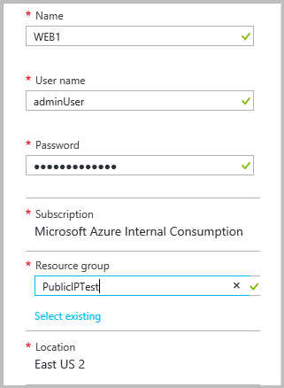
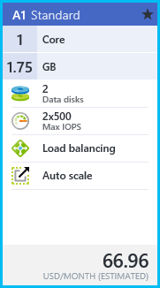

<properties 
   pageTitle="Deploy a VM with a static public IP using the preview portal in Resource Manager | Microsoft Azure"
   description="Learn how to deploy VMs with a static public IP using the preview portal in Resource Manager"
   services="virtual-network"
   documentationCenter="na"
   authors="telmosampaio"
   manager="carmonm"
   editor=""
   tags="azure-resource-manager"
/>

<tags  
   ms.service="virtual-network"
   ms.devlang="na"
   ms.topic="article"
   ms.tgt_pltfrm="na"
   ms.workload="infrastructure-services"
   ms.date="01/08/2016"
   ms.author="telmos" />

# Deploy a VM with a static public IP using the Azure portal
> [AZURE.SELECTOR]
[Azure Portal](virtual-network-deploy-static-pip-arm-portal.md)
[PowerShell](virtual-network-deploy-static-pip-arm-ps.md)
[Azure CLI](virtual-network-deploy-static-pip-arm-cli.md)
[Template](virtual-network-deploy-static-pip-arm-template.md)

You can create virtual machines (VMs) in Azure and expose them to the public Internet by using a public IP address. By default, Public IPs are dynamic and the address associated to them may change when the VM is deleted. To guarantee that the VM always uses the same public IP address, you need to create a static Public IP. 

Before you can implement static Public IPs in VMs, it is necessary to understand when you can use static Public IPs, and how they are used. Read the [IP addressing overview](virtual-network-ip-addresses-overview-arm.md) to learn more about IP addressing in Azure.

> [AZURE.NOTE] Azure has two different deployment models for creating and working with resources:  [Resource Manager and classic](../resource-manager-deployment-model.md).  This article covers using the Resource Manager deployment model, which Microsoft recommends for most new deployments instead of the classic deployment model.

## Scenario

This document will walk through a deployment that uses a static public IP address allocated to a virtual machine (VM). In this scenario, you have a single VM with its own static public IP address. The VM is part of a subnet named **FrontEnd** and also has a static private IP address (**192.168.1.101**) in that subnet.

You may need a static IP address for web servers that require SSL connections in which the SSL certificate is linked to an IP address. 

You can follow the steps below to deploy the environment shown in the figure above.

## Create a VM with a static public IP
To create a VM with a static public IP address in the Azure portal, follow the steps below.

1. From a browser, navigate to the [Azure portal](https://portal.azure.com) and, if necessary, sign in with your Azure account.
2. On the top left hand corner of the portal, click **New**>>**Compute**>**Windows Server 2012 R2 Datacenter**.
3. In the **Select a deployment model** list, select **Resource Manager** and click **Create**.
4. In the **Basics** blade, enter the VM information as shown below, and then click **OK**.

    

5. In the **Choose a size** blade, click **A1 Standard** as shown below, and then click **Select**.

    

6. In the **Settings** blade, click **Public IP address**, then in the **Create public IP address** blade, under **Assignment**, click **Static** as shown below. And then click **OK**.

    

7. In the **Settings** blade, click **OK**.

8. Review the **Summary** blade, as shown below, and then click **OK**.

    

9. Notice the new tile in your dashboard.

    

10. Once the VM is created, the **Settings** blade will be displayed as shown below

    

