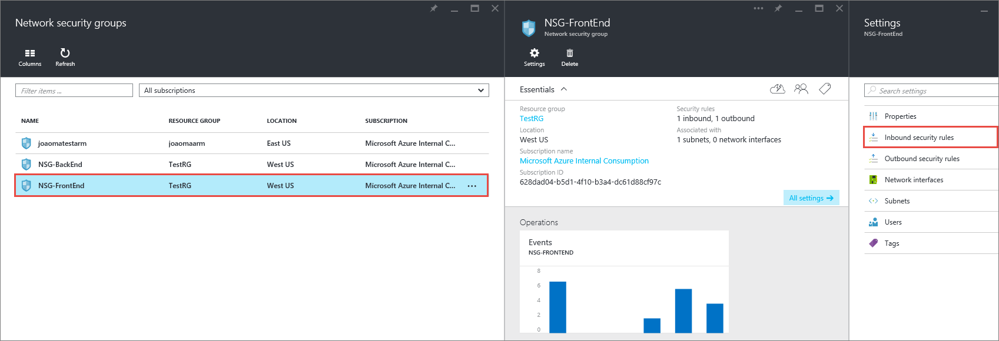

<properties 
   pageTitle="How to create NSGs in ARM mode using the preview portal | Microsoft Azure"
   description="Learn how to create and deploy NSGs in ARM using the preview portal"
   services="virtual-network"
   documentationCenter="na"
   authors="telmosampaio"
   manager="carmonm"
   editor="tysonn"
   tags="azure-resource-manager"
/>

<tags 
   ms.service="virtual-network"
   ms.devlang="na"
   ms.topic="article"
   ms.tgt_pltfrm="na"
   ms.workload="infrastructure-services"
   ms.date="12/11/2015"
   ms.author="telmos" />

# How to manage NSGs using the preview portal
> [AZURE.SELECTOR]
- [Preview portal](virtual-networks-create-nsg-arm-pportal.md)
- [PowerShell](virtual-networks-create-nsg-arm-ps.md)
- [Azure CLI](virtual-networks-create-nsg-arm-cli.md)
- [ARM template](virtual-networks-create-nsg-arm-template.md)

You can use an NSG to control traffic to one or more virtual machines (VMs), role instances, network adapters (NICs), or subnets in your virtual network. An NSG contains access control rules that allow or deny traffic based on traffic direction, protocol, source address and port, and destination address and port. The rules of an NSG can be changed at any time, and changes are applied to all associated instances.

For more information about NSGs, visit [what is an NSG](virtual-networks-nsg.md). 

>[AZURE.IMPORTANT]Before you work with Azure resources, it's important to understand that Azure currently has two deployment models: Resource Manager, and classic. Make sure you understand [deployment models and tools](azure-classic-rm.md) before working with any Azure resource. You can view the documentation for different tools by clicking the tabs at the top of this article. This article covers the Resource Manager deployment model. You can also [create NSGs in the classic deployment model](virtual-networks-create-nsg-classic-ps.md).

## Scenario

To better illustrate how to create NSGs, this document will use the scenario below.

In this scenario you will create an NSG for each subnet in the **TestVNet** virtual network, as described below: 

- **NSG-FrontEnd**. The front end NSG will be applied to the *FrontEnd* subnet, and contain two rules:	
	- **rdp-rule**. This rule will allow RDP traffic to the *FrontEnd* subnet.
	- **web-rule**. This rule will allow HTTP traffic to the *FrontEnd* subnet.
- **NSG-BackEnd**. The back end NSG will be applied to the *BackEnd* subnet, and contain two rules:	
	- **sql-rule**. This rule allows SQL traffic only from the *FrontEnd* subnet.
	- **web-rule**. This rule denies all internet bound traffic from the *BackEnd* subnet.

The combination of these rules create a DMZ-like scenario, where the back end subnet can only receive incoming traffic for SQL traffic from the front end subnet, and has no access to the Internet, while the front end subnet can communicate with the Internet, and receive incoming HTTP requests only.
 

## Deploy the ARM template by using click to deploy
At this time, you cannot create an NSG from the preview. However, you manage existing NSGs. Before you can manage NSGs, use the sample template available in the public repository to create the resources described in the scenario above. Deploy [this this template](http://github.com/telmosampaio/azure-templates/tree/master/201-IaaS-WebFrontEnd-SQLBackEnd-NSG), click **Deploy to Azure**, replace the default parameter values if necessary, and follow the instructions in the portal.

## Create rules in an existing NSG
To create rules in an existing NSG from the preview portal, follow the steps below.

1. From a browser, navigate to http://portal.azure.com and, if necessary, sign in with your Azure account.
2. Click **Browse>** > **Network security groups**.

1. In the list of NSGs, click **NSG-FrontEnd** > **Inbound security rules**

1. In the list of **Inbound security rules**, click **Add**.

1. In the **Add inbound security rule** blade, create a rule named *web-rule* with priority of *200* allowing access via *TCP* to port *80* to any VM from any source, and then click **OK**. Notice hos most of these settings are default values already.

1. After a few seconds you will see the new rule in the NSG.

