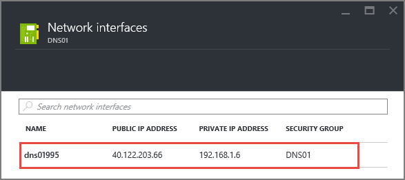
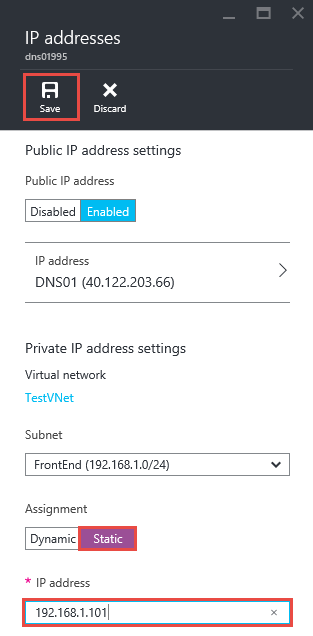

<properties 
   pageTitle="How to set a static private IP in ARM mode using the Preview Portal| Microsoft Azure"
   description="Understanding private IPs (DIPs) and how to manage them in ARM mode using the preview portal"
   services="virtual-network"
   documentationCenter="na"
   authors="telmosampaio"
   manager="carmonm"
   editor="tysonn"
   tags="azure-resource-manager"
/>

<tags 
   ms.service="virtual-network"
   ms.devlang="na"
   ms.topic="article"
   ms.tgt_pltfrm="na"
   ms.workload="infrastructure-services"
   ms.date="12/11/2015"
   ms.author="telmos" />

# How to set a static private IP address in the preview portal
> [AZURE.SELECTOR]
- [Preview portal](virtual-networks-static-private-ip-arm-pportal.md)
- [PowerShell](virtual-networks-static-private-ip-arm-ps.md)
- [Azure CLI](virtual-networks-static-private-ip-arm-cli.md)

Your IaaS virtual machines (VMs) and PaaS role instances in a virtual network automatically receive a private IP address from a range that you specify, based on the subnet they are connected to. That address is retained by the VMs and role instances, until they are decommissioned. You decommission a VM or role instance by stopping it from PowerShell, the Azure CLI, or the Azure portal. In those cases, once the VM or role instance starts again, it will receive an available IP address from the Azure infrastructure, which might not be the same it previously had. If you shut down the VM or role instance from the guest operating system, it retains the IP address it had.  

In certain cases, you want a VM or role instance to have a static IP address, for example, if your VM is going to run DNS or will be a domain controller. You can do so by setting a static private IP address.

>[AZURE.IMPORTANT]Before you work with Azure resources, it's important to understand that Azure currently has two deployment models: Resource Manager, and classic. Make sure you understand [deployment models and tools](azure-classic-rm.md) before working with any Azure resource. You can view the documentation for different tools by clicking the tabs at the top of this article. This article covers the Resource Manager deployment model. You can also [manage static private IP address in the classic deployment model](virtual-networks-static-private-ip-classic-pportal.md).

## Scenario

To better illustrate how to configure a static IP address for a VM, this document will use the scenario below.

In this scenario you will create a VM named **DNS01** in the **FrontEnd** subnet, and set it to use a static IP address of **192.168.1.101**.

 

The sample steps below expect a simple environment already created. If you want to run the steps as they are displayed in this document, first build the test environment described in [create a vnet](virtual-networks-create-vnet-arm-pportal.md).

## How to create a VM for testing static private IP addresses
You cannot set a static private IP address during the creation of a VM in the Resource Manager deployment mode by using the preview portal. You must create the VM first, tehn set its private IP to be static.

To create a VM named *DNS01* in the *FrontEnd* subnet of a VNet named *TestVNet*, follow the steps below.

1. From a browser, navigate to http://portal.azure.com and, if necessary, sign in with your Azure account.
2. Click **NEW** > **Compute** > **Windows Server 2012 R2 Datacenter**, notice that the **Select a deployment model** list already shows **Resource Manager**, and then click **Create**, as seen in the figure below.

    

3. In the **Basics** blade, enter the name of the VM to be created (*DNS01* in our scenario), the local administrator account, and password, as seen in the figure below.

    

4. Make sure the **Location** selected is *Central US*, then click **Select existing** under **Resource group**, then click **Resource group** again, then click *TestRG*, and then click **OK**.

    

5. In the **Choose a size** blade, select **A1 Standard**, and then click **Select**.

        

6. In teh **Settings** blade, make sure the following properties are set are set with the values below, and then click **OK**.

    -**Storage account**: *vnetstorage*

   * **Network**: *TestVNet*
* **Subnet**: *FrontEnd*

       

7. In the **Summary** blade, click **OK**. Notice the tile below displayed in your dashboard.

    

## How to retrieve static private IP address information for a VM
To view the static private IP address information for the VM created with the steps above, execute the steps below.

1. From the Azure preview portal, click **BROWSE ALL** > **Virtual machines** > **DNS01** > **All settings** > **Network interfaces** and then click on the only network interface listed.

    

2. In the **Network interface** blade, click **All settings** > **IP addresses** and notice the **Assignment** and **IP address** values.

    

## How to add a static private IP address to an existing VM
To add a static private IP address to the VM created using the steps above, follow the steps below:

1. From the **IP addresses** blade shown above, click **Static** under **Assignment**.
2. Type *192.168.1.101* for **IP address**, and then click **Save**.

    

> [!NOTE]
> If after clicking **Save** you notice that the assignment is still set to **Dynamic**, it means that the IP address you typed is already in use. Try a different IP address.
> 
> 
## How to remove a static private IP address from a VM
To remove the static private IP address from the VM created above, follow the step below.

1. From the **IP addresses** blade shown above, click **Dynamic** under **Assignment**, and then click **Save**.

## Next steps
* Learn about [reserved public IP](../virtual-networks-reserved-public-ip.md) addresses.
* Learn about [instance-level public IP (ILPIP)](../virtual-networks-instance-level-public-ip.md) addresses.
* Consult the [Reserved IP REST APIs](https://msdn.microsoft.com/library/azure/dn722420.aspx).

