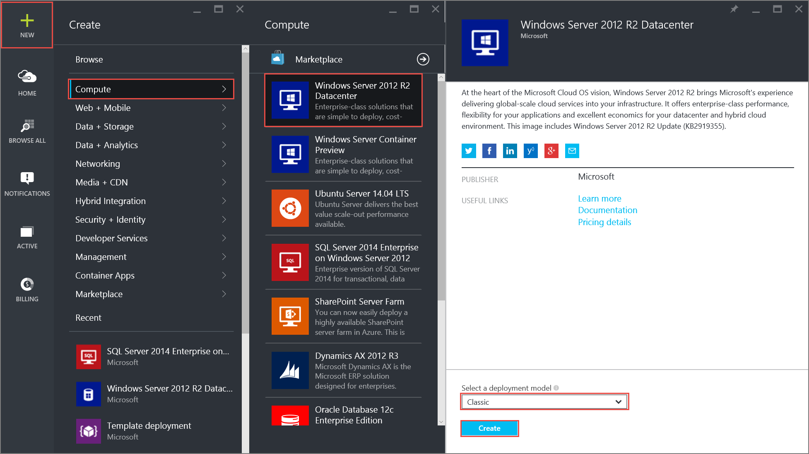
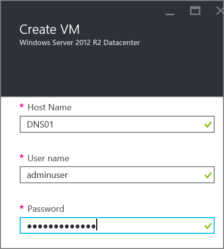
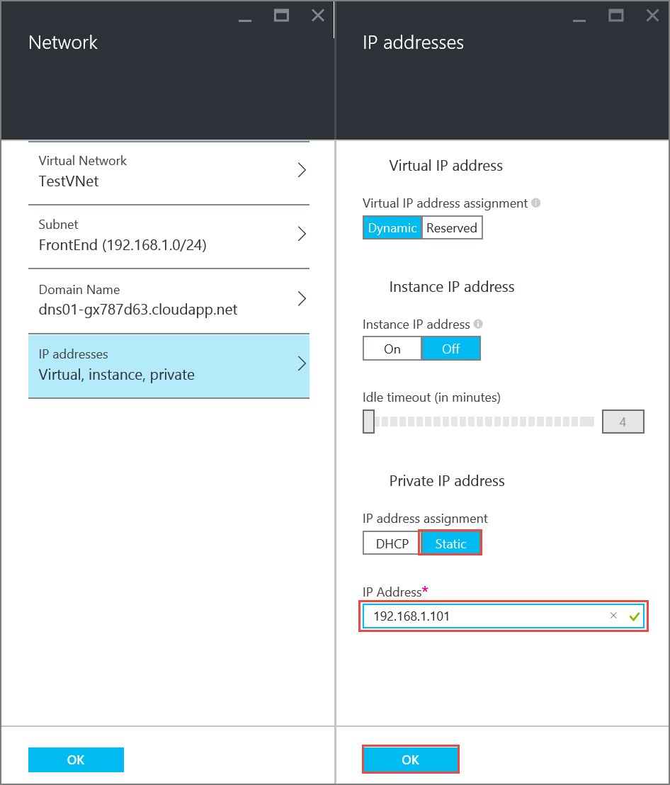
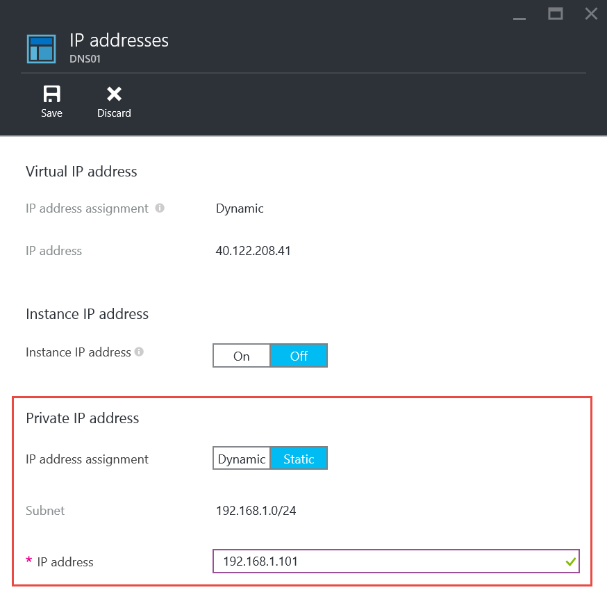

<properties 
   pageTitle="How to set a static private IP in classic mode using the Preview Portal| Microsoft Azure"
   description="Understanding static private IPs and how to manage them in classic mode using the portal"
   services="virtual-network"
   documentationCenter="na"
   authors="telmosampaio"
   manager="carmonm"
   editor="tysonn"
   tags="azure-service-management"
/>

<tags 
   ms.service="virtual-network"
   ms.devlang="na"
   ms.topic="article"
   ms.tgt_pltfrm="na"
   ms.workload="infrastructure-services"
   ms.date="12/11/2015"
   ms.author="telmos" />

# How to set a static private IP address (classic) in the preview portal
> [AZURE.SELECTOR]
- [Preview portal](virtual-networks-static-private-ip-classic-pportal.md)
- [PowerShell](virtual-networks-static-private-ip-classic-ps.md)
- [Azure CLI](virtual-networks-static-private-ip-classic-cli.md)

Your IaaS virtual machines (VMs) and PaaS role instances in a virtual network automatically receive a private IP address from a range that you specify, based on the subnet they are connected to. That address is retained by the VMs and role instances, until they are decommissioned. You decommission a VM or role instance by stopping it from PowerShell, the Azure CLI, or the Azure portal. In those cases, once the VM or role instance starts again, it will receive an available IP address from the Azure infrastructure, which might not be the same it previously had. If you shut down the VM or role instance from the guest operating system, it retains the IP address it had.  

In certain cases, you want a VM or role instance to have a static IP address, for example, if your VM is going to run DNS or will be a domain controller. You can do so by setting a static private IP address.

>[AZURE.IMPORTANT]Before you work with Azure resources, it's important to understand that Azure currently has two deployment models: Resource Manager, and classic. Make sure you understand [deployment models and tools](azure-classic-rm.md) before working with any Azure resource. You can view the documentation for different tools by clicking the tabs at the top of this article. This article covers the classic deployment model. You can also [manage a static private IP address in the Resource Manager deployment model](virtual-networks-static-private-ip-arm-pportal.md).

## Scenario

To better illustrate how to configure a static IP address for a VM, this document will use the scenario below.

In this scenario you will create a VM named **DNS01** in the **FrontEnd** subnet, and set it to use a static IP address of **192.168.1.101**.

 

The sample steps below expect a simple environment already created. If you want to run the steps as they are displayed in this document, first build the test environment described in [create a vnet](virtual-networks-create-vnet-classic-pportal.md).

## How to specify a static private IP address when creating a VM
To create a VM named *DNS01* in the *FrontEnd* subnet of a VNet named *TestVNet* with a static private IP of *192.168.1.101*, follow the steps below:

1. From a browser, navigate to http://portal.azure.com and, if necessary, sign in with your Azure account.
2. Click **NEW** > **Compute** > **Windows Server 2012 R2 Datacenter**, notice that the **Select a deployment model** list already shows **Classic**, and then click **Create**.

    

3. In the **Create VM** blade, enter the name of the VM to be created (*DNS01* in our scenario), the local administrator account, and password.

    

4. Click **Optional Configuration** > **Network** > **Virtual Network**, and then click **TestVNet**. If **TestVNet** is not available, make sure you are using the *Central US* location and have created the test environment described at the beginning of this article.

    

5. In the **Network** blade, make sure the subnet currently selected is *FrontEnd*, then click **IP addresses**, under **IP address assignment** click **Static**, and then enter *192.168.1.101* for **IP Address** as seen below.

        

6. Click **OK** in the **IP addresses** blade, then click **OK** in the **Network** blade, and click **OK** in the **Optional config** blade.

7. In the **Create VM** blade, click **Create**. Notice the tile below displayed in your dashboard.

    

## How to retrieve static private IP address information for a VM
To view the static private IP address information for the VM created with the steps above, execute the steps below.

1. From the Azure preview portal, click **BROWSE ALL** > **Virtual machines (classic)** > **DNS01** > **All settings** > **IP addresses** and notice the IP address assignment and IP address as seen below.

    

## How to remove a static private IP address from a VM
To remove the static private IP address from the VM created above, follow the steps below.

1. From the **IP addresses** blade shown above, click **Dynamic** to the right of **IP address assignment**, then click **Save**, and then click **Yes**.

    

## How to add a static private IP address to an existing VM
To add a static private IP address to the VM created using the steps above, follow the steps below:

1. From the **IP addresses** blade shown above, click **Static** to the right of **IP address assignment**.
2. Type *192.168.1.101* for **IP address**, then click **Save**, and then click **Yes**.

## Next steps
* Learn about [reserved public IP](../virtual-networks-reserved-public-ip.md) addresses.
* Learn about [instance-level public IP (ILPIP)](../virtual-networks-instance-level-public-ip.md) addresses.
* Consult the [Reserved IP REST APIs](https://msdn.microsoft.com/library/azure/dn722420.aspx).

