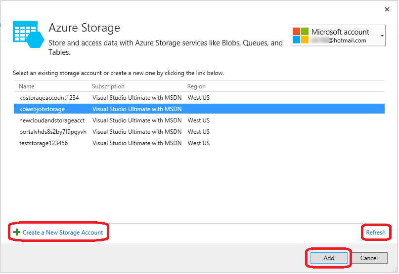

<properties 
   pageTitle="Add Azure Storage by using Connected Services in Visual Studio | Microsoft Azure"
   description="Add Azure Storage to your app by using the Visual Studio Add Connected Services dialog box"
   services="visual-studio-online"
   documentationCenter="na"
   authors="TomArcher"
   manager="douge"
   editor="" />

<tags 
   ms.service="visual-studio-online"
   ms.devlang="na"
   ms.topic="article"
   ms.tgt_pltfrm="na"
   ms.workload="mobile"
   ms.date="12/16/2015"
   ms.author="tarcher" />

# Adding Azure storage by using Visual Studio Connected Services
## Overview
With Visual Studio 2015, you can connect any C# cloud service, .NET backend mobile service, ASP.NET website or service, ASP.NET 5 service, or Azure WebJob service to Azure Storage by using the **Add Connected Services** dialog. The connected service functionality adds all the needed references and connection code, and modifies your configuration files appropriately. The dialog also takes you to documentation that tells you what the next steps are to start blob storage, queues, and tables.

## Supported Project Types
You can use the Connected Services dialog to connect to Azure Storage in the following project types.

* ASP.NET Web Projects

* ASP.NET 5 Projects

* .NET Cloud Service Web Role and Worker Role Projects

* .NET Mobile Services Projects

* Azure WebJob Projects

## Connect to Azure Storage using the Connected Services dialog
1. Make sure you have an Azure account. If you don't have an Azure account, you can sign up for a [free trial](http://go.microsoft.com/fwlink/?LinkId=518146). Once you have an Azure account, you can create storage accounts, create mobile services, and configure Azure Active Directory.

2. Open your project in Visual Studio, open the context menu for the **References** node in Solution Explorer, and then choose **Add Connected Service**.

    

3. In the **Add Connected Service** dialog box, choose **Azure Storage**, and then choose the **Configure** button. You may be prompted to log into Azure if you haven't already done so.

    

4. In the **Azure Storage** dialog box, choose an existing storage account and then click **Add**.

    If you need to create a new storage account, go to the next step. Otherwise, skip to step 6.

    

5. To create a new storage account: 

   1. Choose the **Create a New Storage Account** button at the bottom of the Azure Storage dialog box.

2. Fill out the **Create Storage Account** dialog box and then choose the **Create** button.

    

    When you're back in the **Azure Storage** dialog box, the new storage appears in the list.

3. Select the new storage in the list and click **Add**.

6. The  storage connected service appears under the Service References node of your WebJob project.

    

7. Review the Getting Started page that appears and find out how your project was modified. A Getting Started page appears in your browser whenever you add a connected service. You can review the suggested next steps and code examples, or switch to the What Happened page to see what references were added to your project, and how your code and configuration files were modified.

## How your project is modified
When you finish the dialog, Visual Studio adds references and modifies certain configuration files. The specific changes depend on the project type. 

* For ASP.NET projects, see [What happened – ASP.NET Projects](http://go.microsoft.com/fwlink/p/?LinkId=513126). 
* For ASP.NET 5 projects, see [What happened – ASP.NET 5 Projects](http://go.microsoft.com/fwlink/p/?LinkId=513124). 
* For cloud service projects (web roles and worker roles), see [What happened – Cloud Service projects](http://go.microsoft.com/fwlink/p/?LinkId=516965). 
* For WebJob projects, see [What
happened - WebJob projects](vs-storage-webjobs-what-happened/.md).

## Next steps
1. Using the Getting Started code samples as a guide, create the type of storage that you want, and then start writing code to access your storage account!

2. Ask questions and get help

   * [MSDN Forum: Azure Storage](https://social.msdn.microsoft.com/forums/azure/home?forum=windowsazuredata)

* [Azure Storage Team Blog](http://blogs.msdn.com/b/windowsazurestorage/)

* [Storage at azure.microsoft.com](https://azure.microsoft.com/services/storage/)

* [Storage Documentation at azure.microsoft.com](https://azure.microsoft.com/documentation/services/storage/)

