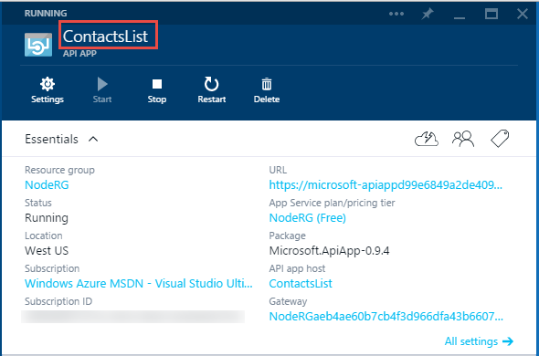

## API app metadata
This section provides additional information about API app metadata that you can customize.

Most of the properties in the *apiapp.json* file, and the files in the *Metadata* folder, affect the way an API app package is presented in the Azure Marketplace. The following sections explain which properties and files affect API apps when you deploy your code to an API app in your Azure subscription. 

### API app ID
The `id` property determines the name of the API app.  For example:

        "id": "ContactsList",

### Namespace
Set the `namespace` property to the domain of your Azure Active Directory tenant. To find your domain, open your browser to the [Azure classic portal](https://manage.windowsazure.com/), browse **Active Directory**, and select the **Domains** tab. For example:

        "namespace": "contoso.onmicrosoft.com",

### Dynamic Swagger API definition
If the API app can return a dynamic [Swagger](http://swagger.io/) API definition, store the relative URL for a GET request that returns the API definition JSON in the `endpoints.apiDefinition` property. For example:  

        "endpoints": {
            "apiDefinition": "/swagger/docs/v1"
        }

> **Note:** If you are using Swashbuckle to generate a Swagger API definition, HTTP method overloads in your Web API controllers result in duplicate operation ids. For more information, see [Customize Swashbuckle-generated operation identifiers](../article/app-service-api/app-service-api-dotnet-swashbuckle-customize.md).
> 
> 
### Static Swagger API definition
To provide a static [Swagger](http://swagger.io/) 2.0 API definition file, store the file in the *Metadata* folder and name the file *apiDefinition.swagger.json*

Leave `endpoints.apiDefinition` out of the *apiapp.json* file or set its value to null. If you include both an `endpoints.apiDefinition` URL and an *apiDefinition.swagger.json* file, the URL will take precedence and the file will be ignored.

