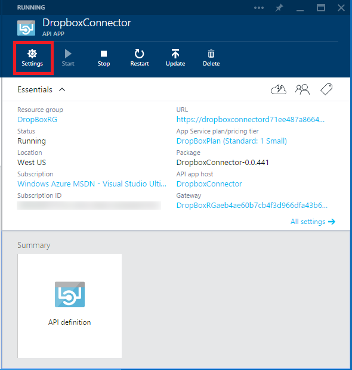
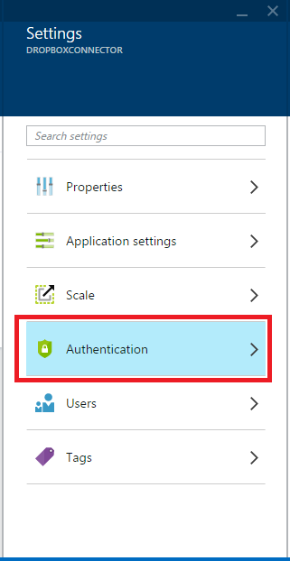
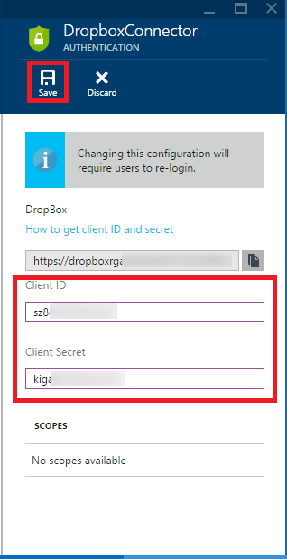
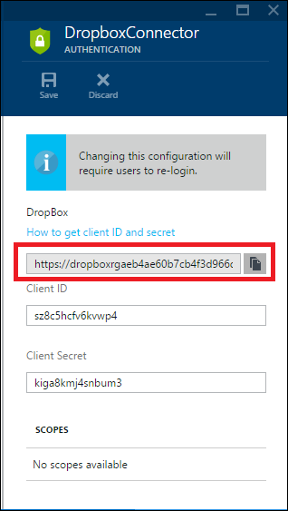
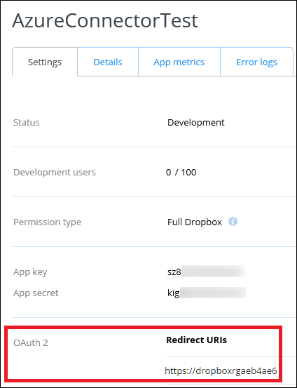

1. In another browser window or tab, go to the [Azure preview portal](https://portal.azure.com).

2. Go to the **API App** blade for your Dropbox connector. (If you're still on the **Resource Group** blade, just click the Dropbox connector in the diagram.)

3. Click **Settings**, and in the **Settings** blade click **Authentication**.

    

    

4. In the Authentication blade, enter the client ID and client secret from the Dropbox site, and then click **Save**.

    

5. Copy the **Redirect URI** (the grey box above the client ID and client secret) and add the value to the page you left open in the previous step. 

    The redirect URI follows this pattern:

        [gatewayurl]/api/consent/redirect/[connectorname]

    For example:

        https://dropboxrgaeb4ae60b7.azurewebsites.net/api/consent/redirect/DropboxConnector

    

    

