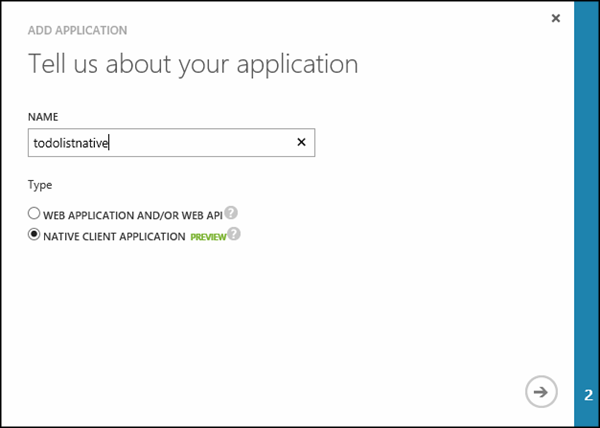
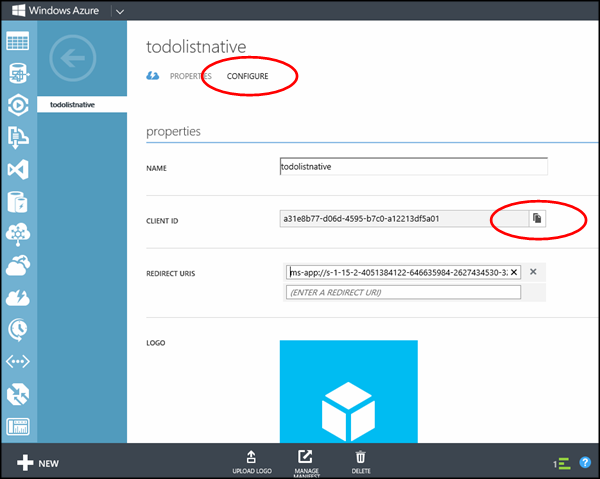
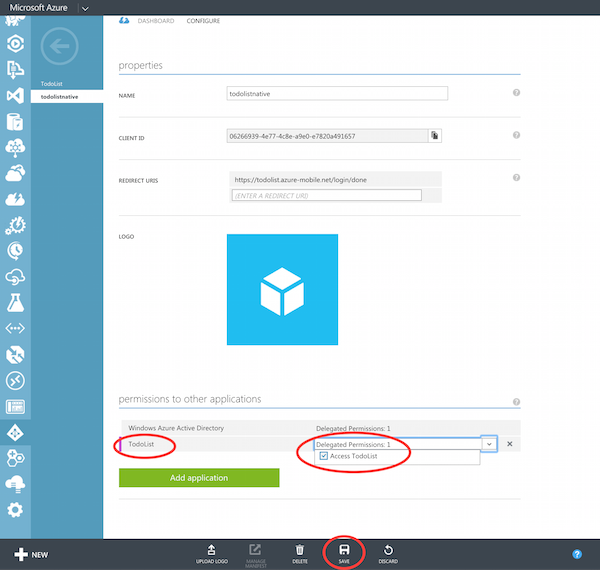

## Register your client app with the Azure Active Directory
1. Navigate to **Active Directory** in the [Azure classic portal](https://manage.windowsazure.com/), then click your directory.

   

2. Click the **Applications** tab at the top, then click to **ADD** an app. 

   

3. Click **Add an application my organization is developing**.

4. In the Add Application Wizard, enter a **Name** for your application and click the  **Native Client Application** type. Then click to continue.

   

5. In the **Redirect URI** box, enter the /login/done endpoint for your mobile service. This value should be similar to https://todolist.azure-mobile.net/login/done.

   

6. Click the **Configure** tab for the native application and copy the **Client ID**. You will need this later.

   

7. Scroll the page down to the **permissions to other applications** section and click the **Add application** button. Choose **Other** from the Show menu and search for todo. Click **TodoList** to add it the mobile service you registered earlier and click the checkmark for done. Grant access to the mobile service application. Then click **Save**

   

Your mobile service is now configured in AAD to receive single sign-on logins from your app.

