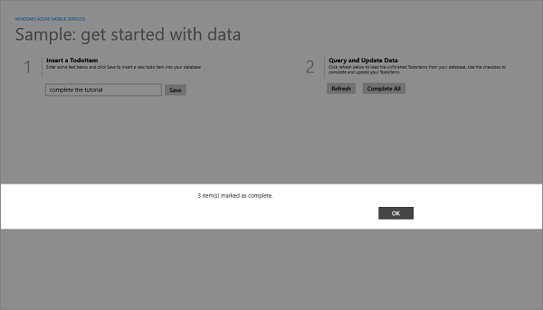

## Update the app to call the custom API
1. In Visual Studio, open the MainPage.xaml file in your quickstart project, locate the **Button** element named `ButtonRefresh`, and replace it with the following XAML code: 

        <StackPanel Orientation="Horizontal">
         <Button Margin="72,0,0,0" Name="ButtonRefresh" 
                 Click="ButtonRefresh_Click">Refresh</Button>
         <Button Margin="12,0,0,0" Name="ButtonCompleteAll" 
                 Click="ButtonCompleteAll_Click">Complete All</Button>
     </StackPanel>

    This adds a new button to the page. 

2. Open the MainPage.xaml.cs code file, and add the following class definition code:

        public class MarkAllResult
     {
         public int Count { get; set; }
     }

    This class is used to hold the row count value returned by the custom API. 

3. Locate the **RefreshTodoItems** method in the **MainPage** class, and make sure that the `query` is defined by using the following **Where** method:

        .Where(todoItem => todoItem.Complete == false)

    This filters the items so that completed items are not returned by the query.

4. In the **MainPage** class, add the following method:

        private async void ButtonCompleteAll_Click(object sender, RoutedEventArgs e)
     {
         string message;
         try
         {
             // Asynchronously call the custom API using the POST method. 
             var result = await App.MobileService
                 .InvokeApiAsync<MarkAllResult>("completeAll", 
                 System.Net.Http.HttpMethod.Post, null);
             message =  result.Count + " item(s) marked as complete.";
             RefreshTodoItems();
         }
         catch (MobileServiceInvalidOperationException ex)
         {
             message = ex.Message;                
         }

         var dialog = new MessageDialog(message);
         dialog.Commands.Add(new UICommand("OK"));
         await dialog.ShowAsync();
     }

    This method handles the **Click** event for the new button. The [InvokeApiAsync](http://msdn.microsoft.com/library/windowsazure/microsoft.windowsazure.mobileservices.mobileserviceclient.invokeapiasync.aspx) method is called on the client, which sends a POST request to the new custom API. The result returned by the custom API is displayed in a message dialog, as are any errors.

## Test the app
1. In Visual Studio, press the **F5** key to rebuild the project and start the app.

2. In the app, type some text in **Insert a TodoItem**, then click **Save**.

3. Repeat the previous step until you have added several todo items to the list.

4. Click the **Complete All** button.

      

    A message dialog is displayed that indicates the number of items marked complete and the filtered query is executed again, which clears all items from the list.

