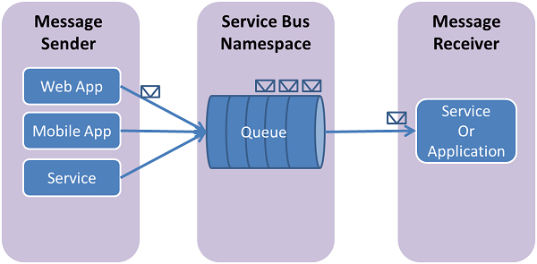
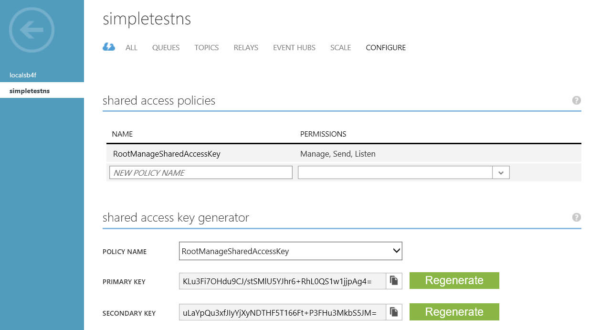

## What are Service Bus Queues?
Service Bus queues support a **brokered messaging** communication
model. When using queues, components of a distributed application do not
communicate directly with each other; instead they exchange messages via
a queue, which acts as an intermediary (broker). A message producer (sender)
hands off a message to the queue and then continues its processing.
Asynchronously, a message consumer (receiver) pulls the message from the
queue and processes it. The producer does not have to wait for a reply
from the consumer in order to continue to process and send further
messages. Queues offer **First In, First Out (FIFO)** message delivery
to one or more competing consumers. That is, messages are typically
received and processed by the receivers in the order in which they were
added to the queue, and each message is received and processed by only
one message consumer.

Service Bus queues are a general-purpose technology that can be used for
a wide variety of scenarios:

* Communication between web and worker roles in a multi-tier
Azure application.
* Communication between on-premises apps and Azure hosted apps
in a hybrid solution.
* Communication between components of a distributed application
running on-premises in different organizations or departments of an
organization.

Using queues enables you to scale out your applications more easily, and
enable more resiliency to your architecture.

## Create a service namespace
To begin using Service Bus queues in Azure, you must first
create a service namespace. A namespace provides a scoping
container for addressing Service Bus resources within your application.

To create a service namespace:

1. Log on to the [Azure classic portal](http://manage.windowsazure.com).

2. In the left navigation pane of the portal, click
**Service Bus**.

3. In the lower pane of the portal, click **Create**.

4. In the **Add a new namespace** dialog, enter a namespace name.
The system immediately checks to see if the name is available.

5. After making sure the namespace name is available, choose the
country or region in which your namespace should be hosted (make
sure you use the same country/region in which you are deploying your
compute resources).

   IMPORTANT: Pick the **same region** that you intend to choose for
deploying your application. This will give you the best performance.

6. Leave the other fields in the dialog with their default values (**Messaging** and **Standard Tier**), then click the check mark. The system now creates your namespace and enables it. You might have to wait several minutes as the system provisions resources for your account.

   

The namespace you created takes a moment to activate, and will then appear in the Azure portal. Wait until the namespace status is **Active** before continuing.

## Obtain the default management credentials for the namespace
In order to perform management operations, such as creating a queue on
the new namespace, you must obtain the management credentials for the
namespace. You can obtain these credentials from the portal.

1. In the left navigation pane, click the **Service Bus** node, to
display the list of available namespaces:

2. Click on the namespace you just created from the list shown.

3. Click **Configure** to view the shared access policies for your namespace.

4. Make a note of the primary key, or copy it to the clipboard.

  [Azure classic portal]: http://manage.windowsazure.com

  [34]: ./media/service-bus-java-how-to-create-queue/VSProperties.png
