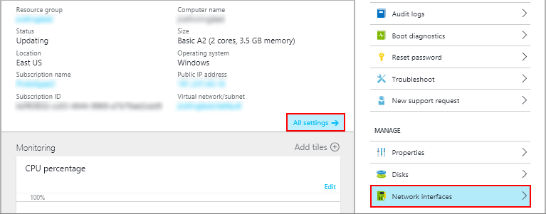
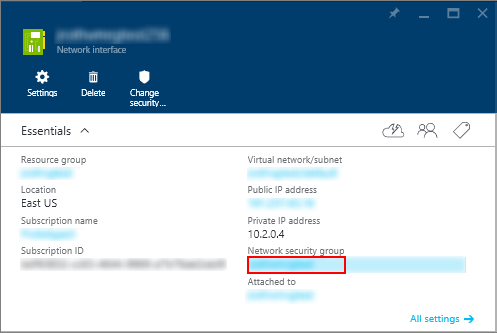

### Configure a Network Security Group inbound rule for the VM
If you want to be able to connect to SQL Server over the internet, you have to configure an inbound rule on the Network Security Group for the port that your SQL Server instance is listening. By default, this is TCP port 1433.

1. In the portal, select **Virtual machines**, and then select your SQL Server VM.

2. Click the **All settings** link.

3. Expand **Nework interfaces**.

    

4. Then select the Network Interface for your VM. 

5. Click the **Network security group** link.

    

6. In the properties of the Network Security Group, expand **Inbound security rules**.

7. Click the **Add** button.

8. Provide a **Name** of "SQLServerPublicTraffic".

9. Change **Protocol** to **TCP**.

10. Specify a **Destination port range** of 1433 (or the port that your SQL Server Instance is listening on). 

11. Verify that **Action** is set to **Allow**. The security rule dialog should look similar to the following screenshot.

     

12. Click **OK** to save the rule for your VM.

